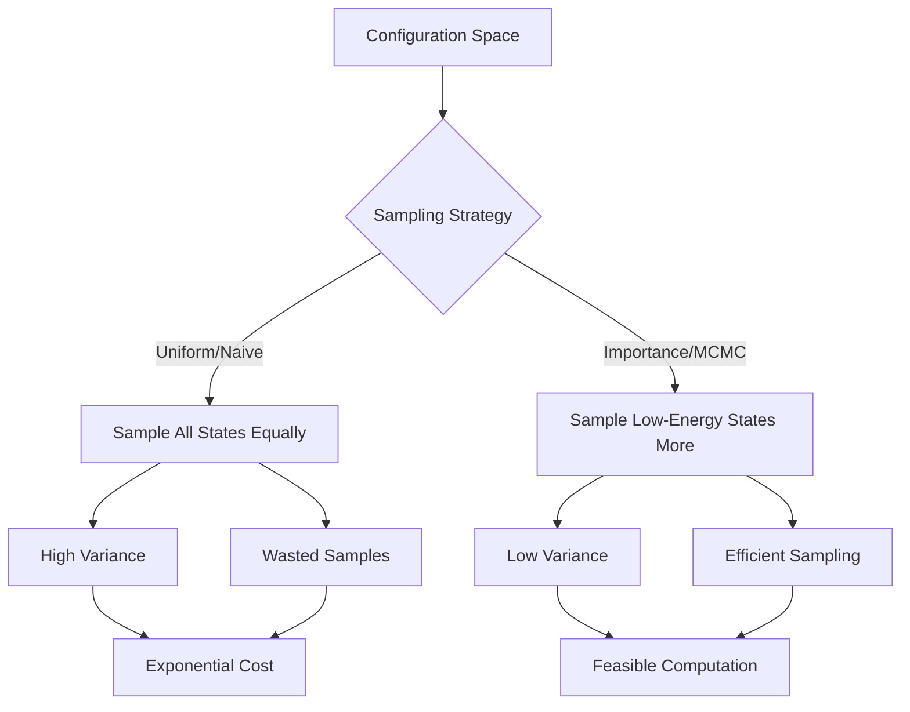

# **Chapter :1 Foundations of Stochastic Simulation**

---

## **Introduction**

The simulation of complex physical systems—ranging from magnets and fluids to biological networks and financial markets—presents a profound computational challenge. At the heart of this challenge lies the **curse of dimensionality**: as the number of interacting components grows, the configuration space expands exponentially, rendering exhaustive enumeration impossible. A simple Ising lattice with just 900 spins possesses $2^{900} \approx 10^{270}$ possible configurations—far exceeding the number of atoms in the observable universe.

This chapter lays the theoretical and algorithmic foundations for **stochastic simulation**, a powerful framework that bypasses brute-force enumeration by intelligently sampling representative configurations. We begin by confronting the curse of dimensionality and explaining why naive Monte Carlo sampling fails in high-dimensional spaces. We then introduce the concept of **importance sampling** and develop the mathematical machinery of **Markov chains**—the backbone of modern Monte Carlo methods. The centerpiece of this chapter is the **Metropolis–Hastings algorithm**, a general-purpose sampler that constructs Markov chains whose stationary distributions match the Boltzmann distribution of statistical mechanics.

By the end of this chapter, you will understand how to design, implement, and diagnose Markov Chain Monte Carlo (MCMC) algorithms for sampling complex probability distributions. These foundations will prepare you for Chapter 2, where we apply these methods to the two-dimensional Ising model—one of the simplest systems to exhibit collective behavior and phase transitions.

---

## **Chapter Outline**

| **Sec.** | **Title**                                                 | **Core Ideas & Examples**                                                                                                                                                                                      |
| -------- | --------------------------------------------------------- | -------------------------------------------------------------------------------------------------------------------------------------------------------------------------------------------------------------- |
| **1.1**  | **The Curse of Dimensionality**                           | Combinatorial explosion in many-body systems; $2^{900}$ configurations in a 30×30 Ising lattice; volume concentration in high dimensions; implications for statistical mechanics.                              |
| **1.2**  | **The Failure of Simple Sampling and the Need for Importance** | Naive Monte Carlo wastes samples on high-energy states; importance sampling re-weights the integrand; Boltzmann distribution $P(\mathbf{s}) \propto e^{-\beta E(\mathbf{s})}$; variance explosion.             |
| **1.3**  | **The Theoretical Foundation: Markov Chains**             | Transition matrices; stationary distributions; ergodicity (irreducibility and aperiodicity); detailed balance vs. global balance; mixing time and autocorrelation.                                              |
| **1.4**  | **The Central Algorithm: Metropolis–Hastings**            | Proposal and acceptance steps; acceptance ratio $\min(1, e^{-\beta \Delta E})$ for symmetric proposals; generalization to asymmetric proposals; Gibbs sampling as a special case.                              |
| **1.5**  | **Core Application: Sampling a 1D Energy Landscape**      | Double-well potential $V(x) = x^4 - 2x^2 + 1$; temperature-dependent barrier crossing; histogram validation; metastability at low $T$; tuning step size $\Delta$ for acceptance rate.                          |
| **1.6**  | **Chapter Summary & Bridge to Chapter 2**                 | Recap of MCMC foundations; preview of 2D Ising model; spontaneous magnetization; phase transitions; finite-size effects; emergence of collective order from microscopic interactions.                          |

---

## **1.1 The Curse of Dimensionality**

---

### **Why the Many-Body Problem is Hard**

In a system with $N$ interacting components (spins in a magnet, molecules in a fluid, neurons in a network, or agents in a financial market) each degree of freedom can typically take on several discrete or continuous values. For a binary spin model like the Ising model, each spin $s_i$ can be $\pm 1$. A $30 \times 30$ Ising lattice contains 900 spins; the total number of spin configurations is

$$
2^{900} \approx 10^{270}
$$

an astronomically large number. Enumerating or even iterating over all these configurations is therefore impossible.

!!! tip "Exponential Growth Intuition"
    Think of each new spin doubling the size of the state space—like a binary tree where each level represents one spin. After just 30 levels, you have over a billion configurations; after 900, the number exceeds all atoms in the universe.

-----

### **Combinatorial Explosion**

The phrase "curse of dimensionality" was coined by Richard Bellman to emphasize that many algorithms suffer exponential slow-down as the dimensionality of the problem grows. Even in the simplest case of $d$ binary variables, the number of possible combinations doubles with each added dimension. This phenomenon appears in many contexts:

- **Sampling on grids.**  
  To sample a unit interval with resolution $10^{-2}$ you need roughly $10^2 = 100$ points. To achieve the same resolution in a 10‑dimensional hypercube, you would need $10^{20}$ lattice points—impractical for any computer.

- **Exploding state space.**  
  In physics, each additional particle doubles the possible spin or occupation states; in finance, adding another asset multiplies the dimensionality of the price vector; in biology, adding another gene or neuron doubles the possible configuration states. Naively scanning or integrating over all combinations thus becomes exponentially expensive.

- **Volume concentration.**  
  As dimension increases, the geometry of space changes: most of the volume of a high‑dimensional cube concentrates near its boundary. For a $d$-dimensional hypercube, the ratio of the volume of an inscribed hypersphere to the cube’s volume shrinks to zero as $d \to \infty$. Randomly sampling points uniformly in a high‑dimensional hypercube means that almost all points lie near the “surface”; very few points represent the deep interior. This makes intuitive notions like “nearby” or “central” meaningless and undermines naive Monte Carlo sampling strategies.

**Implications for statistical mechanics.**  
In statistical mechanics, macroscopic observables are computed from sums over all microstates weighted by $\mathrm{e}^{-\beta E(\mathbf{s})}$. Because the volume of state space grows exponentially with system size, direct summation is impossible. Moreover, most states are extremely high‑energy and contribute negligibly to the partition function. Therefore, a random uniform sampling of all microstates yields almost exclusively useless samples, and the variance of estimates skyrockets. This is why **importance sampling** and **Markov Chain Monte Carlo** methods are indispensable: they concentrate sampling in the low‑energy regions of configuration space that actually matter.

**Takeaway.**  
The curse of dimensionality reminds us that high‑dimensional spaces behave very differently from our everyday intuition: volumes explode, "typical" points live near the boundaries, and the number of possibilities grows faster than any polynomial. To study many‑body systems, we must use stochastic methods that navigate these spaces intelligently rather than exhaustively.

---

## **1.2 The Failure of Simple Sampling and the Need for Importance**

---

### **Why Naïve Monte Carlo Fails**
In classical numerical integration, one can estimate an expectation value of an observable $A(\mathbf{s})$ by drawing states $\mathbf{s}$ uniformly at random and averaging $A$. In statistical mechanics the quantity of interest is

$$
\langle A \rangle := \frac{1}{Z} \sum_{\mathbf{s}} A(\mathbf{s})\, \mathrm{e}^{-\beta E(\mathbf{s})}, \qquad
Z = \sum_{\mathbf{s}} \mathrm{e}^{-\beta E(\mathbf{s})},
$$

where $E(\mathbf{s})$ is the energy of configuration $\mathbf{s}$ and $\beta = 1/(k_\mathrm{B}T)$. A “simple” Monte Carlo estimator would draw configurations uniformly from the state space and use the sample mean

$$
\hat{A}_\text{uniform} := \frac{1}{N} \sum_{i=1}^N A(\mathbf{s}^{(i)})\, \mathrm{e}^{-\beta E(\mathbf{s}^{(i)})}.
$$

The problem is that **most of the state space consists of extremely high‑energy configurations**. According to the Boltzmann distribution, the probability of occupying a state $i$ with energy $\varepsilon_i$ is proportional to $\exp(-\varepsilon_i / (k_\mathrm{B}T))$. The ratio of probabilities of two states depends only on their energy difference:

$$
\frac{p_i}{p_j} = \exp\left(\frac{\varepsilon_j - \varepsilon_i}{k_\mathrm{B}T}\right).
$$

Low‑energy states are exponentially more probable; high‑energy states contribute essentially zero to the average. When we sample uniformly, almost every draw is a high‑energy state with a negligible Boltzmann weight. Consequently:

- **The estimator wastes work.**  
  The vast majority of samples contribute almost nothing to the sum.
  
- **The variance explodes.**  
  Because only a tiny fraction of states have appreciable weight, the estimator's variance is extremely large. To achieve a given statistical accuracy, the required number of uniform samples grows exponentially with system size.

-----

### **Importance Sampling to the Rescue**
The remedy is to draw samples from a **proposal distribution** $p(\mathbf{s})$ that resembles the target Boltzmann distribution $P(\mathbf{s}) \propto \mathrm{e}^{-\beta E(\mathbf{s})}$. In importance sampling, one writes the expectation as

$$
\langle A \rangle = \sum_{\mathbf{s}} A(\mathbf{s})\, \frac{P(\mathbf{s})}{p(\mathbf{s})}\, p(\mathbf{s}),
$$

and estimates it by drawing samples $\mathbf{s}^{(i)}$ from $p(\mathbf{s})$ and computing

$$
\hat{A}_\text{IS} := \frac{\sum_{i=1}^{N} A(\mathbf{s}^{(i)})\, w(\mathbf{s}^{(i)})}{\sum_{i=1}^{N} w(\mathbf{s}^{(i)})}, \qquad
w(\mathbf{s}) = \frac{P(\mathbf{s})}{p(\mathbf{s})}.
$$

If $p(\mathbf{s})$ is chosen so that $p(\mathbf{s}) \approx P(\mathbf{s})$, then all weights $w(\mathbf{s}^{(i)})$ are of similar magnitude and the estimator variance is small. In the ideal case where $p(\mathbf{s}) = P(\mathbf{s})$, every weight $w = 1$ and the estimator reduces to a simple average.

In the context of the Boltzmann distribution, importance sampling means sampling more frequently from low‑energy states and rarely from high‑energy states. **Markov Chain Monte Carlo** algorithms such as the Metropolis–Hastings method achieve this by constructing a random walk that spends time in each state proportional to its Boltzmann weight. Rather than drawing independent samples from a proposal distribution, MCMC incrementally explores state space using transition probabilities that satisfy detailed balance. This allows us to bypass the need for a closed‑form proposal distribution $p(\mathbf{s})$ and to generate samples whose empirical distribution converges to the desired $P(\mathbf{s})$.



-----

### **Key Points to Remember**

- Uniform (simple) sampling is inefficient in high dimensions because nearly all randomly chosen configurations are high‑energy and have negligible Boltzmann weight.
- Importance sampling re‑weights the integrand to sample preferentially from regions that contribute most to the expectation.
- MCMC implements importance sampling in a dynamic way by constructing a Markov chain whose stationary distribution is the target distribution. This resolves the variance explosion and makes the computation of thermodynamic averages feasible.

---

## **1.3 The Theoretical Foundation: Markov Chains**

---

### **Defining a Markov Chain**  
A (time‑homogeneous) Markov chain is a sequence of random variables $\{\mathbf{s}_0, \mathbf{s}_1, \mathbf{s}_2, \dots\}$ taking values in a discrete state space $\mathcal{S}$ such that the probability of moving to the next state depends only on the current state:

$$
\Pr(\mathbf{s}_{n+1} = \mathbf{s}' \mid \mathbf{s}_n = \mathbf{s}, \mathbf{s}_{n-1}, \dots, \mathbf{s}_0) = \Pr(\mathbf{s}_{n+1} = \mathbf{s}' \mid \mathbf{s}_n = \mathbf{s}) = W(\mathbf{s} \to \mathbf{s}').
$$

The collection of transition probabilities $W(\mathbf{s} \to \mathbf{s}')$ for all $\mathbf{s}, \mathbf{s}' \in \mathcal{S}$ forms the **transition matrix** $T$. For a finite state space, $T$ is a square matrix with non‑negative entries satisfying $\sum_{\mathbf{s}'} T_{\mathbf{s}\mathbf{s}'} = 1$ for each $\mathbf{s}$.

-----

### **Stationary Distributions**  
A distribution $\pi$ on $\mathcal{S}$ is **stationary** with respect to $T$ if it remains unchanged by the Markov dynamics:

$$
\pi(\mathbf{s}') = \sum_{\mathbf{s} \in \mathcal{S}} \pi(\mathbf{s})\, T_{\mathbf{s}\mathbf{s}'} \quad \text{for all } \mathbf{s}' \in \mathcal{S}.
$$

In matrix notation, $\pi$ is a **left eigenvector** of $T$ with eigenvalue 1. Existence of a stationary distribution is guaranteed if $T$ is **stochastic** (rows sum to one) and **irreducible** (it is possible to reach any state from any other state). The stationary distribution is unique if the chain is also **aperiodic** (returns to each state with period 1). Under these conditions, the chain is called **ergodic**: as $n \to \infty$, the distribution of $\mathbf{s}_n$ approaches $\pi$ regardless of the initial state, and time averages converge to ensemble averages. The Oxford notes on Markov chains state that for an irreducible chain with stationary distribution $\pi$, the ergodic theorem guarantees $\Pr(X_n = i) \to \pi_i$ as $n \to \infty$ and the fraction of time spent in state $i$ converges to $\pi_i$.

-----

### **Global Balance and Detailed Balance**
If $\pi$ is stationary for $T$, it must satisfy the **global balance** condition: the total probability flow into every state equals the flow out:

$$
\sum_{\mathbf{s}} \pi(\mathbf{s})\, T_{\mathbf{s}\mathbf{s}'} = \pi(\mathbf{s}') = \sum_{\mathbf{s}''} \pi(\mathbf{s}')\, T_{\mathbf{s}'\mathbf{s}''}.
$$

A sufficient (but stronger) condition is **detailed balance**:

$$
\pi(\mathbf{s})\, T_{\mathbf{s}\mathbf{s}'} = \pi(\mathbf{s}')\, T_{\mathbf{s}'\mathbf{s}} \quad \text{for all } \mathbf{s}, \mathbf{s}' \in \mathcal{S}.
$$

Detailed balance implies global balance and has a physical interpretation: at equilibrium each elementary process is balanced by its reverse process. The detailed balance principle arises from microscopic reversibility in kinetic theory and is widely used in the design of Monte Carlo algorithms. Many chains used in statistical mechanics (including the Metropolis–Hastings algorithm) are **reversible** with respect to their target distribution because they are constructed to satisfy detailed balance.

??? question "Why is detailed balance stronger than global balance?"
    Detailed balance requires that **each pair** of states is individually balanced ($\pi(\mathbf{s})T_{\mathbf{s}\mathbf{s}'} = \pi(\mathbf{s}')T_{\mathbf{s}'\mathbf{s}}$), whereas global balance only requires that the **total flow** into each state equals the outflow. Detailed balance is sufficient but not necessary for stationarity—some MCMC algorithms satisfy global balance without detailed balance.

-----

### **Ergodicity: Reachability and Aperiodicity**  
For MCMC to work, the chain must be able to explore the entire relevant region of configuration space. This means:

- **Irreducibility (reachability).**  
  From any state $\mathbf{s}$ there is a sequence of transitions with nonzero probability that reaches any other state $\mathbf{s}'$. Without irreducibility, the chain could get trapped in a subset of states and never sample the rest of the distribution.

- **Aperiodicity.**  
  The chain should not cycle deterministically through states with period $> 1$. Formally, the greatest common divisor of the set $\{n : \Pr(\mathbf{s}_n = \mathbf{s} \mid \mathbf{s}_0 = \mathbf{s}) > 0\}$ must be 1 for every $\mathbf{s}$. Aperiodicity ensures that the chain does not oscillate but rather mixes smoothly.

These properties together ensure the existence of a unique stationary distribution and guarantee convergence of long‑run averages. In practice, MCMC algorithms often add a small probability of remaining in the current state or include random "lazy" steps to break periodicity.

-----

### **Markov Chains in MCMC**
In Markov Chain Monte Carlo, we deliberately construct a Markov chain whose stationary distribution is the target distribution $P(\mathbf{s})$. The Metropolis–Hastings algorithm achieves this by proposing a candidate state $\mathbf{s}'$ and accepting it with a probability chosen to satisfy detailed balance. Ergodicity is enforced by ensuring the proposal mechanism can, over time, reach any region of state space (e.g., by allowing single‑spin flips in the Ising model) and by including occasional acceptance of higher‑energy states to avoid getting trapped in local minima. Once the chain has "burned in" and reached stationarity, time averages of observables converge to ensemble averages under $P(\mathbf{s})$.

-----

### **Mixing Time and Autocorrelation**
An important practical consideration is **mixing time**—how quickly the chain approaches its stationary distribution. Poorly chosen proposals may lead to slow mixing; the chain spends a long time exploring one region before moving to others, resulting in highly correlated samples. Techniques such as tuning the proposal step size, using cluster moves (e.g., Wolff or Swendsen–Wang algorithms for spin systems), or employing advanced methods like parallel tempering can dramatically reduce mixing time.

By understanding these foundational concepts—Markov chains, stationary distributions, ergodicity and detailed balance—we can design Monte Carlo algorithms that sample correctly and efficiently from complex, high‑dimensional probability distributions.

---

## **1.4 The Central Algorithm: Metropolis–Hastings**

---

### **Origins and Generality**  
The Metropolis algorithm was introduced in 1953 by Nicholas Metropolis and collaborators for simulating particles in statistical physics. The original formulation assumed a **symmetric proposal distribution** $g(\mathbf{s} \to \mathbf{s}') = g(\mathbf{s}' \to \mathbf{s})$, leading to a simple acceptance rule based solely on energy difference. In 1970, W.K. Hastings generalized the algorithm to allow **asymmetric proposals**; his work introduced the ratio of proposal probabilities into the acceptance function, giving the modern Metropolis–Hastings (MH) framework. Today MH is a cornerstone of Monte Carlo methods and has countless variants (Gibbs sampling, slice sampling, Hamiltonian/Hybrid Monte Carlo, etc.).

-----

### **Transition Kernel Construction**  
The goal is to construct a Markov chain with stationary distribution $P(\mathbf{s}) \propto \mathrm{e}^{-\beta E(\mathbf{s})}$. In MH this is done by factorizing the transition probability $W(\mathbf{s} \to \mathbf{s}')$ into a **proposal step** and an **acceptance step**:

$$
W(\mathbf{s} \to \mathbf{s}') := g(\mathbf{s} \to \mathbf{s}') \, \alpha(\mathbf{s} \to \mathbf{s}').
$$

Here $g(\mathbf{s} \to \mathbf{s}')$ is a proposal density that suggests a candidate state $\mathbf{s}'$ given the current state $\mathbf{s}$, and $\alpha(\mathbf{s} \to \mathbf{s}')$ is the acceptance probability. We require $g$ to be **ergodic** (it must allow moves between any two states, perhaps in multiple steps) to ensure reachability.

-----

### **Deriving the Acceptance Probability**  
To guarantee detailed balance with respect to $P$, one chooses $\alpha$ such that

$$
P(\mathbf{s})\, g(\mathbf{s} \to \mathbf{s}')\, \alpha(\mathbf{s} \to \mathbf{s}')
=
P(\mathbf{s}')\, g(\mathbf{s}' \to \mathbf{s})\, \alpha(\mathbf{s}' \to \mathbf{s}).
$$

A common solution is the **Metropolis–Hastings acceptance rule**,

$$
\alpha(\mathbf{s} \to \mathbf{s}') =
\min\left(1,
\frac{P(\mathbf{s}')\, g(\mathbf{s}' \to \mathbf{s})}{P(\mathbf{s})\, g(\mathbf{s} \to \mathbf{s}')}\right)
=
\min\left(1,
\frac{\mathrm{e}^{-\beta E(\mathbf{s}')} \, g(\mathbf{s}' \to \mathbf{s})}{\mathrm{e}^{-\beta E(\mathbf{s})} \, g(\mathbf{s} \to \mathbf{s}')}\right).
$$

This formula embodies two intuitive principles:

1. **Favour downhill moves.**  
   If the proposed state has a lower energy than the current state, then $\mathrm{e}^{-\beta (E(\mathbf{s}') - E(\mathbf{s}))} \ge 1$, so the proposal is accepted with probability 1.

2. **Occasionally accept uphill moves.**  
   If the proposal increases the energy ($E(\mathbf{s}') > E(\mathbf{s})$), it may still be accepted, but only with probability $\exp[-\beta (E(\mathbf{s}') - E(\mathbf{s}))]$ (for a symmetric proposal). This allows the chain to escape local minima and ensures ergodicity.

For symmetric proposals ($g(\mathbf{s}' \to \mathbf{s}) = g(\mathbf{s} \to \mathbf{s}')$), the ratio of proposal densities cancels, and the acceptance probability reduces to the classic **Metropolis rule**:

$$
\alpha(\mathbf{s} \to \mathbf{s}') = \min\left(1, \mathrm{e}^{-\beta [E(\mathbf{s}') - E(\mathbf{s})]}\right).
$$

!!! tip "Metropolis Acceptance Intuition"
    The Metropolis rule embodies thermal physics: **always** accept downhill moves (lower energy), but **occasionally** accept uphill moves with probability $\exp(-\beta \Delta E)$. This allows escape from local minima while respecting the Boltzmann distribution.

-----

### **Algorithmic Pseudocode**

The Metropolis–Hastings algorithm can be summarized as follows:

```
# Metropolis-Hastings Algorithm
function metropolis_hastings(beta, num_iterations, initial_state):
    s = initial_state
    samples = []
    
    for t = 0 to num_iterations:
        # Propose a candidate state from proposal distribution
        s_prime = propose_state(s)
        
        # Compute acceptance ratio
        A = (P(s_prime) * g(s_prime -> s)) / (P(s) * g(s -> s_prime))
        # For Boltzmann: A = exp(-beta * (E(s_prime) - E(s))) * g_ratio
        
        # Accept or reject
        u = uniform_random(0, 1)
        if u <= min(1, A):
            s = s_prime  # Accept proposal
        # else: s remains unchanged (reject)
        
        # Record sample (after burn-in)
        if t > burn_in:
            samples.append(s)
    
    return samples
```

Because the chain has memory (each sample depends on the previous one), consecutive samples are correlated. To reduce autocorrelation one can thin the chain (keep only every $k$-th sample) or run multiple independent chains.

-----

### **Choosing and Tuning the Proposal**  
The efficiency of MH depends critically on the proposal distribution $g$. Common choices include:

- **Random‑walk proposals:** $\mathbf{s}' = \mathbf{s} + \delta$ with $\delta$ drawn from a symmetric distribution (e.g., uniform or Gaussian). The step size (variance of $\delta$) controls the acceptance rate. If the step size is too small, moves are almost always accepted but explore the space slowly; if it is too large, proposals are often rejected and the chain stagnates. Theory suggests an optimal acceptance rate of about 50 % in one dimension, decreasing to about 23 % as the dimensionality increases. In practice, one tunes the step size during a preliminary “burn‑in” phase to achieve a desired acceptance rate.

- **Independence proposals:** $g(\mathbf{s} \to \mathbf{s}')$ does not depend on the current state (e.g., drawing $\mathbf{s}'$ from a fixed distribution such as a Gaussian mixture). Independence proposals can work well when a good approximation to $P$ is known, but may suffer from low acceptance if the proposal is poorly matched.

- **Domain‑specific moves:**  
  In lattice models, one might flip a single spin or exchange clusters of spins; in polymer simulations, one might pivot or crankshaft segments. Designing smart proposals that make non‑local changes can dramatically speed up mixing.

-----

### **Special Cases and Extensions**  
Several important sampling algorithms can be viewed as special cases or extensions of MH:

- **Gibbs sampling** sets $g(\mathbf{s} \to \mathbf{s}')$ to update one component of $\mathbf{s}$ at a time by drawing from its full conditional distribution; the acceptance probability is always 1 because detailed balance is satisfied exactly.

- **Slice sampling** introduces an auxiliary variable and samples from the region under the graph of the target density; it can adaptively choose step sizes.

- **Hamiltonian/Hybrid Monte Carlo** uses Hamiltonian dynamics to propose distant moves with higher acceptance rates, particularly useful for continuous, high‑dimensional spaces.

- **Parallel tempering (replica exchange)** runs multiple chains at different temperatures and swaps configurations between them; this helps overcome energy barriers by occasionally allowing high‑temperature chains to visit low‑probability regions.

-----

### **Practical Considerations**

- **Burn‑in.**  
  Because the initial state may not be typical, the first part of the chain may not reflect the stationary distribution. One discards an initial segment (burn‑in) before collecting samples for estimating observables.

- **Autocorrelation and effective sample size.**  
  The correlation time $\tau$ (number of steps needed for samples to become roughly independent) determines the **effective sample size**: from $N$ correlated samples one only gets $N/\tau$ independent pieces of information. Monitoring autocorrelation functions or computing effective sample size helps assess convergence.

- **Convergence diagnostics.**  
  In practice one can run multiple chains from different starting points and use statistics like the Gelman–Rubin $R$‑hat diagnostic to assess whether chains have converged to the same distribution.

Metropolis–Hastings is powerful because of its simplicity and generality—it can sample from any distribution for which the unnormalized density can be computed. By carefully choosing the proposal distribution and acceptance rule, we can explore extremely high‑dimensional energy landscapes and compute thermodynamic properties that would be impossible to obtain via brute force.

---

## **1.5 Core Application: Sampling a 1D Energy Landscape**

---

### **The Double-Well Potential**

A standard double‑well potential takes the form

$$
V(x) := x^4 - 2x^2 + 1,
$$

which has two minima at $x = \pm 1$ and a maximum at $x = 0$. In a more general parameterization you may see

$$
U_\gamma(x) = \gamma (x^2 - 1)^2,
$$

where $\gamma > 0$ controls the barrier height: larger $\gamma$ makes the wells deeper and the barrier higher. The associated **Boltzmann distribution** for the particle’s position is

$$
p_\beta(x) := \frac{1}{Z} \, \mathrm{e}^{-\beta V(x)},
$$

with normalization constant $Z = \int_{-\infty}^{\infty} \mathrm{e}^{-\beta V(x)}\, \mathrm{d}x$. At thermal equilibrium, low‑energy (valley) regions have high probability weight, while the high‑energy barrier near $x = 0$ has exponentially small weight.

-----

### **Sampling Strategy**

We use the Metropolis algorithm to generate samples from $p_\beta(x)$. The algorithm proceeds as follows:

```
# 1D Metropolis for Double-Well Potential
function metropolis_1d(beta, num_steps, step_size):
    x = 1.0  # Initialize in one well
    positions = []
    
    for t = 0 to num_steps:
        # Propose a random walk step
        delta = uniform_random(-step_size, step_size)
        x_prime = x + delta
        
        # Compute energy difference
        delta_V = V(x_prime) - V(x)
        
        # Metropolis acceptance rule
        if delta_V <= 0:
            x = x_prime  # Always accept downhill
        else:
            u = uniform_random(0, 1)
            if u < exp(-beta * delta_V):
                x = x_prime  # Accept uphill with probability
        
        positions.append(x)
    
    return positions
```

Because the proposal distribution is symmetric, the acceptance probability reduces to $\alpha = \min\{1,\, \mathrm{e}^{-\beta \Delta V} \}$. The step size $\Delta$ should be tuned to achieve a reasonable acceptance rate (neither always accepting tiny moves nor rejecting nearly all moves due to overly large jumps).

-----

### **Low Temperature vs. High Temperature Behavior**

This simple system vividly demonstrates how temperature ($1/\beta$) affects sampling:

- **Low temperature (large $\beta$).**  
  When $\beta$ is large, $\mathrm{e}^{-\beta \Delta V}$ is tiny for even moderate energy increases. Thus the particle seldom accepts moves that climb the central barrier. The chain tends to remain trapped in whichever well it starts in, occasionally making small excursions around the minimum. The histogram of sampled $x$ values shows two sharply peaked distributions at $x \approx \pm 1$, with very few samples near $x = 0$. In the language of statistical mechanics, the system explores one metastable state for a long time before transitioning to the other.

- **High temperature (small $\beta$).**  
  When $\beta$ is small, uphill moves are accepted more readily; thermal fluctuations frequently propel the particle over the barrier. The sampler crosses between the wells more often, and the histogram becomes broader and may even appear unimodal if the temperature is high enough. The distribution flattens out towards the two peaks and the barrier region no longer forbids crossing.

A blog demonstration of this effect uses the potential $U_\gamma(x) = \gamma (x^2 - 1)^2$ and shows that as the barrier height $\gamma$ increases, a Metropolis chain initialized in one well jumps to the other well less and less frequently. At very high barriers the chain may remain stuck in one mode for the entire simulation, illustrating the challenge of sampling multimodal landscapes. This example motivates advanced techniques like **parallel tempering** (replica exchange), which run multiple chains at different temperatures and exchange configurations to facilitate barrier crossing.

-----

### **Interpreting the Histogram**

After running the Metropolis algorithm for many iterations (discarding burn‑in), one can construct a histogram $H(x)$ of visited positions. When normalized appropriately, $H(x)$ approximates the target density $p_\beta(x)$. Comparing $H(x)$ for different temperatures reveals the interplay between energy barriers and thermal fluctuations:

- At low $T$: two separate peaks at the minima; practically no samples at the barrier.
- At intermediate $T$: peaks still visible but connected by a low plateau; barrier crossing becomes common.
- At high $T$: the histogram approaches a single broad distribution; the particle spends comparable time in all regions.

These observations confirm that the Metropolis algorithm samples according to the Boltzmann weight $\exp(-\beta V(x))$ and that the acceptance probability correctly embodies the physics of thermal activation over energy barriers.

-----

### **Take-Home Messages from the 1D Example**

- **Validation of MCMC.**  
  The double‑well test shows that Metropolis sampling reproduces the correct distribution for a system with known analytic form.

- **Temperature dependence.**  
  Increasing temperature increases barrier crossing frequency; decreasing temperature leads to metastability.

- **Barrier height matters.**  
  For fixed temperature, increasing the barrier height (through $\gamma$) slows mixing dramatically. This insight foreshadows the difficulties encountered when sampling high‑dimensional, multimodal distributions, and motivates the need for enhanced sampling methods.

- **Tunability of proposals.**  
  Even in one dimension, the choice of step size $\Delta$ influences acceptance rates and sampling efficiency; similar tuning is crucial in higher‑dimensional applications.

Overall, the 1D double‑well example is a pedagogical playground for understanding the strengths and limitations of the basic Metropolis algorithm before applying it to the vastly more complex landscapes encountered in many‑body systems.

---

## **1.6 Chapter Summary & Bridge to Chapter 2**

---

### **What We Learned in This Chapter**
The goal of Chapter 1 was to lay the foundations for stochastic simulation of complex systems. We confronted the curse of dimensionality head‑on by noting that the state space of many‑body systems grows exponentially with system size; brute‑force enumeration is impossible. Naïve Monte Carlo sampling fails because most randomly chosen configurations have extremely high energy and contribute negligibly to thermodynamic averages. To overcome this, we introduced importance sampling and the theory of Markov chains. The key takeaways are:

- A **Markov chain** is a memoryless process described by a transition matrix $T$. Under conditions of **ergodicity** (irreducibility and aperiodicity), a Markov chain has a unique stationary distribution. If the chain satisfies **detailed balance** with respect to a desired distribution $P$, then $P$ is its stationary distribution. This ensures that long‑run time averages equal ensemble averages drawn from $P$.

- The **Metropolis–Hastings algorithm** provides a general recipe for constructing such a Markov chain when one can evaluate the unnormalized density $P(\mathbf{s})$ (e.g., the Boltzmann weight $\mathrm{e}^{-\beta E(\mathbf{s})}$). By proposing random moves and accepting them with a probability that depends on the ratio of target densities (and proposal densities in the general case), MH yields samples distributed according to $P(\mathbf{s})$ in equilibrium.

- In a **double‑well potential** example we saw how MCMC works in practice. We observed that at low temperatures the sampler becomes trapped in one well for long times, while at higher temperatures it crosses the barrier more easily. This illustrates both the correctness of the Metropolis acceptance rule and the challenges associated with sampling multimodal distributions.

These concepts provide the **engine** for the rest of the book. We now have a reliable method to sample from complicated probability distributions by constructing Markov chains that satisfy detailed balance.

-----

### **Looking Ahead to Chapter 2**
The next logical step is to apply this engine to a non‑trivial many‑body system. Chapter 2 introduces the **two‑dimensional Ising model**, one of the simplest models in statistical physics to exhibit a phase transition. In the Ising model, each lattice site $i$ carries a spin $s_i = \pm 1$ that interacts with its nearest neighbours. The energy function is

$$
E(\mathbf{s}) = -J \sum_{\langle i,j\rangle} s_i s_j - h \sum_{i} s_i,
$$

where $J$ is the coupling constant and $h$ an external magnetic field. At low temperature and zero field, the system spontaneously magnetizes ($\langle s_i \rangle \neq 0$), whereas at high temperature it remains disordered ($\langle s_i \rangle = 0$). Between these regimes lies a critical temperature at which the system undergoes a continuous phase transition. The 2D Ising model thus embodies the emergence of collective order from microscopic interactions.

In Chapter 2 we will:

- Use the Metropolis algorithm developed in Chapter 1 to sample spin configurations according to the Boltzmann weight $\mathrm{e}^{-\beta E(\mathbf{s})}$.
- Compute macroscopic observables such as magnetization, susceptibility and energy.
- Observe how the system behaves as the temperature is varied: spontaneous symmetry breaking, critical fluctuations and phase transitions.
- Discuss finite‑size effects and techniques for estimating critical exponents.

The Ising model serves as the “Hello, World!” of complex systems. It introduces key concepts—order parameters, criticality, universality—and provides a proving ground for Monte Carlo methods. By the end of Chapter 2 you will have not only a deeper appreciation for statistical mechanics but also a concrete demonstration of how the Metropolis engine can reveal emergent phenomena in high‑dimensional state spaces.

With these foundations in place, we are ready to simulate and understand a wide array of complex systems—from magnets to biological networks and financial markets—in the chapters that follow.

---

## **References**

1. Metropolis, N., Rosenbluth, A.W., Rosenbluth, M.N., Teller, A.H., & Teller, E. (1953). "Equation of State Calculations by Fast Computing Machines." *The Journal of Chemical Physics*, 21(6), 1087–1092.

2. Hastings, W.K. (1970). "Monte Carlo Sampling Methods Using Markov Chains and Their Applications." *Biometrika*, 57(1), 97–109.

3. Newman, M.E.J., & Barkema, G.T. (1999). *Monte Carlo Methods in Statistical Physics*. Oxford University Press.

4. Landau, D.P., & Binder, K. (2014). *A Guide to Monte Carlo Simulations in Statistical Physics* (4th ed.). Cambridge University Press.

5. MacKay, D.J.C. (2003). *Information Theory, Inference, and Learning Algorithms*. Cambridge University Press.

6. Robert, C.P., & Casella, G. (2004). *Monte Carlo Statistical Methods* (2nd ed.). Springer.

7. Liu, J.S. (2001). *Monte Carlo Strategies in Scientific Computing*. Springer.

8. Gelman, A., Carlin, J.B., Stern, H.S., Dunson, D.B., Vehtari, A., & Rubin, D.B. (2013). *Bayesian Data Analysis* (3rd ed.). CRC Press.

9. Norris, J.R. (1997). *Markov Chains*. Cambridge University Press.

10. Frenkel, D., & Smit, B. (2001). *Understanding Molecular Simulation: From Algorithms to Applications* (2nd ed.). Academic Press.