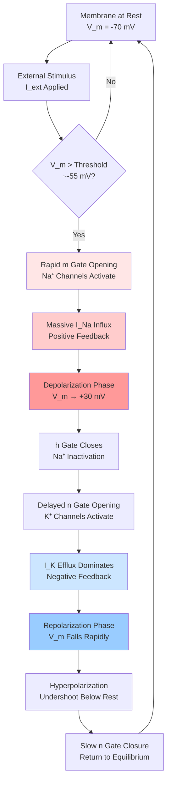

# **Chapter 10: Neuroscience (Hodgkin-Huxley)**

---

## **Introduction**

While financial derivatives (Chapter 9) are governed by stochastic dynamics that reduce to deterministic PDEs through hedging, biological excitable systems operate through fundamentally **deterministic, nonlinear feedback mechanisms** that generate precise, reproducible electrical signals. The **action potential**—the rapid voltage spike that propagates information through neural networks—is not random noise but a rigorous consequence of controlled ion flow across the neuronal membrane. In their landmark 1952 work, Alan Hodgkin and Andrew Huxley demonstrated that this "spike" arises from the interplay of voltage-gated ion channels that act as variable resistors: sodium ($\text{Na}^+$) channels open rapidly to depolarize the membrane, while potassium ($\text{K}^+$) channels open slowly to repolarize it, creating a self-propagating electrical wave. This transforms the neuron from a passive conductor into an **active, excitable circuit** where voltage controls channel conductances, which in turn control currents that change the voltage—a nonlinear feedback loop encoded in coupled differential equations.

This chapter develops the complete **Hodgkin–Huxley (H–H) model**, a system of four coupled nonlinear ordinary differential equations (ODEs) that quantitatively reproduces the action potential from first principles of electromagnetism and chemical kinetics. We begin by modeling the membrane as an electrical circuit: the lipid bilayer acts as a capacitor $C_m$ storing charge, ion concentration gradients create electrochemical batteries with Nernst potentials $E_X = \frac{RT}{zF}\ln([X]_{\text{out}}/[X]_{\text{in}})$, and voltage-gated channels provide variable conductances. The central voltage equation follows from Kirchhoff's current law: $C_m \frac{dV_m}{dt} = I_{\text{ext}} - I_{\text{Na}} - I_{\text{K}} - I_L$, where ionic currents obey Ohm's law $I_X = g_X(V_m - E_X)$. The conductances themselves are dynamic: $g_{\text{Na}} = \bar{g}_{\text{Na}} m^3 h$ and $g_{\text{K}} = \bar{g}_{\text{K}} n^4$, controlled by **gating variables** $(m, h, n)$ that evolve according to voltage-dependent rate equations $\frac{dx}{dt} = \alpha_x(V_m)(1-x) - \beta_x(V_m)x$. This creates a **stiff, four-dimensional dynamical system** requiring high-order numerical integration.

By the end of this chapter, you will master the H–H framework: translating biological ion channel kinetics into electrical circuit equations, implementing the fourth-order Runge–Kutta (RK4) method to integrate the coupled ODEs, and analyzing how positive feedback from rapid $\text{Na}^+$ activation drives depolarization while delayed negative feedback from $\text{K}^+$ activation ensures repolarization. You will simulate the characteristic action potential waveform—depolarization from $-70$ mV to $+30$ mV in $\sim 1$ ms, followed by repolarization and hyperpolarization—and understand how complex phenomena like the all-or-nothing response, refractory period, and spike threshold emerge naturally from deterministic equations without requiring separate biological rules. This chapter bridges continuous physical modeling (Parts I–II) to the agent-based, discrete interaction frameworks of Part III, where networks of H–H neurons generate collective intelligence through emergent dynamics.

---

## **Chapter Outline**

| **Sec.** | **Title** | **Core Ideas & Examples** |
|:---------|:----------|:--------------------------|
| **10.1** | The Physics of the Spike | **Action potential phases**: Resting ($-70$ mV), depolarization (rapid rise to $+30$ mV), repolarization (fall), hyperpolarization (undershoot). **Electrochemical gradients**: Nernst equation $E_X = \frac{RT}{zF}\ln([X]_{\text{out}}/[X]_{\text{in}})$ for $\text{Na}^+$, $\text{K}^+$ equilibrium potentials. **Voltage-gated channels**: Protein pores as variable resistors. Feedback loop: $V_m$ controls gates, gates control currents, currents change $V_m$. |
| **10.2** | The Neuron as Electrical Circuit | **Circuit components**: Membrane as capacitor $C_m$, ion gradients as batteries $E_X$, channels as conductances $g_X$. **Kirchhoff's current law**: $C_m \frac{dV_m}{dt} = I_{\text{ext}} - I_{\text{ion}}$. **Ohmic currents**: $I_{\text{Na}} = \bar{g}_{\text{Na}} m^3 h (V_m - E_{\text{Na}})$, $I_{\text{K}} = \bar{g}_{\text{K}} n^4 (V_m - E_{\text{K}})$, $I_L = g_L(V_m - E_L)$. Charge balance as primary voltage ODE. |
| **10.3** | Gating Variables and Coupled ODEs | **Gating kinetics**: $\frac{dx}{dt} = \alpha_x(V_m)(1-x) - \beta_x(V_m)x$ for $x \in \{m,h,n\}$. **Steady-state form**: $\frac{dx}{dt} = \frac{x_\infty(V_m) - x}{\tau_x(V_m)}$ with $x_\infty = \frac{\alpha_x}{\alpha_x + \beta_x}$. **Conductance dynamics**: $g_{\text{Na}} \propto m^3h$ (three activation, one inactivation gate), $g_{\text{K}} \propto n^4$ (four activation gates). Timescale separation: fast $m$ vs. slow $h, n$. |
| **10.4** | RK4 for Hodgkin–Huxley | **Fourth-order Runge–Kutta**: Four-stage method for stiff, coupled nonlinear ODE system $(V_m, m, h, n)$. **Implementation structure**: Compute rate functions $\alpha_x(V_m), \beta_x(V_m)$ at each RK stage, update all four variables simultaneously. **Stability and accuracy**: $\mathcal{O}(\Delta t^4)$ local truncation error, handles fast $m$ dynamics and slow $n,h$ evolution. |
| **10.5** | Simulating the Action Potential | **Spike waveform reproduction**: Depolarization (positive feedback from $\text{Na}^+$ influx), peak (inactivation), repolarization (delayed $\text{K}^+$ efflux), hyperpolarization (slow $n$ gate closure). **Ionic current analysis**: $I_{\text{Na}}$ surge drives rise phase, $I_{\text{K}}$ surge drives fall phase. **Emergent properties**: All-or-nothing response, refractory period, $-55$ mV threshold—all emerge from coupled ODEs without external rules. |
| **10.6** | Chapter Summary & Bridge | **H–H synthesis**: Neuron as electrical circuit, four coupled ODEs $(V_m, m, h, n)$, positive/negative feedback loops create self-propagating spike. **Deterministic emergence**: Complex biological behavior (threshold, refractoriness) from simple physical laws. Bridge to Part III: From single-neuron dynamics $\frac{d\mathbf{S}}{dt} = f(\mathbf{S}, t)$ to networked agents $\frac{d\mathbf{S}_i}{dt} = f_i(\mathbf{S}_i, \mathbf{S}_{\text{neighbors}}, t)$—collective intelligence through local interactions. |

---

## **10.1 The Physics of the Spike**

-----

### **From Randomness to Determinism: A New Domain**

In previous chapters, we moved from modeling physical systems through equilibrium sampling (Monte Carlo) and deterministic classical dynamics (Molecular Dynamics), to managing randomness through stochastic calculus. We now transition to **biology**, where complex cellular behavior, specifically that of neurons, is governed by rigorous, **deterministic physical laws**. The fundamental unit of information in the nervous system is the **action potential**, or **spike**—a rapid, predictable electrical event that enables neural communication.

-----

### **The Action Potential: Nature's Digital Signal**

In a series of landmark studies in the 1940s and 1950s, **Alan Hodgkin** and **Andrew Huxley** demonstrated that the neuronal spike is a precise, physical consequence of **controlled ion flow** across the cell membrane, rather than random noise. The neuron acts as a **nonlinear electrical circuit** driven by these ion movements.

| Phenomenon | Mechanism | Electrical Analogy |
| :--- | :--- | :--- |
| Electrical spike | Movement of ions ($\text{Na}^+$, $\text{K}^+$) across membrane | Current across a circuit |
| Membrane | Thin insulating lipid layer | Capacitor ($C_m$) |
| Ion channels | Protein pores with **voltage-controlled gates** | Variable resistors (conductances) |

This feedback—where the membrane **voltage ($V_m$)** controls the opening and closing of ion channel gates, which in turn alters the voltage—makes the action potential **self-propagating**.

-----

### **The Observation: Spike Waveform and Phases**

Experimental measurements using microelectrodes reveal a consistent, characteristic waveform for the action potential:

* **Resting Phase:** The stable baseline membrane potential (typically around $-70 \text{ mV}$).
* **Depolarization (Rising Phase):** A rapid and substantial increase in membrane potential (e.g., from $-70 \text{ mV}$ to $+30 \text{ mV}$).
* **Repolarization (Falling Phase):** The potential rapidly falls back toward the resting level.
* **Hyperpolarization (Undershoot):** A brief dip in voltage below the resting potential before the system stabilizes.

These distinct phases are the **fingerprint** of neural signaling, consistent across many excitable cells.

-----

### **The Physics Beneath the Biology: Electrochemical Gradients**

The electrical behavior of the membrane is a direct consequence of **electromagnetic physics and diffusion**. A voltage difference ($V_m$) is maintained across the thin lipid bilayer because key ions ($\text{Na}^+$ and $\text{K}^+$) are unevenly distributed between the cell's interior and exterior:

* **Sodium ($\text{Na}^+$):** High concentration **outside** the cell, driving an **inward** electrical current upon channel opening.
* **Potassium ($\text{K}^+$):** High concentration **inside** the cell, driving an **outward** electrical current upon channel opening.

The **electrochemical equilibrium potential ($E_X$)** for each ion is calculated by the **Nernst equation**:

$$E_X = \frac{RT}{zF} \ln \left( \frac{[X]_{\text{out}}}{[X]_{\text{in}}} \right)$$

where $R$ is the gas constant, $T$ is temperature, $z$ is the ion charge, and $F$ is the Faraday constant. At rest, the membrane acts like a **capacitor** charged to its resting potential; when stimulated, **voltage-gated ion channels** open, allowing ions to flow down their electrochemical gradients and quickly discharge the capacitor, generating the spike.

!!! tip "The Nernst Potential: Electrochemical Equilibrium"
    The Nernst equation tells us the voltage at which electrical force exactly balances chemical diffusion for a given ion. For $\text{Na}^+$ (high outside), $E_{\text{Na}} \approx +50$ mV pulls the membrane positive when channels open. For $\text{K}^+$ (high inside), $E_{\text{K}} \approx -77$ mV pulls it negative. The action potential is the neuron rapidly switching between these two battery potentials by opening different channels.

-----

### **The Hodgkin–Huxley Model: System of Coupled ODEs**

In 1952, Hodgkin and Huxley quantitatively modeled the membrane as a complex, **nonlinear electrical circuit**. They derived a comprehensive system of equations that accounts for charge storage and the dynamic flow of three current types: sodium ($\text{Na}^+$), potassium ($\text{K}^+$), and a passive leak current ($L$).

The core of the model is a **system of four coupled Ordinary Differential Equations (ODEs)**. The first ODE describes the voltage change based on total current (a statement of **Kirchhoff's current law** or charge balance):

$$C_m \frac{dV_m}{dt} = I_{\text{ext}} - I_{\text{Na}} - I_{\text{K}} - I_L$$

The ionic currents ($I_X$) are defined by Ohm’s Law, $I_X = g_X (V_m - E_X)$, where the conductances ($g_{\text{Na}}$ and $g_{\text{K}}$) are controlled by **gating variables** ($m, h, n$) that themselves obey three separate first-order ODEs:

$$\frac{dx}{dt} = \alpha_x(V_m)(1-x) - \beta_x(V_m)x, \quad x \in \{m, h, n\}$$

The functions $\alpha_x(V_m)$ and $\beta_x(V_m)$ are **voltage-dependent rate constants**. This feedback loop—where voltage controls gates and gates control current, which in turn controls voltage—makes the system **highly nonlinear** and capable of reproducing all observed features of the action potential.

-----

### **The Computational Challenge**

The complete Hodgkin–Huxley system is a **deterministic, nonlinear Initial Value Problem (IVP)**. Analytical solutions are impossible due to its complexity. Furthermore, the system is **stiff**—the sodium activation gate ($m$) changes very rapidly, while potassium activation ($n$) and sodium inactivation ($h$) change much more slowly—necessitating the use of a high-accuracy numerical integrator, typically the **fourth-order Runge–Kutta (RK4) method**.

The successful simulation of this system transformed the study of life into a **quantitative physical science**.

---

## **10.2 The Neuron as an Electrical Circuit**

The core strategy of the **Hodgkin–Huxley (H–H) model** is to translate the neuron's complex biological structure into an **equivalent electrical circuit**. This transformation allows the principles of electromagnetism to be applied to cellular dynamics, describing the action potential as a controlled discharge of a capacitor.

-----

### **Electrical Components of the Membrane**

The neuron membrane separates the highly conductive cytoplasm from the external fluid by a thin insulating lipid layer. This physical arrangement can be modeled using three standard electrical components:

* **Capacitor ($C_m$)**: The lipid bilayer acts as a **capacitor**, storing electric charge and maintaining the voltage difference ($V_m$) between the inside and the outside of the cell.
* **Batteries ($E_X$)**: The uneven **ion concentration gradients** (e.g., high $\text{Na}^+$ outside, high $\text{K}^+$ inside) create electrochemical potential differences that function as **batteries**. These fixed voltages, known as **reversal potentials** or equilibrium potentials, represent the driving force for each ion species.
* **Resistors (Conductances $g_X$)**: **Ion channels**, which are protein pores embedded in the membrane, control the flow of ions and act as **resistors**. Crucially, the conductances for sodium ($g_{\text{Na}}$) and potassium ($g_{\text{K}}$) are **variable** and dependent on the membrane voltage and time.

-----

### **The Core Voltage Equation: Charge Balance**

The foundational equation of the H–H model is derived from **Kirchhoff's Current Law** (or Charge Balance), which states that the total current flowing across a patch of membrane must be conserved. This current determines the rate of change of the membrane voltage:

$$C_m \frac{dV_m}{dt} = -I_{\text{total}}$$

The term $C_m \frac{dV_m}{dt}$ represents the **capacitive current**—the rate at which charge accumulates on the membrane's two faces. The total current, $I_{\text{total}}$, is composed of the ionic currents ($I_{\text{ion}}$) and any experimental or synaptic external current ($I_{\text{ext}}$). Rearranging to solve for the voltage change yields the primary ODE of the H–H model:

$$\frac{dV_m}{dt} = \frac{1}{C_m} \left( I_{\text{ext}} - I_{\text{ion}} \right)$$

-----

### **Ionic Currents and Ohm's Law**

The total ionic current ($I_{\text{ion}}$) is the sum of currents flowing through the major ion channels: sodium ($I_{\text{Na}}$), potassium ($I_{\text{K}}$), and a generalized leak current ($I_L$).

Each individual current follows **Ohm's Law**, where the current is the product of the **conductance** ($g_X$) and the **driving force** ($V_m - E_X$):

$$I_X = g_X (V_m - E_X)$$

The current contributions are:

1.  **Sodium Current ($I_{\text{Na}}$)**: This is the large, rapid inward current responsible for the spike's depolarization. It is proportional to the maximum sodium conductance ($\bar{g}_{\text{Na}}$) modulated by its gating variables ($m$ and $h$):
    $$I_{\text{Na}} = \bar{g}_{\text{Na}} m^3 h (V_m - E_{\text{Na}})$$
    *The exponent $m^3 h$ represents the probabilistic nature of the channel opening, requiring three independent activation gates ($m$) and one inactivation gate ($h$) to be open simultaneously.*
2.  **Potassium Current ($I_{\text{K}}$)**: This is the delayed outward current responsible for repolarization. It is proportional to the maximum potassium conductance ($\bar{g}_{\text{K}}$) modulated by its gating variable ($n$):
    $$I_{\text{K}} = \bar{g}_{\text{K}} n^4 (V_m - E_{\text{K}})$$
    *The exponent $n^4$ similarly represents four independent activation gates.*
3.  **Leak Current ($I_L$)**: This models small, passive background currents, typically carried by chloride or residual ions, and uses constant values for its conductance ($g_L$) and reversal potential ($E_L$).

-----

### **The Full Voltage Equation and Resting Potential**

Combining the components, the final **core voltage equation** is derived:

$$\frac{dV_m}{dt} = \frac{1}{C_m} \left( I_{\text{ext}} - \bar{g}_{\text{Na}} m^3 h (V_m - E_{\text{Na}}) - \bar{g}_{\text{K}} n^4 (V_m - E_{\text{K}}) - g_L (V_m - E_L) \right)$$

This ODE defines the voltage ($V_m$) as a function of the dynamic gating variables ($m, h, n$) and the external input ($I_{\text{ext}}$).

The **resting potential** ($V_{\text{rest}}$), typically around $-65 \text{ mV}$ to $-70 \text{ mV}$, is the stable equilibrium state where the total ionic current is zero (assuming $I_{\text{ext}}=0$). At this voltage, the small outward leak and potassium currents are exactly balanced by the inward sodium leak, resulting in $\frac{dV_m}{dt} = 0$.

!!! example "The Membrane as a Leaky Capacitor"
    Think of the neuron as a water tank (capacitor) with three pipes (ion channels): a large $\text{Na}^+$ pipe filling it, a large $\text{K}^+$ pipe draining it, and a small leak pipe. At rest, the filling and draining balance perfectly at $-70$ mV. When you suddenly open the $\text{Na}^+$ valve (depolarization), the tank rapidly fills (voltage rises). Then the $\text{K}^+$ valve opens to drain it back down (repolarization). The leak ensures eventual return to equilibrium.

-----

### **Typical Parameters**

The model's parameters are often quoted based on the original experiments using the **squid giant axon**:

| Parameter | Symbol | Typical Value | Units |
| :--- | :--- | :--- | :--- |
| Membrane Capacitance | $C_m$ | 1.0 | $\mu\text{F/cm}^2$ |
| $\text{Na}^+$ Max Conductance | $\bar{g}_{\text{Na}}$ | 120 | $\text{mS/cm}^2$ |
| $\text{K}^+$ Max Conductance | $\bar{g}_{\text{K}}$ | 36 | $\text{mS/cm}^2$ |
| $\text{Na}^+$ Reversal Potential | $E_{\text{Na}}$ | +50 | $\text{mV}$ |
| $\text{K}^+$ Reversal Potential | $E_{\text{K}}$ | -77 | $\text{mV}$ |

This electrical circuit framework is the necessary foundation for analyzing the complex **gating kinetics** of the ion channels, which we address next.

---

## **10.3 The Conductance: Gating Variables and Coupled ODEs**

The core complexity and functional ability of the Hodgkin–Huxley (H–H) model to generate an action potential lies in the **conductances ($g_{\text{Na}}$ and $g_{\text{K}}$)**, which are not static but are highly dynamic, changing instantaneously in response to the membrane voltage ($V_m$). This voltage-sensitive behavior transforms the neuron from a passive circuit element into an **active, excitable system**.

-----

### **The Concept of Gating Variables**

The H–H model represents the opening and closing of ion channels using **gating variables** ($m, h, n$), which are continuous, deterministic variables constrained between 0 and 1 ($0 \le x \le 1$). These variables describe the **probability (or fraction)** that a specific channel's gate is in the open state. Because there are thousands of channels in a membrane patch, the aggregate behavior of these probabilities is accurately modeled deterministically.

The total conductance for each ion is proportional to the maximum possible conductance ($\bar{g}_X$) multiplied by the product of the corresponding gating variables, raised to empirically determined powers:

* **Sodium Conductance ($g_{\text{Na}}$):** The sodium channel requires three independent **activation gates** ($m$) and one **inactivation gate** ($h$) to be open simultaneously for current to flow:
    $$g_{\text{Na}} = \bar{g}_{\text{Na}} m^3 h$$
* **Potassium Conductance ($g_{\text{K}}$):** The potassium channel requires four independent **activation gates** ($n$) to be open:
    $$g_{\text{K}} = \bar{g}_{\text{K}} n^4$$

-----

### **The First-Order Kinetic ODEs**

Each gating variable ($x \in \{m, h, n\}$) evolves according to a **first-order kinetic Ordinary Differential Equation (ODE)** that describes the competition between the opening and closing rates:

$$\frac{dx}{dt} = \alpha_x(V_m)(1 - x) - \beta_x(V_m)x$$

Here:
* $\mathbf{\alpha_x(V_m)}$ is the **opening rate constant** (transition from closed to open).
* $\mathbf{\beta_x(V_m)}$ is the **closing rate constant** (transition from open to closed).
* The term $\alpha_x(1-x)$ represents the rate of gates opening (proportional to the fraction of closed gates).
* The term $\beta_x x$ represents the rate of gates closing (proportional to the fraction of open gates).

This ODE can be rewritten in terms of its **voltage-dependent steady-state value** ($x_{\infty}$) and its **time constant** ($\tau_x$):

$$\frac{dx}{dt} = \frac{x_{\infty}(V_m) - x}{\tau_x(V_m)}$$

where:
$$x_{\infty}(V_m) = \frac{\alpha_x(V_m)}{\alpha_x(V_m) + \beta_x(V_m)}, \quad \tau_x(V_m) = \frac{1}{\alpha_x(V_m) + \beta_x(V_m)}$$

This form shows that for any given voltage, the variable $x$ relaxes exponentially toward its equilibrium value $x_{\infty}$ at a speed determined by $\tau_x$.

-----

### **The Full Coupled System**

The action potential is an emergent property of the feedback created when the four ODEs are solved simultaneously:

1.  **Voltage Equation ($V_m$):** Dictated by charge conservation and ionic currents (Section 10.2).
2.  **Gating Equations ($m, h, n$):** Dictated by kinetic rates that are **voltage-dependent**.

The **coupling** is established through two loops:
* **Voltage $\to$ Gates:** The voltage $V_m$ determines the rate functions ($\alpha_x, \beta_x$), controlling how quickly the gates $m, h, n$ evolve.
* **Gates $\to$ Voltage:** The evolved gates ($m, h, n$) set the conductances ($g_{\text{Na}}, g_{\text{K}}$), controlling the currents ($I_{\text{Na}}, I_{\text{K}}$), which drive $\frac{dV_m}{dt}$.

The $\text{Na}^+$ activation gate ($\mathbf{m}$) opens **very quickly** upon depolarization, generating a massive inward current that drives the spike's rapid rise (positive feedback). Conversely, the $\text{K}^+$ activation gate ($\mathbf{n}$) and the $\text{Na}^+$ inactivation gate ($\mathbf{h}$) are much **slower**, initiating the delayed repolarization and subsequent recovery (negative feedback). These different time scales are essential for creating the unique shape and timing of the action potential.

??? question "Why Is the Hodgkin-Huxley System Stiff?"
    A stiff ODE system has components evolving on vastly different timescales. In H-H, the sodium activation gate $m$ responds in $\sim 0.1$ ms (very fast), while $h$ and $n$ evolve over $\sim 1-5$ ms (slower). This means explicit methods like Euler require prohibitively small time steps to remain stable. RK4 handles this better with its four-stage predictor-corrector approach, though fully implicit methods (like backward Euler) would be even more stable for extreme stiffness.

The full H-H model is thus a **four-dimensional nonlinear dynamical system** that requires numerical methods like Runge-Kutta (Section 10.4) for its solution.

---

## **10.4 The Simulation Strategy: Runge–Kutta for Hodgkin–Huxley**

The **Hodgkin–Huxley (H–H) model** is a system of **four coupled nonlinear Ordinary Differential Equations (ODEs)** that must be solved simultaneously to generate the action potential. Given its stiff, deterministic nature, this problem is ideally suited for numerical integration using a high-order method like the **4th-order Runge–Kutta (RK4) method**.

-----

### **The Problem Structure**

The simulation seeks to find the time evolution of the system's **state vector** $\mathbf{S}(t) = [V_m, m, h, n]$, where the time derivative of each component is defined by the full H–H equations, which can be expressed generally as $\dot{\mathbf{S}} = \mathbf{f}(\mathbf{S}, t)$:

1.  **Voltage Equation ($\dot{V}_m$):** Dictated by charge conservation, balancing external current ($I_{\text{ext}}$) with ionic currents ($I_{\text{Na}}, I_{\text{K}}, I_L$).
2.  **Gating Equations ($\dot{m}, \dot{h}, \dot{n}$):** Dictated by voltage-dependent kinetic rates $\alpha_x(V_m)$ and $\beta_x(V_m)$.

The **RK4 method** is preferred over simpler schemes (like the Euler method) because it offers **high accuracy** for smooth systems, which is necessary to reliably capture the steep transitions and precise timing of the action potential.

-----

### **The Runge–Kutta Integration**

The RK4 update scheme advances the entire state vector $\mathbf{S}$ from time $t$ to $t+\Delta t$ by calculating four intermediate slope estimates ($k_1, k_2, k_3, k_4$):

$$\mathbf{S}_{t+\Delta t} = \mathbf{S}_t + \frac{1}{6}(k_1 + 2k_2 + 2k_3 + k_4)$$

where the $k$ terms are vectors representing the derivatives of all four state variables, calculated at different points within the interval $\Delta t$:
$$k_1 = \Delta t \cdot \mathbf{f}(\mathbf{S}_t, t)$$
$$k_2 = \Delta t \cdot \mathbf{f}(\mathbf{S}_t + \frac{1}{2}k_1, t + \frac{1}{2}\Delta t)$$
$$k_3 = \Delta t \cdot \mathbf{f}(\mathbf{S}_t + \frac{1}{2}k_2, t + \frac{1}{2}\Delta t)$$
$$k_4 = \Delta t \cdot \mathbf{f}(\mathbf{S}_t + k_3, t + \Delta t)$$

Here is the complete RK4 implementation for the Hodgkin-Huxley system:

```python
def hodgkin_huxley_rk4(V_m, m, h, n, I_ext, dt, params):
    """
    4th-order Runge-Kutta integration for Hodgkin-Huxley model.
    
    Parameters:
    - V_m: Membrane voltage (mV)
    - m, h, n: Gating variables (dimensionless, 0 to 1)
    - I_ext: External stimulus current (μA/cm²)
    - dt: Time step (ms)
    - params: Dictionary with {C_m, g_Na_bar, g_K_bar, g_L, E_Na, E_K, E_L}
    
    Returns:
    - Updated state: (V_m_new, m_new, h_new, n_new)
    """
    def alpha_m(V): return 0.1 * (V + 40) / (1 - np.exp(-(V + 40) / 10))
    def beta_m(V):  return 4.0 * np.exp(-(V + 65) / 18)
    
    def alpha_h(V): return 0.07 * np.exp(-(V + 65) / 20)
    def beta_h(V):  return 1.0 / (1 + np.exp(-(V + 35) / 10))
    
    def alpha_n(V): return 0.01 * (V + 55) / (1 - np.exp(-(V + 55) / 10))
    def beta_n(V):  return 0.125 * np.exp(-(V + 65) / 80)
    
    def derivatives(V, m, h, n, I_ext):
        # Compute ionic currents
        I_Na = params['g_Na_bar'] * m**3 * h * (V - params['E_Na'])
        I_K  = params['g_K_bar'] * n**4 * (V - params['E_K'])
        I_L  = params['g_L'] * (V - params['E_L'])
        
        # Voltage derivative
        dV_dt = (I_ext - I_Na - I_K - I_L) / params['C_m']
        
        # Gating variable derivatives
        dm_dt = alpha_m(V) * (1 - m) - beta_m(V) * m
        dh_dt = alpha_h(V) * (1 - h) - beta_h(V) * h
        dn_dt = alpha_n(V) * (1 - n) - beta_n(V) * n
        
        return np.array([dV_dt, dm_dt, dh_dt, dn_dt])
    
    # RK4 stages
    S = np.array([V_m, m, h, n])
    k1 = dt * derivatives(S[0], S[1], S[2], S[3], I_ext)
    k2 = dt * derivatives(S[0] + 0.5*k1[0], S[1] + 0.5*k1[1], 
                          S[2] + 0.5*k1[2], S[3] + 0.5*k1[3], I_ext)
    k3 = dt * derivatives(S[0] + 0.5*k2[0], S[1] + 0.5*k2[1], 
                          S[2] + 0.5*k2[2], S[3] + 0.5*k2[3], I_ext)
    k4 = dt * derivatives(S[0] + k3[0], S[1] + k3[1], 
                          S[2] + k3[2], S[3] + k3[3], I_ext)
    
    # Update state
    S_new = S + (k1 + 2*k2 + 2*k3 + k4) / 6.0
    
    return S_new[0], S_new[1], S_new[2], S_new[3]
```

-----

### **Initial Conditions and Stimulus**

Before running the simulation, the system must be initialized to the **resting state**:
* **Initial Voltage ($V_m$):** Set to the resting potential ($V_m \approx -65 \text{ mV}$).
* **Initial Gates ($m_0, h_0, n_0$):** Set to the steady-state values ($x_{\infty}(V_0)$) corresponding to the resting voltage.

An **external stimulus current ($I_{\text{ext}}$)** is then applied, typically as a brief pulse, to push the membrane voltage above its threshold (around $-55 \text{ mV}$) and initiate the positive feedback of sodium channel activation.

-----

### **Simulation Output and Emergent Properties**

The numerical integration generates time series for $V_m(t)$, $m(t)$, $h(t)$, and $n(t)$. Analyzing these time series reveals the key **emergent properties** of the neuron that arise solely from the coupled ODE structure:

* **All-or-Nothing Response:** A subthreshold input fails to generate a spike, while a supra-threshold input always generates a full-amplitude spike.
* **Refractory Period:** The neuron is temporarily unresponsive to a second stimulus immediately after firing, due to the slow recovery of the inactivation gate ($h$) and the delayed closing of the potassium gate ($n$).
* **Threshold Behavior:** The precise voltage at which the rapid, regenerative phase of $\text{Na}^+$ influx begins.

The high-resolution time step (typically $\Delta t = 0.01 \text{ ms}$) used in RK4 is critical for accurately resolving the **millisecond-scale dynamics** of the sodium activation gate ($m$), which is essential for preserving the characteristic shape and timing of the spike.

---

## **10.5 Core Application: Simulating the Action Potential**

The simulation of the **Hodgkin–Huxley (H–H) model** represents the climax of the neuroscience module, as the integration of the four coupled ODEs yields the classic **action potential** waveform. This application demonstrates how deterministic physical laws and continuous mathematics precisely reproduce a fundamental biological signal.

-----

### **The Goal and Simulation Output**

The objective is to numerically solve for the time evolution of the membrane voltage ($V_m$) and the gating variables ($m, h, n$) after applying a **supra-threshold external current pulse** ($I_{\text{ext}}$). Using the RK4 method, the simulation generates the time series that visually and quantitatively match the voltage traces recorded experimentally from the squid giant axon.

The resulting $V_m(t)$ trace confirms the expected **spike waveform**:
* A stable baseline (resting potential).
* A rapid, regenerative **rising phase** (depolarization).
* A quick **falling phase** (repolarization).
* A brief **undershoot** (hyperpolarization) before returning to the resting potential.

-----

### **Analyzing the Spike Phases and Ionic Currents**

The distinct phases of the action potential are not isolated events; they are sequential consequences of the interplay between the voltage-dependent sodium ($I_{\text{Na}}$) and potassium ($I_{\text{K}}$) conductances. Analyzing the calculated ionic currents is the key to understanding the mechanism.

| Phase | Mechanism | Ionic Current Event | Feedback Loop |
| :--- | :--- | :--- | :--- |
| **Depolarization** | $V_m$ rises above threshold, rapidly opening $m$ gates. | Massive, rapid $\mathbf{I_{Na}}$ **influx** (inward current). | **Positive** (Current $\to$ Voltage $\to$ More Current). |
| **Peak** | $V_m$ approaches the $\text{Na}^+$ equilibrium potential ($E_{\text{Na}}$) as $h$ begins to close and $n$ begins to open. | $\mathbf{I_{Na}}$ flow stops (inactivation). | Neutral |
| **Repolarization** | Delayed opening of $n$ gates causes $\mathbf{I_{K}}$ to surge outward. | Slow, sustained $\mathbf{I_{K}}$ **efflux** (outward current) dominates. | **Negative** (Current $\to$ Voltage $\to$ Recovery). |
| **Hyperpolarization** | $\text{K}^+$ gates ($n$) close slowly, temporarily driving $V_m$ below the resting potential. | $\mathbf{I_{K}}$ slowly decays, resetting the membrane. | **Recovery**. |

The temporal asymmetry—the $\mathbf{I_{Na}}$ current is quick and explosive, while the $\mathbf{I_{K}}$ current is delayed and sustained—is what gives the action potential its characteristic asymmetric waveform.

-----

### **Dynamic Conductance and Emergence**

Plotting the instantaneous conductances ($g_{\text{Na}} \propto m^3h$ and $g_{\text{K}} \propto n^4$) against time reveals the precise, time-locked sequence that governs the spike:
* $\mathbf{g_{Na}}$ **surges first** and collapses rapidly due to inactivation.
* $\mathbf{g_{K}}$ **rises slowly and late**, reaching its peak after $V_m$ has already begun to fall, ensuring timely repolarization.

The successful reproduction of these features is a striking validation of the H–H model: complex properties such as the **all-or-nothing response** (the spike either fails or proceeds to full amplitude) and the **refractory period** (the neuron's temporary unresponsiveness after firing) are entirely **emergent consequences** of the four deterministic ODEs—no external control or probabilistic rules are required.

-----

### **Quantitative Characteristics**

The H–H simulation yields quantitative characteristics that align with experimental observation:
* **Duration:** The spike typically lasts $2 \text{ to } 3 \text{ ms}$.
* **Peak Amplitude:** Reaches approximately $+30 \text{ mV}$.
* **Threshold Voltage:** Firing is initiated sharply near $-55 \text{ mV}$.

These results demonstrate the power of differential equations to translate **microscopic molecular kinetics** into **macroscopic electrical signaling** with near-perfect accuracy.

---

## **10.6 Chapter Summary & Bridge to Part III**

Chapter 10 concluded our survey of deterministic physical models by applying mathematical principles to the complexities of neuroscience, yielding the **Hodgkin–Huxley (H–H) model** of the neuron.



-----

### **Synthesis of the Hodgkin–Huxley Framework**

The H–H model demonstrated how a fundamental biological signal, the **action potential** (or spike), arises as a precise, predictable consequence of continuous, deterministic physics. The key takeaways were:

* **The Circuit Analogy:** The neuron membrane was modeled as an **electrical circuit** governed by charge conservation (Kirchhoff's Law), where the membrane acts as a **capacitor** and ion channels act as **voltage-controlled resistors** (conductances).
* **Coupled Nonlinear ODEs:** The full system is defined by four coupled nonlinear ODEs describing the voltage ($V_m$) and the three **gating variables** ($m, h, n$) that control the $\text{Na}^+$ and $\text{K}^+$ conductances.
* **Emergent Properties:** Numerical integration using the RK4 method revealed that complex biological phenomena—such as the **all-or-nothing response**, the **refractory period**, and the precise **timing** of the spike—are **emergent consequences** of the equations' inherent positive and negative feedback loops, not separate biological mechanisms.
* **Deterministic vs. Digital:** The H–H model proved that a continuous, deterministic physical system can give rise to robust, digital (thresholded, discrete) outputs, acting as a natural **analog-to-digital converter**.

| Model Component | Physical Function | Mathematical Role |
| :--- | :--- | :--- |
| **Voltage ($V_m$)** | Charge storage | **Primary ODE** (Current Balance) |
| **Gating Variables ($m, h, n$)** | Molecular channel kinetics | **Coupling ODEs** (Nonlinear, Voltage-Dependent) |
| **Feedback** | $\text{Na}^+$ positive; $\text{K}^+$ negative | Generates oscillation and self-restoration |

-----

### **The Conceptual Bridge to Part III**

Throughout the simulation volume (Part II), we have focused on modeling **single-system dynamics**—be it a many-body system at equilibrium (Ising), a quantum field (Lattice Gauge Theory), a price path (SDE), or a single excitable cell (Hodgkin–Huxley).

The **Hodgkin–Huxley model** successfully described the physics *within* one neuron. However, the most complex and interesting biological and social phenomena, such as cognition, flocking behavior, and economic crises, arise not from single entities but from **large-scale collective interactions**.

**Part III: Collective Intelligence (Agent-Based Models)** addresses this next level of complexity:
* **The Transition:** We move from solving coupled ODEs for a single state vector $\mathbf{S}(t)$ to modeling the dynamics of millions of coupled, decentralized systems.
* **The New Framework:** Instead of complex continuous equations, we use simple **local rules** applied to numerous **discrete agents** ($\mathbf{S}_i$).
* **The Goal:** To understand the nature of **emergence**—how global, complex patterns (like flock cohesion or thought processes) spontaneously arise from simple local interactions that are not centrally controlled.

If the single H–H neuron is governed by $\frac{d\mathbf{S}}{dt} = f(\mathbf{S}, t)$, the agent-based approach scales this up to an interacting network:

$$\frac{d\mathbf{S}_i}{dt} = f_i(\mathbf{S}_i, \mathbf{S}_{\text{neighbors}}, t)$$

This transition, from the continuous dynamics of a single system to the **discrete, decentralized interactions** of many, marks the beginning of the computational exploration of **complex systems**.

---

## **References**

1. **Hodgkin, A. L., & Huxley, A. F. (1952).** "A Quantitative Description of Membrane Current and Its Application to Conduction and Excitation in Nerve." *The Journal of Physiology*, 117(4), 500–544. — The original landmark paper establishing the H-H model and winning the Nobel Prize.

2. **Hille, B. (2001).** *Ion Channels of Excitable Membranes* (3rd ed.). Sinauer Associates. — Comprehensive textbook on ion channel biophysics and electrophysiology.

3. **Keener, J., & Sneyd, J. (2009).** *Mathematical Physiology: I: Cellular Physiology* (2nd ed.). Springer. — Rigorous mathematical treatment of excitable systems including detailed H-H analysis.

4. **Izhikevich, E. M. (2007).** *Dynamical Systems in Neuroscience: The Geometry of Excitability and Bursting*. MIT Press. — Geometric phase-plane analysis of neuronal dynamics and bifurcations in H-H model.

5. **Ermentrout, G. B., & Terman, D. H. (2010).** *Mathematical Foundations of Neuroscience*. Springer. — Mathematical methods for analyzing coupled ODE systems in computational neuroscience.

6. **Dayan, P., & Abbott, L. F. (2001).** *Theoretical Neuroscience: Computational and Mathematical Modeling of Neural Systems*. MIT Press. — Standard reference covering H-H model, reduced models, and network dynamics.

7. **Gerstner, W., Kistler, W. M., Naud, R., & Paninski, L. (2014).** *Neuronal Dynamics: From Single Neurons to Networks and Models of Cognition*. Cambridge University Press. — Modern treatment of single neuron models and scaling to network computation.

8. **Koch, C. (1999).** *Biophysics of Computation: Information Processing in Single Neurons*. Oxford University Press. — Detailed biophysical perspective on dendritic computation and cable theory extending H-H.

9. **Rinzel, J., & Ermentrout, G. B. (1998).** "Analysis of Neural Excitability and Oscillations." In *Methods in Neuronal Modeling* (2nd ed.), MIT Press. — Classic chapter on phase-plane methods and reduction techniques for H-H system.

10. **Hairer, E., Nørsett, S. P., & Wanner, G. (1993).** *Solving Ordinary Differential Equations I: Nonstiff Problems*. Springer. — Authoritative reference on Runge-Kutta methods and numerical ODE integration theory.


