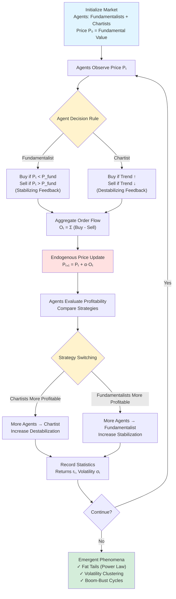

# **Chapter 12: Agent-Based Market Models**

---

## **Introduction**

The stochastic calculus framework (Chapters 8–9) models financial markets through geometric Brownian motion $dS_t = \mu S_t dt + \sigma S_t dW_t$, treating price uncertainty as **exogenous white noise**—external, independent random shocks drawn from a Gaussian distribution. This Efficient Market Hypothesis (EMH) paradigm predicts that returns follow normal distributions, volatility is constant or smoothly varying, and price movements are memoryless. Empirical market data catastrophically violates all three predictions, exhibiting robust **stylized facts**: (1) **fat tails (leptokurtosis)**—extreme price movements occur with power-law frequency $P(|r| > x) \sim x^{-\alpha}$ far exceeding Gaussian predictions, (2) **volatility clustering**—high-volatility periods persist and cluster in time rather than occurring independently, and (3) **sudden crashes and bubbles**—discontinuous collective regime shifts that continuous diffusion models explicitly prohibit. These pervasive deviations reveal that market instability is not caused by external noise but by **endogenous dynamics**—fluctuations generated internally through trader interactions, herding psychology, and positive feedback loops where synchronized buying/selling amplifies small price movements into self-fulfilling booms and busts.

This chapter applies the Agent-Based Model (ABM) framework (Chapter 11) to financial markets, demonstrating that stylized facts emerge naturally from heterogeneous trader interactions without requiring complex external noise. We replace the mean-field assumption of GBM with the **Ising model analogy from statistical physics**: trader actions (Buy/Sell) map to spins ($s_i = \pm 1$), herding strength maps to coupling constant $J$, and net market sentiment maps to magnetization $M = \frac{1}{N}\sum s_i$. The Ising Hamiltonian $E(\mathbf{s}) = -J\sum_{\langle i,j\rangle} s_i s_j - H\sum_i s_i$ governs collective decision-making, where positive $J$ (ferromagnetic coupling) encourages local alignment (imitation), and external field $H$ represents fundamental news bias. We then develop the **Santa Fe Artificial Stock Market (ASM)**, introducing **heterogeneous agents**: fundamentalists who trade toward intrinsic value $P_{\text{fund}}$ (negative feedback stabilizers) and chartists who follow price trends (positive feedback destabilizers). Price updates endogenously via net order flow: $P_{t+1} = P_t + \alpha O_t$, where $O_t = \sum_i \text{action}_i$ replaces the $dW_t$ noise term with collective agent decisions.

By the end of this chapter, you will understand why Gaussian models fail for markets (independence and normality assumptions violated by collective psychology), master the Ising-to-market mapping (spin alignment → herding, phase transitions → crashes/bubbles), and implement the ASM framework where strategy competition between fundamentalists and chartists generates emergent phenomena. You will observe how synchronized herding creates fat-tailed return distributions (extreme events from collective alignment), how adaptive strategy switching produces volatility clustering (memory in risk regimes), and why boom-bust cycles arise as **collective phase transitions** analogous to ferromagnetic ordering. This bridges statistical physics (Ising model), computational complexity (ABM emergence), and econophysics, demonstrating that markets are not efficient equilibrium systems but **complex adaptive systems** where decentralized local rules generate global instability. This prepares you for Chapter 13's biological morphogenesis, where similar reaction-diffusion feedback mechanisms create spatial patterns in living organisms.

---

## **Chapter Outline**

| **Sec.** | **Title** | **Core Ideas & Examples** |
|:---------|:----------|:--------------------------|
| **12.1** | The Limits of White Noise | **EMH/GBM failure**: Gaussian assumptions predict thin tails, independent volatility, continuous paths—all violated by empirical data. **Stylized facts**: Fat tails $P(\|r\| > x) \sim x^{-\alpha}$ (power law vs. exponential), volatility clustering (persistence, memory), sudden crashes (discontinuous jumps). **Endogenous instability**: Herding and feedback loops generate fluctuations internally, not from external $dW_t$ noise. Markets as non-equilibrium complex systems. |
| **12.2** | The Ising Model as Market | **Physics-to-finance mapping**: Trader action (Buy/Sell) $\leftrightarrow$ spin $s_i = \pm 1$, herding strength $\leftrightarrow$ coupling $J$, fundamental bias $\leftrightarrow$ field $H$, net sentiment $\leftrightarrow$ magnetization $M$. **Hamiltonian**: $E(\mathbf{s}) = -J\sum_{\langle i,j\rangle} s_i s_j - H\sum_i s_i$, positive $J$ encourages alignment (imitation). **Temperature regime**: Low $T$ (strong consensus, persistent trends), high $T$ (random chaos, zero net flow). Monte Carlo dynamics for equilibrium sampling. |
| **12.3** | Santa Fe Artificial Stock Market | **Heterogeneous agents**: Fundamentalists trade toward intrinsic value $P_{\text{fund}}$ (stabilizing negative feedback), chartists follow trends/momentum (destabilizing positive feedback). **Endogenous price formation**: $P_{t+1} = P_t + \alpha O_t$ with order flow $O_t = \sum_i \text{action}_i$ replacing $dW_t$. **Adaptive learning**: Strategy switching based on profitability, regime transitions (fundamentalists dominate near equilibrium, chartists amplify trends). Closed feedback loop: actions → price → adaptation → new actions. |
| **12.4** | Fat Tails and Volatility Clustering | **Fat tail mechanism**: Synchronized herding (chartist positive feedback) creates extreme collective order flow, power-law return distributions from phase-transition-like crashes. **Volatility clustering**: Adaptive memory (profitable strategies persist) creates regime persistence—turbulent periods follow turbulent, calm follows calm. **Quantitative validation**: Return distribution kurtosis, autocorrelation of squared returns $\text{Corr}(r_t^2, r_{t+\tau}^2)$, comparison to empirical S&P 500 data. Emergence without exogenous complexity. |
| **12.5** | Chapter Summary & Bridge | **Paradigm synthesis**: Markets as complex adaptive systems, not efficient equilibria—volatility is endogenous (agent interactions), not exogenous ($dW_t$). **Universality of emergence**: Local rules generate global patterns across domains (Ising spins → magnetization, H-H channels → spikes, ASM traders → volatility clustering). Bridge to Chapter 13: From financial agents to biological cells, reaction-diffusion feedback creates spatial patterns (morphogenesis, Turing instability), stripes/spots emerge from chemical imbalance without genetic blueprint. |

---

## **12.1 The Limits of White Noise**

-----

### **The Paradox of Market Noise**

Throughout our analysis of quantitative finance (Chapters 8 and 9), the foundational assumption for modeling price uncertainty has been the **Efficient Market Hypothesis (EMH)** and its mathematical translation into the **Geometric Brownian Motion (GBM)** model. This framework implies that asset prices evolve as a continuous, random process driven by **exogenous white noise** (the Wiener Process, $dW_t$).

The theoretical outcome of this approach is a predictable, continuous system where:
* Returns follow a **Normal (Gaussian) distribution**.
* Volatility is constant or smoothly random.
* All price fluctuations are independent of past movement.

-----

### **The Failure of Gaussian Assumptions**

In reality, financial markets exhibit **stylized facts** that fundamentally violate the Gaussian/EMH premise. These empirical observations prove that markets behave more like **non-equilibrium complex systems** than stable diffusion processes:

* **Fat Tails (Leptokurtosis):** Extreme events, such as crashes and sudden spikes, occur far more often than the Gaussian distribution predicts. The tails of the return distribution are "heavier" and follow a slow-decaying **power law** ($P(|r| > x) \sim x^{-\alpha}$), not an exponential decay.
* **Volatility Clustering:** Periods of high volatility tend to be followed by more high volatility, and calm periods tend to follow calm periods. This persistence shows that market risk has **memory** and is not random white noise.
* **Sudden Shifts:** Prices are prone to sudden jumps and large-scale **bubbles and crashes**, phenomena explicitly ruled out by continuous diffusion models.

This pervasive mismatch exposes the limit of top-down, continuous models in capturing true market instability.

!!! tip "The October 1987 Black Monday Paradox"
    On October 19, 1987, the S&P 500 dropped 20.5% in a single day. Under the Gaussian assumption of GBM with historical volatility $\sigma \approx 15\%$ annually, this was a **22-sigma event**—probability $\sim 10^{-100}$, essentially impossible even over the universe's lifetime. Yet it happened. ABMs explain this naturally: synchronized herding by chartists creates collective phase transitions (crashes) with power-law frequency, making "impossible" events routine.

-----

### **The Emergent Cause: Interaction, Not Noise**

The market's instability is not caused by external, unmodeled noise, but by **endogenous dynamics**—fluctuations generated by the system's internal structure. This instability is rooted in the **local interactions** and **collective psychology** of individual traders:

* **Herding:** Traders are prone to **imitation**, looking to the actions of their peers rather than acting as isolated rational optimizers.
* **Feedback Loops:** Synchronization of buying or selling pressure leads to **amplification** of small price movements, creating self-fulfilling booms and busts.

This collective behavior mirrors the **emergent phenomena** observed in physical systems (Chapter 11): crashes and bubbles are not anomalies, but **collective phase transitions** in the social thermodynamics of trading.

-----

### **The Need for a Bottom-Up Agent-Based Model**

Since the market's aggregate behavior is determined by **heterogeneous agents** and **local, non-linear feedback**, we must discard the mean-field assumption and adopt the **Agent-Based Model (ABM)** philosophy (Chapter 11):

* **The Market as an Ecosystem:** The market is modeled as a network of interacting agents, where the price evolves dynamically as a result of their **collective order flow**.
* **Heterogeneity is Key:** Agents must possess distinct, simple decision rules (e.g., fundamentalists vs. trend followers) to inject the competing behavioral forces necessary to generate complex dynamics.
* **Endogenous Complexity:** The goal is to show that by programming simple local rules, the system spontaneously generates the full spectrum of observed market dynamics (fat tails, clustering) **without injecting any complex external noise**.

This paradigm shift reinterprets markets as **self-organizing critical systems**.

-----

### **The Next Step: The Ising Analogy**

To quantify this behavioral shift, we borrow the concept of **collective interaction** directly from statistical physics. The simplest theoretical framework is the **Ising Model** (Chapter 2), which provides a universal blueprint for collective decision-making systems:
* **Trader Action** ($\text{Buy}/\text{Sell}$) maps to the **Spin** ($\pm 1$).
* **Herding Strength** maps to the **Coupling Constant ($J$)**.
* **Net Market Sentiment** maps to **Magnetization ($M$)**.

This analogy bridges the gap between physics and finance, providing the structural foundation for the complex agent-based models that follow.

---

## **12.2 The Physics Analogy: The Ising Model as a Market**

To quantify the behavioral dynamics of collective trading, the field of **Econophysics** directly borrows the structure of the **Ising Model**, the canonical framework for studying phase transitions and collective behavior in statistical physics. This analogy translates microscopic physical interactions into macroscopic market sentiment.

-----

### **Mapping Key Concepts**

The Ising Model describes how local interactions among binary units (spins) create global order (magnetization). This maps perfectly to the collective decision-making of traders:

| Ising Model (Physics) | Agent-Based Market Model (Econophysics) |
| :--- | :--- |
| **Spin ($s_i = \pm 1$)** | **Trader's Action ($\pm 1$):** Buy ($+1$) or Sell ($-1$) |
| **Coupling Constant ($J$)** | **Herding Behavior:** Strength of local imitation/influence |
| **External Field ($H$)** | **Fundamental News/Bias:** Macro-level economic influence |
| **Temperature ($T$)** | **Market Uncertainty/Chaos:** Psychological randomness |
| **Magnetization ($M$)** | **Net Order Flow/Sentiment:** Total buying minus selling |

!!! example "The Ising-Market Mapping in Practice"
    Consider a network of 1000 traders. Each trader $i$ has opinion $s_i = +1$ (bullish, buy) or $s_i = -1$ (bearish, sell). With coupling $J = 0.5$ (moderate herding) and temperature $T = 1.0$ (moderate randomness), the system exhibits bistability: it can lock into collective buying ($M \approx +1$, bull market) or collective selling ($M \approx -1$, bear market) for extended periods, then suddenly flip between them—exactly like real market regime shifts.

-----

### **The Hamiltonian and Decision Forces**

The collective behavior is governed by the **Ising Hamiltonian**, which represents the total "energy" of the system configuration $\mathbf{s}$:

$$E(\mathbf{s}) = -J \sum_{\langle i, j \rangle} s_i s_j - H \sum_i s_i$$

1.  **Herding Term (Coupling $J$):** The term $-J \sum s_i s_j$ encourages alignment. When the coupling $J$ is positive (ferromagnetic), the system minimizes energy when neighboring traders agree (Buy/Buy or Sell/Sell). This models **local herding** or imitation behavior, which is a major source of market instability.
2.  **Fundamental Term (Field $H$):** The term $-H \sum s_i$ encourages all traders to align with the external bias. In the market, $H$ represents objective news or fundamental value that universally biases decisions.

-----

#### **Trader Dynamics**
A trader's decision to switch positions (e.g., from Buy to Sell) is governed by the **Metropolis or Glauber dynamics** (Chapter 2), ensuring that the system moves toward equilibrium according to the Boltzmann distribution. The probability of flipping depends on the change in energy ($\Delta E$) and the temperature ($T$).

The **temperature parameter ($T$)** is particularly revealing:
* **Low $T$ (Strong Consensus):** Decisions are dominated by the collective forces ($J$ and $H$). The market is highly aligned, leading to persistent rallies or crashes.
* **High $T$ (Random Chaos):** Decisions are dominated by random noise. Traders act independently of herding or news, leading to a disordered market with zero net order flow ($M \approx 0$).

-----

### **Emergent Market Phenomena**

By simulating the time evolution of the Ising model using Monte Carlo methods (Chapter 2), we observe market-like phenomena that arise spontaneously:

* **Net Order Flow ($M$):** The average magnetization, $M(t) = \frac{1}{N} \sum s_i(t)$, represents the aggregate buying or selling pressure at time $t$. Price evolution is then modeled as a cumulative response to this order imbalance: $P_{t+1} = P_t + \alpha M_t$.
* **Phase Transitions:** Near the critical temperature ($T_c$), the system is prone to large-scale, sudden collective alignment or reversal, corresponding to **market bubbles and crashes**.
* **Volatility Clustering:** The simulation generates bursts of high volatility (large $|M|$ fluctuations) separated by calm periods, matching the observed stylized fact of real markets.

The Ising Model serves as the **minimal Agent-Based Market**—a foundational model demonstrating that collective alignment, driven by local psychological factors (herding), is the primary engine of non-Gaussian market dynamics.

---

## **12.3 The Simulation: The Santa Fe Artificial Stock Market (ASM)**

The **Santa Fe Artificial Stock Market (ASM)**, pioneered by researchers at the Santa Fe Institute (Arthur et al., 1997), is a seminal Agent-Based Model (ABM) that extended the abstract Ising analogy into a functional economic system. The ASM successfully demonstrated that the most robust statistical features of real financial data—the **stylized facts**—are emergent consequences of **heterogeneous agents** and **adaptive feedback**, not external white noise.

-----

### **The Agents: Heterogeneity and Competing Strategies**

The ASM introduces essential **heterogeneity** by defining two distinct types of traders who represent the psychological and analytical tension driving real markets:

1.  **Fundamentalists (Stabilizers):** These agents are considered **rational** and believe that the asset possesses an intrinsic **fundamental value** ($P_{\text{fund}}$) based on future discounted earnings. Their trading rule is to restore equilibrium: they **buy** if the market price ($P_t$) is below $P_{\text{fund}}$ and **sell** if it is above. Fundamentalists act as the system's **negative feedback loop**.
2.  **Chartists (Destabilizers):** These agents are **speculators** who ignore $P_{\text{fund}}$ and base their trades solely on **recent price trends** (e.g., momentum, moving averages, or simple extrapolation). Their behavior introduces the psychological component of **imitation** and **herding**, reinforcing collective movements. Chartists act as the system's **positive feedback loop**.

-----

### **The Endogenous Feedback Loop and Price Formation**

The ASM replaces the exogenous noise term ($dW_t$) of the Stochastic Differential Equation (SDE) with an **endogenous price discovery mechanism**:

1.  **Agent Action:** Each trader observes the current market price $P_t$ (the environment) and applies its strategy (fundamental or chartist) to generate a Buy ($+1$) or Sell ($-1$) order.
2.  **Net Order Flow:** The **Net Order Flow ($O_t$)** is calculated as the sum of all individual agent actions (total buying minus total selling). This is analogous to **magnetization ($M$)** in the Ising model.
3.  **Price Update:** The new market price ($P_{t+1}$) is set by adjusting the current price proportionally to the Net Order Flow:
    $$P_{t+1} = P_t + \alpha O_t + \epsilon_t$$
    where $\alpha$ is a constant representing the market's sensitivity to imbalance, and $\epsilon_t$ is minimal background noise.

This mechanism creates a **closed, self-referential feedback loop**: agent actions $\to$ order flow $\to$ price change $\to$ agent adaptation $\to$ new actions.

Here is the basic ASM simulation structure:

```python
def santa_fe_asm_simulation(n_agents, n_steps, P_fund, alpha):
    """
    Santa Fe Artificial Stock Market simulation.
    
    Parameters:
    - n_agents: Number of traders
    - n_steps: Simulation time steps
    - P_fund: Fundamental value of asset
    - alpha: Price sensitivity to order flow
    """
    # Initialize agents (70% fundamentalists, 30% chartists)
    agents = []
    for i in range(n_agents):
        agent_type = 'fundamentalist' if i < 0.7 * n_agents else 'chartist'
        agents.append({'type': agent_type, 'profit': 0.0, 'position': 0})
    
    # Initialize price and history
    price = P_fund
    price_history = [price]
    returns = []
    
    for t in range(n_steps):
        # Phase 1: Agent decisions (based on current price)
        order_flow = 0
        for agent in agents:
            if agent['type'] == 'fundamentalist':
                # Buy if undervalued, sell if overvalued
                action = 1 if price < P_fund else -1
            else:  # chartist
                # Follow momentum (simple trend)
                if len(price_history) > 5:
                    momentum = price_history[-1] - price_history[-5]
                    action = 1 if momentum > 0 else -1
                else:
                    action = 0
            
            order_flow += action
            agent['position'] = action
        
        # Phase 2: Endogenous price update
        price_new = price + alpha * order_flow / n_agents
        returns.append((price_new - price) / price)
        price = price_new
        price_history.append(price)
        
        # Phase 3: Agent adaptation (profit-based strategy switching)
        for agent in agents:
            agent['profit'] += agent['position'] * returns[-1]
        
        # Strategy switching based on relative profitability (simplified)
        if t % 20 == 0:  # Periodic evaluation
            fund_profit = np.mean([a['profit'] for a in agents if a['type'] == 'fundamentalist'])
            chart_profit = np.mean([a['profit'] for a in agents if a['type'] == 'chartist'])
            
            # Agents switch to more profitable strategy
            if chart_profit > fund_profit:
                # Some fundamentalists become chartists
                for agent in agents[:int(0.1 * n_agents)]:
                    if agent['type'] == 'fundamentalist':
                        agent['type'] = 'chartist'
    
    return price_history, returns
```

-----

### **Strategy Evolution and Adaptation**

The ASM does not hold agent strategies static; they **co-evolve** with market conditions. Agents maintain memory of their past performance (e.g., realized profits).

* A **reinforcement learning mechanism** or a rule-switching algorithm dictates that successful strategies are rewarded (kept or imitated), while unsuccessful strategies are discarded or switched.
* When prices trade near $P_{\text{fund}}$, Fundamentalists are profitable and their stabilizing strategies dominate. If Chartists successfully drive a **momentum trend**, they become profitable, attracting more followers, which further amplifies the trend.

This dynamic switching between rational and speculative regimes is what generates complex **boom-bust cycles** and **regime volatility** in the simulation.

-----

### **The Emergent Outcome**

When the ASM is run, the resulting price series and returns successfully reproduce the **stylized facts** of empirical financial markets:

* **Fat Tails:** The distribution of returns is found to be leptokurtic (power-law), with extreme events occurring far more often than in the original Gaussian framework. This is caused by massive, synchronized **herding events** from Chartists overwhelming the market.
* **Volatility Clustering:** The simulation naturally produces alternating periods of high and low volatility (turbulent and calm) due to the agents' collective memory and adaptive strategy switching.

The Santa Fe ASM demonstrated that **complex, real-world market dynamics** emerge spontaneously from minimal local rules and heterogeneity, providing a computational basis for **Econophysics**.

---

## **12.4 Application: Observing Fat Tails and Volatility Clustering**

This section focuses on analyzing the statistical output of the **Santa Fe Artificial Stock Market (ASM)** simulation to verify that the system, driven by heterogeneous agents and feedback, spontaneously generates the core **stylized facts** observed in real financial data. These emergent features—**fat tails** and **volatility clustering**—are phenomena that continuous models like GBM fail to reproduce.

-----

### **The Emergent Signature: Fat Tails**

The most significant failure of classical finance is its reliance on the **Gaussian (Normal) distribution** for returns, which predicts that extreme price movements are astronomically rare. The ASM successfully generates the empirical reality: **fat tails (leptokurtosis)** in the return distribution.

-----

#### **Mechanism of Fat Tails**
In the ASM, fat tails are caused by **collective synchronization**—a massive, synchronized alignment of trader decisions that quickly overwhelms the market's stability.
* **Synchronization:** When Chartists (trend-followers) successfully initiate a momentum trend, their positive feedback loop (buying causes prices to rise, which causes more buying) quickly causes a synchronized order flow.
* **Emergent Extremes:** This synchronized order flow generates massive price changes that are orders of magnitude larger than any single external news event could produce. Crashes and rallies are effectively **collective reorganizations** of agent sentiment.

-----

#### **Quantitative Verification**
The distribution of these extreme returns empirically, and in the ASM, follows a **power law**:
$$P(|r| > x) \sim x^{-\alpha}$$
This power law means the probability density of large returns decays much slower than a Gaussian, confirming that **extreme events are orders of magnitude more common** than predicted by the BSM framework. The fitted exponent $\alpha$ in both real data and ASM simulations typically lies near $3$ (the inverse cubic law).

??? question "Why Do Markets Exhibit Power Laws Instead of Exponential Decay?"
    Power laws arise from **scale-free systems** operating near critical points—systems without characteristic scales where events at all magnitudes follow similar statistical rules. In markets, this happens because herding creates **cascades**: one trader's action triggers neighbors, which trigger more neighbors, creating avalanches of arbitrary size. This is identical to sandpile models and earthquakes. Gaussian models assume independence (no cascades), so they can only produce exponential decay.

-----

### **The Emergent Memory: Volatility Clustering**

The second critical stylized fact generated spontaneously by the ASM is **volatility clustering**—the empirical observation that large price changes (volatility) tend to be followed by other large price changes, resulting in periods of market turbulence alternating with periods of calm.

-----

#### **Mechanism of Volatility Clustering**
In contrast to the constant, random volatility assumed by SDE models (where subsequent increments are independent), volatility clustering reveals that **market risk has memory**. This persistence arises from the agents' **adaptive learning and feedback dynamics**:
* **Agent Memory:** The agents' rules for switching between Fundamentalist (stabilizing) and Chartist (destabilizing) strategies depend on recent price movements (memory).
* **Reinforcement:** A period of high volatility (large price changes) reinforces the use of speculative (Chartist) strategies, causing the market to remain in a volatile regime for an extended time before stabilizing.

-----

#### **Statistical Verification (Autocorrelation)**
The memory of volatility is measured using the **autocorrelation function** ($C(\tau)$) of squared returns ($r_t^2$), which serves as a proxy for volatility:

$$C(\tau) = \frac{\langle r_t^2 r_{t+\tau}^2 \rangle - \langle r_t^2 \rangle^2}{\langle r_t^4 \rangle - \langle r_t^2 \rangle^2}$$

* In a GBM, $C(\tau)$ would immediately drop to zero (no memory).
* In the ASM, $C(\tau)$ decays slowly, following a **power law** over long lags ($\tau$), indicating **long memory** and persistence in volatility. This decay confirms that the market's turbulence is self-organized in time.

-----

### **Self-Organized Criticality**


The simultaneous emergence of fat tails and volatility clustering confirms the primary hypothesis of the ABM approach: financial markets behave as **complex adaptive systems** that operate near a state of **self-organized criticality**. The market is not an efficient, smooth machine, but an evolving ecosystem where instability (volatility) is the natural state produced by continuous adaptation and feedback. This alignment between emergent simulation data and empirical reality validates the bottom-up, behavioral approach to financial modeling.


---

## **12.5 Chapter Summary and Bridge to Chapter 13**

This chapter concluded our study of financial markets by moving past equilibrium models to the realm of **Agent-Based Modeling (ABM)**, demonstrating that market complexities are **emergent properties** of decentralized interactions.

-----

### **Paradigm Synthesis**

The core insight of the ABM approach, epitomized by the **Santa Fe Artificial Stock Market (ASM)**, is that **markets are not efficient; they are complex adaptive systems**.

* **Failure of Exogenous Noise:** We established that continuous models like GBM fail because they treat volatility as simple **exogenous white noise**, when in reality, the "noise" is **endogenously generated** by the system itself.
* **The Generative Mechanism:** The ASM successfully reproduced the **stylized facts** of real markets—including **fat tails** and **volatility clustering**—by modeling the competition and feedback between **heterogeneous agents** (Fundamentalists vs. Chartists).
* **Emergence as Phase Transition:** The market dynamics closely mirror the **Ising Model** from statistical physics. **Crashes and bubbles** are interpreted not as anomalies, but as **collective phase transitions** driven by synchronized **herding** and adaptation among traders.
* **Adaptation and Complexity:** The emergence of complex, power-law behavior proves that **heterogeneity** and **feedback** are essential ingredients for realistic market simulation, replacing the notion that markets operate under pure rationality.

| ABM Component | Financial Function | Emergent Outcome |
| :--- | :--- | :--- |
| **Heterogeneous Agents** | Provides competing forces (stabilization vs. speculation) | Sustained oscillation, not simple equilibrium |
| **Local Rule/Imitation** | Herding pressure ($J$) | **Fat tails** (synchronized buying/selling) |
| **Adaptive Learning** | Strategy switching based on profit | **Volatility clustering** (memory in risk) |

-----

### **The Universality of Emergence**

The ABM framework unifies seemingly disparate fields—physics, biology, and finance—under the universal principle that **complex order arises from decentralized local rules**.

* **Statistical Mechanics (Ising):** Local spin coupling creates global magnetization.
* **Neuroscience (Hodgkin–Huxley):** Local ion channel kinetics creates global electrical spikes.
* **Finance (ASM):** Local imitation creates global volatility clustering.

The ABM methodology, which replaces continuous calculus with discrete computation, is the **computational lens** that makes these structural similarities visible.

-----

### **Bridge to Chapter 13: From Financial Agents to Biological Cells**

The principles of collective self-organization established in modeling markets are directly applicable to the biological world.

We now extend the **Agent-Based Model** to study **biological pattern formation**, or **morphogenesis**:

* **The Shift:** We move from financial agents (traders) to **biological agents (cells)**.
* **The Rules:** The decision logic is replaced by **reaction–diffusion rules**, governing how chemical signals (morphogens) are produced and spread across the cellular environment.
* **The Emergence:** The collective interaction of chemical diffusion (spreading) and chemical reaction (production/decay) spontaneously generates macroscopic, stationary patterns—such as the stripes on a zebra or the spots on a leopard—without any central genetic blueprint.

The theoretical foundation for this is **Alan Turing's 1952 theory of morphogenesis**. In **Chapter 13**, we will see that the same logic that drove the instability in the stock market (positive and negative feedback) drives the instability in chemical concentrations that generates form and architecture in living organisms.

The final journey of this volume is to demonstrate the **universality of emergence**: how local interaction rules govern the geometry of life itself.

Here is the ASM feedback loop that generates market complexity:



Chapter 13 will construct the **reaction-diffusion equations** (Turing's framework) computationally, simulating the transition from homogeneous chemical equilibrium to structured spatial instability, completing the progression:

**Financial Instability (Chapter 12)** → **Biological Pattern Formation (Chapter 13)**.

---

## **References**

1. **Arthur, W. B., Holland, J. H., LeBaron, B., Palmer, R., & Tayler, P.** (1997). *Asset Pricing Under Endogenous Expectations in an Artificial Stock Market*. In W. B. Arthur, S. N. Durlauf, & D. A. Lane (Eds.), The Economy as an Evolving Complex System II (pp. 15-44). Addison-Wesley. [Seminal Santa Fe ASM paper demonstrating emergent stylized facts from heterogeneous agents]

2. **Lux, T., & Marchesi, M.** (1999). *Scaling and Criticality in a Stochastic Multi-Agent Model of a Financial Market*. Nature, 397(6719), 498-500. [Chartist-fundamentalist model generating power-law returns and volatility clustering]

3. **Cont, R.** (2001). *Empirical Properties of Asset Returns: Stylized Facts and Statistical Issues*. Quantitative Finance, 1(2), 223-236. [Comprehensive documentation of market stylized facts: fat tails, volatility clustering, leverage effects]

4. **Mantegna, R. N., & Stanley, H. E.** (2000). *An Introduction to Econophysics: Correlations and Complexity in Finance*. Cambridge University Press. [Foundational econophysics text applying statistical physics to financial markets]

5. **Farmer, J. D., & Foley, D.** (2009). *The Economy Needs Agent-Based Modelling*. Nature, 460(7256), 685-686. [Argument for replacing equilibrium models with agent-based frameworks in macroeconomics]

6. **Hommes, C. H.** (2006). *Heterogeneous Agent Models in Economics and Finance*. In L. Tesfatsion & K. L. Judd (Eds.), Handbook of Computational Economics, Vol. 2 (pp. 1109-1186). North-Holland. [Survey of heterogeneous agent models and emergent market dynamics]

7. **Chakraborti, A., Toke, I. M., Patriarca, M., & Abergel, F.** (2011). *Econophysics Review: I. Empirical Facts*. Quantitative Finance, 11(7), 991-1012. [Comprehensive review of econophysics literature and empirical market regularities]

8. **Bouchaud, J.-P., & Potters, M.** (2003). *Theory of Financial Risk and Derivative Pricing: From Statistical Physics to Risk Management* (2nd ed.). Cambridge University Press. [Statistical physics approach to option pricing and risk management beyond Black-Scholes]

9. **LeBaron, B.** (2006). *Agent-Based Computational Finance*. In L. Tesfatsion & K. L. Judd (Eds.), Handbook of Computational Economics, Vol. 2 (pp. 1187-1233). North-Holland. [Survey of agent-based models in finance, evolutionary dynamics, and market microstructure]

10. **Farmer, J. D., & Geanakoplos, J.** (2009). *The Virtues and Vices of Equilibrium and the Future of Financial Economics*. Complexity, 14(3), 11-38. [Critique of equilibrium paradigm in economics, case for agent-based and evolutionary approaches]


