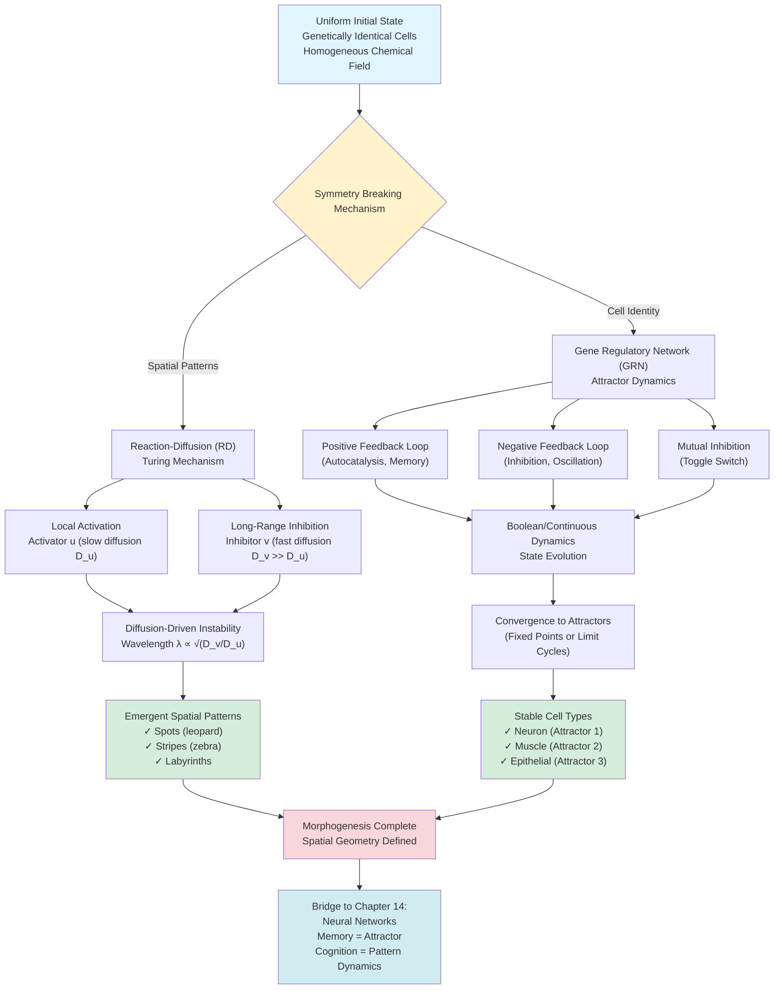

# **Chapter 13: Collective Behavior & Pattern Formation**

---

## **Introduction**

The emergence of biological form—**morphogenesis**—presents a profound computational puzzle: how do genetically identical cells, starting from a uniform embryonic state, spontaneously coordinate to generate complex ordered structures like zebra stripes, leopard spots, or limb geometry without relying on a centralized blueprint? Traditional molecular biology identifies genetic and protein components but struggles to explain how these components **collectively compute geometry and identity** through decentralized local interactions. In his seminal 1952 paper, Alan Turing proposed that biological patterns arise not from genetic prespecification but from **symmetry breaking** driven by simple physical-chemical feedback: random fluctuations in chemical concentrations (morphogens) are amplified through coupled reaction and diffusion processes, converting uniform states into stable spatial differentiation. This requires two complementary computational frameworks: (1) **reaction-diffusion PDEs** modeling continuous chemical fields that diffuse across tissue, and (2) **agent-based models** representing discrete cells following local rules for division, adhesion, migration, and signaling. The mutual feedback between continuous chemical dynamics and discrete cellular agents drives the emergent computation that constructs biological architecture.

This chapter develops the mathematical and computational foundations of pattern formation, beginning with **Turing's reaction-diffusion systems** where two interacting morphogens with concentrations $u, v$ evolve according to $\frac{\partial u}{\partial t} = f(u,v) + D_u \nabla^2 u$ and $\frac{\partial v}{\partial t} = g(u,v) + D_v \nabla^2 v$. The critical insight is **local activation, long-range inhibition**: an activator $u$ promotes its own production (autocatalysis, positive feedback) and creates inhibitor $v$, but because the inhibitor diffuses much faster ($D_v \gg D_u$), it suppresses activator growth in surrounding regions, creating stable periodic spacing. This **diffusion-driven instability** paradoxically uses diffusion—normally a stabilizing, homogenizing process—to amplify noise into structured patterns (spots, stripes, labyrinths) whose characteristic wavelength is determined by the diffusion coefficient ratio. We then shift from spatial geometry to logical architecture through **gene regulatory networks (GRNs)**, modeled as directed graphs $G = (V, E)$ where nodes represent genes/proteins and signed edges encode activation/inhibition interactions. Structural motifs (positive feedback loops for memory, negative feedback for oscillation, mutual inhibition for binary switches) act as cellular logical gates, and **Boolean network dynamics** reveal that stable gene expression patterns—**attractors**—correspond to distinct cell types, making differentiation a computational transition between attractor basins.

By the end of this chapter, you will master the complete pattern formation framework: implementing reaction-diffusion simulations (Gray-Scott model) to generate Turing patterns by adjusting feed/kill rate parameters, understanding how diffusion coefficient imbalance creates structure from uniform chemical fields, analyzing GRN topology using graph theory metrics (degree, centrality, motifs), and simulating Boolean network dynamics to identify attractors as stable cell fates. You will see how the same feedback principles operate across scales—positive feedback stabilizes states (autocatalysis in RD, cell memory in GRNs), negative feedback controls spacing and rhythm (long-range inhibition, oscillatory genes)—and recognize that biological form is an **emergent computational output** of physical laws, not genetic prescription. This bridges statistical physics (Ising alignment → magnetization), financial markets (trader herding → volatility clustering), and developmental biology (chemical feedback → spatial patterns), demonstrating the universality of emergence. Chapter 14 extends these principles from morphogenesis to cognition, showing how Hopfield networks use attractor dynamics for associative memory—the neural analogue of GRN cell fate determination.

---

## **Chapter Outline**

| **Sec.** | **Title** | **Core Ideas & Examples** |
|:---------|:----------|:--------------------------|
| **13.1** | How Cells "Compute" Structure | **Morphogenesis challenge**: Genetically identical cells generate ordered form (stripes, spots, limbs) without central blueprint. **Emergent computation**: Local chemical signaling + cell behavior rules → global geometry. **Symmetry breaking**: Uniform state → structured state via noise amplification through feedback. **Dual framework**: Continuous PDEs (chemical diffusion) + discrete ABMs (cell agents) with mutual feedback. Turing's 1952 insight: form from physics, not genetic prespecification. |
| **13.2** | Reaction-Diffusion (Turing Patterns) | **RD equations**: $\frac{\partial u}{\partial t} = f(u,v) + D_u \nabla^2 u$, $\frac{\partial v}{\partial t} = g(u,v) + D_v \nabla^2 v$ with reaction terms $f,g$ and diffusion $D_u, D_v$. **Local activation, long-range inhibition**: Activator $u$ (slow diffusion, autocatalysis) vs. inhibitor $v$ (fast diffusion $D_v \gg D_u$, suppresses $u$). **Diffusion-driven instability**: Diffusion amplifies fluctuations into periodic patterns. **Emergent morphologies**: Spots (leopard), stripes (zebra), labyrinths—wavelength set by $D_v/D_u$ ratio. Gray-Scott model implementation. |
| **13.3** | Gene Regulatory Networks (GRNs) | **Graph framework**: Directed graph $G = (V, E)$ with genes/proteins as nodes, signed edges (activation $+1$, inhibition $-1$). **Structural motifs**: Positive feedback loop (memory/stability), negative feedback (oscillation/homeostasis), mutual inhibition (toggle switch, binary decisions). **Boolean network dynamics**: ON/OFF states, logic rules (AND/OR/NOT), attractors as stable cell types. **Bistability**: Continuous ODE models with two stable states (genetic toggle switch), differentiation as attractor transition. Graph metrics: degree, centrality, hubs. |
| **13.4** | Chapter Summary & Bridge | **Dual frameworks synthesis**: RD (spatial patterns from diffusion imbalance) + GRNs (logical patterns from feedback loops). **Feedback drives form**: Positive feedback → stability/structure, negative feedback → spacing/rhythm. **Genome as program**: Dynamic system with multiple attractors (cell types), not static blueprint. Bridge to Chapter 14: From morphogenesis (chemical computation in cells) to cognition (electrical computation in neural networks)—Hopfield attractor networks for memory storage, neural field dynamics as activity diffusion, mutual inhibition for decision boundaries. Intelligence as emergent property of organized matter. |

---

## **13.1 How Cells "Compute" Structure**

-----

### **The Mystery of Morphogenesis**

One of the most profound questions in biology is how organisms develop their complex, ordered forms—a process known as **morphogenesis**. Every multicellular organism starts from a single cell, dividing into millions of descendants that are initially genetically identical. Yet, these cells must coordinate their actions to spontaneously produce specific shapes, tissues, and patterns, such as the stripes on a fish or the structure of a limb, without relying on a central blueprint.

Alan Turing, the pioneer of computer science, formalized this question in 1952, proposing that **biological form** could arise spontaneously from simple physical and chemical rules. His core insight was that **cells compute geometry** through local chemical signaling.

-----

### **The Challenge: From Genes to Geometry**

Traditional molecular biology excels at identifying the components (genes and proteins). However, understanding morphogenesis requires explaining **how these components collectively generate structure and pattern**.

The primary challenge lies in coordination:
* **The "Processors":** The individual **cells** act as decentralized processors.
* **The "Rules":** The cells follow simple, local behavioral and **molecular kinetics** (e.g., sense chemical concentrations, divide, secrete).
* **The "Output":** The resulting **complex geometry and functional structure** (the stripes, spots, or organ shape) is the emergent output.

This suggests that development is a process of **emergent computation**.

!!! tip "Why Decentralized Computation?"
    Centralized blueprints would require each cell to know its global position ("I am cell 47,293 at coordinates (x, y, z)") and execute a pre-programmed instruction set. This is computationally intractable for billions of cells and fragile to damage. Instead, evolution discovered **distributed algorithms**: each cell runs the same local rules (sense chemicals, respond), and global patterns emerge automatically. This is identical to how ant colonies build complex nests without architects—local pheromone following creates emergent architecture.

-----

### **Computational Frameworks for Development**

To model and understand this distributed computation, two complementary computational frameworks are employed:

1.  **Partial Differential Equations (PDEs):** Used to model **continuous fields** such as chemical concentrations (morphogens) that diffuse across tissue in space and time.
2.  **Agent-Based Models (ABMs):** Used to model the behavior of **individual cells** (the discrete agents) following local rules for division, adhesion, migration, and signaling.

This hybrid approach recognizes that morphogenesis is driven by a constant **mutual feedback** between **discrete agents** (cells) and **continuous dynamics** (chemical fields).

-----

### **Emergence and Symmetry Breaking**

Morphogenesis requires the system to transition from a uniform, homogeneous state (early embryo) to a structured, ordered state. This is the biological equivalent of **symmetry breaking** in physics.

The emergence of order is triggered when:
* **Noise:** Random fluctuations in local chemical concentrations occur.
* **Interaction:** These fluctuations are coupled to specific chemical feedback loops (activation and inhibition).
* **Structure:** The noise is amplified and converted into a stable, non-uniform **spatial differentiation**.

The process demonstrates that **structure emerges from simple rules and interaction**, not centralized control.

-----

### **The Role of Computational Modeling**

Computational models are essential for studying morphogenesis because they allow us to:
* **Test the Rules:** Directly implement hypotheses about local molecular rules (e.g., the speed of chemical diffusion, the rate of reaction).
* **Visualize Emergence:** Simulate the process over time and observe how complex macroscopic patterns arise from microscopic causes.
* **Bridge Disciplines:** Unify concepts from **biology** (gene expression), **physics** (diffusion equations), and **computation** (simulation algorithms).

The ultimate goal is to understand how **information processing in space and time** constructs the architecture of life.

---

## **13.2 Reaction–Diffusion Models (Turing Patterns)**

The **Reaction–Diffusion (RD) system**, introduced by Alan Turing in 1952, provides the mathematical and computational foundation for understanding how complex **biological patterns** can arise spontaneously from simple chemical interactions. This framework explains the self-organization of structure (**morphogenesis**) through the physics of transport and feedback, rather than requiring detailed genetic pre-coding.

-----

### **The Mathematical Framework**

The core RD system models the continuous concentration fields of two or more interacting chemical species (morphogens) diffusing across tissue in space and time. The equations combine two distinct physical processes: local chemical kinetics and spatial transport:

$$\frac{\partial u}{\partial t} = f(u, v) + D_u \nabla^2 u$$
$$\frac{\partial v}{\partial t} = g(u, v) + D_v \nabla^2 v$$

Here:
* $\mathbf{u}$ and $\mathbf{v}$ are the concentrations of the two morphogens.
* $\mathbf{f(u, v)}$ and $\mathbf{g(u, v)}$ are the **reaction terms**, which define the local chemical kinetics (production, decay, and interaction).
* $\mathbf{D_u}$ and $\mathbf{D_v}$ are the constant **diffusion coefficients** (transport rates).
* $\mathbf{\nabla^2}$ is the **Laplacian operator**, which mathematically models diffusion across the spatial domain.

-----

### **Mechanism: Local Activation, Long-Range Inhibition**

Turing's great insight was that stable, stationary spatial patterns—now called **Turing patterns**—emerge when there is a specific and crucial **imbalance** between the two species:

| Chemical Role | Symbol | Behavior | Requirement for Pattern |
| :--- | :--- | :--- | :--- |
| **Activator** | $u$ | Promotes its own production (autocatalysis) and that of the inhibitor. | Must diffuse **slowly** ($D_u$). |
| **Inhibitor** | $v$ | Suppresses the activator. | Must diffuse significantly **faster** ($D_v \gg D_u$). |

This setup generates the "**local activation, long-range inhibition**" principle:
1.  A random, local fluctuation of $u$ at a specific point amplifies itself (positive feedback).
2.  The activator also generates the inhibitor, $v$.
3.  Because $v$ spreads faster, it suppresses $u$'s growth in the surrounding, long-range neighborhood.
4.  This creates stable, periodic spacing where small "active" spots are surrounded by inhibitory "off" rings.

!!! example "The Gray-Scott Model: A Computational Turing System"
    The Gray-Scott model is a widely studied RD system with reactions:
    $$u + 2v \to 3v \quad (\text{autocatalytic})$$
    $$v \to P \quad (\text{decay})$$
    The PDEs are:
    $$\frac{\partial u}{\partial t} = D_u \nabla^2 u - uv^2 + F(1-u)$$
    $$\frac{\partial v}{\partial t} = D_v \nabla^2 v + uv^2 - (F+k)v$$
    where $F$ is the feed rate (replenishment of $u$) and $k$ is the kill rate (removal of $v$). By varying $(F, k)$ with $D_v/D_u \approx 2$, you can generate spots, stripes, or chaotic patterns—all from identical initial random noise.

-----

### **Diffusion-Driven Instability**

Normally, diffusion acts to stabilize and homogenize a system by smoothing out concentrations. Turing showed that when coupled with specific nonlinear kinetics, diffusion can paradoxically **drive instability** and create structure from a uniform, stable chemical field.

The **most unstable mode** (a specific wavelength) dictates the characteristic spacing of the final pattern, meaning that the width of a stripe or the distance between two spots is determined by the ratio of the diffusion coefficients ($D_v / D_u$). This explains why biological features like a zebra's stripes have a predictable, uniform width.

-----

### **Emergent Morphologies**

By adjusting the kinetic parameters (such as feed and kill rates, or concentrations) within a Reaction–Diffusion system (e.g., the Gray–Scott model), the system spontaneously generates a variety of fixed, stable patterns:

* **Spots:** Isolated clusters of high activator concentration (e.g., leopard spots).
* **Stripes:** Alternating bands of high and low concentration (e.g., zebra stripes).
* **Labyrinths:** Complex maze-like networks.

This mechanism connects **biochemistry** (reactions) and **geometry** (patterns), showing that biological form is an **emergent computational output** of physical laws.

Here is the basic Gray-Scott RD simulation structure:

```python
def gray_scott_simulation(nx, ny, steps, Du, Dv, F, k, dt=1.0, dx=1.0):
    """
    Gray-Scott reaction-diffusion simulation for Turing patterns.
    
    Parameters:
    - nx, ny: Grid dimensions
    - steps: Number of time steps
    - Du, Dv: Diffusion coefficients (Dv > Du for patterns)
    - F: Feed rate (replenishment of u)
    - k: Kill rate (removal of v)
    - dt, dx: Time and space discretization
    """
    # Initialize concentrations with small random perturbations
    u = np.ones((nx, ny))  # Activator (start at 1)
    v = np.zeros((nx, ny))  # Inhibitor (start at 0)
    
    # Add small random seed in center to break symmetry
    u[nx//2-5:nx//2+5, ny//2-5:ny//2+5] = 0.5
    v[nx//2-5:nx//2+5, ny//2-5:ny//2+5] = 0.25
    
    # Discrete Laplacian kernel for diffusion
    laplacian_kernel = np.array([[0, 1, 0],
                                  [1, -4, 1],
                                  [0, 1, 0]]) / (dx**2)
    
    for step in range(steps):
        # Compute Laplacian (diffusion term) using convolution
        from scipy.ndimage import convolve
        laplacian_u = convolve(u, laplacian_kernel, mode='wrap')
        laplacian_v = convolve(v, laplacian_kernel, mode='wrap')
        
        # Reaction terms (Gray-Scott kinetics)
        reaction_u = -u * v**2 + F * (1 - u)
        reaction_v = u * v**2 - (F + k) * v
        
        # Update concentrations (Forward Euler)
        u += dt * (Du * laplacian_u + reaction_u)
        v += dt * (Dv * laplacian_v + reaction_v)
        
        # Optional: visualize every N steps
        if step % 100 == 0:
            # plot(v)  # v typically shows clearer patterns
            pass
    
    return u, v

# Example: Generate spots pattern
# u, v = gray_scott_simulation(256, 256, 10000, Du=0.16, Dv=0.08, F=0.035, k=0.065)
```

---

## **13.3 Gene Regulatory Networks (GRNs)**

While Reaction–Diffusion models (Section 13.2) explain how biological form emerges through **physical transport** in space, the emergence of **distinct cell identities** (e.g., muscle cell vs. neuron) arises from **informational networks** inside the cell. The appropriate computational tool for understanding these internal logical patterns is **Graph Theory**, applied to **Gene Regulatory Networks (GRNs)**.


### The Gene Regulatory Network (GRN) Framework

A GRN is a map of the control system that dictates how genes and proteins regulate one another's expression within a cell. It shifts the focus from spatial geometry to **logical architecture**.

* **Nodes and Edges:** The network is modeled as a **directed graph** $G = (V, E)$. **Nodes ($V$)** represent genes or proteins, and **edges ($E$)** represent regulatory interactions.
* **Edge Sign:** Edges are signed to indicate the nature of the control: **positive (+)** for activation (promotion of expression) and **negative (–)** for inhibition (suppression of expression).
* **State:** The state of a node is its expression level, which can be modeled either continuously (concentration) or discretely (ON/OFF).

The **adjacency matrix** $A$ provides a computational representation of the GRN, encoding these interactions with $+1$, $-1$, or $0$.

-----

### **Network Architecture and Structural Motifs**

Analyzing the **topology** of GRNs using graph theory reveals recurring sub-structures, known as **structural motifs**, which act as the fundamental **logical gates** of the cell:

| Motif | Description | Computational/Biological Function |
| :--- | :--- | :--- |
| **Positive Feedback Loop** | A gene activates itself (directly or via an intermediary gene). | **Memory and Stability:** Stabilizes an ON state, making the decision robust against noise. |
| **Negative Feedback Loop** | A gene inhibits its own production. | **Oscillation and Homeostasis:** Drives rhythmic activity (e.g., circadian clock genes) or maintains a stable target level. |
| **Mutual Inhibition** | Gene A inhibits B, and B inhibits A (a toggle switch). | **Binary Decision-Making:** Forces the system into one of two stable states (cell fate choices). |

Metrics like **degree** (total connections), **in-degree** (inputs), **out-degree** (outputs), and **centrality** are used to computationally identify the functional roles of genes, such as master regulators (hubs) or sensor genes.

-----

### **Boolean Networks and Attractors**

To simulate the dynamics of decision-making within the GRN, genes are often simplified to a **Boolean Network**, where the expression level is binary: ON (1) or OFF (0).

* **Logic Rules:** Each gene's next state is determined by a logical function (AND, OR, NOT) applied to the current states of its regulators.
* **Attractors as Cell Types:** When a Boolean network is simulated iteratively, the system eventually settles into a stable, self-perpetuating pattern. This pattern is known as an **attractor**. An attractor can be a **fixed point** (a single stable state) or a **limit cycle** (a repeating sequence of states). Biologically, these attractors are interpreted as **distinct, stable cell types** (e.g., the expression profile of a neuron is one attractor, and that of a muscle cell is another).

The **genome** is thus viewed not as a static blueprint, but as a **dynamical system with multiple stable equilibria**. **Cell differentiation** is the computational process of transitioning from one attractor basin to another.

??? question "How Many Possible Cell Types Can a GRN Support?"
    For a Boolean network with $N$ genes, there are $2^N$ possible states. However, only a tiny fraction become attractors—typically $O(\sqrt{N})$ for random networks (Kauffman's finding). In humans, ~20,000 genes could theoretically support $2^{20000}$ states, but only ~200-300 stable cell types exist. This massive reduction reflects highly structured, non-random GRN topology: most gene combinations are unstable and collapse into a few robust attractors, ensuring reproducible development.

-----

### **Continuous Models and Bistability**

While Boolean networks capture the logic, **continuous GRNs** use coupled Ordinary Differential Equations (ODEs) to model the smooth, non-linear kinetics of protein concentrations. These continuous models are essential for demonstrating phenomena like **bistability**, where the system has two competing stable states.

A well-known example is the **genetic toggle switch** (two mutually inhibitory genes), which settles into one of two stable states depending on its initial condition. Bistability is a fundamental mechanism for binary decision-making in biological systems (e.g., choosing a cell fate).

---

## **13.4 Chapter Summary and Bridge to Chapter 14**

This chapter concluded our study of biological pattern formation, synthesizing how both **physical transport** and **informational networks** create structure in living systems. We demonstrated that biological order, or **morphogenesis**, is a process of **emergent computation**.

-----

### **Synthesis of Pattern Formation**

We explored two complementary computational frameworks that explain how complexity arises from simple local rules:

| Framework | Mechanism | Mathematical Form | Emergent Outcome |
| :--- | :--- | :--- | :--- |
| **Reaction–Diffusion** (Turing) | **Local activation, long-range inhibition** driven by diffusion imbalance ($D_v \gg D_u$). | Coupled PDEs. | **Spatial patterns** (spots, stripes) through diffusion-driven instability. |
| **Gene Regulatory Networks** (GRN) | **Feedback loops** (positive and negative) among genes. | Graph Theory / Boolean or Continuous ODEs. | **Logical patterns** (attractors) corresponding to stable cell types. |

The unifying principle across both frameworks is that **feedback drives form**:
* **Positive feedback** creates stability and structure (e.g., cell memory in GRNs).
* **Negative feedback** controls rhythm and spacing (e.g., long-range inhibition in RD).

The **Turing pattern** explains *where* pigment goes (geometry), and the **GRN attractor** explains *what* kind of cell or tissue is formed (identity).

-----

### **Philosophical and Computational Implications**

This study reinforces the idea of the **computational universe**: biological processes are algorithmic, and structure is discovered through dynamics.

* **Multistability and Attractors:** Both continuous GRNs and Boolean networks demonstrate **multistability**, meaning the system can settle into several stable states (attractors). These attractors are computationally interpreted as the distinct, stable **cell types** (e.g., neuron, muscle) that arise from the same genome.
* **The Genome as a Program:** The genome is not viewed as a static map but as a **dynamic program** (a recurrent network) that computes its behavior and structure through feedback and iteration.
* **Universality of Logic:** The logical architecture found in these biological systems (feedback loops, switches, oscillators) is the same architecture used in engineered circuits and computational models.

-----

### **Bridge to Chapter 14: From Morphogenesis to Memory**

The mathematical principles of **stability, pattern formation, and feedback** are not exclusive to tissue development; they are also the foundation of **cognition**.

We now transition from **chemical computation in cells** to **electrical computation in neural networks**.

| Concept in Morphogenesis | Analog in Neuroscience | Function |
| :--- | :--- | :--- |
| **Gene Network Attractor** | **Memory Attractor** (Hopfield Network) | Stabilizes information against noise (maintaining cell identity or maintaining a memory). |
| **Reaction–Diffusion** | **Neural Field Dynamics** (Waves of activation) | Spreads signals and creates structured patterns of activity. |
| **Mutual Inhibition** | **Inhibitory Balance** between neural groups | Enforces stable decision boundaries and binary choice. |

In **Chapter 14**, we will study the **Hopfield Network**, which functions as the neural analogue of a regulatory network, showing how the same feedback principles that create a tissue pattern spontaneously create a **memory pattern** in the brain. The biological computation chain leads directly from **morphology (form)** to **cognition (thought)**.

We have shown that complexity in nature requires **computation through interaction**, leading us to the final conclusion of our modeling journey: **intelligence is an emergent property of organized matter**.

Here is the unified framework connecting pattern formation mechanisms:



---

## **References**

1. **Turing, A. M.** (1952). *The Chemical Basis of Morphogenesis*. Philosophical Transactions of the Royal Society of London B, 237(641), 37-72. [Seminal paper introducing reaction-diffusion theory for biological pattern formation]

2. **Murray, J. D.** (2003). *Mathematical Biology II: Spatial Models and Biomedical Applications* (3rd ed.). Springer. [Comprehensive treatment of reaction-diffusion systems, Turing patterns, and biological applications]

3. **Pearson, J. E.** (1993). *Complex Patterns in a Simple System*. Science, 261(5118), 189-192. [Gray-Scott model exploration showing diverse pattern formation from simple parameter changes]

4. **Kondo, S., & Miura, T.** (2010). *Reaction-Diffusion Model as a Framework for Understanding Biological Pattern Formation*. Science, 329(5999), 1616-1620. [Modern experimental validation of Turing patterns in zebrafish stripes and other organisms]

5. **Kauffman, S. A.** (1993). *The Origins of Order: Self-Organization and Selection in Evolution*. Oxford University Press. [Boolean network models of gene regulatory networks, NK networks, and attractor landscapes]

6. **Alon, U.** (2007). *An Introduction to Systems Biology: Design Principles of Biological Circuits*. Chapman and Hall/CRC. [Network motifs in gene regulatory networks: feedforward loops, feedback loops, toggle switches]

7. **Davidson, E. H.** (2006). *The Regulatory Genome: Gene Regulatory Networks in Development and Evolution*. Academic Press. [Gene regulatory network architecture and developmental computation]

8. **Gardner, T. S., Cantor, C. R., & Collins, J. J.** (2000). *Construction of a Genetic Toggle Switch in Escherichia coli*. Nature, 403(6767), 339-342. [Experimental implementation of bistable genetic circuit demonstrating attractor dynamics]

9. **Sick, S., Reinker, S., Timmer, J., & Schlake, T.** (2006). *WNT and DKK Determine Hair Follicle Spacing Through a Reaction-Diffusion Mechanism*. Science, 314(5804), 1447-1450. [Experimental evidence for Turing mechanism in mammalian hair follicle patterning]

10. **Meinhardt, H., & Gierer, A.** (2000). *Pattern Formation by Local Self-Activation and Lateral Inhibition*. BioEssays, 22(8), 753-760. [Classic activator-inhibitor models and applications to developmental biology]


