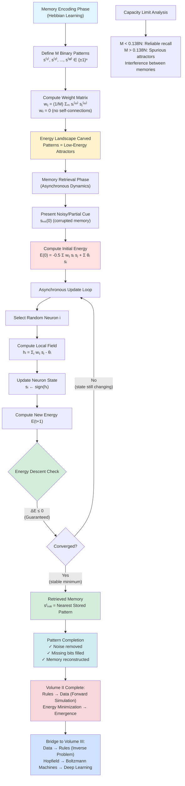

# **Chapter 14: Computational Neuroscience**

---

## **Introduction**

While the Hodgkin–Huxley model (Chapter 10) explains the biophysical mechanisms of a single neuron through continuous voltage dynamics and ion channel kinetics, the phenomenal complexity of cognition and memory arises not from individual cells but from **collective emergent behavior** of billions of interconnected neurons. Simulating networks of full H–H neurons—each requiring four coupled nonlinear ODEs $(V_m, m, h, n)$—is computationally intractable at brain scale. Moreover, the essential computational function of neurons for network-level information processing is not the detailed ionic currents but their **binary all-or-nothing firing decision**: integrating weighted inputs $\sum_j w_{ij} s_j$ and firing when threshold $\theta$ is exceeded. This leads to radical simplification: collapsing continuous voltage into **binary states** $s_i \in \{+1, -1\}$ (active/silent), transforming the neuron from a complex dynamical system into a simple threshold logic unit. The profound insight of John Hopfield (1982) was recognizing that networks of such binary neurons are mathematically identical to **Ising spin glasses from statistical physics**, where neuron states map to spins, synaptic weights to coupling constants, and network dynamics to energy minimization.

This chapter develops the **Hopfield Network** as a computational model of associative memory, demonstrating that memory storage and retrieval are emergent consequences of **thermodynamic relaxation** on an energy landscape. The network is governed by the energy function $E(\mathbf{s}) = -\frac{1}{2}\sum_{i \neq j} w_{ij} s_i s_j + \sum_i \theta_i s_i$, mathematically equivalent to the Ising Hamiltonian with synaptic weights $w_{ij}$ as coupling strengths and thresholds $\theta_i$ as external fields. **Memory encoding** uses the Hebbian learning rule—"neurons that fire together, wire together"—computing weights as $w_{ij} = \frac{1}{M}\sum_{m=1}^M s_i^{(m)} s_j^{(m)}$ to carve low-energy basins (attractors) for each stored pattern $\mathbf{s}^{(m)}$. **Memory retrieval** occurs through asynchronous updates: neurons sequentially flip to align with weighted inputs $s_i \gets \text{sign}(\sum_j w_{ij} s_j - \theta_i)$, guaranteed to decrease or maintain energy $\Delta E \leq 0$, driving the network downhill to the nearest attractor. Presenting a noisy or partial input (cue) initializes the system in a high-energy state; relaxation dynamics then perform **pattern completion**, converging to the stored memory that best matches the cue.

By the end of this chapter, you will master the complete Hopfield framework: implementing binary neuron dynamics with asynchronous update rules, encoding multiple memory patterns using Hebbian weights, simulating energy descent to stable attractors, and understanding capacity limits ($M_{\text{max}} \approx 0.138N$ patterns before spurious minima emerge). You will recognize memory not as static data storage but as an **emergent physical process**—stable fixed points in a dynamical system's evolution, computed through distributed energy minimization without centralized control. This unifies statistical mechanics (Ising energy minimization), morphogenesis (GRN attractors as cell types), and cognition (Hopfield attractors as memories), revealing the universal principle: **complex computation emerges from simple local rules through collective relaxation to stability**. This completes Volume II's journey from simulation (rules → data) and bridges to Volume III's inverse problem (data → rules), where Hopfield networks inspire energy-based learning models (Boltzmann Machines) and gradient descent on energy landscapes becomes the foundation of deep learning.

---

## **Chapter Outline**

| **Sec.** | **Title** | **Core Ideas & Examples** |
|:---------|:----------|:--------------------------|
| **14.1** | The Network as Computer | **From single neuron to collective intelligence**: H–H model (Chapter 10) captures single-cell biophysics, but cognition is network-level emergence. **Memory as attractors**: Stored memories = stable low-energy states in network's energy landscape, recall = relaxation to nearest attractor. **Ising analogy**: Neuron firing $s_i = \pm 1 \leftrightarrow$ spin, synaptic weight $w_{ij} \leftrightarrow$ coupling $J$, network energy $E \leftrightarrow$ Hamiltonian. **Thermodynamic computation**: Brain computes by relaxing to equilibrium, not sequential instructions. Binary simplification: integrate-and-fire → threshold logic. |
| **14.2** | Integrate-and-Fire Simplification | **From H–H to binary**: Full model $(V_m, m, h, n)$ intractable for large networks, essential function is threshold firing decision. **Integrate-and-fire dynamics**: $\tau \frac{dV_i}{dt} = -V_i + \sum_j w_{ij} s_j + I_i^{\text{ext}}$, fire when $V_i > \theta$. **Binary abstraction**: $s_i \in \{+1, -1\}$ (active/silent), all physiology absorbed into synaptic weights $w_{ij}$. **Discrete update rule**: $s_i(t+1) = \text{sign}(\sum_j w_{ij} s_j(t) - \theta_i)$. Asynchronous vs. synchronous updates. |
| **14.3** | Hopfield Network and Memory | **Energy function**: $E(\mathbf{s}) = -\frac{1}{2}\sum_{i \neq j} w_{ij} s_i s_j + \sum_i \theta_i s_i$, equivalent to Ising spin glass Hamiltonian. **Hebbian encoding**: $w_{ij} = \frac{1}{M}\sum_{m=1}^M s_i^{(m)} s_j^{(m)}$ creates attractor basins for stored patterns. **Energy descent**: Asynchronous updates guarantee $\Delta E \leq 0$, network converges to stable minima. **Associative memory**: Pattern completion from noisy/partial cues, retrieval as downhill relaxation to nearest attractor. Capacity limit $M_{\text{max}} \approx 0.138N$ before spurious minima. |
| **14.4** | Storing and Retrieving Patterns | **Encoding phase**: Compute weight matrix $\mathbf{W}$ via Hebbian rule for $M$ binary patterns (e.g., images, text). **Retrieval simulation**: Initialize with corrupted pattern (flip random bits), iterate asynchronous updates until convergence (energy minimum). **Pattern completion demo**: Partial input → full memory reconstruction. **Capacity analysis**: Success rate vs. number of stored patterns, spurious attractor emergence beyond $0.138N$. Visualizing energy landscape and basin structure. |
| **14.5** | Chapter Summary & Volume End | **Physics-cognition unification**: Hopfield network = Ising spin glass, memory = attractor, recall = energy minimization. **Universal dynamics archetype**: Change $\propto -\nabla E$ across all Volume II systems (MC equilibrium sampling, MD potential minimization, BSM hedging, Turing/Hopfield emergence). **Simulation synthesis**: Rules → data (forward modeling). Bridge to Volume III: Data → rules (inverse problem)—Hopfield inspires Boltzmann Machines, energy landscapes → deep learning gradient descent. **Grand conclusion**: Computation discovered, not invented—energy minimization governs matter, life, intelligence. |

---

## **14.1 The Network as a Computer**

-----

### **From Neuron to Network**

In Chapter 10, we achieved a detailed, biophysical understanding of the single neuron using the **Hodgkin–Huxley (H–H) equations**, modeling continuous voltage, ion channel dynamics, and membrane capacitance. However, the phenomenal complexity and intelligence of the brain do not reside within a single neuron; they are **distributed** and arise from the **collective interaction** of billions of neurons connected by thousands of synapses.

To model **cognition** and **memory**, the computational challenge requires shifting focus from the continuous physics of one cell to the **emergent behavior** of the entire network.

-----

### **The New Goal: Modeling Collective Memory**

The central question in network-level computational neuroscience is how a complex network of simple, interconnected units can perform higher-level functions like **memory and pattern recognition**.

Memory is not stored in a centralized file system; it is **reconstructed** by the network from partial inputs. This reconstruction process is modeled as the network dynamically evolving toward a **stable network state**.

This perspective leads directly to the **Hopfield Network**, a model that unifies physics and cognition.

!!! tip "Why Energy Functions for Memory?"
    Energy functions provide a natural framework for understanding stability. In physics, stable states (like a ball at the bottom of a valley) are energy minima—small perturbations don't change the state. Similarly, memories must be stable against noise (forgetting). By mapping memory to energy minima, Hopfield guaranteed that corrupted inputs naturally flow downhill to the nearest stored pattern, implementing error correction through pure physics.

-----

### **The Hopfield Insight: Energy Minimization**

In 1982, physicist **John Hopfield** formalized this connection with a crucial insight: the dynamics of a neural network can be related to a scalar quantity—the **energy function**.

His model showed that the network's collective activity evolves to **minimize this energy function**, just like a physical system moving toward thermal equilibrium or its ground state.

* **Memories as Attractors:** In this framework, stored **memories** correspond to **stable, low-energy minima (attractors)** in the network's high-dimensional energy landscape.
* **Recall as Relaxation:** Presenting a noisy or partial input (a "cue") puts the network in a high-energy state. The network then evolves dynamically (relaxes) until it settles into the nearest low-energy minimum, thereby **recalling (completing) the associated memory**.

This views the brain as a **thermodynamic computer** that computes by **relaxing to equilibrium**, not by following sequential instructions.

-----

### **Analogy to Physics (Ising Model)**

The Hopfield Network draws a direct analogy to the **Ising Hamiltonian** (Chapter 2):

* **Neuron Firing State ($s_i = \pm 1$)** maps to the **Ising Spin** ($\pm 1$).
* **Synaptic Weight ($w_{ij}$)** maps to the **Ising Coupling Constant ($J_{ij}$)**.
* **Network Energy ($E$)** measures the consistency of neuron interactions.

The **Energy Function** of the Hopfield Network is mathematically equivalent to the Hamiltonian of a generalized **Ising spin glass**. This establishes a profound link: a network that thinks is essentially an Ising model that minimizes its energy.

-----

### **Emergence of Computation**

The Hopfield model provides a powerful realization of **emergent computation**:
* **Local Physics Yields Global Intelligence:** Each neuron follows a simple local rule based on input. The collective asynchronous updating yields a global, ordered outcome (a stable memory).
* **Distributed Storage:** Memory is not stored in a single neuron or central location; it is **distributed** across the pattern of **synaptic weights**.

The complexity of the brain is thus explained by **local physics yielding global intelligence**—a self-organizing process where **local stability produces global order**.

-----

### **Simplification to Integrate-and-Fire**

Simulating the full $\text{H-H}$ model for large networks is computationally infeasible. Therefore, analysis must simplify the neuron to its essential functional output, shifting the computational focus from complex membrane dynamics to network connectivity.

The simplification is the **Integrate-and-Fire** model, abstracted into a **Binary Neuron State** ($s_i \in \{+1, -1\}$):
* **Integration:** The neuron sums the weighted inputs from its neighbors ($\sum_j w_{ij} s_j$).
* **Firing:** It sets its state to $+1$ if this integrated input exceeds a threshold ($\theta_i$).

This binary simplification successfully captures the **all-or-nothing nature** of the action potential (Chapter 10), which is the essential functional output required for network-level computation.

---

## **14.2 Simplification to Integrate-and-Fire**

-----

### **From Biophysics to Abstraction**

The detailed **Hodgkin–Huxley (H–H)** model (Chapter 10) accurately describes a single neuron’s firing through continuous, nonlinear ODEs. However, simulating the complex ionic currents ($I_{\text{Na}}, I_{\text{K}}$) and four state variables ($V_m, m, h, n$) for large **networks** of neurons quickly becomes **computationally intractable**.

To study cognition and memory at the network scale, we must simplify the neuron, retaining only its essential information-processing role: 
**integration** of inputs and **firing** when a threshold is met. This is the basis of the **Integrate-and-Fire neuron** model.

-----

### **The Integrate-and-Fire Abstraction**

The Integrate-and-Fire (IF) model abstracts the neuron as a circuit that sums incoming signals and compares the result to a voltage threshold ($\theta$).

The evolution of the membrane potential ($V_i$) is governed by an ODE that models the passive decay of charge and the influx of synaptic current:

$$\tau \frac{dV_i}{dt} = -V_i + \sum_{j} w_{ij} s_j + I_i^{\text{ext}}$$

Where:
* $\mathbf{w_{ij}}$ is the **synaptic weight** (influence) from neuron $j$ to $i$.
* $\mathbf{s_j}$ is the output state (activity) of neuron $j$.
* The **Integration** step is the summation $\sum_{j} w_{ij} s_j$.

The **Firing** event occurs when $V_i(t)$ exceeds the threshold $\theta$, after which $V_i$ is reset.

!!! example "The McCulloch-Pitts Neuron: The Original Binary Model"
    In 1943, McCulloch and Pitts proposed the first mathematical neuron model with binary output:
    $$y = \begin{cases} 1 & \text{if } \sum_j w_j x_j \geq \theta \\\\ 0 & \text{otherwise} \end{cases}$$
    This showed that networks of such units could implement any logical function (AND, OR, NOT), proving that neural circuits are universal computers. Hopfield extended this by adding dynamics (temporal evolution) and energy functions (global stability), transforming static logic gates into dynamical memory systems.

-----

### **Binary Simplification: The Agent as a Spin**

The **Hopfield Network** simplifies the IF model further by collapsing the continuous voltage dynamics into a **binary state**. This abstraction maintains the core decision behavior while enabling massive network simulation.

The state of each neuron $i$ is modeled as a **spin**:
$$\mathbf{s_i \in \{+1, -1\}}$$
* $\mathbf{s_i = +1}$ means the neuron is **active** (firing).
* $\mathbf{s_i = -1}$ means the neuron is **silent** (not firing).

This reduction makes the network **mathematically identical to the Ising model**. All complex physiological details (ionic currents, spikes, refractory periods) are absorbed into the scalar synaptic weight $\mathbf{w_{ij}}$.

-----

### **The Discrete Update Rule**

The local behavior of the binary neuron is defined by a simple **threshold rule**:

$$s_i(t + 1) = \text{sign}\left( \sum_{j} w_{ij} s_j(t) - \theta_i \right)$$

Where the sum $\sum_j w_{ij} s_j(t)$ is the total **weighted input**.

This rule is executed via **asynchronous updates** (randomly picking one neuron at a time). The process repeats until the network reaches a stable configuration, which is the **memory attractor**.

The core benefit of this simplification is stability: the asynchronous update ensures **local energy descent**, guaranteeing that the network **converges** to a stable, low-energy state. This convergence is the engine of **memory formation**.

-----

### **Summary of Simplification**

| Concept | Biological Reality (H–H) | Computational Abstraction (Hopfield) |
| :--- | :--- | :--- |
| **Agent State** | Continuous Voltage ($V_m$) | Binary Spin ($s_i = \pm 1$) |
| **Input Current** | $\text{Na}^+/\text{K}^+$ Ionic Dynamics | Weighted Sum ($\sum w_{ij}s_j$) |
| **Decision** | $\frac{dV}{dt} > 0$ and $V > \theta$ | Sign Function ($\text{sign}(h_i - \theta_i)$) |
| **Equivalence** | Biophysics | **Ising Model** |

The computational power of the Hopfield Network lies in this strategic simplification: retaining the **all-or-nothing threshold decision** while leveraging the **thermodynamic principles** of the Ising model.

---

## **14.3 The Hopfield Network and Memory**

-----

### **From Neurons to Energy**

The **Hopfield Network** establishes a profound connection between **neural computation** and **statistical mechanics** by showing that the network's behavior can be described by a scalar quantity: the **Energy Function** ($E$). This function allows us to ask, "What is the network as a whole trying to do?" The answer is simple: it is evolving to **minimize its total energy**.

Hopfield deliberately constructed the local update rule (Section 14.2) to guarantee that every asynchronous decision made by a neuron **decreases or maintains the network's total energy** ($\Delta E \le 0$). This guarantees the network will always converge to a stable state.

-----

### **The Hopfield Energy Function**

The Energy Function, $E(\mathbf{s})$, defines a high-dimensional **energy landscape** over the network's configuration space (all possible $2^N$ states):

$$E(\mathbf{s}) = -\frac{1}{2} \sum_{i \neq j} w_{ij} s_i s_j + \sum_i \theta_i s_i$$

Here:
* $\mathbf{s} = [s_1, \ldots, s_N]$ is the vector of binary neuron states ($s_i = \pm 1$).
* The first term, $- \frac{1}{2} \sum w_{ij} s_i s_j$, represents the **pairwise interaction** between neurons, weighted by their symmetric **synaptic connection ($w_{ij}$)**.
* The second term, $\sum_i \theta_i s_i$, accounts for the **individual neuron thresholds** ($\theta_i$) or biases.

This function dictates the stability of any given pattern of neural firing.

-----

### **The Ising Analogy: Energy Minimization**

The Hopfield Energy Function is mathematically equivalent to the Hamiltonian of the **Ising spin glass**:

| Hopfield Term | Ising Term | Interpretation |
| :--- | :--- | :--- |
| $-\frac{1}{2}\sum_{i,j} w_{ij}s_is_j$ | $-J\sum_{\langle i,j\rangle}s_is_j$ | **Coupling:** Synaptic weight ($w_{ij}$) is analogous to spin coupling ($J$). |
| $+\sum_i\theta_is_i$ | $-H\sum_is_i$ | **Bias:** Neuron threshold ($\theta_i$) is analogous to the external magnetic field ($H$). |

This means that the process of **thinking** (network evolution) is physically equivalent to a disordered magnetic material **relaxing to its ground state**.

??? question "Why Does Asynchronous Update Guarantee Energy Descent?"
    When neuron $i$ flips from $s_i$ to $-s_i$, the energy change is $\Delta E = -2s_i(\sum_j w_{ij}s_j - \theta_i)$. The update rule flips $s_i$ only when $\text{sign}(\sum_j w_{ij}s_j - \theta_i) \neq s_i$, which means the product $s_i \cdot (\sum_j w_{ij}s_j - \theta_i) < 0$. Therefore $\Delta E = -2 \times (\text{negative}) = \text{negative}$, guaranteeing energy always decreases or stays constant. This is why asynchronous (one neuron at a time) updates are crucial—synchronous updates can create oscillations.

-----

### **Memory as a Stable Attractor**

The primary function of the Hopfield Network is **associative memory**. Memory is stored by shaping the energy landscape such that desired patterns become stable minima.

1.  **Encoding (Hebbian Learning):** The **synaptic weights ($w_{ij}$) are calculated using the Hebbian learning rule** (inspired by the idea that "neurons that fire together, wire together"):
    $$w_{ij} = \frac{1}{M} \sum_{m=1}^{M} s_i^{(m)} s_j^{(m)}$$
    This rule strengthens connections between co-active neurons across all stored patterns ($\mathbf{s}^{(m)}$), effectively carving out basins of attraction (low-energy valleys) for each memory.

2.  **Storage (Attractors):** Each stored pattern $\mathbf{s}^{(m)}$ becomes a **stable, low-energy minimum (attractor)** in the landscape.
3.  **Retrieval (Relaxation):** When the network is presented with a **noisy or corrupted input pattern (a cue)**, the system is placed in a high-energy state. The asynchronous update dynamics then drive the system downhill, causing it to **converge to the nearest attractor**. This process is **pattern completion**—recalling the full memory from a partial input.

The network's ability to store and retrieve multiple patterns is limited by its capacity ($M_{\text{max}} \approx 0.138N$). Exceeding this limit causes attractor basins to overlap, creating spurious minima and leading to memory interference.

-----

### **The Computational Conclusion**

The Hopfield Network demonstrates that memory is not merely data storage but an **emergent, physical process**. The computation of memory is achieved through **dynamic relaxation**, with the **stable fixed points** of the network's evolution corresponding directly to the information it has learned.

---

## **14.4 Storing and Retrieving Patterns**

The simulation of the Hopfield Network involves two primary computational phases: **encoding** (storing memory) and **retrieval** (recalling memory), both leveraging the principle of energy minimization.

-----

### **Encoding: The Hebbian Learning Rule**

The encoding phase is static, focusing on calculating the **synaptic weight matrix ($\mathbf{W}$) ** that defines the energy landscape. The weights are determined using the **Hebbian learning rule**:

$$w_{ij} = \frac{1}{M} \sum_{m=1}^{M} s_i^{(m)} s_j^{(m)}, \quad w_{ii} = 0$$

* **Correlation Storage:** This rule ensures that connections between neurons are strengthened (made more excitatory) if they are frequently **co-active** (i.e., firing together, $s_i=s_j$), and weakened (made inhibitory) if they are active in opposition ($s_i \neq s_j$).
* **Attractor Carving:** The resulting $\mathbf{W}$ matrix embeds the desired **memory patterns ($\mathbf{s}^{(m)}$)** as **stable fixed points** or low-energy minima in the network's energy landscape.

The computation involves simple matrix operations to calculate the correlation (outer product) of all stored binary patterns.

-----

### **Retrieval: Asynchronous Energy Descent**

The retrieval phase is dynamic, simulating the network's evolution from a noisy input to a stored memory. This process is equivalent to the system performing a **gradient descent** in the energy landscape.

-----

#### **The Asynchronous Update Loop**
Retrieval uses an **asynchronous update scheme**, where a single, random neuron ($i$) is selected and updated at a time:

1.  **Select Neuron:** Choose a random neuron $i$ from $N$ neurons.
2.  **Calculate Local Input:** Compute the neuron's weighted input ($h_i$) from all other neurons in the current state $\mathbf{s}(t)$:
    $$h_i = \sum_{j \neq i} w_{ij} s_j(t)$$
3.  **Update State:** Set the neuron's new state ($s_i$) based on the sign of the local input:
    $$s_i(t+1) = \text{sign}(h_i)$$

This iteration repeats until the state vector $\mathbf{s}$ stabilizes (i.e., no neuron can change its state, meaning the system has reached a minimum where $\Delta E = 0$).

-----

#### **Pattern Completion and Error Correction**
The core function demonstrated during retrieval is **pattern completion (associative recall)**:
* The network is initialized with a **noisy cue** (a corrupted version of a stored memory).
* The energy minimization dynamics drive the network away from the high-energy, noisy state.
* The system relaxes into the nearest attractor, resulting in the reconstruction of the full, uncorrupted stored memory. This is the computational equivalent of human memory recall from a partial fragment.

-----

#### **Visualizing Energy Descent**
Monitoring the network's total **Energy ($E$)** during the retrieval simulation confirms that the process is a relaxation. Plotting $E(t)$ versus time shows a **monotonically non-increasing** function, confirming that the update rule guarantees movement only toward a lower energy state, physically validating the memory mechanism.

The network's functionality is bounded by its **memory capacity** ($M_{\text{max}} \approx 0.138N$); attempting to store too many patterns causes interference and unreliable recall.

Here is the complete Hopfield Network implementation:

```python
import numpy as np

def hopfield_encode(patterns):
    """
    Encode memory patterns using Hebbian learning.
    
    Parameters:
    - patterns: List of M binary patterns, each of shape (N,)
              Values should be +1 or -1
    
    Returns:
    - W: Weight matrix (N, N) with zero diagonal
    """
    M = len(patterns)
    N = patterns[0].shape[0]
    
    # Initialize weight matrix
    W = np.zeros((N, N))
    
    # Hebbian learning: w_ij = (1/M) * sum over patterns of s_i * s_j
    for pattern in patterns:
        W += np.outer(pattern, pattern)
    
    W = W / M
    
    # Zero diagonal (no self-connections)
    np.fill_diagonal(W, 0)
    
    return W

def hopfield_energy(state, W, theta=None):
    """
    Compute Hopfield energy for a given state.
    
    E = -0.5 * sum(w_ij * s_i * s_j) + sum(theta_i * s_i)
    """
    if theta is None:
        theta = np.zeros(len(state))
    
    interaction_energy = -0.5 * state @ W @ state
    threshold_energy = theta @ state
    
    return interaction_energy + threshold_energy

def hopfield_retrieve(initial_state, W, theta=None, max_iter=1000):
    """
    Retrieve memory from noisy input via asynchronous update.
    
    Parameters:
    - initial_state: Corrupted pattern (N,) with values +1 or -1
    - W: Weight matrix from encoding
    - theta: Threshold vector (default: zeros)
    - max_iter: Maximum iterations before stopping
    
    Returns:
    - state: Converged state (retrieved memory)
    - energy_history: Energy at each iteration
    """
    N = len(initial_state)
    state = initial_state.copy()
    
    if theta is None:
        theta = np.zeros(N)
    
    energy_history = [hopfield_energy(state, W, theta)]
    
    for iteration in range(max_iter):
        # Asynchronous update: pick random neuron
        i = np.random.randint(N)
        
        # Compute local field (weighted input)
        h_i = np.sum(W[i, :] * state) - theta[i]
        
        # Update neuron state
        new_state_i = 1 if h_i >= 0 else -1
        
        # Check if state changed
        if state[i] != new_state_i:
            state[i] = new_state_i
            energy_history.append(hopfield_energy(state, W, theta))
        else:
            # Check for convergence (no neurons want to flip)
            converged = True
            for j in range(N):
                h_j = np.sum(W[j, :] * state) - theta[j]
                new_state_j = 1 if h_j >= 0 else -1
                if state[j] != new_state_j:
                    converged = False
                    break
            
            if converged:
                break
    
    return state, np.array(energy_history)

# Example usage:
# patterns = [np.array([1, -1, 1, -1, 1]),  # Pattern 1
#             np.array([-1, 1, -1, 1, -1])]  # Pattern 2
# W = hopfield_encode(patterns)
# noisy_input = np.array([1, -1, -1, -1, 1])  # Corrupted version of pattern 1
# retrieved, energy = hopfield_retrieve(noisy_input, W)
```

---

## **14.5 Chapter Summary and End of Volume II**

-----

### **The Grand Unification: Physics and Memory**

The analysis of the **Hopfield Network** in Chapter 14 serves as the conceptual culmination of the volume, demonstrating the direct link between **physical principles** and **cognitive function**. The network provided a unified view of memory by showing it is an **emergent, physical process**.

* **Network as an Ising System:** The Hopfield Energy Function ($\mathbf{E}$) is mathematically identical to the Hamiltonian of a generalized **Ising spin glass**.
* **Memory as an Attractor:** Stored memories correspond to **stable, low-energy minima (attractors)** in the network’s high-dimensional energy landscape.
* **Recall as Relaxation:** Memory retrieval is simulated as **asynchronous energy descent** ($\mathbf{\Delta E \le 0}$). The network finds the nearest attractor, thus performing **pattern completion**.

This principle confirms the view of the brain as a **thermodynamic computer**, which computes by **relaxing to stability** rather than executing sequential instructions.

-----

### **The Universal Rule: Dynamics as Computation**

Across the diverse models in Volume II, a single mathematical archetype governs system dynamics: change is driven by the minimization of an energy or potential function. The evolution of the system is dictated by the negative gradient of this function ($\mathbf{Change \propto -\nabla E}$).

| System | Governing Equation Archetype | Dynamics and Outcome |
| :--- | :--- | :--- |
| **Statistical Mechanics** (Monte Carlo) | $P(s) \propto e^{-\beta E}$ | **Random Search:** Explores the energy landscape probabilistically to sample thermal equilibrium. |
| **Molecular Dynamics** (MD) | $\frac{dx}{dt} = -\nabla U(x)$ | **Deterministic Motion:** Finds stable structures by minimizing potential energy. |
| **Financial Markets** (SDEs/BSM) | $dS = \mu dt + \sigma dW_t$ | **Stochastic Structure:** Noise generates volatility, and hedging eliminates it to find deterministic price. |
| **Biological Emergence** (Turing/Hopfield) | $\frac{d\mathbf{S}}{dt} = f(\mathbf{S}_{\text{neighbors}})$ | **Emergent Order:** Local feedback creates stable spatial (Turing) or cognitive (Hopfield) patterns. |

In every instance, the system performs a computation—whether calculating the **equilibrium state**, the **optimal price**, or the **stable memory pattern**—by evolving according to a set of simple, local rules.

-----

### **The Bridge to Volume III: Data and Intelligence**

The completion of Volume II signifies the end of our exploration of **simulation and modeling** (the forward process: *rules $\to$ data*). We have successfully demonstrated how complex systems **generate data**.

**Volume III** will transition to **Data, Inference, and AI** (the inverse process: *data $\to$ rules*). The core principles established here—**energy landscapes, optimization, and emergence**—are the exact foundational concepts that govern modern machine learning:

* The **Hopfield Network** is a direct precursor to energy-based learning models like **Boltzmann Machines**.
* The **gradient descent** process used to minimize network energy is the central algorithm for training **Deep Learning** models.

The final conclusion of this volume is a unifying vision: **computation is not something invented, but discovered**. The principles of **energy minimization** and **distributed computation** govern the structure of matter, the architecture of life, and the mechanisms of intelligence.

Here is the Hopfield Network memory cycle:



---

## **References**

1. **Hopfield, J. J.** (1982). *Neural Networks and Physical Systems with Emergent Collective Computational Abilities*. Proceedings of the National Academy of Sciences, 79(8), 2554-2558. [Seminal paper introducing Hopfield networks and energy-based associative memory]

2. **Amit, D. J., Gutfreund, H., & Sompolinsky, H.** (1985). *Storing Infinite Numbers of Patterns in a Spin-Glass Model of Neural Networks*. Physical Review Letters, 55(14), 1530-1533. [Statistical mechanics analysis of Hopfield network capacity limits]

3. **Hertz, J., Krogh, A., & Palmer, R. G.** (1991). *Introduction to the Theory of Neural Computation*. Addison-Wesley. [Comprehensive treatment of Hopfield networks, statistical physics connections, and learning theory]

4. **Hopfield, J. J., & Tank, D. W.** (1985). *"Neural" Computation of Decisions in Optimization Problems*. Biological Cybernetics, 52(3), 141-152. [Application of Hopfield networks to combinatorial optimization problems like TSP]

5. **McCulloch, W. S., & Pitts, W.** (1943). *A Logical Calculus of the Ideas Immanent in Nervous Activity*. Bulletin of Mathematical Biophysics, 5(4), 115-133. [Foundational paper on binary neuron models and neural computation]

6. **Gerstner, W., & Kistler, W. M.** (2002). *Spiking Neuron Models: Single Neurons, Populations, Plasticity*. Cambridge University Press. [Detailed treatment of integrate-and-fire models and biological neurons]

7. **Ackley, D. H., Hinton, G. E., & Sejnowski, T. J.** (1985). *A Learning Algorithm for Boltzmann Machines*. Cognitive Science, 9(1), 147-169. [Extension of Hopfield networks to stochastic Boltzmann Machines with learning algorithms]

8. **Hebb, D. O.** (1949). *The Organization of Behavior: A Neuropsychological Theory*. Wiley. [Classic text introducing Hebbian learning principle: "neurons that fire together, wire together"]

9. **Abbott, L. F., & Dayan, P.** (1999). *The Effect of Correlated Variability on the Accuracy of a Population Code*. Neural Computation, 11(1), 91-101. [Population coding and network-level neural computation]

10. **Rojas, R.** (1996). *Neural Networks: A Systematic Introduction*. Springer. [Comprehensive textbook covering Hopfield networks, energy functions, and neural network theory]


