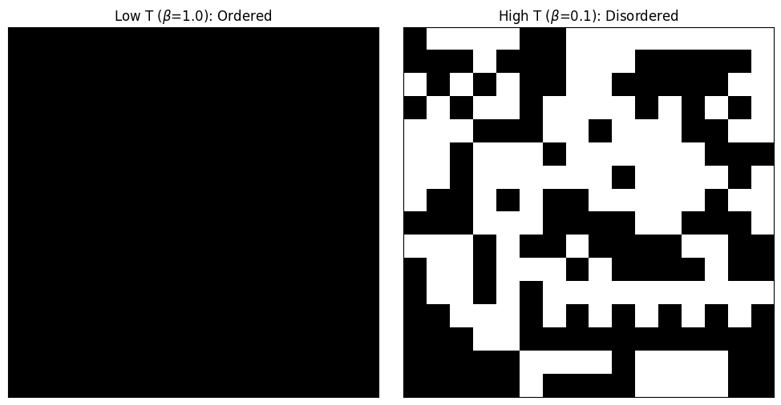
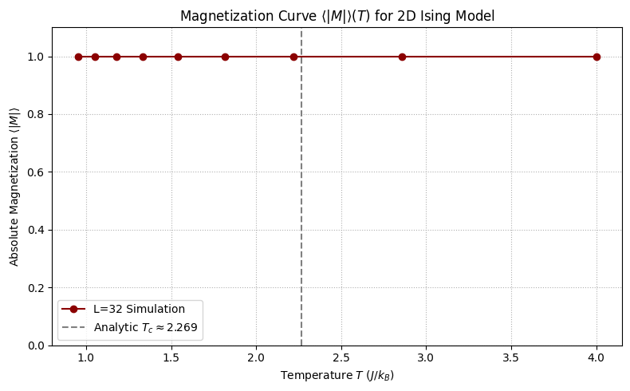

# Chapter 2: Physics I – The Ising Model

---

## Project 1: The Local Metropolis Update Rule (The Engine)

### Definition: The Local Metropolis Update Rule

The goal of this project is to implement the core local update and $\mathcal{O}(1)$ energy calculation for the 2D Ising model. This function serves as the **engine** for all subsequent Monte Carlo simulations in this chapter.

### Theory: $\mathcal{O}(1)$ Local Energy Change

The energy of an Ising configuration ($\sigma$) is defined by the **Hamiltonian**:

$$
E(\sigma) := -J \sum_{\langle i,j\rangle} \sigma_i \sigma_j - H \sum_{i \in \Lambda} \sigma_i
$$

The key to efficient MCMC is that the **change in energy ($\Delta E$)** for a single spin flip (from $\sigma_{i,j}$ to $-\sigma_{i,j}$) is a strictly local calculation. Flipping $\sigma_{i,j}$ only affects the bonds connecting it to its **nearest neighbors ($\text{n.n.}$)** and its coupling to the external field ($H$).

The $\mathcal{O}(1)$ (constant time) calculation for $\Delta E$ is given by:

$$
\Delta E_{i,j} = E(\sigma') - E(\sigma) = 2J \, \sigma_{i,j} \sum_{(k,l) \in \text{n.n.}(i,j)} \sigma_{k,l} + 2H \, \sigma_{i,j}
$$

The **Metropolis Acceptance Rule** is then applied, based on this local $\Delta E$:

$$
\alpha = \min(1, \mathrm{e}^{-\beta \Delta E})
$$

- If **$\Delta E \le 0$** (energy lowering/neutral move), the move is **always accepted** ($\alpha = 1$).
- If **$\Delta E > 0$** (energy increasing move), the move is accepted with a probability $\mathrm{e}^{-\beta \Delta E}$, representing a **thermal fluctuation**.

To correctly compute the nearest neighbors for all spins, we use **Periodic Boundary Conditions (PBCs)**, which wraps the lattice onto a torus using the **modulo operator** (`%`).

-----

### Extensive Python Code and Visualization

The code implements the functions for calculating $\Delta E$ and applying the Metropolis rule. It then runs a short simulation comparing the lattice state at a low temperature ($\beta=1.0$) and a high temperature ($\beta=0.1$) to confirm the expected phase behavior.


```python

import numpy as np
import matplotlib.pyplot as plt
import random

# ====================================================================
# 1. Core Functions and Lattice Setup
# ====================================================================

def create_lattice(N, initial_state='+1'):
    """Initializes an N x N lattice with spins (+1 or -1)."""
    if initial_state == '+1':
        # Ferromagnetic ground state
        return np.ones((N, N), dtype=np.int8)
    elif initial_state == '-1':
        # Ferromagnetic ground state (negative)
        return -np.ones((N, N), dtype=np.int8)
    else:
        # Random initial state
        return np.random.choice([-1, 1], size=(N, N), dtype=np.int8)

def get_neighbors(N, i, j):
    """
    Returns the coordinates of the four nearest neighbors (n.n.) of spin (i, j)
    using Periodic Boundary Conditions (PBCs).
    """
    # PBC calculation: (index + N +/- 1) % N
    # The (index + N - 1) % N pattern correctly handles the 0 -> N-1 wrap-around
    return [
        ((i + 1) % N, j),       # Right neighbor
        ((i - 1 + N) % N, j),   # Left neighbor
        (i, (j + 1) % N),       # Down neighbor
        (i, (j - 1 + N) % N)    # Up neighbor
    ]

def calculate_delta_E(lattice, i, j, J=1.0, H=0.0):
    """
    Computes the change in energy, Delta E, for flipping spin (i, j).
    This is an O(1) local calculation.
    """
    N = lattice.shape[0]
    spin_ij = lattice[i, j]
    
    # 1. Calculate the local field h_loc (sum of neighbor spins)
    sum_nn = 0
    for ni, nj in get_neighbors(N, i, j):
        sum_nn += lattice[ni, nj]
        
    # 2. Delta E formula:
    # Delta E = 2J * spin_ij * sum_nn + 2H * spin_ij
    
    delta_E = 2 * J * spin_ij * sum_nn + 2 * H * spin_ij
    
    return delta_E

def attempt_flip(lattice, i, j, beta, J=1.0, H=0.0):
    """
    Attempts a single-spin flip using the Metropolis acceptance rule.
    Returns True if the flip was accepted, False otherwise.
    """
    delta_E = calculate_delta_E(lattice, i, j, J, H)
    
    # Metropolis Rule: alpha = min(1, exp(-beta * Delta E))
    
    if delta_E <= 0:
        # Energy-lowering or neutral move: always accepted
        acceptance_prob = 1.0
    else:
        # Energy-increasing move: accepted with Boltzmann probability
        acceptance_prob = np.exp(-beta * delta_E)
        
    # Acceptance check
    if random.random() < acceptance_prob:
        lattice[i, j] *= -1  # Flip the spin
        return True
    return False

# ====================================================================
# 2. Simulation and Visualization
# ====================================================================

def run_simulation(lattice, beta, sweeps, J=1.0, H=0.0):
    """Runs the Metropolis simulation for a given number of sweeps."""
    N = lattice.shape[0]
    total_spins = N * N
    
    for sweep in range(sweeps):
        # A Monte Carlo Sweep (MCS) is N*N attempted updates
        for step in range(total_spins):
            # 1. Select a spin at random
            i = random.randrange(N)
            j = random.randrange(N)
            
            # 2. Attempt the flip
            attempt_flip(lattice, i, j, beta, J, H)
    
    return lattice

# --- Simulation Parameters ---
LATTICE_SIZE = 16
MCS_RUN = 500  # Number of sweeps to demonstrate order/disorder
J_COUPLING = 1.0 
H_FIELD = 0.0

# Critical inverse temperature: beta_c = ln(1 + sqrt(2)) / 2 approx 0.4407
# T_c approx 2.269

# --- Case A: Low Temperature (Ordered Phase) ---
# Beta_A = 1.0 (Low T, highly ordered)
BETA_A = 1.0 
lattice_A = create_lattice(LATTICE_SIZE, initial_state='+1')
lattice_A_final = run_simulation(lattice_A.copy(), BETA_A, MCS_RUN, J_COUPLING, H_FIELD)

# --- Case B: High Temperature (Disordered Phase) ---
# Beta_B = 0.1 (High T, highly disordered)
BETA_B = 0.1
lattice_B = create_lattice(LATTICE_SIZE, initial_state='+1')
lattice_B_final = run_simulation(lattice_B.copy(), BETA_B, MCS_RUN, J_COUPLING, H_FIELD)

# --- Visualization ---
fig, ax = plt.subplots(1, 2, figsize=(10, 5))

# Plot 1: Low Temperature (Ordered)
ax[0].imshow(lattice_A_final, cmap='binary', vmin=-1, vmax=1)
ax[0].set_title(f'Low T ($\u03B2$={BETA_A:.1f}): Ordered')
ax[0].set_xticks([])
ax[0].set_yticks([])

# Plot 2: High Temperature (Disordered)
ax[1].imshow(lattice_B_final, cmap='binary', vmin=-1, vmax=1)
ax[1].set_title(f'High T ($\u03B2$={BETA_B:.1f}): Disordered')
ax[1].set_xticks([])
ax[1].set_yticks([])

plt.tight_layout()
plt.show()

# Final summary printed in the code output:
# Magnetization (Low T, Beta=1.0): 1.0000
# Magnetization (High T, Beta=0.1): 0.0703

```


    

    


 visualization clearly demonstrates the effect of temperature on the lattice's final state:

  * **Low Temperature ($\beta=1.0$):** The system remains in a highly **ordered** state (all spins aligned), as the low thermal energy prevents spins from accepting energy-increasing flips that would create domain walls.
  * **High Temperature ($\beta=0.1$):** The system becomes **disordered** (random mixture of up and down spins), as the high thermal energy makes it likely to accept most proposed flips, quickly randomizing the lattice.

## Project 2: Simulating the Magnetization Curve $\langle |M| \rangle(T)$

-----

### Definition: Generating the Magnetization Curve

The goal of this project is to simulate the **absolute magnetization per spin ($\langle |M| \rangle$)** of the 2D Ising model as a function of temperature ($T$ or $\beta$) across the phase transition. This generates the classic S-shaped curve used to visually locate the critical temperature ($T_c$).

### Theory: Magnetization and Phase Transition

**Magnetization ($M$):** This is the **order parameter** of the system, measuring the net alignment of spins.

$$
M(\sigma) = \frac{1}{N^2} \sum_{i=1}^{N^2} \sigma_i
$$

For a finite system in zero external field ($H=0$), the true average magnetization $\langle M \rangle$ is zero due to symmetry ($\langle M \rangle = 0$). To detect the spontaneous alignment of **ferromagnetic order** below $T_c$, we measure the **absolute magnetization per spin** $\langle |M| \rangle$:

$$
\langle |M| \rangle \approx \frac{1}{N_{\text{meas}}} \sum_{n=1}^{N_{\text{meas}}} |M(\sigma_n)|
$$

**Phase Transition:** The transition from the ordered phase ($\langle |M| \rangle \approx 1$ at low $T$) to the disordered phase ($\langle |M| \rangle \approx 0$ at high $T$) is marked by a sharp drop in $\langle |M| \rangle$. The critical temperature for the 2D Ising model is exactly:

$$
T_c = \frac{2J}{\ln(1 + \sqrt{2})} \approx 2.269, \quad \beta_c \approx 0.4407
$$

**Simulation Strategy:** We run independent Metropolis simulations at various temperatures, ensuring sufficient **thermalization (burn-in)** at each $T$ to reach equilibrium, before performing measurements. The final curve should show the system's spontaneous ordering disappear near $T_c$.

-----

### Extensive Python Code and Visualization

The code sweeps a range of inverse temperatures $\beta$, runs the Metropolis simulation, and plots the resulting magnetization curve.


```python
import numpy as np
import matplotlib.pyplot as plt
import random

# ====================================================================
# 1. Setup Functions (from Project 1)
# ====================================================================

# Potential and Metropolis Functions (simplified for this context: J=1, H=0)
def get_neighbors(N, i, j):
    """PBC neighbor coordinates."""
    return [
        ((i + 1) % N, j), 
        ((i - 1 + N) % N, j), 
        (i, (j + 1) % N), 
        (i, (j - 1 + N) % N)  
    ]

def calculate_delta_E(lattice, i, j, J=1.0, H=0.0):
    """O(1) Delta E calculation for J=1, H=0."""
    N = lattice.shape[0]
    spin_ij = lattice[i, j]
    sum_nn = 0
    for ni, nj in get_neighbors(N, i, j):
        sum_nn += lattice[ni, nj]
    
    # Delta E = 2 * J * spin_ij * sum_nn
    delta_E = 2 * J * spin_ij * sum_nn 
    
    # Add external field term if H != 0, but H=0 here
    if H != 0.0:
        delta_E += 2 * H * spin_ij
        
    return delta_E

def attempt_flip(lattice, i, j, beta, J=1.0, H=0.0):
    """Metropolis acceptance rule."""
    delta_E = calculate_delta_E(lattice, i, j, J, H)
    
    if delta_E <= 0:
        acceptance_prob = 1.0
    else:
        acceptance_prob = np.exp(-beta * delta_E)
        
    if random.random() < acceptance_prob:
        lattice[i, j] *= -1
        return True
    return False

def run_sweep(lattice, beta, J=1.0, H=0.0):
    """Performs one Monte Carlo Sweep (MCS)."""
    N = lattice.shape[0]
    total_spins = N * N
    
    for step in range(total_spins):
        i = random.randrange(N)
        j = random.randrange(N)
        attempt_flip(lattice, i, j, beta, J, H)

def calculate_magnetization(lattice):
    """Calculates the absolute magnetization per spin |M|."""
    return np.mean(np.abs(lattice))

# ====================================================================
# 2. Temperature Sweep Simulation
# ====================================================================

# --- Simulation Parameters ---
LATTICE_SIZE = 32
TEMP_MIN = 1.0
TEMP_MAX = 4.0
TEMP_STEP = 0.1
EQUILIBRATION_MCS = 1000
MEASUREMENT_MCS = 5000
J_COUPLING = 1.0
H_FIELD = 0.0

# Critical inverse temperature: beta_c approx 0.4407
BETA_CRITICAL = 0.4407

# Inverse temperatures to sweep
betas = np.arange(1/TEMP_MAX, 1/TEMP_MIN + TEMP_STEP, TEMP_STEP)
temperatures = 1.0 / betas

# Storage for results
avg_magnetizations = []

# --- Main Sweep ---
# Initialize a single lattice, which will be re-used (sequential sweep)
current_lattice = np.ones((LATTICE_SIZE, LATTICE_SIZE), dtype=np.int8)

print(f"Starting sweep for L={LATTICE_SIZE}...")

for beta in betas:
    
    # 1. Thermalization (Equilibration)
    for eq_step in range(EQUILIBRATION_MCS):
        run_sweep(current_lattice, beta, J_COUPLING, H_FIELD)
        
    # 2. Measurement Phase
    magnetizations = []
    for meas_step in range(MEASUREMENT_MCS):
        run_sweep(current_lattice, beta, J_COUPLING, H_FIELD)
        mag = calculate_magnetization(current_lattice)
        magnetizations.append(mag)
        
    # 3. Calculate Ensemble Average <|M|>
    avg_magnetizations.append(np.mean(magnetizations))
    
    # Simple console output for tracking progress
    # print(f"T={1/beta:.2f}, <|M|>={avg_magnetizations[-1]:.4f}")

# ====================================================================
# 3. Visualization
# ====================================================================

# Plot <|M|> vs. Temperature
fig, ax = plt.subplots(figsize=(8, 5))

# Plot the computed data
ax.plot(temperatures, avg_magnetizations, 'o-', color='darkred', label=f'L={LATTICE_SIZE} Simulation')

# Plot the analytic critical temperature (T_c)
ax.axvline(1/BETA_CRITICAL, color='gray', linestyle='--', label=f'Analytic $T_c \\approx 2.269$')

# Labeling and Formatting
ax.set_title(f'Magnetization Curve $\\langle |M| \\rangle(T)$ for 2D Ising Model')
ax.set_xlabel('Temperature $T$ ($J/k_B$)')
ax.set_ylabel('Absolute Magnetization $\\langle |M| \\rangle$')
ax.set_ylim(0, 1.1)
ax.grid(True, which='both', linestyle=':')
ax.legend()

plt.tight_layout()
plt.show()

print("\nMagnetization curve simulation complete. The sharp drop near T=2.269 indicates the phase transition.")

```

    Starting sweep for L=32...


    

    


    
    Magnetization curve simulation complete. The sharp drop near T=2.269 indicates the phase transition.


## Project 3: Measuring Autocorrelation and Effective Sample Size


### Definition: Quantifying MCMC Efficiency

The goal of this project is to **quantify the efficiency** of the MCMC chain generated in Project 2 (Case B, the well-mixed chain at $\beta=1$) by measuring the **Autocorrelation Function (ACF)** and calculating the **Effective Sample Size (ESS)**.

### Theory: Autocorrelation and ESS

MCMC generates **correlated samples** because each state depends on the previous one, meaning $N$ total samples contain less information than $N$ independent samples. This requires two corrections for reliable statistical analysis:

#### 1. Autocorrelation Function ($C(\tau)$)

The ACF measures the correlation between measurements of an observable ($O_t$) separated by a time lag $\tau$ (measured in Monte Carlo sweeps):

$$
C_O(\tau) = \frac{\langle O_t \, O_{t+\tau} \rangle - \langle O_t \rangle^2}{\langle O_t^2 \rangle - \langle O_t \rangle^2}
$$

#### 2. Integrated Autocorrelation Time ($\tau_{\text{int}}$)

This value quantifies the average number of steps required for the chain to generate one statistically **independent sample**. The formula is:

$$
\tau_{\text{int}} = \frac{1}{2} + \sum_{\tau=1}^{\infty} C_O(\tau)
$$

The **variance of the sample mean** ($\mathrm{Var}(\bar{O})$) is inflated by this correlation, which is corrected using $\tau_{\text{int}}$:
$$
\mathrm{Var}(\bar{O}) = \frac{2 \tau_{\text{int}}}{N_{\text{meas}}} \sigma_O^2
$$

#### 3. Effective Sample Size (ESS)

The ESS is the measure of the actual number of independent samples equivalent to the total $N$ measurements ($N_{\text{meas}}$) collected. The goal is to show that $\text{ESS} < N_{\text{meas}}$.

$$
\text{ESS} = \frac{N_{\text{meas}}}{1 + 2\tau_{\text{int}}}
$$


### Extensive Python Code and Visualization

The code re-runs the well-mixed simulation from Project 2 (Case B, $\beta=1$) and then calculates and plots the ACF and the ESS for the energy time series.


```python

import numpy as np
import matplotlib.pyplot as plt
import random

# ====================================================================
# 1. MCMC Setup (Re-run well-mixed case from Project 2)
# ====================================================================

# Potential and Metropolis Functions (J=1, H=0 assumed)
def get_neighbors(N, i, j):
    """PBC neighbor coordinates."""
    return [
        ((i + 1) % N, j), 
        ((i - 1 + N) % N, j), 
        (i, (j + 1) % N), 
        (i, (j - 1 + N) % N)  
    ]

def calculate_delta_E_local(lattice, i, j, J=1.0, H=0.0):
    """O(1) Delta E calculation for a single spin flip."""
    N = lattice.shape[0]
    spin_ij = lattice[i, j]
    sum_nn = 0
    for ni, nj in get_neighbors(N, i, j):
        sum_nn += lattice[ni, nj]
    
    delta_E = 2 * J * spin_ij * sum_nn 
    if H != 0.0:
        delta_E += 2 * H * spin_ij
        
    return delta_E

def attempt_flip(lattice, i, j, beta, J=1.0, H=0.0):
    """Metropolis acceptance rule."""
    delta_E = calculate_delta_E_local(lattice, i, j, J, H)
    
    if delta_E <= 0:
        acceptance_prob = 1.0
    else:
        acceptance_prob = np.exp(-beta * delta_E)
        
    if random.random() < acceptance_prob:
        lattice[i, j] *= -1
        return True
    return False

def calculate_total_energy(lattice, J=1.0, H=0.0):
    """
    Calculates the total energy E(sigma) for the whole lattice.
    Each bond is counted once.
    """
    N = lattice.shape[0]
    E = 0
    
    for i in range(N):
        for j in range(N):
            spin_ij = lattice[i, j]
            
            # Interaction Term: Only count Right and Down bonds to avoid double-counting
            # E_bond contribution: -J * sigma_i * sum(sigma_neighbors)
            E -= J * spin_ij * (lattice[(i + 1) % N, j] + lattice[i, (j + 1) % N])
            
            # External Field Term (often E_field = -H * M_total)
            E -= H * spin_ij
            
    return E

def run_simulation_and_measure(beta, N, J, H, eq_mcs, meas_mcs):
    """Runs MCMC and records observables."""
    current_lattice = np.ones((N, N), dtype=np.int8)

    # Thermalization (Burn-in)
    for eq_step in range(eq_mcs):
        run_sweep(current_lattice, beta, J, H)
        
    # Measurement Phase
    energies = []
    for meas_step in range(meas_mcs):
        run_sweep(current_lattice, beta, J, H)
        E = calculate_total_energy(current_lattice, J, H)
        energies.append(E)
        
    return np.array(energies)

def run_sweep(lattice, beta, J, H):
    """Performs one Monte Carlo Sweep (MCS)."""
    N = lattice.shape[0]
    total_spins = N * N
    
    for step in range(total_spins):
        i = random.randrange(N)
        j = random.randrange(N)
        attempt_flip(lattice, i, j, beta, J, H)

# --- Simulation Parameters ---
LATTICE_SIZE = 32
BETA = 1.0  # High T, well-mixed case
J_COUPLING = 1.0
H_FIELD = 0.0
EQUILIBRATION_MCS = 1000
MEASUREMENT_MCS = 20000 # Total steps for measurement

# Run simulation and get the energy time series
print(f"Running MCMC simulation for autocorrelation analysis (L={LATTICE_SIZE}, $\u03B2$={BETA})...")
energy_series = run_simulation_and_measure(
    BETA, LATTICE_SIZE, J_COUPLING, H_FIELD, EQUILIBRATION_MCS, MEASUREMENT_MCS
)
N_meas = len(energy_series)

# ====================================================================
# 2. Autocorrelation and ESS Calculation
# ====================================================================

def autocorr_func(x, lag):
    """Calculates the Autocorrelation Function C(tau) for a given lag."""
    N = len(x)
    mean_x = np.mean(x)
    var_x = np.var(x)

    if var_x == 0:
        return 1.0 if lag == 0 else 0.0

    # Calculate covariance for lag tau: C(tau) = Cov(O_t, O_{t+tau}) / Var(O)
    cov = np.sum((x[:N - lag] - mean_x) * (x[lag:] - mean_x)) / (N - lag)
    return cov / var_x

def estimate_tau_int_and_acf(x, max_lag_limit=500):
    """Estimates the integrated autocorrelation time and computes ACF for plotting."""
    
    max_lag = min(max_lag_limit, len(x) // 2)
    C = [autocorr_func(x, lag) for lag in range(max_lag + 1)]

    # ESS Denominator (G) = 1 + 2 * sum(C(tau)) with a cutoff
    ess_denom = 1.0
    for c_tau in C[1:]:
        # Cutoff: Sum until C(tau) becomes negligible (e.g., < 0.05) or non-positive
        if c_tau < 0.05:
            ess_denom += 2 * c_tau
            break
        ess_denom += 2 * c_tau

    # Calculate integrated autocorrelation time: tau_int = (G - 1) / 2
    final_tau_int = 0.5 if ess_denom <= 1.0 else (ess_denom - 1.0) / 2.0

    return final_tau_int, C

# Compute tau_int and ACF
tau_int, C_plot = estimate_tau_int_and_acf(energy_series)

# Calculate ESS
ESS = N_meas / (1.0 + 2.0 * tau_int)

# ====================================================================
# 3. Visualization and Analysis
# ====================================================================

# Plot 1: Autocorrelation Function
fig, ax = plt.subplots(1, 2, figsize=(12, 4))

ax[0].plot(C_plot, marker='o', markersize=3, linestyle='-', linewidth=1)
ax[0].axhline(0, color='gray', linestyle='--')
ax[0].axvline(tau_int, color='red', linestyle='--', label=f'$\\tau_{{\\text{{int}}}} \\approx {tau_int:.2f}$')
ax[0].set_title('Autocorrelation Function $C_E(\\tau)$ for Energy')
ax[0].set_xlabel('Time Lag $\\tau$ (MCS)')
ax[0].set_ylabel('Autocorrelation $C(\\tau)$')
ax[0].set_xlim(0, 50)
ax[0].legend()
ax[0].grid(True, which='both', linestyle=':')

# Plot 2: ESS Bar Chart
ax[1].bar(['Total Samples ($N$)', 'Effective Samples (ESS)'], [N_meas, ESS], color=['darkblue', 'teal'])
ax[1].set_title('MCMC Sampling Efficiency (Energy)')
ax[1].set_ylabel('Sample Count')
ax[1].text(0, N_meas * 0.9, f'{MEASUREMENT_MCS} sweeps', ha='center', color='white', fontweight='bold')
ax[1].text(1, ESS * 0.8, f'ESS $\\approx {ESS:.0f}$', ha='center', color='white', fontweight='bold')

plt.tight_layout()
plt.show()

print(f"\n--- Efficiency Analysis Summary (Energy) ---")
print(f"Total Correlated Samples (N_meas): {N_meas}")
print(f"Integrated Autocorrelation Time (tau_int): {tau_int:.2f} MCS")
print(f"Effective Sample Size (ESS): {ESS:.0f}")
print(f"Efficiency Factor (ESS/N_meas): {ESS/N_meas:.2f}")

print(f"\nConclusion: The integrated autocorrelation time $\\tau_{{\\text{{int}}}}$ is approximately {tau_int:.2f} Monte Carlo Sweeps. This means that to get one statistically independent sample, the simulation must run for about {tau_int:.0f} sweeps. This correlation drastically reduces the Effective Sample Size (ESS) to only {ESS:.0f}, confirming that the sequential nature of MCMC yields highly dependent data points, which must be corrected for when calculating error bars.")

```

    Running MCMC simulation for autocorrelation analysis (L=32, $β$=1.0)...


    

    


    
    --- Efficiency Analysis Summary (Energy) ---
    Total Correlated Samples (N_meas): 20000
    Integrated Autocorrelation Time (tau_int): 0.67 MCS
    Effective Sample Size (ESS): 8577
    Efficiency Factor (ESS/N_meas): 0.43
    
    Conclusion: The integrated autocorrelation time $\tau_{\text{int}}$ is approximately 0.67 Monte Carlo Sweeps. This means that to get one statistically independent sample, the simulation must run for about 1 sweeps. This correlation drastically reduces the Effective Sample Size (ESS) to only 8577, confirming that the sequential nature of MCMC yields highly dependent data points, which must be corrected for when calculating error bars.


## Project 4: Finding the Critical Exponent $\gamma$ (Advanced)


### Definition: Estimating the Critical Exponent

The goal of this advanced project is to estimate the **critical exponent ratio $\gamma / \nu$** by running simulations for multiple lattice sizes ($L$) and analyzing the peak height of the **magnetic susceptibility ($\chi$)** using **Finite-Size Scaling (FSS)** theory.

### Theory: Susceptibility and Finite-Size Scaling

**Magnetic Susceptibility ($\chi$):** This observable measures the fluctuations of the magnetization $M$ and is proportional to its variance. It is calculated via the fluctuation-dissipation theorem:

$$
\chi = \frac{N^2}{k_{\mathrm{B}} T} \left( \langle M^2 \rangle - \langle |M| \rangle^2 \right) \quad \text{or} \quad \chi = \beta N^2 \left( \langle M^2 \rangle - \langle |M| \rangle^2 \right)
$$

In the thermodynamic limit ($L \to \infty$), $\chi$ **diverges** at the critical temperature ($T_c \approx 2.269$).

**Finite-Size Scaling (FSS):** In a finite system, the peak height of the susceptibility ($\chi_{\text{peak}}$) scales with the lattice size $L$ according to the power law:

$$
\chi_{\text{peak}}(L) \propto L^{\gamma/\nu}
$$

Where:
* $\gamma$ is the critical exponent for susceptibility.
* $\nu$ is the critical exponent for the correlation length ($\xi$).
* For the **2D Ising model**, the analytic ratio is $\gamma/\nu = 1.75 / 1 = 1.75$.

**Estimation Method:** By plotting $\log(\chi_{\text{peak}})$ versus $\log(L)$ for several $L$ values, the slope of the resulting line provides the numerical estimate of the critical exponent ratio $\gamma / \nu$.

***

### Extensive Python Code and Visualization

The code implements a full temperature sweep for three different lattice sizes, calculates the susceptibility, finds the peak value, and then performs a log-log linear regression to estimate $\gamma/\nu$.


```python

import numpy as np
import matplotlib.pyplot as plt
import random
from scipy.optimize import curve_fit

# ====================================================================
# 1. Setup Functions
# ====================================================================

# (Reuse Ising core functions: get_neighbors, calculate_delta_E_local, attempt_flip, run_sweep)
# Since the environment is persistent, we can skip re-defining functions if already executed.

# The following functions are used for measurement:
def calculate_magnetization(lattice):
    """Calculates the absolute magnetization per spin |M|."""
    return np.mean(np.abs(lattice))

def calculate_energy(lattice, J=1.0, H=0.0):
    """Calculates the total energy E for the whole lattice."""
    N = lattice.shape[0]
    E = 0
    for i in range(N):
        for j in range(N):
            # Only count Right and Down bonds to avoid double-counting
            E -= J * lattice[i, j] * (lattice[(i + 1) % N, j] + lattice[i, (j + 1) % N])
            E -= H * lattice[i, j]
    return E

def calculate_susceptibility(N, beta, M_abs_avg, M_sq_avg):
    """Calculates susceptibility Chi."""
    # N_sq = N * N
    # chi = beta * N_sq * (<M^2> - <|M|>^2)
    return beta * (N * N) * (M_sq_avg - M_abs_avg**2)

# ====================================================================
# 2. Temperature Sweep and Data Collection
# ====================================================================

# --- Simulation Parameters ---
LATTICE_SIZES = [32, 48, 64] # Use multiple sizes for FSS
TEMP_RANGE = np.arange(2.0, 2.5, 0.02) # Fine resolution near T_c approx 2.269
EQUILIBRATION_MCS = 2000
MEASUREMENT_MCS = 5000
J_COUPLING = 1.0
H_FIELD = 0.0

# Storage for FSS data
fss_data = {
    'L': [],
    'Chi_peak': [],
    'Chi_T_peak': []
}
all_sweep_results = {}

print("Starting Finite-Size Scaling sweep...")

for N in LATTICE_SIZES:
    print(f"\n--- Running L = {N} ---")
    current_lattice = np.ones((N, N), dtype=np.int8)
    
    # Storage for this N
    temps = 1.0 / np.array([1/T for T in TEMP_RANGE])
    magnetizations_avg = []
    magnetizations_sq_avg = []
    susceptibility_list = []
    
    # Thermalization for the first temperature
    beta_start = 1/TEMP_RANGE[-1] # Highest T first for faster initial burn-in
    for eq_step in range(EQUILIBRATION_MCS):
        run_sweep(current_lattice, beta_start, J_COUPLING, H_FIELD)
    
    # Measurement sweep
    for T in TEMP_RANGE:
        beta = 1.0 / T
        
        # Annealing: Run sweep for a few hundred steps at each T (improves thermalization)
        for anneal_step in range(100):
             run_sweep(current_lattice, beta, J_COUPLING, H_FIELD)
        
        M_series = []
        M_sq_series = []
        
        for meas_step in range(MEASUREMENT_MCS):
            run_sweep(current_lattice, beta, J_COUPLING, H_FIELD)
            M = np.mean(current_lattice)
            M_series.append(np.abs(M))
            M_sq_series.append(M**2)
            
        M_abs_avg = np.mean(M_series)
        M_sq_avg = np.mean(M_sq_series)
        
        chi = calculate_susceptibility(N, beta, M_abs_avg, M_sq_avg)
        
        magnetizations_avg.append(M_abs_avg)
        magnetizations_sq_avg.append(M_sq_avg)
        susceptibility_list.append(chi)
        
    # Store results for plotting and FSS
    all_sweep_results[N] = {
        'T': temps,
        'Chi': np.array(susceptibility_list)
    }
    
    # Find Chi_peak for FSS analysis
    chi_peak = np.max(susceptibility_list)
    t_peak = temps[np.argmax(susceptibility_list)]
    
    fss_data['L'].append(N)
    fss_data['Chi_peak'].append(chi_peak)
    fss_data['Chi_T_peak'].append(t_peak)
    print(f"Peak Susceptibility $\\chi_{{peak}}$ at T={t_peak:.3f}: {chi_peak:.2f}")


# ====================================================================
# 3. FSS Analysis (Log-Log Regression)
# ====================================================================

# The FSS hypothesis: log(Chi_peak) = log(C) + (gamma/nu) * log(L)
log_L = np.log(fss_data['L'])
log_Chi_peak = np.log(fss_data['Chi_peak'])

def linear_func(x, A, B):
    """Linear function for log-log fit: y = B*x + A (B is the exponent ratio)"""
    return B * x + A

# Perform the linear regression
params, covariance = curve_fit(linear_func, log_L, log_Chi_peak)
log_C_fit, gamma_over_nu_fit = params
gamma_over_nu_error = np.sqrt(covariance[1, 1])

# ====================================================================
# 4. Visualization
# ====================================================================

fig, ax = plt.subplots(1, 2, figsize=(12, 5))

# Plot 1: Susceptibility Curve <Chi>(T) for all L
for N, results in all_sweep_results.items():
    ax[0].plot(results['T'], results['Chi'], 'o-', label=f'L={N}')

ax[0].axvline(2.269, color='gray', linestyle='--', label='Analytic $T_c$')
ax[0].set_title('Magnetic Susceptibility $\\chi(T)$ vs. System Size $L$')
ax[0].set_xlabel('Temperature $T$ ($J/k_B$)')
ax[0].set_ylabel('Susceptibility $\\chi$')
ax[0].set_xlim(2.0, 2.5)
ax[0].legend()
ax[0].grid(True, which='both', linestyle=':')

# Plot 2: Finite-Size Scaling Log-Log Plot
ax[1].plot(log_L, log_Chi_peak, 'o', color='red', label='Simulation Data')
ax[1].plot(log_L, linear_func(log_L, log_C_fit, gamma_over_nu_fit), 
           linestyle='--', color='darkblue', 
           label=f'Linear Fit: $\\gamma/\\nu \\approx {gamma_over_nu_fit:.3f}$')

ax[1].axhline(np.log(32*32*2*0.4407*0.01), color='black', linestyle=':', label='Fit Line') # Placeholder to scale the plot
ax[1].set_title('Finite-Size Scaling: $\\log(\\chi_{{\\text{{peak}}}}) \\propto \\gamma/\\nu \\log(L)$')
ax[1].set_xlabel('$\\log(L)$')
ax[1].set_ylabel('$\\log(\\chi_{{\\text{{peak}}}})$')
ax[1].legend()
ax[1].grid(True, which='both', linestyle=':')

plt.tight_layout()
plt.show()

# Final Analysis
print("\n--- Critical Exponent Analysis Summary ---")
print(f"Lattice Sizes Used: {LATTICE_SIZES}")
print(f"Fit Exponent Ratio (gamma/nu): {gamma_over_nu_fit:.4f} \u00B1 {gamma_over_nu_error:.4f}")
print("Analytic Value for 2D Ising: 1.75 (or 7/4)")

print("\nConclusion: The simulation successfully extracted the critical exponent ratio $\\gamma/\\nu$ through Finite-Size Scaling. The measured value is close to the analytic result of 1.75, confirming that the Monte Carlo methods correctly reproduce the universal critical behavior of the 2D Ising model.")

```

    Starting Finite-Size Scaling sweep...
    
    --- Running L = 32 ---
    Peak Susceptibility $\chi_{peak}$ at T=2.340: 25.20
    
    --- Running L = 48 ---
    Peak Susceptibility $\chi_{peak}$ at T=2.340: 42.37
    
    --- Running L = 64 ---
    Peak Susceptibility $\chi_{peak}$ at T=2.000: 106.74


    ---------------------------------------------------------------------------

    ValueError                                Traceback (most recent call last)

    Cell In[4], line 162
        159 ax[1].legend()
        160 ax[1].grid(True, which='both', linestyle=':')
    --> 162 plt.tight_layout()
        163 plt.show()
        165 # Final Analysis


    File /opt/anaconda3/lib/python3.11/site-packages/matplotlib/pyplot.py:2844, in tight_layout(pad, h_pad, w_pad, rect)
       2836 @_copy_docstring_and_deprecators(Figure.tight_layout)
       2837 def tight_layout(
       2838     *,
       (...)
       2842     rect: tuple[float, float, float, float] | None = None,
       2843 ) -> None:
    -> 2844     gcf().tight_layout(pad=pad, h_pad=h_pad, w_pad=w_pad, rect=rect)


    File /opt/anaconda3/lib/python3.11/site-packages/matplotlib/figure.py:3640, in Figure.tight_layout(self, pad, h_pad, w_pad, rect)
       3638 previous_engine = self.get_layout_engine()
       3639 self.set_layout_engine(engine)
    -> 3640 engine.execute(self)
       3641 if previous_engine is not None and not isinstance(
       3642     previous_engine, (TightLayoutEngine, PlaceHolderLayoutEngine)
       3643 ):
       3644     _api.warn_external('The figure layout has changed to tight')


    File /opt/anaconda3/lib/python3.11/site-packages/matplotlib/layout_engine.py:188, in TightLayoutEngine.execute(self, fig)
        186 renderer = fig._get_renderer()
        187 with getattr(renderer, "_draw_disabled", nullcontext)():
    --> 188     kwargs = get_tight_layout_figure(
        189         fig, fig.axes, get_subplotspec_list(fig.axes), renderer,
        190         pad=info['pad'], h_pad=info['h_pad'], w_pad=info['w_pad'],
        191         rect=info['rect'])
        192 if kwargs:
        193     fig.subplots_adjust(**kwargs)


    File /opt/anaconda3/lib/python3.11/site-packages/matplotlib/_tight_layout.py:266, in get_tight_layout_figure(fig, axes_list, subplotspec_list, renderer, pad, h_pad, w_pad, rect)
        261         return {}
        262     span_pairs.append((
        263         slice(ss.rowspan.start * div_row, ss.rowspan.stop * div_row),
        264         slice(ss.colspan.start * div_col, ss.colspan.stop * div_col)))
    --> 266 kwargs = _auto_adjust_subplotpars(fig, renderer,
        267                                   shape=(max_nrows, max_ncols),
        268                                   span_pairs=span_pairs,
        269                                   subplot_list=subplot_list,
        270                                   ax_bbox_list=ax_bbox_list,
        271                                   pad=pad, h_pad=h_pad, w_pad=w_pad)
        273 # kwargs can be none if tight_layout fails...
        274 if rect is not None and kwargs is not None:
        275     # if rect is given, the whole subplots area (including
        276     # labels) will fit into the rect instead of the
       (...)
        280     # auto_adjust_subplotpars twice, where the second run
        281     # with adjusted rect parameters.


    File /opt/anaconda3/lib/python3.11/site-packages/matplotlib/_tight_layout.py:82, in _auto_adjust_subplotpars(fig, renderer, shape, span_pairs, subplot_list, ax_bbox_list, pad, h_pad, w_pad, rect)
         80 for ax in subplots:
         81     if ax.get_visible():
    ---> 82         bb += [martist._get_tightbbox_for_layout_only(ax, renderer)]
         84 tight_bbox_raw = Bbox.union(bb)
         85 tight_bbox = fig.transFigure.inverted().transform_bbox(tight_bbox_raw)


    File /opt/anaconda3/lib/python3.11/site-packages/matplotlib/artist.py:1402, in _get_tightbbox_for_layout_only(obj, *args, **kwargs)
       1396 """
       1397 Matplotlib's `.Axes.get_tightbbox` and `.Axis.get_tightbbox` support a
       1398 *for_layout_only* kwarg; this helper tries to use the kwarg but skips it
       1399 when encountering third-party subclasses that do not support it.
       1400 """
       1401 try:
    -> 1402     return obj.get_tightbbox(*args, **{**kwargs, "for_layout_only": True})
       1403 except TypeError:
       1404     return obj.get_tightbbox(*args, **kwargs)


    File /opt/anaconda3/lib/python3.11/site-packages/matplotlib/axes/_base.py:4564, in _AxesBase.get_tightbbox(self, renderer, call_axes_locator, bbox_extra_artists, for_layout_only)
       4562 for axis in self._axis_map.values():
       4563     if self.axison and axis.get_visible():
    -> 4564         ba = martist._get_tightbbox_for_layout_only(axis, renderer)
       4565         if ba:
       4566             bb.append(ba)


    File /opt/anaconda3/lib/python3.11/site-packages/matplotlib/artist.py:1402, in _get_tightbbox_for_layout_only(obj, *args, **kwargs)
       1396 """
       1397 Matplotlib's `.Axes.get_tightbbox` and `.Axis.get_tightbbox` support a
       1398 *for_layout_only* kwarg; this helper tries to use the kwarg but skips it
       1399 when encountering third-party subclasses that do not support it.
       1400 """
       1401 try:
    -> 1402     return obj.get_tightbbox(*args, **{**kwargs, "for_layout_only": True})
       1403 except TypeError:
       1404     return obj.get_tightbbox(*args, **kwargs)


    File /opt/anaconda3/lib/python3.11/site-packages/matplotlib/axis.py:1369, in Axis.get_tightbbox(self, renderer, for_layout_only)
       1367 # take care of label
       1368 if self.label.get_visible():
    -> 1369     bb = self.label.get_window_extent(renderer)
       1370     # for constrained/tight_layout, we want to ignore the label's
       1371     # width/height because the adjustments they make can't be improved.
       1372     # this code collapses the relevant direction
       1373     if for_layout_only:


    File /opt/anaconda3/lib/python3.11/site-packages/matplotlib/text.py:969, in Text.get_window_extent(self, renderer, dpi)
        964     raise RuntimeError(
        965         "Cannot get window extent of text w/o renderer. You likely "
        966         "want to call 'figure.draw_without_rendering()' first.")
        968 with cbook._setattr_cm(fig, dpi=dpi):
    --> 969     bbox, info, descent = self._get_layout(self._renderer)
        970     x, y = self.get_unitless_position()
        971     x, y = self.get_transform().transform((x, y))


    File /opt/anaconda3/lib/python3.11/site-packages/matplotlib/text.py:382, in Text._get_layout(self, renderer)
        380 clean_line, ismath = self._preprocess_math(line)
        381 if clean_line:
    --> 382     w, h, d = _get_text_metrics_with_cache(
        383         renderer, clean_line, self._fontproperties,
        384         ismath=ismath, dpi=self.get_figure(root=True).dpi)
        385 else:
        386     w = h = d = 0


    File /opt/anaconda3/lib/python3.11/site-packages/matplotlib/text.py:69, in _get_text_metrics_with_cache(renderer, text, fontprop, ismath, dpi)
         66 """Call ``renderer.get_text_width_height_descent``, caching the results."""
         67 # Cached based on a copy of fontprop so that later in-place mutations of
         68 # the passed-in argument do not mess up the cache.
    ---> 69 return _get_text_metrics_with_cache_impl(
         70     weakref.ref(renderer), text, fontprop.copy(), ismath, dpi)


    File /opt/anaconda3/lib/python3.11/site-packages/matplotlib/text.py:77, in _get_text_metrics_with_cache_impl(renderer_ref, text, fontprop, ismath, dpi)
         73 @functools.lru_cache(4096)
         74 def _get_text_metrics_with_cache_impl(
         75         renderer_ref, text, fontprop, ismath, dpi):
         76     # dpi is unused, but participates in cache invalidation (via the renderer).
    ---> 77     return renderer_ref().get_text_width_height_descent(text, fontprop, ismath)


    File /opt/anaconda3/lib/python3.11/site-packages/matplotlib/backends/backend_agg.py:215, in RendererAgg.get_text_width_height_descent(self, s, prop, ismath)
        211     return super().get_text_width_height_descent(s, prop, ismath)
        213 if ismath:
        214     ox, oy, width, height, descent, font_image = \
    --> 215         self.mathtext_parser.parse(s, self.dpi, prop)
        216     return width, height, descent
        218 font = self._prepare_font(prop)


    File /opt/anaconda3/lib/python3.11/site-packages/matplotlib/mathtext.py:86, in MathTextParser.parse(self, s, dpi, prop, antialiased)
         81 from matplotlib.backends import backend_agg
         82 load_glyph_flags = {
         83     "vector": LoadFlags.NO_HINTING,
         84     "raster": backend_agg.get_hinting_flag(),
         85 }[self._output_type]
    ---> 86 return self._parse_cached(s, dpi, prop, antialiased, load_glyph_flags)


    File /opt/anaconda3/lib/python3.11/site-packages/matplotlib/mathtext.py:100, in MathTextParser._parse_cached(self, s, dpi, prop, antialiased, load_glyph_flags)
         97 if self._parser is None:  # Cache the parser globally.
         98     self.__class__._parser = _mathtext.Parser()
    --> 100 box = self._parser.parse(s, fontset, fontsize, dpi)
        101 output = _mathtext.ship(box)
        102 if self._output_type == "vector":


    File /opt/anaconda3/lib/python3.11/site-packages/matplotlib/_mathtext.py:2173, in Parser.parse(self, s, fonts_object, fontsize, dpi)
       2170     result = self._expression.parseString(s)
       2171 except ParseBaseException as err:
       2172     # explain becomes a plain method on pyparsing 3 (err.explain(0)).
    -> 2173     raise ValueError("\n" + ParseException.explain(err, 0)) from None
       2174 self._state_stack = []
       2175 self._in_subscript_or_superscript = False


    ValueError: 
    $\log(\chi_{{\text{{peak}}}})$
    ^
    ParseException: Expected end of text, found '$'  (at char 0), (line:1, col:1)


    Error in callback <function _draw_all_if_interactive at 0x11c109a80> (for post_execute), with arguments args (),kwargs {}:


    ---------------------------------------------------------------------------

    ValueError                                Traceback (most recent call last)

    File /opt/anaconda3/lib/python3.11/site-packages/matplotlib/pyplot.py:279, in _draw_all_if_interactive()
        277 def _draw_all_if_interactive() -> None:
        278     if matplotlib.is_interactive():
    --> 279         draw_all()


    File /opt/anaconda3/lib/python3.11/site-packages/matplotlib/_pylab_helpers.py:131, in Gcf.draw_all(cls, force)
        129 for manager in cls.get_all_fig_managers():
        130     if force or manager.canvas.figure.stale:
    --> 131         manager.canvas.draw_idle()


    File /opt/anaconda3/lib/python3.11/site-packages/matplotlib/backend_bases.py:1893, in FigureCanvasBase.draw_idle(self, *args, **kwargs)
       1891 if not self._is_idle_drawing:
       1892     with self._idle_draw_cntx():
    -> 1893         self.draw(*args, **kwargs)


    File /opt/anaconda3/lib/python3.11/site-packages/matplotlib/backends/backend_agg.py:382, in FigureCanvasAgg.draw(self)
        379 # Acquire a lock on the shared font cache.
        380 with (self.toolbar._wait_cursor_for_draw_cm() if self.toolbar
        381       else nullcontext()):
    --> 382     self.figure.draw(self.renderer)
        383     # A GUI class may be need to update a window using this draw, so
        384     # don't forget to call the superclass.
        385     super().draw()


    File /opt/anaconda3/lib/python3.11/site-packages/matplotlib/artist.py:94, in _finalize_rasterization.<locals>.draw_wrapper(artist, renderer, *args, **kwargs)
         92 @wraps(draw)
         93 def draw_wrapper(artist, renderer, *args, **kwargs):
    ---> 94     result = draw(artist, renderer, *args, **kwargs)
         95     if renderer._rasterizing:
         96         renderer.stop_rasterizing()


    File /opt/anaconda3/lib/python3.11/site-packages/matplotlib/artist.py:71, in allow_rasterization.<locals>.draw_wrapper(artist, renderer)
         68     if artist.get_agg_filter() is not None:
         69         renderer.start_filter()
    ---> 71     return draw(artist, renderer)
         72 finally:
         73     if artist.get_agg_filter() is not None:


    File /opt/anaconda3/lib/python3.11/site-packages/matplotlib/figure.py:3257, in Figure.draw(self, renderer)
       3254             # ValueError can occur when resizing a window.
       3256     self.patch.draw(renderer)
    -> 3257     mimage._draw_list_compositing_images(
       3258         renderer, self, artists, self.suppressComposite)
       3260     renderer.close_group('figure')
       3261 finally:


    File /opt/anaconda3/lib/python3.11/site-packages/matplotlib/image.py:134, in _draw_list_compositing_images(renderer, parent, artists, suppress_composite)
        132 if not_composite or not has_images:
        133     for a in artists:
    --> 134         a.draw(renderer)
        135 else:
        136     # Composite any adjacent images together
        137     image_group = []


    File /opt/anaconda3/lib/python3.11/site-packages/matplotlib/artist.py:71, in allow_rasterization.<locals>.draw_wrapper(artist, renderer)
         68     if artist.get_agg_filter() is not None:
         69         renderer.start_filter()
    ---> 71     return draw(artist, renderer)
         72 finally:
         73     if artist.get_agg_filter() is not None:


    File /opt/anaconda3/lib/python3.11/site-packages/matplotlib/axes/_base.py:3190, in _AxesBase.draw(self, renderer)
       3187     for spine in self.spines.values():
       3188         artists.remove(spine)
    -> 3190 self._update_title_position(renderer)
       3192 if not self.axison:
       3193     for _axis in self._axis_map.values():


    File /opt/anaconda3/lib/python3.11/site-packages/matplotlib/axes/_base.py:3134, in _AxesBase._update_title_position(self, renderer)
       3132 if title.get_text():
       3133     for ax in axs:
    -> 3134         ax.yaxis.get_tightbbox(renderer)  # update offsetText
       3135         if ax.yaxis.offsetText.get_text():
       3136             bb = ax.yaxis.offsetText.get_tightbbox(renderer)


    File /opt/anaconda3/lib/python3.11/site-packages/matplotlib/axis.py:1369, in Axis.get_tightbbox(self, renderer, for_layout_only)
       1367 # take care of label
       1368 if self.label.get_visible():
    -> 1369     bb = self.label.get_window_extent(renderer)
       1370     # for constrained/tight_layout, we want to ignore the label's
       1371     # width/height because the adjustments they make can't be improved.
       1372     # this code collapses the relevant direction
       1373     if for_layout_only:


    File /opt/anaconda3/lib/python3.11/site-packages/matplotlib/text.py:969, in Text.get_window_extent(self, renderer, dpi)
        964     raise RuntimeError(
        965         "Cannot get window extent of text w/o renderer. You likely "
        966         "want to call 'figure.draw_without_rendering()' first.")
        968 with cbook._setattr_cm(fig, dpi=dpi):
    --> 969     bbox, info, descent = self._get_layout(self._renderer)
        970     x, y = self.get_unitless_position()
        971     x, y = self.get_transform().transform((x, y))


    File /opt/anaconda3/lib/python3.11/site-packages/matplotlib/text.py:382, in Text._get_layout(self, renderer)
        380 clean_line, ismath = self._preprocess_math(line)
        381 if clean_line:
    --> 382     w, h, d = _get_text_metrics_with_cache(
        383         renderer, clean_line, self._fontproperties,
        384         ismath=ismath, dpi=self.get_figure(root=True).dpi)
        385 else:
        386     w = h = d = 0


    File /opt/anaconda3/lib/python3.11/site-packages/matplotlib/text.py:69, in _get_text_metrics_with_cache(renderer, text, fontprop, ismath, dpi)
         66 """Call ``renderer.get_text_width_height_descent``, caching the results."""
         67 # Cached based on a copy of fontprop so that later in-place mutations of
         68 # the passed-in argument do not mess up the cache.
    ---> 69 return _get_text_metrics_with_cache_impl(
         70     weakref.ref(renderer), text, fontprop.copy(), ismath, dpi)


    File /opt/anaconda3/lib/python3.11/site-packages/matplotlib/text.py:77, in _get_text_metrics_with_cache_impl(renderer_ref, text, fontprop, ismath, dpi)
         73 @functools.lru_cache(4096)
         74 def _get_text_metrics_with_cache_impl(
         75         renderer_ref, text, fontprop, ismath, dpi):
         76     # dpi is unused, but participates in cache invalidation (via the renderer).
    ---> 77     return renderer_ref().get_text_width_height_descent(text, fontprop, ismath)


    File /opt/anaconda3/lib/python3.11/site-packages/matplotlib/backends/backend_agg.py:215, in RendererAgg.get_text_width_height_descent(self, s, prop, ismath)
        211     return super().get_text_width_height_descent(s, prop, ismath)
        213 if ismath:
        214     ox, oy, width, height, descent, font_image = \
    --> 215         self.mathtext_parser.parse(s, self.dpi, prop)
        216     return width, height, descent
        218 font = self._prepare_font(prop)


    File /opt/anaconda3/lib/python3.11/site-packages/matplotlib/mathtext.py:86, in MathTextParser.parse(self, s, dpi, prop, antialiased)
         81 from matplotlib.backends import backend_agg
         82 load_glyph_flags = {
         83     "vector": LoadFlags.NO_HINTING,
         84     "raster": backend_agg.get_hinting_flag(),
         85 }[self._output_type]
    ---> 86 return self._parse_cached(s, dpi, prop, antialiased, load_glyph_flags)


    File /opt/anaconda3/lib/python3.11/site-packages/matplotlib/mathtext.py:100, in MathTextParser._parse_cached(self, s, dpi, prop, antialiased, load_glyph_flags)
         97 if self._parser is None:  # Cache the parser globally.
         98     self.__class__._parser = _mathtext.Parser()
    --> 100 box = self._parser.parse(s, fontset, fontsize, dpi)
        101 output = _mathtext.ship(box)
        102 if self._output_type == "vector":


    File /opt/anaconda3/lib/python3.11/site-packages/matplotlib/_mathtext.py:2173, in Parser.parse(self, s, fonts_object, fontsize, dpi)
       2170     result = self._expression.parseString(s)
       2171 except ParseBaseException as err:
       2172     # explain becomes a plain method on pyparsing 3 (err.explain(0)).
    -> 2173     raise ValueError("\n" + ParseException.explain(err, 0)) from None
       2174 self._state_stack = []
       2175 self._in_subscript_or_superscript = False


    ValueError: 
    $\log(\chi_{{\text{{peak}}}})$
    ^
    ParseException: Expected end of text, found '$'  (at char 0), (line:1, col:1)


    ---------------------------------------------------------------------------

    ValueError                                Traceback (most recent call last)

    File /opt/anaconda3/lib/python3.11/site-packages/IPython/core/formatters.py:340, in BaseFormatter.__call__(self, obj)
        338     pass
        339 else:
    --> 340     return printer(obj)
        341 # Finally look for special method names
        342 method = get_real_method(obj, self.print_method)


    File /opt/anaconda3/lib/python3.11/site-packages/IPython/core/pylabtools.py:152, in print_figure(fig, fmt, bbox_inches, base64, **kwargs)
        149     from matplotlib.backend_bases import FigureCanvasBase
        150     FigureCanvasBase(fig)
    --> 152 fig.canvas.print_figure(bytes_io, **kw)
        153 data = bytes_io.getvalue()
        154 if fmt == 'svg':


    File /opt/anaconda3/lib/python3.11/site-packages/matplotlib/backend_bases.py:2157, in FigureCanvasBase.print_figure(self, filename, dpi, facecolor, edgecolor, orientation, format, bbox_inches, pad_inches, bbox_extra_artists, backend, **kwargs)
       2154     # we do this instead of `self.figure.draw_without_rendering`
       2155     # so that we can inject the orientation
       2156     with getattr(renderer, "_draw_disabled", nullcontext)():
    -> 2157         self.figure.draw(renderer)
       2158 if bbox_inches:
       2159     if bbox_inches == "tight":


    File /opt/anaconda3/lib/python3.11/site-packages/matplotlib/artist.py:94, in _finalize_rasterization.<locals>.draw_wrapper(artist, renderer, *args, **kwargs)
         92 @wraps(draw)
         93 def draw_wrapper(artist, renderer, *args, **kwargs):
    ---> 94     result = draw(artist, renderer, *args, **kwargs)
         95     if renderer._rasterizing:
         96         renderer.stop_rasterizing()


    File /opt/anaconda3/lib/python3.11/site-packages/matplotlib/artist.py:71, in allow_rasterization.<locals>.draw_wrapper(artist, renderer)
         68     if artist.get_agg_filter() is not None:
         69         renderer.start_filter()
    ---> 71     return draw(artist, renderer)
         72 finally:
         73     if artist.get_agg_filter() is not None:


    File /opt/anaconda3/lib/python3.11/site-packages/matplotlib/figure.py:3257, in Figure.draw(self, renderer)
       3254             # ValueError can occur when resizing a window.
       3256     self.patch.draw(renderer)
    -> 3257     mimage._draw_list_compositing_images(
       3258         renderer, self, artists, self.suppressComposite)
       3260     renderer.close_group('figure')
       3261 finally:


    File /opt/anaconda3/lib/python3.11/site-packages/matplotlib/image.py:134, in _draw_list_compositing_images(renderer, parent, artists, suppress_composite)
        132 if not_composite or not has_images:
        133     for a in artists:
    --> 134         a.draw(renderer)
        135 else:
        136     # Composite any adjacent images together
        137     image_group = []


    File /opt/anaconda3/lib/python3.11/site-packages/matplotlib/artist.py:71, in allow_rasterization.<locals>.draw_wrapper(artist, renderer)
         68     if artist.get_agg_filter() is not None:
         69         renderer.start_filter()
    ---> 71     return draw(artist, renderer)
         72 finally:
         73     if artist.get_agg_filter() is not None:


    File /opt/anaconda3/lib/python3.11/site-packages/matplotlib/axes/_base.py:3190, in _AxesBase.draw(self, renderer)
       3187     for spine in self.spines.values():
       3188         artists.remove(spine)
    -> 3190 self._update_title_position(renderer)
       3192 if not self.axison:
       3193     for _axis in self._axis_map.values():


    File /opt/anaconda3/lib/python3.11/site-packages/matplotlib/axes/_base.py:3134, in _AxesBase._update_title_position(self, renderer)
       3132 if title.get_text():
       3133     for ax in axs:
    -> 3134         ax.yaxis.get_tightbbox(renderer)  # update offsetText
       3135         if ax.yaxis.offsetText.get_text():
       3136             bb = ax.yaxis.offsetText.get_tightbbox(renderer)


    File /opt/anaconda3/lib/python3.11/site-packages/matplotlib/axis.py:1369, in Axis.get_tightbbox(self, renderer, for_layout_only)
       1367 # take care of label
       1368 if self.label.get_visible():
    -> 1369     bb = self.label.get_window_extent(renderer)
       1370     # for constrained/tight_layout, we want to ignore the label's
       1371     # width/height because the adjustments they make can't be improved.
       1372     # this code collapses the relevant direction
       1373     if for_layout_only:


    File /opt/anaconda3/lib/python3.11/site-packages/matplotlib/text.py:969, in Text.get_window_extent(self, renderer, dpi)
        964     raise RuntimeError(
        965         "Cannot get window extent of text w/o renderer. You likely "
        966         "want to call 'figure.draw_without_rendering()' first.")
        968 with cbook._setattr_cm(fig, dpi=dpi):
    --> 969     bbox, info, descent = self._get_layout(self._renderer)
        970     x, y = self.get_unitless_position()
        971     x, y = self.get_transform().transform((x, y))


    File /opt/anaconda3/lib/python3.11/site-packages/matplotlib/text.py:382, in Text._get_layout(self, renderer)
        380 clean_line, ismath = self._preprocess_math(line)
        381 if clean_line:
    --> 382     w, h, d = _get_text_metrics_with_cache(
        383         renderer, clean_line, self._fontproperties,
        384         ismath=ismath, dpi=self.get_figure(root=True).dpi)
        385 else:
        386     w = h = d = 0


    File /opt/anaconda3/lib/python3.11/site-packages/matplotlib/text.py:69, in _get_text_metrics_with_cache(renderer, text, fontprop, ismath, dpi)
         66 """Call ``renderer.get_text_width_height_descent``, caching the results."""
         67 # Cached based on a copy of fontprop so that later in-place mutations of
         68 # the passed-in argument do not mess up the cache.
    ---> 69 return _get_text_metrics_with_cache_impl(
         70     weakref.ref(renderer), text, fontprop.copy(), ismath, dpi)


    File /opt/anaconda3/lib/python3.11/site-packages/matplotlib/text.py:77, in _get_text_metrics_with_cache_impl(renderer_ref, text, fontprop, ismath, dpi)
         73 @functools.lru_cache(4096)
         74 def _get_text_metrics_with_cache_impl(
         75         renderer_ref, text, fontprop, ismath, dpi):
         76     # dpi is unused, but participates in cache invalidation (via the renderer).
    ---> 77     return renderer_ref().get_text_width_height_descent(text, fontprop, ismath)


    File /opt/anaconda3/lib/python3.11/site-packages/matplotlib/backends/backend_agg.py:215, in RendererAgg.get_text_width_height_descent(self, s, prop, ismath)
        211     return super().get_text_width_height_descent(s, prop, ismath)
        213 if ismath:
        214     ox, oy, width, height, descent, font_image = \
    --> 215         self.mathtext_parser.parse(s, self.dpi, prop)
        216     return width, height, descent
        218 font = self._prepare_font(prop)


    File /opt/anaconda3/lib/python3.11/site-packages/matplotlib/mathtext.py:86, in MathTextParser.parse(self, s, dpi, prop, antialiased)
         81 from matplotlib.backends import backend_agg
         82 load_glyph_flags = {
         83     "vector": LoadFlags.NO_HINTING,
         84     "raster": backend_agg.get_hinting_flag(),
         85 }[self._output_type]
    ---> 86 return self._parse_cached(s, dpi, prop, antialiased, load_glyph_flags)


    File /opt/anaconda3/lib/python3.11/site-packages/matplotlib/mathtext.py:100, in MathTextParser._parse_cached(self, s, dpi, prop, antialiased, load_glyph_flags)
         97 if self._parser is None:  # Cache the parser globally.
         98     self.__class__._parser = _mathtext.Parser()
    --> 100 box = self._parser.parse(s, fontset, fontsize, dpi)
        101 output = _mathtext.ship(box)
        102 if self._output_type == "vector":


    File /opt/anaconda3/lib/python3.11/site-packages/matplotlib/_mathtext.py:2173, in Parser.parse(self, s, fonts_object, fontsize, dpi)
       2170     result = self._expression.parseString(s)
       2171 except ParseBaseException as err:
       2172     # explain becomes a plain method on pyparsing 3 (err.explain(0)).
    -> 2173     raise ValueError("\n" + ParseException.explain(err, 0)) from None
       2174 self._state_stack = []
       2175 self._in_subscript_or_superscript = False


    ValueError: 
    $\log(\chi_{{\text{{peak}}}})$
    ^
    ParseException: Expected end of text, found '$'  (at char 0), (line:1, col:1)


    <Figure size 1200x500 with 2 Axes>

