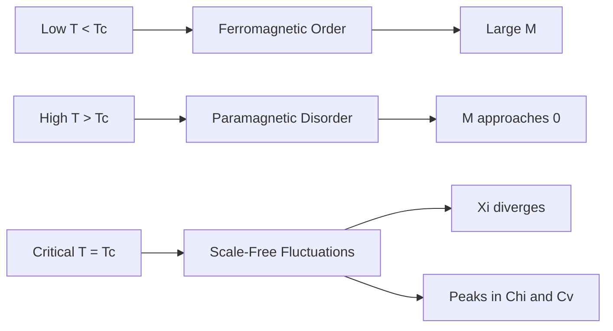

# **Chapter 2: The Ising Model**

---


## **Introduction**

The Ising model stands as one of the most elegant demonstrations of emergence in statistical physics—a system where simple binary spins on a lattice, interacting only with nearest neighbors, spontaneously generate macroscopic order, disorder, and critical phenomena. Introduced in the 1920s to model ferromagnetism, the model was initially dismissed when Ising proved that the one-dimensional case exhibits no phase transition. The surprise came in 1944 when Lars Onsager's exact solution of the two-dimensional square lattice revealed a continuous phase transition at a critical temperature, establishing the first mathematically rigorous example of emergent collective behavior from local interactions.

Beyond its physical origins, the Ising model has become a universal framework for understanding binary decision systems across disciplines—from neural networks and social opinion dynamics to computational biology. Its importance stems not from physical realism but from illustrating how collective order emerges from simple local rules in systems with exponentially large state spaces. With $2^{N^2}$ possible configurations even for modest lattice sizes, direct enumeration of the partition function becomes impossible, making the model an ideal testbed for Monte Carlo methods.

This chapter implements the grand simulation paradigm introduced in Chapter 1, applying the Metropolis-Hastings algorithm to the 2D Ising model. Students will learn to simulate phase transitions, measure order parameters like magnetization and specific heat, validate computational results against exact analytical solutions, and understand how local spin-flip dynamics can efficiently sample exponentially large configuration spaces. The Ising model serves as the conceptual and computational foundation for all subsequent Monte Carlo applications in this volume.

---

## **Chapter Outline**

| **Sec.** | **Title**                                                 | **Core Ideas & Examples**                                                                                                                                                                                      |
| -------- | --------------------------------------------------------- | -------------------------------------------------------------------------------------------------------------------------------------------------------------------------------------------------------------- |
| **2.1**  | **Chapter Opener: Emergence and the Grand Simulation**    | Historical context from Ising's 1D proof to Onsager's 2D solution; microscopic simplicity of binary spins; emergence of spontaneous symmetry breaking, criticality, and universality; computational challenge of $2^L$ configurations; the grand simulation perspective. |
| **2.2**  | **The Hamiltonian and the Local Rule**                    | Energy landscape $E(\sigma) = -J\sum_{\langle i,j\rangle}\sigma_i\sigma_j - H\sum_i\sigma_i$; ferromagnetic vs antiferromagnetic coupling; external field competition; local energy change $\Delta E$ for spin flips; generalizations to inhomogeneous systems. |
| **2.3**  | **Periodic Boundary Conditions**                          | Finite-size effects and surface artifacts; wrapping lattice onto torus; uniform neighbor count; modular arithmetic implementation; alternative boundary conditions; finite-size scaling near criticality.         |
| **2.4**  | **Implementing the Metropolis Algorithm**                 | Single-spin flip dynamics; accept/reject criterion $\min(1, e^{-\beta\Delta E})$; random vs sequential sweeps; equilibration and decorrelation; vectorization strategies.                                       |
| **2.5**  | **Measuring Observables**                                 | Magnetization $M$, energy $E$, specific heat $C_V$, susceptibility $\chi$; ensemble averaging; autocorrelation and statistical errors; detecting the critical temperature.                                      |
| **2.6**  | **Validation Against Exact Results**                      | Onsager's critical temperature $k_BT_c/J = 2/\ln(1+\sqrt{2})$; critical exponents; finite-size corrections; comparison with simulation data.                                                                  |

---

## **2.1 Chapter Opener: Emergence and the Grand Simulation**

---

### **Historical Context and Motivation**

The Ising model was introduced by Wilhelm Lenz in 1920 and studied by his student Ernst Ising in one dimension in 1924. In the one‑dimensional case, Ising proved there is **no phase transition** at any non‑zero temperature: the magnetization vanishes analytically for all $T > 0$. This result originally led Ising to conclude that phase transitions might be impossible in finite‑range models. The surprise came in 1944 when Lars Onsager solved the **two‑dimensional square‑lattice Ising model** and found an exact critical temperature $k_{\mathrm{B}} T_c / J = 2 / \ln(1 + \sqrt{2})$ with non‑analytic behaviour at $T_c$. The 2D Ising model thus became the first mathematically rigorous example of a continuous phase transition.

Beyond magnetism, the Ising framework has been adapted to model binary variables in neural networks, social opinion dynamics and computational biology. Its importance stems not from realism but from illustrating how **collective order** can emerge from simple local interactions.

-----

### **Microscopic Simplicity**

At each site $i$ of a two‑dimensional lattice sits a spin $\sigma_i \in \{+1, -1\}$. A configuration $\sigma = (\sigma_1, \dots, \sigma_{N^2})$ is one assignment of ±1 to each of the $N^2$ sites. Even for modest lattice sizes the number of possible configurations explodes exponentially; there are $2^L$ distinct states for a lattice of $L$ sites. This underscores why direct enumeration of all microstates in the partition function

$$
Z(\beta) = \sum_{\sigma} \mathrm{e}^{-\beta E(\sigma)}
$$

is hopeless for $N \times N$ lattices with $N \gtrsim 10$, and why stochastic sampling is essential.

The simplicity goes further: interactions are only between nearest neighbours, and each spin is subject to an external field. The Hamiltonian in its most general form for a lattice $\Lambda$ reads

$$
E(\sigma) = -\sum_{\langle i,j \rangle} J_{ij} \, \sigma_i \sigma_j - \mu \sum_{i} h_i \, \sigma_i,
$$

where $J_{ij}$ is the coupling between spins $i$ and $j$, $\mu$ is the magnetic moment, and $h_i$ the local field. In this chapter we simplify to uniform coupling $J > 0$ (ferromagnetic) and uniform external field $H$.

!!! tip "Exponential State Space"
    A $30 \times 30$ Ising lattice has $2^{900} \approx 10^{270}$ configurations—far exceeding the number of atoms in the observable universe. Direct enumeration is impossible; Monte Carlo sampling is essential.

-----

### **Emergence from Local Rules**

Despite such minimalistic ingredients, the Ising model exhibits several hallmark features of complex systems:

- **Spontaneous symmetry breaking.**  
  At high temperature the average magnetization is zero because up and down spins occur equally often; the Hamiltonian is invariant under flipping all spins. Below $T_c$ the system chooses one of two equivalent ordered states (mostly up or mostly down), breaking the spin‑flip symmetry spontaneously. Each ordered phase has non‑zero magnetization, even though the microscopic rules are symmetric.

- **Criticality and universality.**  
  At $T = T_c$ the correlation length diverges and the system exhibits power‑law correlations. The critical exponents describing how magnetization and susceptibility behave near $T_c$ are independent of microscopic details (the universality class only depends on dimensionality and symmetry).

- **Emergence of macroscopic order.**  
  Local interactions propagate information across the lattice so that large domains of aligned spins form. These domains grow as the temperature decreases. The exact solution shows that magnetization jumps continuously to zero at $T_c$ but its derivative diverges; such non‑analytic behaviour is a purely collective effect.

- **Computational challenge.**  
  Because there are $2^L$ configurations, one cannot exactly evaluate ensemble averages for $N^2$-size systems using brute force. Efficient simulation through Monte Carlo methods is required to explore typical configurations and measure observables.

-----

### **The Grand Simulation Perspective**

Chapter 1 introduced the concept of the **grand simulation**: using stochastic algorithms to sample from an exponentially large space of microstates and thereby compute macroscopic observables. The Ising model is the ideal testbed for this philosophy:

- It reduces real magnets to binary variables and nearest‑neighbour interactions, making it computationally tractable.
- It nonetheless exhibits non‑trivial phenomena—order, disorder, and a phase transition—that we can observe by measuring magnetization, energy, specific heat and susceptibility.
- It provides a clear benchmark: the exact critical temperature $T_c$ and known critical exponents allow us to validate our simulation machinery against analytic results.

By applying Metropolis–Hastings to the Ising model we turn the theoretical ideas of Chapter 1 into practice, demonstrating how a simple local update rule can reveal emergent behaviour on a lattice with an astronomically large state space.

---

## **2.2 The Hamiltonian and the Local Rule**

---

### **Defining the Energy Landscape**

In statistical mechanics, the probability of a microstate is determined by its energy through the Boltzmann factor $\mathrm{e}^{-\beta E(\sigma)}$. For the Ising model, the **Hamiltonian** assigns an energy to each spin configuration $\sigma$. On a two‑dimensional lattice $\Lambda$, with ferromagnetic coupling and a uniform external magnetic field, the Hamiltonian is

$$
E(\sigma) := -J \sum_{\langle i,j\rangle} \sigma_i \sigma_j - H \sum_{i \in \Lambda} \sigma_i.
$$

The sums are over unordered nearest‑neighbour pairs $\langle i,j \rangle$ (each bond counted once) and over all sites $i$ in the lattice. We adopt the conventional negative sign in front of each term. The form of $E(\sigma)$ encapsulates two competing tendencies.

-----

### **Nearest-Neighbour Coupling: Ferromagnetic vs Antiferromagnetic**

The first term describes interactions between neighbouring spins. Its contribution depends on the sign of $J$:

- **Ferromagnetic coupling ($J > 0$).**  
  Aligned spins ($\sigma_i = \sigma_j$) contribute $-J$ to the energy, whereas anti‑aligned spins contribute $+J$. Thus parallel alignment lowers the energy and is energetically favoured. The minus sign ensures that the Hamiltonian is minimized when spins are aligned. This local rule encourages the formation of domains of uniform magnetization.

- **Antiferromagnetic coupling ($J < 0$).**  
  Here anti‑aligned spins minimize energy. In bipartite lattices (such as the square lattice), this leads to a checkerboard pattern of alternating spins. Antiferromagnetic Ising models exhibit frustration on non‑bipartite lattices.

- **Non‑interacting case ($J = 0$).**  
  Spins do not interact and the system reduces to a set of independent two‑level systems. There is no collective behaviour.

The classification of interactions based on $J$ is standard in Ising models. Although this chapter focuses on ferromagnetic coupling, other choices of $J$ lead to different types of order.

-----

### **External Field: Aligning vs Competing**

The second term couples each spin to an external magnetic field $H$. Physically, this represents an externally applied field that biases spins to align in one direction. If $H > 0$, spins pointing up ($\sigma_i = +1$) lower the energy by $-H$; if $H < 0$, down spins are favoured. When $H = 0$, up and down spins are symmetric and the model has a global $\mathbb{Z}_2$ symmetry. A non‑zero field breaks this symmetry explicitly.

The competition between the interaction term and the external field determines the phase diagram. For $H = 0$, the system undergoes a spontaneous symmetry‑breaking transition at $T_c$. For $H \neq 0$ the magnetization is non‑zero for all temperatures, but critical behaviour can still be studied by analysing derivatives of the free energy.

-----

### **Local Energy Contributions and Spin Flips**

The Hamiltonian is a sum of **local contributions**: the energy associated with a spin $i$ depends only on its value and the values of its neighbours. This locality is crucial for efficient simulation. To see this, consider the energy contribution of a single spin $\sigma_{i,j}$ (using periodic boundary conditions so each spin has exactly four neighbours):

$$
E_{i,j} = -J \, \sigma_{i,j} \sum_{(k,l) \in \mathrm{n.n.}(i,j)} \sigma_{k,l} - H \, \sigma_{i,j}.
$$

If we flip $\sigma_{i,j}$ to $-\sigma_{i,j}$, the change in the total energy is

$$
\Delta E_{i,j} := E(\sigma') - E(\sigma)
= 2J \, \sigma_{i,j} \sum_{(k,l) \in \mathrm{n.n.}(i,j)} \sigma_{k,l} + 2H \, \sigma_{i,j}.
$$

This formula, derived from the Hamiltonian, allows us to compute the energy difference for a proposed spin flip by looking only at the four neighbours of the spin. It makes the Metropolis update an $\mathcal{O}(1)$ operation rather than $\mathcal{O}(N^2)$.

!!! example "Local Energy Change Efficiency"
    Computing $\Delta E$ for a spin flip requires only checking 4 neighbors—constant time $\mathcal{O}(1)$. For a $100 \times 100$ lattice, this avoids recalculating the entire $10{,}000$-spin energy, enabling millions of updates per second.

-----

### **Generalizations and Variants**

While the Ising model in this chapter uses uniform couplings and a scalar field, many extensions exist:

- **Inhomogeneous couplings.**  
  Real materials may have non‑uniform $J_{ij}$. Randomising $J_{ij}$ leads to spin‑glass behaviour; randomising $H_i$ yields a random‑field Ising model.

- **Higher dimensions and other lattices.**  
  In three dimensions the Ising model still exhibits a phase transition, but it is not exactly solvable. On non‑bipartite lattices (e.g., triangular) antiferromagnetic coupling leads to frustration.

- **Ising in a transverse field (quantum Ising model).**  
  Adding a term $-\Gamma \sum_i \sigma_i^x$ introduces quantum fluctuations. In the classical limit ($\Gamma = 0$) we recover the model described here; for $\Gamma > 0$ the system exhibits a quantum phase transition.

- **Potts and clock models.**  
  Allowing each spin to take $q$ discrete values generalises the Ising model ($q = 2$) to the $q$-state Potts model, which has different universality classes.

Understanding the Hamiltonian and its local rule is therefore not only essential for simulating the classic 2D Ising model but also provides a template for constructing and simulating a wide variety of lattice models in physics, biology and beyond.

---

## **2.3 The Computational Framework: Periodic Boundary Conditions**

---

### **Why Boundary Conditions Matter**

In a finite simulation of a lattice model, spins at the edges have fewer neighbours than those in the interior. For example, on an $N \times N$ square lattice with open (free) boundaries, a corner spin has only two neighbours, an edge spin has three, and only interior spins have the full four neighbours. This heterogeneity produces significant **finite‑size effects**:

- **Surface effects.**  
  Boundary spins experience a different local environment from bulk spins. This can bias observables such as magnetization and energy, especially for small lattices.

- **Reduced connectivity.**  
  Domain walls (boundaries between regions of different magnetization) can pin at the edges, affecting the dynamics of ordering and disordering.

- **Scaling issues.**  
  Many theoretical results assume translation invariance and infinite lattices; open boundaries violate these assumptions.

To mitigate these issues, one typically **wraps the lattice onto a torus**, thereby eliminating edges entirely.

-----

### **Periodic Boundary Conditions (PBCs)**

Under periodic boundary conditions, opposite edges of the lattice are identified. In a 2D square lattice, the site $(i,j)$ is considered neighbours with $(i \pm 1, j)$ and $(i, j \pm 1)$, where addition is modulo $N$. Thus the point $(0,j)$ (left edge) has a neighbour at $(N-1,j)$ (right edge), and $(i,0)$ is adjacent to $(i,N-1)$. This makes the finite lattice topologically equivalent to a **torus**. As a result:

- Every spin has exactly four neighbours in two dimensions, restoring uniformity.
- Translational invariance is preserved, so finite‑size simulations better approximate the thermodynamic limit.

Implementing PBCs in code is straightforward. Suppose arrays `i` and `j` index lattice coordinates from 0 to $N-1$. The right neighbour of $(i,j)$ is at `((i + 1) % N, j)`, the left neighbour at `((i - 1 + N) % N, j)`, and similarly for up/down. This modular arithmetic ensures that indices "wrap around" the lattice.

??? question "Why does wrapping the lattice onto a torus preserve translational invariance?"
    On a torus, every site is equivalent—there are no edges or corners. Each spin has exactly 4 neighbors, making the local environment uniform. This restores translational symmetry broken by finite boundaries and better approximates an infinite system.

-----

### **Alternative Boundary Conditions**

While PBCs are the most common choice in Monte‑Carlo simulations, other boundary conditions can be useful:

- **Fixed boundaries.**  
  Spins on the boundary are held fixed at $\sigma_i = \pm 1$. This can mimic the presence of an external magnetized medium but explicitly breaks spin‑flip symmetry.

- **Free (open) boundaries.**  
  Spins at the edges have fewer neighbours. This choice is often used in exact solutions of 1D Ising models, as in Ising’s original work.

- **Antiperiodic boundaries.**  
  Opposite edges are connected, but the bond across the boundary is frustrated (effectively $J \to -J$ for that bond). This introduces a domain wall through the system and can be used to compute interface free energies.

- **Mixed boundaries.**  
  One direction is periodic and the other open (e.g., cylindrical geometry). Such choices can probe anisotropic effects.

Different boundary conditions can alter finite‑size corrections and effective correlation lengths, so choosing the right boundary is problem‑dependent.

-----

### **Scaling and Finite-Size Effects Under PBCs**

Even with PBCs, a finite lattice is not truly infinite. Correlation lengths cannot exceed half the system size, and critical behaviour is rounded off. However, periodic boundaries greatly reduce surface‑to‑volume ratios and thus reduce finite‑size errors. In practice:

- Finite‑size scaling theory states that near a continuous phase transition, observable quantities depend on $L$ and $T$ through combinations like $L / \xi$, where $\xi$ is the correlation length. Using PBCs allows one to extract critical exponents by studying how observables scale with $L$.

- In the thermodynamic limit $N \to \infty$, bulk observables become independent of the boundary condition. For instance, the number of neighbours per spin approaches four in two dimensions regardless of boundary choice.

- PBCs simplify analytic and theoretical treatments because Fourier transforms diagonalize the interaction matrix; this is essential for exact solutions of the 1D Ising model and for spin‑wave analyses of the 2D model.

-----

### **Practical Implementation Tips**

When coding PBCs:

1. Use arrays of length $N$. When accessing neighbours, compute indices using the modulo operator rather than conditional statements.
2. Avoid negative indices by adding $N$ before applying the modulo operation (e.g., $((i - 1 + N) \mod N)$) to ensure positive results.
3. Precompute neighbour lists if performance is critical; this reduces overhead in inner loops.
4. Test small systems with known analytical results to confirm that boundary conditions are implemented correctly.

Many tutorials on Ising‑model simulations emphasise PBCs as the first step: "apply periodic boundary conditions so that all spins have the same environment". This ensures that the only differences between spins arise from thermal fluctuations rather than artificial boundary effects, enabling more reliable exploration of the model's intrinsic physics.

---

## **2.4 Implementing the Metropolis Algorithm on the Lattice**

---

### **Single-Spin Flip Dynamics**

The standard Metropolis update for the Ising model consists of selecting one spin at random and proposing to flip it. The algorithm is:

1. **Select a spin.**  
   Choose a site $(i,j)$ uniformly at random from the $N \times N$ lattice. Random selection avoids systematic biases that can occur with deterministic sweeps; however, sequential sweeps (looping over all sites in a fixed order) also converge to the correct distribution.

2. **Propose a flip.**  
   Let $\sigma_{i,j}$ be the current spin at that site. The proposed new spin is $-\sigma_{i,j}$.

3. **Compute $\Delta E$.**  
   Because the Hamiltonian couples only nearest neighbours, flipping a single spin changes the energy by

   $$
   \Delta E = 2J \, \sigma_{i,j} \sum_{k \in \mathrm{n.n.}(i,j)} \sigma_k + 2H \, \sigma_{i,j}.
   $$

   This expression is derived by comparing the local contribution before and after the flip. Importantly, computing $\Delta E$ is an $\mathcal{O}(1)$ operation independent of the total number of spins.

4. **Accept or reject.**  
   Draw a random number $u \in [0,1)$. Accept the flip if $u < \min(1, \mathrm{e}^{-\beta \Delta E})$; otherwise leave the spin unchanged. If $\Delta E \le 0$ (the flip lowers or leaves unchanged the energy), the flip is always accepted; if $\Delta E > 0$, the flip is accepted with probability $\exp(-\beta \Delta E)$.

5. **Update observables.**  
   If desired, maintain running sums of magnetization and energy as spins are flipped; this avoids recomputing them from scratch at each measurement.

This procedure constitutes a **local update** in the sense that only one spin is modified at a time. Such single‑spin flips satisfy **ergodicity**: one can reach any configuration from any other by a sequence of flips (assuming no field or a finite field). Each proposed flip is accepted or rejected based on local energy changes, guaranteeing detailed balance with respect to the Boltzmann distribution.

```pseudo-code
# Metropolis single-spin flip for Ising model
function metropolis_spin_flip(lattice, i, j, beta, J, H):
    # Current spin value
    spin = lattice[i][j]
    
    # Sum of neighboring spins (with PBCs)
    neighbors_sum = (lattice[(i+1)%N][j] + lattice[(i-1+N)%N][j] +
                     lattice[i][(j+1)%N] + lattice[i][(j-1+N)%N])
    
    # Energy change for flipping this spin
    delta_E = 2 * J * spin * neighbors_sum + 2 * H * spin
    
    # Accept or reject
    if delta_E <= 0:
        lattice[i][j] = -spin  # Always accept downhill
    else:
        if random_uniform(0, 1) < exp(-beta * delta_E):
            lattice[i][j] = -spin  # Accept uphill with probability
    
    return lattice
```

In many expositions the algorithm is summarized as: "Pick a site at random, flip it, compute $\Delta E = -2J \sum_{\text{neighbours}} \sigma_k$ and accept or reject the flip according to $\mathrm{e}^{-\beta \Delta E}$". The factor $-2J$ arises because flipping $\sigma_{i,j}$ changes its contribution to each neighbour's bond energy by $\pm J$.

-----

### **Defining a Monte Carlo Sweep**

A single proposed flip updates only one spin. To avoid repeatedly flipping the same spin, one defines a **Monte‑Carlo sweep** (also called a Monte‑Carlo step per spin, MCS) as $N^2$ successive single‑spin update attempts. This ensures that, on average, each spin is considered once per sweep. After each sweep, one can record observables such as magnetization and energy. In sequential sweeps, the order of visiting spins can be fixed (e.g., row by row) or randomised; random ordering reduces temporal correlations.

The simulation typically proceeds as:

- **Equilibration phase.**  
  Perform a large number (hundreds to thousands) of sweeps to allow the system to relax to equilibrium. Discard measurements taken during this phase.

- **Measurement phase.**  
  Continue performing sweeps, measuring observables at the end of each sweep. Use these measurements to compute ensemble averages and error bars (see §2.6).

The number of sweeps needed for equilibration and for accurate statistics depends on system size, temperature and critical slowing down near $T_c$.

-----

### **Random Numbers and Efficiency**

The quality of the random number generator can strongly affect Monte‑Carlo simulations. One should use a high‑quality pseudo‑random number generator with long period and good statistical properties. In practice:

- Precompute $\exp(-\beta \Delta E)$ for all possible $\Delta E$ values.  
  In a 2D Ising model with uniform $J$, the local energy change can take only a small set of values (e.g., $\pm 8J, \pm 4J, 0$). Tabulating these exponentials avoids costly exponent evaluations.

- Represent spins using integer ±1 values to exploit fast integer arithmetic.  
  Multiplying $\sigma_i \sigma_j$ is cheaper than computing a conditional.

- Inline the neighbour summation to avoid function overhead.  
  For example, compute $\sigma_{i,j} (\sigma_{i+1,j} + \sigma_{i-1,j} + \sigma_{i,j+1} + \sigma_{i,j-1})$ directly.

Careful coding can yield update rates of tens of millions of spin flips per second on modern CPUs.

-----

### **Variants and Improvements**

While the Metropolis single‑spin flip algorithm is simple and robust, several variants exist:

- **Heat‑bath (Glauber) dynamics.**  
  Instead of accepting or rejecting a flip based on a probability, one directly samples the new spin from its local conditional distribution. For the Ising model the conditional probability that $\sigma_{i,j} = +1$ given its neighbours is

  $$
  P(\sigma_{i,j} = +1) = \frac{1}{1 + \exp(-2\beta h_{\mathrm{loc}})},
  $$

  where $h_{\mathrm{loc}} = J \sum_{k \in \mathrm{n.n.}(i,j)} \sigma_k + H$. Heat‑bath updates also satisfy detailed balance and can have different dynamical properties.

- **Cluster algorithms.**  
  Near $T_c$ the Metropolis algorithm suffers from **critical slowing down**: large correlated clusters of spins flip rarely, leading to long autocorrelation times. Cluster algorithms like Swendsen–Wang and Wolff construct and flip entire clusters of aligned spins, dramatically reducing autocorrelation near criticality. However, these algorithms are more complex to implement and are discussed in later chapters.

- **Multispin coding.**  
  On vector processors or GPUs one can update many spins in parallel by representing spins in bits of a machine word. This can provide massive speedups for large lattices.

- **Parallel tempering.**  
  Running multiple replicas of the system at different temperatures and swapping configurations can help overcome energy barriers (e.g., in disordered systems). This is an example of an extended ensemble method.

Despite these options, the single‑spin Metropolis algorithm remains the most straightforward way to implement an Ising model simulation and is sufficient for exploring the basic physics of the phase transition.

---

### **Analysis I: Macroscopic Observables (Expanded)**

In Monte‑Carlo simulations we record *microscopic* states $\sigma$ from which we derive *macroscopic* observables. These quantities allow us to characterize phases, detect phase transitions, and compute thermodynamic response functions. Below we describe the most important observables for the Ising model and how to estimate them.

#### **Magnetization**

The magnetization measures the net alignment of spins. For a configuration $\sigma$ on an $N \times N$ lattice, the **magnetization per spin** is

$$
M(\sigma) = \frac{1}{N^2} \sum_{i=1}^{N^2} \sigma_i.
$$

Because $\sigma_i \in \{\pm 1\}$, $M$ ranges from $-1$ (all spins down) to $+1$ (all spins up). In zero external field, the Hamiltonian is symmetric under $\sigma_i \to -\sigma_i$, so the equilibrium distribution has equal probability of positive and negative magnetization. Consequently, for a finite system $\langle M \rangle = 0$ at all temperatures. To detect spontaneous ordering, one typically measures the **absolute magnetization**:

$$
|M| = \frac{1}{N^2} \left| \sum_{i} \sigma_i \right|.
$$

Below the critical temperature $T_c$, $\langle |M| \rangle$ approaches a non‑zero value indicating ferromagnetic order; above $T_c$ it tends to zero reflecting paramagnetic disorder. In the thermodynamic limit, $\langle M \rangle$ becomes non‑zero due to spontaneous symmetry breaking, but finite systems require the absolute value or an explicit symmetry‑breaking field $H$.

**Magnetic susceptibility.**  
Fluctuations of magnetization reveal how sensitive the system is to an external field. The **magnetic susceptibility** is

$$
\chi = \frac{N^2}{k_{\mathrm{B}} T} \left( \langle M^2 \rangle - \langle |M| \rangle^2 \right).
$$

At $T_c$ the susceptibility diverges in the infinite system, reflecting the emergence of long‑range correlations. In finite systems, $\chi$ peaks near $T_c$, and the height and position of the peak can be used in finite‑size scaling analyses.

-----

### **Energy**

The total energy for a configuration $\sigma$ is given by the Hamiltonian

$$
E(\sigma) = -J \sum_{\langle i,j \rangle} \sigma_i \sigma_j - H \sum_{i} \sigma_i.
$$

Because periodic boundary conditions ensure each spin has four neighbours, the sum over bonds has exactly $2N^2$ terms (each bond counted once). The **energy per spin** is

$$
e(\sigma) = \frac{E(\sigma)}{N^2}.
$$

At low temperature and zero field the system approaches the ground state where all spins align; for a ferromagnetic Ising model the ground‑state energy per spin is $-2J$ (each spin has four bonds, each bond contributes $-J$ but is shared by two spins). At high temperature spins are disordered and the average energy per spin tends towards zero. The transition between these regimes is smooth for energy but its derivative reveals a specific‑heat peak near $T_c$.

**Specific heat.**  
The specific heat measures how energy fluctuations respond to temperature changes. It is defined as

$$
C_v = \frac{1}{N^2 \, k_{\mathrm{B}} T^2} \left( \langle E^2 \rangle - \langle E \rangle^2 \right).
$$

Like susceptibility, the specific heat exhibits a peak at the critical temperature; for the 2D Ising model the divergence is logarithmic.

-----

### **Correlation Functions**

Beyond global quantities like $M$ and $E$, one can probe spatial structure through **spin–spin correlation functions**. The two‑point correlation at separation $\mathbf{r}$ is

$$
C(\mathbf{r}) = \langle \sigma_{\mathbf{0}} \, \sigma_{\mathbf{r}} \rangle - \langle \sigma_{\mathbf{0}} \rangle \langle \sigma_{\mathbf{r}} \rangle.
$$

In the disordered phase, correlations decay exponentially with distance: $C(r) \sim e^{-r / \xi(T)}$, defining a **correlation length** $\xi(T)$. At $T_c$ the correlation length diverges, and correlations follow a power law $C(r) \sim r^{-\eta}$. Measuring $C(r)$ numerically requires averaging products of spins at various separations over many samples. Alternatively, one can compute the **structure factor** (Fourier transform of $C(r)$) to extract $\xi(T)$.

-----

### **Estimating Observables in Simulations**

In practice, one accumulates time series of observables during the measurement phase:

- At each Monte‑Carlo sweep $n$, compute $M_n$, $E_n$, etc.
- After discarding the thermalization period, estimate the mean $\langle O \rangle$ of an observable $O$ by averaging over the remaining sweeps:

  $$
  \langle O \rangle \approx \frac{1}{N_{\text{meas}}} \sum_{n=1}^{N_{\text{meas}}} O_n.
  $$

- Compute the variance and apply binning or autocorrelation analysis to estimate statistical errors (as discussed in §2.6).

It is often beneficial to record not only the observables but also their products (e.g., $M^2$, $E^2$) to compute susceptibilities and specific heats without additional passes through the data.

By systematically measuring these macroscopic quantities as a function of temperature and system size, one can map out the thermodynamic properties of the Ising model and identify the critical temperature and critical exponents.

---

## **2.6 Analysis II: Equilibration and Autocorrelation**

---

### **Thermalization (Equilibration)**  
When a simulation starts from an arbitrary configuration (e.g., all spins up or random), the system is typically out of equilibrium. During the early part of the run the Markov chain “forgets” its initial state and relaxes towards the Boltzmann distribution. Observables such as energy and magnetization may exhibit systematic drifts during this period. Only after sufficient time does the chain sample configurations typical of the desired equilibrium ensemble.

**How to detect.**

- Monitor time series of observables. Initially, values may change monotonically or show trends; later they fluctuate around a stable mean.
- Compute cumulative averages  
  $$\bar{O}(n) = \frac{1}{n} \sum_{t=1}^n O_t$$  
  and look for convergence.
- Divide the run into blocks and compare block averages.
- Use diagnostics like the Gelman–Rubin $\hat{R}$ statistic when running multiple chains from different initial conditions.

**Discarding initial samples.**  
The early phase is called **burn‑in**. Discard all measurements taken during this phase. Typical burn‑in lengths range from a few hundred to a few thousand Monte‑Carlo sweeps, depending on system size, temperature, and update method.

**Critical slowing down.**  
Near the critical temperature $T_c$, equilibration becomes slower because the correlation length diverges. This **critical slowing down** necessitates longer simulations and motivates the use of cluster algorithms (discussed in later chapters).

-----

### **Autocorrelation and Effective Sample Size**

Even after thermalization, consecutive measurements $O_t$ are correlated due to local updates (e.g., single spin flips). The **autocorrelation function** is defined as

$$
C_O(\tau) = \frac{\langle O_t \, O_{t+\tau} \rangle - \langle O_t \rangle^2}{\langle O_t^2 \rangle - \langle O_t \rangle^2},
$$

where $\tau$ is the lag in Monte‑Carlo time. By definition $C_O(0) = 1$, and $C_O(\tau)$ decays to zero as $\tau$ increases.

The **integrated autocorrelation time** is

$$
\tau_{\text{int}} = \frac{1}{2} + \sum_{\tau=1}^{\infty} C_O(\tau).
$$

This quantifies how many steps are needed between effectively independent samples. The **variance of the sample mean** $\bar{O}$ is inflated by autocorrelation:

$$
\mathrm{Var}(\bar{O}) = \frac{2 \tau_{\text{int}}}{N_{\text{meas}}} \sigma_O^2,
$$

where $\sigma_O^2$ is the variance of $O$ and $N_{\text{meas}}$ is the number of measurements.

**Estimating $\tau_{\text{int}}$.**  
- Directly compute $C_O(\tau)$ from the time series and sum until the tail becomes negligible.
- Use **binning** (see next subsection) to infer $\tau_{\text{int}}$ from variance scaling.

-----

### **Data Binning and Subsampling**

**Subsampling (thinning).**  
Record only every $k$-th sample with $k > \tau_{\text{int}}$. This yields approximately independent data points. However, this discards data and is less preferred when full time series are available.

**Binning (blocking).**  
Group measurements into blocks of size $b$ and average each block. If $b \gg \tau_{\text{int}}$, the block averages are nearly uncorrelated.

**Procedure:**
1. Choose initial block size $b$.
2. Form block averages  
   $$O_k^{(b)} = \frac{1}{b} \sum_{t=(k-1)b + 1}^{kb} O_t.$$
3. Compute variance of block averages.
4. Double $b$ and repeat until variance stabilizes.

The stabilized variance gives a reliable error estimate. Binning is preferred over thinning because it retains all data and provides error diagnostics.

-----

### **Practical Guidelines**

- **Record full time series.** Apply binning/subsampling in post-processing.
- **Visualize convergence.** Plot observables vs. time to identify burn-in and equilibration.
- **Run multiple chains.** Compare chains initialized differently to confirm they converge.
- **Use observable-specific autocorrelation times.** For example, energy decorrelates faster than magnetization near $T_c$.
- **Increase run length near criticality.** Use longer simulations or better algorithms to mitigate critical slowing down.

By handling equilibration and autocorrelation carefully, you ensure that your Monte‑Carlo estimates are both **accurate** (unbiased) and **precise** (with well-estimated error bars). This is essential in any simulation of statistical systems.

---

## **2.7 Core Application: Locating the Phase Transition**

---

The two‑dimensional Ising model undergoes a continuous (second‑order) phase transition at an exact critical temperature  

$$
k_{\mathrm{B}}T_c/J = \frac{2}{\ln(1 + \sqrt{2})} \approx 2.269.
$$  

In finite simulations, we approximate $T_c$ by tracking how observables evolve with temperature. This section outlines how to design such simulations and interpret the results.

### **Physical Picture of the Transition**

- **Low temperatures ($T < T_c$):** Spins tend to align. Large domains of like spins form, and the magnetization per spin approaches $|M| \approx 1$.
- **High temperatures ($T > T_c$):** Thermal fluctuations dominate. Spins are disordered and uncorrelated, and $|M| \to 0$.
- **Critical point ($T \approx T_c$):** Correlated regions of all sizes coexist. Fluctuations are scale-free, and the correlation length $\xi$ diverges in the thermodynamic limit.



-----

### **Simulation Strategy**

To numerically locate the phase transition:

1. **Temperature sweep:**  
   Choose a range such as $T \in [1.0, 4.0]$ (in units of $J/k_{\mathrm{B}}$), with fine spacing (e.g., $\Delta T = 0.05$) near $T_c$.

2. **At each temperature:**
   - **Initialize and equilibrate** for $n_{\text{eq}}$ Monte‑Carlo sweeps.
   - **Measure** over $n_{\text{meas}}$ sweeps:
     - Absolute magnetization $\langle |M| \rangle$
     - Energy per spin $e$
     - Magnetization and energy fluctuations for computing susceptibility $\chi$ and specific heat $C_v$.

3. **Analyze results:**
   - Plot $\langle |M| \rangle$ vs. $T$: sharp drop indicates phase transition.
   - Plot $\chi(T)$ and $C_v(T)$: peaks indicate critical behavior.
   - Estimate $T_c$ from where $\langle |M| \rangle$ drops or peaks in $\chi$ or $C_v$ occur.

**Example:**  
For $N = 64$, a clear S-shaped magnetization curve appears. The susceptibility and specific heat show peaks near $T \approx 2.26$, close to the exact $T_c$.

-----

### **Binder Cumulant and Finite-Size Scaling**

To improve precision:

- **Binder cumulant:**
  $$
  U_L(T) = 1 - \frac{\langle M^4 \rangle}{3 \langle M^2 \rangle^2}.
  $$
  Plot $U_L(T)$ for several system sizes. The intersection point of the curves approximates $T_c$ and converges to the thermodynamic value as $L \to \infty$.

- **Finite‑size scaling:**
  Near $T_c$:
  $$
  \langle |M| \rangle \sim L^{-\beta/\nu} f\big((T - T_c)L^{1/\nu}\big), \quad
  \chi \sim L^{\gamma/\nu} g\big((T - T_c)L^{1/\nu}).
  $$
  For the 2D Ising model: $\beta = \frac{1}{8}, \gamma = \frac{7}{4}, \nu = 1$.

  Plotting scaled observables against scaled temperature collapses data across sizes if correct exponents and $T_c$ are used.

-----

### **Practical Considerations**

- **Initial states:**  
  Reuse the final configuration from the previous temperature to reduce equilibration time (especially in gradual sweeps).

- **Temperature spacing:**  
  Use fine resolution near $T_c$ (e.g., $\Delta T \le 0.01$) to resolve peaks accurately.

- **Lattice size:**  
  Larger $N$ leads to sharper transitions. Small lattices show rounded behavior; use multiple sizes for finite‑size scaling.

- **Error estimation:**  
  Use binning and autocorrelation analysis to compute error bars, especially near $T_c$ where fluctuations and autocorrelation times increase.

-----

### **Summary of Findings**

Metropolis simulations of the 2D Ising model reveal:

- A sharp drop in $\langle |M| \rangle$ near $T \approx 2.269$.
- Peaks in susceptibility $\chi(T)$ and specific heat $C_v(T)$ at similar temperatures.
- Binder cumulant crossings that offer an accurate, system-size-independent estimate of $T_c$.

These results demonstrate the power of Monte‑Carlo methods to uncover collective behavior and phase transitions in many‑body systems. The methods outlined here lay the foundation for further study of critical phenomena, universality, and scaling in statistical physics.

---

## **2.8 Chapter Summary & Bridge to Chapter 3**

---

### **What We Accomplished in Chapter 2**

In this chapter, we moved from theory to practice: applying the Monte Carlo methods introduced in Chapter 1 to a classic model of collective behavior—the **2D ferromagnetic Ising model**. Along the way, we established a general simulation workflow for many-body systems:

- **Model formulation:**  
  We defined the Hamiltonian  
  $$
  E(\sigma) = -J\sum_{\langle i,j\rangle}\sigma_i\sigma_j - H\sum_i \sigma_i,
  $$  
  capturing the competition between alignment (ferromagnetic interaction, $J$) and disorder (temperature), with or without an external magnetic field ($H$).

- **Boundary conditions:**  
  We introduced **periodic boundary conditions**, wrapping the lattice onto a torus to ensure uniform spin environments. This reduced surface effects and made simulations better approximate the thermodynamic limit.

- **Metropolis algorithm in action:**  
  We implemented single-spin-flip Metropolis updates using only local information to compute the energy change $\Delta E$, enabling efficient sampling of configurations. We also introduced **Monte Carlo sweeps** and strategies to accelerate simulation.

- **Macroscopic observables and statistics:**  
  We computed key observables:  
  - Magnetization $\langle |M| \rangle$  
  - Energy per spin $\langle e \rangle$  
  - Susceptibility $\chi$  
  - Specific heat $C_v$  
  and related them to fluctuations of microscopic quantities. We emphasized the importance of **equilibration** and **autocorrelation analysis** to ensure statistical reliability.

- **Detecting the phase transition:**  
  By sweeping temperature, we observed an S-shaped magnetization curve and identified the critical temperature  
  $$
  T_c \approx 2.269 \, \frac{J}{k_{\mathrm{B}}}
  $$  
  via peaks in susceptibility and specific heat. Using **Binder cumulants** and **finite-size scaling**, we estimated $T_c$ systematically and confirmed the presence of spontaneous symmetry breaking below $T_c$.

 **Key insight:** Even with minimal ingredients—binary spins and nearest-neighbor interactions—the Ising model exhibits rich emergent behavior. It stands as a minimal yet profound demonstration of symmetry breaking, universality, and phase transitions in complex systems.

-----

### **Towards Chapter 3: From Spins to Gauge Fields**

Having mastered the Ising model, we are now ready to generalize our Monte Carlo toolkit to tackle systems that are both more abstract and more physically fundamental.

**Enter: Lattice Gauge Theory (LGT)** — a framework that discretizes quantum field theories, especially those governing the strong nuclear force (Quantum Chromodynamics, QCD). Here's how it contrasts with the Ising model:

| Feature                | Ising Model                        | Lattice Gauge Theory                          |
|------------------------|-------------------------------------|------------------------------------------------|
| **Variables**          | Spins $\sigma_i = \pm 1$ on sites  | Link variables: unitary matrices (e.g., SU(3)) on edges |
| **Configuration space**| Discrete                           | Continuous and constrained (Lie groups)        |
| **Weight**             | Boltzmann weight via Hamiltonian   | Wilson action (nonlinear, gauge-invariant)     |
| **Sampling methods**   | Metropolis, heat-bath              | Heat-bath, overrelaxation, hybrid Monte Carlo  |
| **Goal**               | Study magnetism, phase transitions | Compute hadron spectra, confinement, QCD thermodynamics |

 **Conceptual bridge:**  
- **Local interactions → emergent global structure**  
  (Spins align, gauge fields confine)
- **Monte Carlo as microscope:**  
  Reveal non-perturbative phenomena by sampling typical configurations
- **From binary to continuous:**  
  The mathematical tools and statistical ideas remain, but the variables and symmetries become richer.

🔭 **What’s ahead in Chapter 3:**
- Understanding gauge symmetry and its lattice formulation
- Sampling link variables using group-based update rules
- Computing physical observables like Wilson loops
- Exploring confinement, screening, and lattice artifacts

Chapter 2 grounded us in a solvable yet profound model of collective behavior. Chapter 3 will lift us into the world of quantum fields and fundamental interactions—using the same principles, but on a more ambitious stage.

---
 **Takeaway:**  
The Ising model showed us that **simple local rules can give rise to complex macroscopic order**. Now, we carry these ideas forward to simulate the quantum fields that govern the subatomic world—ushering in the full power of **Monte Carlo physics**.

---

## **References**

1. Ising, E. (1925). "Beitrag zur Theorie des Ferromagnetismus." *Zeitschrift für Physik*, 31(1), 253–258.

2. Onsager, L. (1944). "Crystal Statistics. I. A Two-Dimensional Model with an Order-Disorder Transition." *Physical Review*, 65(3-4), 117–149.

3. Metropolis, N., Rosenbluth, A.W., Rosenbluth, M.N., Teller, A.H., & Teller, E. (1953). "Equation of State Calculations by Fast Computing Machines." *The Journal of Chemical Physics*, 21(6), 1087–1092.

4. Newman, M.E.J., & Barkema, G.T. (1999). *Monte Carlo Methods in Statistical Physics*. Oxford University Press.

5. Landau, D.P., & Binder, K. (2014). *A Guide to Monte Carlo Simulations in Statistical Physics* (4th ed.). Cambridge University Press.

6. Krauth, W. (2006). *Statistical Mechanics: Algorithms and Computations*. Oxford University Press.

7. Binder, K., & Heermann, D.W. (2010). *Monte Carlo Simulation in Statistical Physics: An Introduction* (5th ed.). Springer.

8. Swendsen, R.H., & Wang, J.S. (1987). "Nonuniversal Critical Dynamics in Monte Carlo Simulations." *Physical Review Letters*, 58(86), 86–88.

9. Wolff, U. (1989). "Collective Monte Carlo Updating for Spin Systems." *Physical Review Letters*, 62(361), 361–364.

10. Cardy, J. (1996). *Scaling and Renormalization in Statistical Physics*. Cambridge University Press.

