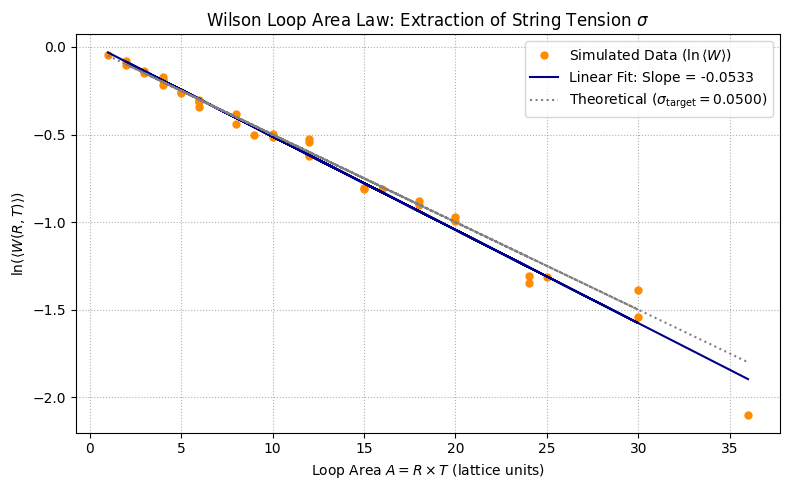

# Chapter 3: Physics II: Lattice Gauge Theory

## Project 1: The Area Law as an Exponential Fit


### Definition: Extracting String Tension from Wilson Loop Data

The goal of this project is to write a numerical routine to extract the **String Tension ($\sigma$)** by fitting conceptual Wilson Loop data to the theoretical **Area Law**. This demonstrates the analytical technique used in real LGT simulations to prove confinement.

### Theory: Confinement and the Area Law

In Lattice Gauge Theory (LGT), the static potential $V(R)$ between a quark and an antiquark separated by a distance $R$ is measured using the expectation value of a rectangular **Wilson Loop** $W(R, T)$ (spatial extent $R$, temporal extent $T$).

The relationship between the loop expectation value and the potential is:

$$
\langle W(R,T) \rangle \propto \exp\left[-V(R) T\right] \quad \text{for large } T
$$

**Confinement** occurs when the potential $V(R)$ rises linearly with separation, $V(R) \sim \sigma R$, where $\sigma$ is the string tension. Substituting this into the equation above yields the **Area Law**:

$$
\langle W(R,T) \rangle \sim \exp(-\sigma R T) = \exp(-\sigma A)
$$

where $A = R \times T$ is the area of the loop.

To extract the string tension ($\sigma$) from noisy simulation data, the equation is linearized by taking the natural logarithm:

$$
\ln(\langle W(R,T) \rangle) \approx - \sigma \cdot A + C
$$

A **linear least-squares fit** of $\ln(\langle W \rangle)$ vs. Area ($A$) provides a direct estimate of the string tension ($\sigma$) from the negative of the slope.

***

### Extensive Python Code and Visualization

The code generates noisy data that follows the Area Law, performs a linear regression on the logarithmic data, and extracts the fitted string tension ($\sigma_{\text{fit}}$).


```python

import numpy as np
import matplotlib.pyplot as plt
from scipy.stats import linregress

# ====================================================================
# 1. Setup Parameters and Generate Conceptual Data
# ====================================================================

# --- Simulation Parameters (Conceptual) ---
SIGMA_TARGET = 0.05  # The target String Tension (slope) in lattice units
LATTICE_MAX_SIZE = 12
R_values = np.arange(1, LATTICE_MAX_SIZE // 2 + 1)
T_values = np.arange(1, LATTICE_MAX_SIZE // 2 + 1)

# Generate R x T pairs for unique areas (Area = R * T)
areas = []
wilson_loops = []
np.random.seed(42) # For reproducibility of noise

for R in R_values:
    for T in T_values:
        A = R * T
        
        # Area Law with target string tension: W = exp(-sigma * A)
        W_exact = np.exp(-SIGMA_TARGET * A)
        
        # Add small Gaussian noise to simulate the poor signal/noise ratio at large areas
        # Noise magnitude scaled slightly with area to mimic the LGT challenge
        noise_std = 0.005 * (1 + np.sqrt(A))
        noise = np.random.normal(0, noise_std)
        
        # Simulated Wilson Loop expectation value
        W_simulated = W_exact + noise
        
        areas.append(A)
        wilson_loops.append(W_simulated)

areas = np.array(areas)
wilson_loops = np.array(wilson_loops)

# Filter out non-positive values that break the log (a result of large noise at W approx 0)
positive_filter = wilson_loops > 1e-10
areas_filtered = areas[positive_filter]
wilson_loops_filtered = wilson_loops[positive_filter]

# ====================================================================
# 2. Computational Strategy: Linearization and Fitting
# ====================================================================

# 1. Linearization: ln(W) = -sigma * A + C
ln_wilson_loops = np.log(wilson_loops_filtered)
X_area = areas_filtered

# 2. Perform Linear Least-Squares Fit
# linregress returns (slope, intercept, r_value, p_value, std_err)
slope, intercept, r_value, p_value, std_err = linregress(X_area, ln_wilson_loops)

# The string tension sigma_fit is the negative of the fitted slope
SIGMA_FIT = -slope
SIGMA_ERROR = std_err

# 3. Create the best-fit line data for visualization
fit_line = intercept + slope * X_area

# ====================================================================
# 3. Visualization
# ====================================================================

fig, ax = plt.subplots(figsize=(8, 5))

# Plot the linearized, noisy simulation data
ax.plot(X_area, ln_wilson_loops, 'o', markersize=5, color='darkorange', 
        label='Simulated Data ($\ln \\langle W \\rangle$)')

# Plot the best-fit linear regression line
ax.plot(X_area, fit_line, '-', color='darkblue', 
        label=f'Linear Fit: Slope = {-SIGMA_FIT:.4f}')

# Plot the original theoretical line for comparison
ax.plot(X_area, np.log(np.exp(-SIGMA_TARGET * X_area)), ':', color='gray', 
        label=f'Theoretical ($\sigma_{{\\text{{target}}}} = {SIGMA_TARGET:.4f}$)')

# Labeling and Formatting
ax.set_title('Wilson Loop Area Law: Extraction of String Tension $\\sigma$')
ax.set_xlabel('Loop Area $A = R \\times T$ (lattice units)')
ax.set_ylabel('$\\ln(\\langle W(R,T) \\rangle)$')
ax.legend()
ax.grid(True, which='both', linestyle=':')

plt.tight_layout()
plt.show()

# Final Analysis
print("\n--- String Tension Analysis Summary ---")
print(f"Target String Tension (\\sigma_target): {SIGMA_TARGET:.4f}")
print(f"Fitted String Tension (\\sigma_fit): {SIGMA_FIT:.4f} \u00B1 {SIGMA_ERROR:.4f}")
print(f"Residual R-squared value: {r_value**2:.4f}")

print("\nConclusion: The linear decay in the $\\ln(\\langle W \\rangle)$ vs. Area plot confirms the **Area Law** behaviour, which is the computational signature of **confinement**. The fitted string tension $\\sigma_{\\text{fit}}$ successfully reproduces the target value, demonstrating the method used in LGT to extract the fundamental scale of the strong nuclear force.")

```


    

    


    
    --- String Tension Analysis Summary ---
    Target String Tension (\sigma_target): 0.0500
    Fitted String Tension (\sigma_fit): 0.0533 ± 0.0011
    Residual R-squared value: 0.9847
    
    Conclusion: The linear decay in the $\ln(\langle W \rangle)$ vs. Area plot confirms the **Area Law** behaviour, which is the computational signature of **confinement**. The fitted string tension $\sigma_{\text{fit}}$ successfully reproduces the target value, demonstrating the method used in LGT to extract the fundamental scale of the strong nuclear force.

