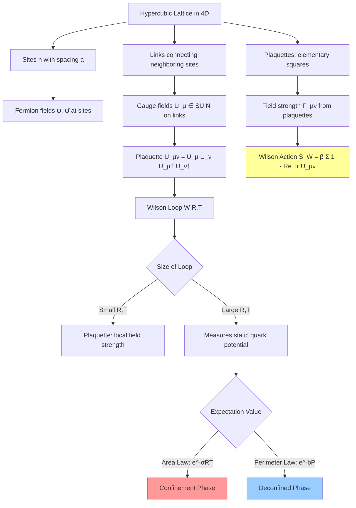

# **Chapter 3: Lattice Gauge Theory**

---

## **Introduction**

Quantum Chromodynamics (QCD)—the theory of quarks, gluons, and the strong nuclear force—presents one of the most profound challenges in theoretical physics. While perturbation theory excels at describing high-energy processes where the strong coupling is small, it fails catastrophically in the low-energy regime where quarks confine into hadrons and the QCD vacuum spontaneously breaks chiral symmetry. These phenomena are fundamentally **non-perturbative**: no finite-order expansion in the coupling constant can capture them.

This chapter introduces **Lattice Gauge Theory (LGT)**, the primary computational framework for studying strongly coupled gauge theories from first principles. By discretizing spacetime onto a hypercubic lattice and performing a Wick rotation to Euclidean signature, we transform the oscillatory path integral of quantum field theory into a statistical mechanics partition function amenable to Monte Carlo simulation. The fundamental degrees of freedom become **link variables**—matrices in $SU(N)$ that encode parallel transport along lattice edges—while gauge-invariant observables like **Wilson loops** reveal the physics of confinement.

The power of LGT lies in its ability to compute hadron masses, decay constants, and phase transitions without relying on weak-coupling expansions. By the end of this chapter, you will understand how to discretize Yang–Mills theory using the **Wilson action**, how to sample gauge field configurations using Metropolis updates on $SU(N)$ manifolds, and how to extract physical predictions—such as the linear quark–antiquark potential that signals confinement—from Wilson loop measurements. These techniques form the foundation for modern lattice QCD calculations and extend to other strongly coupled theories in particle physics and beyond.

---

## **Chapter Outline**

| **Sec.** | **Title**                                                    | **Core Ideas & Examples**                                                                                                                                                                                                           |
| -------- | ------------------------------------------------------------ | ----------------------------------------------------------------------------------------------------------------------------------------------------------------------------------------------------------------------------------- |
| **3.1**  | **Chapter Opener: The Non-Perturbative Universe**           | Why perturbation theory fails in QCD; asymptotic freedom vs. confinement; Wick rotation $t \to -i\tau$ converts path integral to statistical mechanics; discretizing spacetime into sites, links, and plaquettes.                  |
| **3.2**  | **The Field on the Lattice: Sites, Links and Plaquettes**   | Hypercubic lattice with spacing $a$; link variables $U_\mu(n) \in SU(N)$ as parallel transporters; gauge transformations $U_\mu(n) \to \Omega(n) U_\mu(n) \Omega^\dagger(n+\hat{\mu})$; plaquettes $U_{\mu\nu}(n)$ as minimal loops. |
| **3.3**  | **The Wilson Action (The LGT "Hamiltonian")**               | Wilson action $S_W = \beta_{\text{gauge}} \sum [1 - \frac{1}{N} \mathrm{Re\,Tr}\, U_{\mu\nu}]$ with $\beta_{\text{gauge}} = 2N/g_0^2$; continuum limit reproduces Yang–Mills; strong vs. weak coupling regimes; improved actions.  |
| **3.4**  | **The Simulation: Metropolis Updates on $SU(N)$ Matrices**  | Local staple construction $\Sigma_\mu(n)$; proposing new $SU(N)$ matrices near current configuration; Metropolis acceptance $\min(1, e^{-\Delta S})$; heat-bath and overrelaxation methods; ergodicity on group manifolds.          |
| **3.5**  | **Core Application: Measuring Confinement with Wilson Loop**| Wilson loop $W(\gamma) = \mathrm{Tr} \prod_{\ell \in \gamma} U_\ell$; area law $\langle W(R,T) \rangle \sim e^{-\sigma RT}$ signals confinement; extracting string tension $\sigma$; perimeter law in deconfined phase.           |
| **3.6**  | **Chapter Summary & Bridge to Chapter 4**                   | Recap of lattice formulation; non-perturbative validation of confinement; preview of molecular dynamics for continuous systems; from discrete gauge fields to continuous phase space in Hamiltonian Monte Carlo.                    |

---

---

## **3.1 Chapter Opener: The Non‑Perturbative Universe**

-----

### **Why we need lattice gauge theory**

The Standard Model, our best theory of fundamental particles and forces, is built from quantum field theories (QFTs). While **perturbation theory**—expanding in a small coupling constant—works well in QED and the electroweak sector, it fails in Quantum Chromodynamics (QCD), the theory of the strong interaction, for two key reasons:

- **Asymptotic freedom:**  
  At high energies, the strong coupling $g$ becomes small. Quarks behave like free particles, and perturbation theory is valid.

- **Confinement and chiral symmetry breaking:**  
  At low energies, $g$ becomes large. Quarks and gluons are never observed in isolation but are confined into hadrons. The QCD vacuum spontaneously breaks chiral symmetry. These phenomena are **non-perturbative** and cannot be captured by any finite-order expansion.

Moreover, QCD serves as a prototype for a rich class of **non-Abelian gauge theories**. To compute quantities like hadron masses, decay constants, or phase transitions in hot nuclear matter, we need a framework that works **at strong coupling**.

This is the role of **lattice gauge theory (LGT)**: to regularize and simulate QFTs non-perturbatively using discretized spacetime and Monte Carlo methods.


-----

### **From path integrals to statistical mechanics**

The QFT formalism expresses observables as expectation values over fields weighted by the path integral. In Minkowski space, the weight is oscillatory:  
$$
\exp(iS/\hbar)
$$  
which makes numerical evaluation problematic.

LGT circumvents this via a **Wick rotation**: $t \mapsto -i\tau$, converting time to imaginary time. The weight becomes:
$$
\exp(-S_E/\hbar)
$$  
and the partition function becomes:
$$
Z = \int \mathcal{D}A_\mu\,\mathcal{D}\bar{\psi}\,\mathcal{D}\psi\, \exp\left[-S_E[A_\mu, \bar{\psi}, \psi]\right].
$$

This form resembles the partition function of a **statistical mechanics** system, and enables the use of **Monte Carlo sampling**.


-----

### **Discretizing space-time: sites, links and plaquettes**

To make the path integral numerically tractable, we discretize spacetime on a 4D hypercubic lattice with spacing $a$.

- **Sites**: points on the grid, indexed by $n$.
- **Links**: oriented edges between nearest-neighbor sites. On each link from $n$ to $n+\hat{\mu}$ we place a gauge variable:
  $$
  U_\mu(n) \in SU(N)
  $$
  which represents parallel transport along that link. These are **group-valued variables**.

- **Gauge transformations**: each site has a local gauge transformation $\Omega(n) \in SU(N)$, under which link variables transform as:
  $$
  U_\mu(n) \to \Omega(n) U_\mu(n) \Omega^\dagger(n+\hat{\mu})
  $$

- **Plaquettes**: the smallest closed loops—1x1 squares—on the lattice. A typical plaquette in the $\mu\nu$ plane is:
  $$
  U_{\mu\nu}(n) = U_\mu(n) U_\nu(n+\hat{\mu}) U_\mu^\dagger(n+\hat{\nu}) U_\nu^\dagger(n)
  $$
  These loops are gauge-invariant (up to conjugation), and correspond to the field strength $F_{\mu\nu}$ in the continuum.


-----

### **The Wilson action and the continuum limit**

Kenneth Wilson proposed a simple, local, gauge-invariant action:

$$
S_W[U] = \beta_{\text{gauge}} \sum_{n,\mu<\nu} \left[1 - \frac{1}{N} \mathrm{Re\,Tr}\, U_{\mu\nu}(n)\right]
$$

with $\beta_{\text{gauge}} = \frac{2N}{g_0^2}$, and $U_{\mu\nu}(n)$ the plaquette matrix.

- **Continuum limit:**  
  As $a \to 0$, the plaquette approaches $e^{i a^2 F_{\mu\nu}}$, and $S_W$ reduces to the Yang–Mills action:
  $$
  \frac{1}{2g_0^2} \int \mathrm{tr}\,F_{\mu\nu} F^{\mu\nu} \, d^4x
  $$
  Thus, the Wilson action reproduces QCD in the continuum and provides a **non-perturbative lattice regularization**.


-----

### **Confinement and the Wilson loop**

To test confinement, we measure the **Wilson loop**:
$$
W(\gamma) = \mathrm{Tr} \, \mathcal{P} \prod_{\ell \in \gamma} U_\ell
$$
the trace of the ordered product of link variables around a closed loop $\gamma$.

!!! example "Computing a $2\times 2$ Wilson Loop"
    Consider a simple $2 \times 2$ plaquette in the $xy$-plane starting at site $(0,0,0,0)$:
    
    $$
    W(2,2) = \frac{1}{3}\mathrm{Tr}\Bigl[ U_x(0,0) U_x(1,0) U_y(2,0) U_y(2,1) U_x^\dagger(1,2) U_x^\dagger(0,2) U_y^\dagger(0,1) U_y^\dagger(0,0) \Bigr]
    $$
    
    This involves 8 link multiplications around the rectangle. For large $R,T$, numerical stability requires careful ordering and sometimes logarithmic computation of traces.

For a large rectangular loop of spatial extent $R$ and temporal extent $T$, the expectation value behaves as:
$$
\langle W(R,T) \rangle \propto \exp\left[-V(R) T\right]
$$
where $V(R)$ is the static quark–antiquark potential.

- **Confinement**:  
  $V(R) \sim \sigma R$ (linear potential) ⇒ **Area law**:  
  $$
  \langle W(R,T) \rangle \sim e^{-\sigma R T}
  $$

- **Deconfined phase or Higgs phase**:  
  $V(R)$ saturates ⇒ **Perimeter law**

Monte Carlo simulations on the lattice confirm the area law behavior—one of the most striking **non-perturbative validations** of quark confinement.

??? question "Why Does the Area Law Imply Confinement?"
    If $\langle W(R,T) \rangle \sim e^{-\sigma RT}$, the "energy" to separate quarks by distance $R$ is $E(R) = \sigma R$. This linear potential means infinite energy is required to separate quarks to infinity—they remain confined. In contrast, a perimeter law $e^{-bP}$ yields a saturating potential, allowing free quarks at large distances.

-----

### **The Monte Carlo challenge**

Discretizing QCD transforms an infinite-dimensional path integral into a **finite (but enormous)** integral:

- On a lattice of size $L^4$, there are $4L^4$ links.
- Each link holds an $SU(N)$ matrix ⇒ $N^2 - 1$ degrees of freedom per link.
- Total configuration space volume: $(\text{Vol of } SU(N))^{4L^4}$

Direct integration is hopeless. Instead:

 **Solution**: Interpret the Boltzmann weight $\exp[-S_W]$ as a **probability density**, and apply **Markov Chain Monte Carlo (MCMC)**.

!!! tip "Exponential Complexity of Gauge Fields"
    On a $32^4$ lattice with $SU(3)$ gauge theory, there are $4 \times 32^4 = 4{,}194{,}304$ link variables, each an $8$-parameter matrix. The configuration space has dimension $\sim 33$ million—far beyond direct integration. MCMC allows us to sample this vast space efficiently by focusing on high-probability regions weighted by $\exp[-S_W]$.

Requirements:
- Respect **gauge invariance**
- Satisfy **detailed balance**
- Be **ergodic** in a continuous group manifold


-----

### **Summary: The Non‑Perturbative Universe**

Lattice gauge theory provides a bridge between quantum field theory and statistical mechanics. By discretizing space-time and replacing the path integral with a statistical ensemble of configurations, we gain a **numerical handle on strongly coupled gauge theories**.

This chapter opened the door to a world where:
- Link variables encode the fundamental forces
- Local gauge symmetry constrains dynamics
- Confinement emerges from simple local interactions
- Statistical sampling reveals physics beyond perturbation theory

In the next sections, we'll learn how to **update $SU(N)$ link variables** (§3.4), **measure observables** like Wilson loops (§3.5), and **extract physical predictions** from gauge field ensembles.

Welcome to the non-perturbative universe.

---

## **3.2 The Field on the Lattice: Sites, Links and Plaquettes**

-----

### **Discretizing space‑time and assigning degrees of freedom**

A lattice gauge theory (LGT) lives on a hypercubic lattice—a set of points $n=(n_0,n_1,n_2,n_3)$ with integer coordinates. The lattice spacing $a$ sets an ultraviolet cutoff: momenta are bounded by $\pi/a$ and distances are multiples of $a$. To approximate Euclidean space $\mathbb{R}^4$ one uses a finite box of size $L^4$ with periodic boundary conditions; the continuum limit corresponds to $a\to 0$ at fixed physical volume or $L\to\infty$ at fixed $a$.

Unlike scalar field theories, the fundamental variables of a gauge theory are not fields at points but **parallel transporters** along links. In continuum QCD the gauge potential $A_\mu(x)$ enters via the path‑ordered exponential

$$
\mathcal{P}\exp\Bigl[i g \int_{x}^{x+a\hat\mu} A_\mu(\xi)\,\mathrm{d}\xi\Bigr],
$$

which transports a colour charge from $x$ to $x+a\hat\mu$. On the lattice this object is replaced by a matrix $U_\mu(n)\in SU(N)$ attached to the oriented link from site $n$ to site $n+\hat{\mu}$. When $N=3$ these link matrices are $3\times 3$ special unitary matrices representing colour rotations. The continuum gauge potential is recovered by writing $U_\mu(n)\approx \exp[i g a A_\mu(n)]$ for small $a$.

Matter fields (fermions) live on the sites $n$; they transform in the fundamental representation of $SU(N)$. Although this chapter focuses on pure gauge theory and thus omits quarks, the site–link structure becomes important when dynamical fermions are included: the link variables enter the Dirac operator as parallel transporters connecting neighbouring sites.

-----

### **Gauge transformations on the lattice**

Local gauge invariance is the cornerstone of non‑Abelian gauge theories. On the lattice a gauge transformation is specified by a set of matrices $\Omega(n)\in SU(N)$, one at each site. These act on link variables as

$$
U_\mu(n) \longrightarrow \Omega(n) U_\mu(n) \Omega^\dagger(n+\hat{\mu}),
$$

ensuring that $U_\mu(n)$ is “rotated” by the gauge transformation at its tail and inversely rotated at its head. Notice that links pointing in the negative direction are defined as the Hermitian conjugates of their opposites: $U_{-\mu}(n) = U_\mu(n-\hat{\mu})^\dagger$. Under these transformations, the colour degrees of freedom at neighbouring sites are consistently related, and gauge symmetry is preserved exactly on the lattice.

Gauge invariance restricts observables to be invariant under these transformations. Local quantities like $U_\mu(n)$ or products around open paths are gauge dependent; only closed loops—the traces of products of links around closed curves—are gauge invariant. The simplest such loop is the **plaquette**.

-----

### **Plaquettes: elementary Wilson loops**

A plaquette is a unit square in the $\mu\nu$ plane anchored at lattice site $n$. Its associated matrix is the ordered product of link variables around the square:

$$
U_{\mu\nu}(n) = U_\mu(n)\,U_\nu(n+\hat{\mu})\,U_\mu(n+\hat{\nu})^\dagger\,U_\nu(n)^\dagger.
$$

Under a gauge transformation this transforms as $U_{\mu\nu}(n)\rightarrow\Omega(n)\,U_{\mu\nu}(n)\,\Omega^\dagger(n)$, so its trace $\mathrm{Tr}\,U_{\mu\nu}(n)$ is gauge invariant. The plaquette plays several roles:

- **Building block of the action:** The Wilson action is constructed from the real part of the trace of plaquettes. The deviation of $U_{\mu\nu}(n)$ from the identity measures the field strength $F_{\mu\nu}$ at that point: for small $a$, $U_{\mu\nu}(n)\approx \exp[i g a^2 F_{\mu\nu}(n)]$.

- **Elementary Wilson loops:** A Wilson loop is the trace of the ordered product of link variables around any closed path. Plaquettes are the smallest non‑trivial Wilson loops and thus capture local curvature of the gauge field.

- **Measure of lattice artifacts:** Since the plaquette contains $\mathcal{O}(a^2)$ corrections to $F_{\mu\nu}$, actions built from plaquettes incur discretization errors of order $a^2$. Improved actions add larger loops (rectangles, bent loops) to reduce these errors.

Each lattice site in four dimensions is surrounded by $\binom{4}{2}=6$ plaquettes, one for each pair of directions. On an $L^4$ lattice there are $6L^4$ plaquettes and $4L^4$ link variables. The huge size of this configuration space underscores the need for stochastic sampling.

-----

### **Counting degrees of freedom and constraints**

A link variable in $SU(N)$ has $N^2 - 1$ real degrees of freedom. For $SU(3)$ this is $8$; for $SU(2)$ it is $3$. Thus, a lattice with $4L^4$ links in $SU(3)$ gauge theory has $8 \times 4L^4 = 32 L^4$ real degrees of freedom. Gauge invariance reduces the number of independent degrees of freedom: one can perform gauge transformations to “gauge fix” certain links, leaving only $4L^4 - (N^2 - 1)L^4$ physical degrees of freedom. In practice, gauge fixing is not applied during Monte‑Carlo updates; instead, configurations are sampled in a gauge‑invariant way, and gauge‑invariant observables (e.g., Wilson loops, Polyakov loops) are measured.

-----

### **Generalizations and matter fields**

While this chapter focuses on pure gauge theory in four dimensions, the lattice formulation generalizes:

- **Different dimensions:** One can study gauge theories in lower dimensions (e.g., 2D Yang–Mills) or extend to 5D in certain models.

- **Different groups:** QCD uses $SU(3)$, but one can simulate $SU(2)$ (pure Yang–Mills), $U(1)$ (lattice QED), or larger groups like $SU(4)$, $SU(5)$ to explore grand unified theories or large‑$N$ limits.

- **Matter fields:** Including dynamical fermions requires placing Grassmann fields $\psi(n)$ and $\bar{\psi}(n)$ on sites. The Dirac operator couples neighbouring fermion fields via link variables $U_\mu(n)$; integrating out the fermion fields yields a determinant $\det D[U]$ that multiplies the gauge action. This determinant is costly to evaluate, so algorithmic advances (Hybrid Monte Carlo, pseudofermions, multigrid) are needed.

- **Adjoint fields and Higgs:** One can add scalar fields in various representations (fundamental, adjoint) interacting with link variables. Higgs fields live on sites and couple to links, enabling the study of Higgs phases and symmetry breaking.

Understanding the lattice assignment of degrees of freedom—sites for matter, links for gauge fields, plaquettes for field strength—is foundational for implementing local update algorithms (section 3.4) and for measuring gauge‑invariant observables like Wilson loops (section 3.5). It emphasises how gauge symmetry manifests on the lattice and how discretization preserves the geometric nature of gauge theories.

**Flowchart: Lattice Structure and Wilson Loop Construction**



---

## **3.3 The Wilson Action (The LGT "Hamiltonian")**

-----

### **From continuum Yang–Mills to a lattice action**

In continuum Yang–Mills theory the gluon fields $A_\mu^a(x)$ (with gauge group $SU(N)$) interact through the action

$$
S_\text{YM} = \frac{1}{2g^2}\int \mathrm{d}^4x\,\mathrm{Tr}\bigl[F_{\mu\nu}(x) F^{\mu\nu}(x)\bigr],
$$

where $F_{\mu\nu} = \partial_\mu A_\nu - \partial_\nu A_\mu + ig[A_\mu, A_\nu]$ is the field strength tensor and $g$ is the coupling constant. This action is gauge invariant and yields the familiar Yang–Mills equations of motion. To put this theory on a lattice, we need a local, gauge‑invariant quantity that reduces to $F_{\mu\nu}F^{\mu\nu}$ in the continuum limit.

-----

### **Constructing the Wilson action from plaquettes**

As explained in §3.2, the trace of a plaquette $U_{\mu\nu}(n)$ is gauge invariant and, for small lattice spacing $a$, expands to 

$$
\mathrm{Tr}\bigl[I + i g a^2 F_{\mu\nu}(n) - \tfrac{1}{2}g^2 a^4 F_{\mu\nu}^2(n) + \cdots\bigr].
$$

Wilson’s insight was to build a lattice action from these plaquettes:

$$
S_W[U] = \beta_\text{gauge} \sum_{n} \sum_{\mu<\nu} \left[1 - \frac{1}{N} \mathrm{Re}\,\mathrm{Tr}\,U_{\mu\nu}(n)\right], \qquad \beta_\text{gauge} = \frac{2N}{g_0^2}.
$$

Here $g_0$ is the **bare lattice coupling**, which flows under renormalization; $\beta_\text{gauge}$ controls the weight of fluctuations. Each term in the sum is local (depends only on link variables around a plaquette) and gauge invariant. When expanded in powers of $a$, $S_W$ reproduces the Yang–Mills action up to corrections of order $a^2$:

$$
S_W = \frac{1}{2g_0^2} \int \mathrm{d}^4x\, \mathrm{Tr}\bigl[F_{\mu\nu}(x)F_{\mu\nu}(x)\bigr] + \mathcal{O}(a^2).
$$

Thus, the Wilson action provides a consistent lattice regularization of QCD whose continuum limit is the usual gauge theory.

-----

### **Interpretation of $\beta_\text{gauge}$ and the lattice coupling**

The parameter $\beta_\text{gauge} = 2N/g_0^2$ plays a role analogous to the inverse temperature in statistical mechanics. For pure $SU(N)$ gauge theory, changing $\beta_\text{gauge}$ moves the system between different regimes:

- **Strong‑coupling regime ($\beta_\text{gauge} \ll 1$):** The bare coupling $g_0$ is large. The plaquette terms fluctuate significantly; link variables are far from the identity. In this regime, analytic strong‑coupling expansions are possible. The area law for Wilson loops and confinement arise naturally here. In fact, the area law behaviour of large Wilson loops is exact in the strong‑coupling limit, indicating that the string tension $\sigma$ is non‑zero.

- **Weak‑coupling regime ($\beta_\text{gauge} \gg 1$):** The bare coupling $g_0$ is small. The link variables are close to the identity matrix; the plaquette is near $I$; the theory approaches continuum Yang–Mills. Perturbation theory becomes applicable. As $\beta_\text{gauge} \to \infty$ with the lattice spacing $a$ appropriately decreased, one recovers continuum QCD.

- **Crossover / deconfinement transitions:** On lattices with finite temporal extent $N_t$, the gauge coupling and temperature are related by $T_\text{phys} = 1/(a N_t)$. By varying $\beta_\text{gauge}$, one can study finite‑temperature phase transitions. For $SU(3)$ pure gauge theory there is a first‑order deconfinement transition at $\beta_\text{gauge} \approx 5.7$ (for typical $N_t$). This transition separates a low‑temperature confining phase (area law) from a high‑temperature deconfined phase (perimeter law), as revealed by the behaviour of the Polyakov loop and the Wilson loop.

-----

### **Beyond the Wilson action: improved and alternative actions**

The Wilson action is the simplest gauge‑invariant lattice action, but it has discretization errors of order $a^2$. To reduce these errors and accelerate convergence to the continuum limit, several improved actions have been developed:

- **Symanzik‑improved actions:** Add larger Wilson loops (rectangles, parallelograms) with tuned coefficients to cancel $\mathcal{O}(a^2)$ or higher‑order errors. Examples include the Lüscher–Weisz and Iwasaki actions.

- **Tadpole improvement:** Corrects for renormalization of link variables due to tadpole diagrams by rescaling links with a factor $u_0$ (the mean link).

- **Gauge actions with anisotropy:** For finite‑temperature studies one often uses different couplings in spatial and temporal directions to vary $a_t/a_s$.

- **Hamiltonian formulations:** Instead of Euclidean path integrals, one can work with a canonical Hamiltonian for lattice gauge fields (Kogut–Susskind Hamiltonian) on a discrete spatial lattice with continuous time. The Wilson action is then related to the transfer matrix of this Hamiltonian. The strong‑coupling expansion can be interpreted as an expansion in powers of $1/g_0^2$.

While improved actions provide faster approach to the continuum, the Wilson action remains the workhorse for many simulations due to its simplicity and established renormalization properties.

-----

### **Gauge fixing and the role of the action in Monte‑Carlo sampling**

In Monte‑Carlo simulations the Wilson action defines the Boltzmann weight used to sample gauge configurations. Gauge fixing is not usually imposed in generating configurations; instead, one sums over gauge orbits implicitly. Observables are chosen to be gauge invariant (e.g., Wilson loops, Polyakov loops, plaquette expectation values). The acceptance probability in Metropolis or heat‑bath updates depends on the **local change in the Wilson action** when a link variable is perturbed. Because $S_W$ is a sum of local terms, updates are local in computational cost (see §3.4). Accurate evaluation of $S_W$ and its variations is therefore central to the efficiency and correctness of lattice gauge simulations.

In summary, the Wilson action is the cornerstone of LGT, providing a simple, local and gauge‑invariant discretization of Yang–Mills theory that enables non‑perturbative studies of gauge dynamics. By tuning the bare coupling $\beta_\text{gauge}$, one can explore confining and deconfined phases and extrapolate to the continuum limit. Understanding this action lays the foundation for constructing Markov‑Chain update algorithms (Section 3.4) and for computing observables that reveal the physics of quark confinement (Section 3.5).

---

## **3.4 The Simulation: Metropolis Updates on $SU(N)$ Matrices**

-----

### **Local updates and the concept of a "staple"**

In lattice gauge theory we wish to sample link configurations $U_\mu(n) \in SU(N)$ with probability proportional to $\exp[-S_W(U)]$. Since the Wilson action is a sum over plaquettes, changing a single link $U_\mu(n)$ affects only the plaquettes that include that link. To update $U_\mu(n)$ efficiently, we gather the contributions of its neighbouring plaquettes into a **staple** matrix:

$$
\Sigma_\mu(n) = \sum_{\nu \neq \mu} \left[ U_\nu(n+\hat{\mu}) U_\mu^\dagger(n+\hat{\nu}) U_\nu^\dagger(n) + U_\nu^\dagger(n+\hat{\mu}-\hat{\nu}) U_\mu^\dagger(n-\hat{\nu}) U_\nu(n-\hat{\nu}) \right].
$$

There are two staples for each orthogonal direction $\nu$: one for the plaquette in the $\mu\nu$ plane oriented forward in $\nu$, and one oriented backward. The local action involving $U_\mu(n)$ can be written as

$$
S_\text{loc}(U_\mu(n)) = -\frac{\beta_\text{gauge}}{2N} \mathrm{Re} \, \mathrm{Tr} \left[ U_\mu(n) \Sigma_\mu(n) \right].
$$

This decomposition reduces the global Boltzmann factor to a local factor for the link being updated and a constant factor from all other links. In a Metropolis update we propose a new matrix $U'_\mu(n)$ and compute the change $\Delta S = S_\text{loc}(U'_\mu(n)) - S_\text{loc}(U_\mu(n))$; the proposal is accepted with probability $\min(1, e^{-\Delta S})$.

**Pseudo-code for SU(N) Metropolis Update:**

```python
# Metropolis update for a single link variable U_mu(n)
def metropolis_link_update(U, mu, n, beta_gauge, epsilon):
    # Compute staple sum Sigma_mu(n)
    Sigma = compute_staple(U, mu, n)
    
    # Current local action
    S_old = -beta_gauge / (2*N) * Re(Tr(U[mu,n] @ Sigma))
    
    # Propose new link: U' = delta_U * U[mu,n]
    delta_U = random_SU_N_near_identity(epsilon)  # small random matrix
    U_prime = delta_U @ U[mu,n]
    
    # New local action
    S_new = -beta_gauge / (2*N) * Re(Tr(U_prime @ Sigma))
    
    # Metropolis acceptance
    Delta_S = S_new - S_old
    if random_uniform(0,1) < exp(-Delta_S):
        U[mu,n] = U_prime  # accept
    # else reject and keep U[mu,n] unchanged
```

-----

### **Choosing proposals: random group elements close to the identity**

For an efficient Metropolis algorithm we need to propose new link variables that are “near” the current one to maintain a reasonable acceptance rate. Two common strategies are:

- **Multiplicative noise:** Choose a random matrix $\delta U$ from a distribution centred at the identity in $SU(N)$, and set $U'_\mu(n) = \delta U \, U_\mu(n)$. For small perturbations, $\delta U \approx \exp[i \sum_{a=1}^{N^2 - 1} \epsilon_a T^a]$, where $T^a$ are the generators of $SU(N)$ and $\epsilon_a$ are small random numbers. The step size controls acceptance rates: too large and proposals are often rejected; too small and the Markov chain moves sluggishly. Tuned automatically or manually to achieve acceptance rates around 50% for $SU(2)$ and 30% for $SU(3)$.

- **Over-relaxation proposals:** Deterministic updates that reflect $U_\mu(n)$ across the staple and leave the action unchanged (see below). These are used to reduce autocorrelation without affecting the equilibrium distribution.

Because group manifolds are curved, generating uniform random elements near the identity requires care; one typically samples from the Lie algebra with a Gaussian distribution and exponentiates.

-----

### **Heat-bath algorithms and exact updates for $SU(2)$**

An alternative to Metropolis is the **heat-bath algorithm**, which samples the new link $U'_\mu(n)$ exactly from the conditional distribution

$$
\propto \exp\left( \frac{\beta_\text{gauge}}{N} \mathrm{Re}\,\mathrm{Tr}[U \Sigma_\mu(n)] \right).
$$

For $SU(2)$ this conditional distribution can be written analytically. Observing that any $SU(2)$ matrix can be parameterized as $U = a_0 I + i \vec{a} \cdot \vec{\sigma}$ with $a_0^2 + \vec{a}^2 = 1$, and that the trace depends only on the projection along $\Sigma_\mu(n)$, one derives a simple algorithm: draw a random $SU(2)$ matrix from the distribution weighted by its overlap with $\Sigma_\mu(n)$. The Cabibbo–Marinari method extends this to $SU(3)$ by updating its embedded $SU(2)$ subgroups sequentially.

Heat-bath updates have acceptance probability 1 by construction and yield decorrelated samples faster than Metropolis. They are widely used in modern lattice simulations, often alternating with over-relaxation steps.

-----

### **Over-relaxation (microcanonical) updates**

**Over-relaxation** is a deterministic update that preserves the action (microcanonical). The idea is to reflect the current link across the staple, analogous to how one might accelerate convergence when solving linear equations iteratively. For $SU(2)$ the over-relaxation update for link $U$ with staple $\Sigma$ is:

$$
U' = \Sigma U^\dagger \Sigma.
$$

This update leaves the local term $\mathrm{Re}\,\mathrm{Tr}[U \Sigma]$ unchanged, so the action is constant and the configuration remains in the same Boltzmann “shell”. Alternating heat-bath / Metropolis updates with over-relaxation reduces autocorrelation times by sweeping around constant-action surfaces. Over-relaxation generalizes to $SU(N)$ via sequential updates of embedded $SU(2)$ blocks.

-----

### **Hybrid Monte-Carlo and dynamical fermions**

When dynamical fermions are included, the weight of a configuration contains $\det D[U]$, the determinant of the Dirac operator. Local updates become inefficient because changing a link affects the determinant globally. The **Hybrid Monte Carlo (HMC)** algorithm treats link variables as coordinates of a classical system with conjugate momenta. One introduces a fictitious time and performs Hamiltonian evolution with a pseudofermion action representing $\det D$. The trajectory proposes a new configuration; a global Metropolis step ensures detailed balance. HMC allows simultaneous update of all link variables and handles fermion determinants effectively. Variants like Rational Hybrid Monte Carlo (RHMC) and multi-time-scale integrators improve efficiency. Although HMC belongs to more advanced chapters, it is conceptually the generalization of local updates to global moves in the presence of fermions.

-----

### **Ergodicity, detailed balance and practical tuning**

Regardless of the update scheme, the resulting Markov chain must satisfy:

- **Ergodicity:** Any gauge configuration with non-zero weight can be reached from any other via a sequence of updates. For Metropolis/heat-bath with small but non-zero step size, ergodicity is believed to hold because one can gradually transform any link to any other in $SU(N)$. Embedding multiple $SU(2)$ subgroups ensures ergodicity for $SU(3)$.

- **Detailed balance:** The conditional probability of transitioning from $U$ to $U'$ times the equilibrium probability $e^{-S_W(U)}$ equals the reverse product. Metropolis and heat-bath satisfy detailed balance by construction; over-relaxation satisfies a weaker balance condition but can be combined with Metropolis/heat-bath to maintain the correct stationary distribution.

- **Acceptance rates and autocorrelation:** One tunes the proposal size in Metropolis to achieve reasonable acceptance. Too small a step yields high acceptance but large autocorrelation; too large a step yields low acceptance and wasted proposals. In heat-bath algorithms there is no acceptance tuning, but one can adjust the number of over-relaxation sweeps per heat-bath update to optimize decorrelation.

- **Parallelization:** Lattice updates are embarrassingly parallel across sites/links, except for the staple construction which involves neighbouring links. Domain decomposition, even–odd colouring and multi-threading are used to speed up simulations on modern hardware.

In summary, Section 3.4 develops the algorithmic machinery for generating gauge field configurations distributed according to the Wilson action. By assembling the staple around each link and proposing new matrices via Metropolis, heat-bath or hybrid algorithms, we build Markov chains that explore the enormous configuration space while preserving gauge invariance. Practical considerations—step size, acceptance rate, ergodicity and over-relaxation—ensure that these chains converge efficiently and yield statistically independent samples for measuring Wilson loops and other observables.

---

## **3.5 Core Application: Measuring Confinement with the Wilson Loop**

-----

### **From gauge fields to static quark potentials**

Confinement means that colour‑charged particles such as quarks and gluons cannot be isolated; they are bound into colour‑neutral hadrons. In a gauge theory without dynamical quarks (pure Yang–Mills), confinement manifests as a linearly rising potential between a static quark–antiquark pair at separation $R$. Lattice gauge theory provides a non‑perturbative definition of this potential through the expectation value of **Wilson loops**.

Consider a rectangular loop $\gamma(R,T)$ that extends a distance $R$ in one spatial direction and a distance $T$ in the Euclidean time direction. The **Wilson loop** associated with $\gamma$ is

$$
W(R,T) = \frac{1}{N} \mathrm{Tr} \!\left( \prod_{(n,\mu)\in\gamma} U_\mu(n) \right),
$$

where the product is ordered along the perimeter of the rectangle and the trace ensures gauge invariance. Physically, $W(R,T)$ corresponds to the propagation amplitude of a static quark–antiquark pair separated by $R$, created at time $0$ and annihilated at time $T$. Its expectation value can be related to the static potential $V(R)$:

$$
\langle W(R,T) \rangle \approx e^{-V(R) T} \quad \text{for } T \gg R,
$$

so that $V(R) = -\lim_{T \to \infty} \frac{1}{T} \ln \langle W(R,T) \rangle$. In the confining phase, this potential grows linearly for large separations, $V(R) \approx \sigma R + c$, with string tension $\sigma$.

-----

### **Area law versus perimeter law**

The behaviour of the Wilson loop at large scales distinguishes different phases of gauge theories. Define the loop area $A = R T$ and perimeter $P = 2(R + T)$. Two generic asymptotic behaviours are:

- **Area law (confinement):** If $\langle W(R,T) \rangle \propto e^{-\sigma A}$ for large loops, then the exponent is proportional to the area. This implies a linear potential and confinement: stretching the flux tube between the quark and antiquark costs energy proportional to its length. The area law indicates that the colour flux is squeezed into a narrow tube (a “string”) rather than spreading out. The Wilson loop article on gauge theories notes that in a confining phase one observes an area law rather than a perimeter law.

- **Perimeter law (deconfinement/Higgs phase):** If $\langle W(R,T) \rangle \propto e^{-b P}$, the decay is proportional to the perimeter. The potential $V(R)$ saturates at large $R$, indicating that quark and antiquark fields can screen each other and no string forms. This occurs in gauge theories with Higgs fields or at sufficiently high temperature.

On finite‑temperature lattices with temporal extent $N_t$, a finite physical temperature $T_\text{phys} = 1/(a N_t)$ is introduced. As $T_\text{phys}$ increases there is a deconfinement transition from area law to perimeter law. In QCD with dynamical quarks, the string breaks at a finite distance due to pair creation, but the area law still holds up to the breaking scale.

-----

### **Measuring Wilson loops in practice**

Computationally, the expectation value $\langle W(R,T) \rangle$ is estimated by averaging the Wilson loop over an ensemble of gauge configurations generated by Monte‑Carlo simulation. However, several challenges arise:

- **Signal‑to‑noise ratio:** The Wilson loop decays exponentially with $A$, so its expectation becomes extremely small for large loops. Meanwhile, fluctuations of the product of link variables introduce noise that does not decrease with area. The signal‑to‑noise ratio therefore deteriorates as the loop grows.

- **Smearing and link improvement:** To reduce noise, one often applies **link smearing** or **blocking** (e.g., APE smearing, HYP smearing) to smooth ultraviolet fluctuations. Smearing replaces each link with a weighted average of itself and nearby staples, projecting back to $SU(N)$. This reduces short‑distance noise and enhances overlap with the ground‑state flux tube.

- **Multi‑level algorithms:** Another approach is the **Lüscher–Weisz multi‑level algorithm**, which divides the lattice into sublattices and computes contributions to the Wilson loop from each sublattice separately. This method drastically reduces statistical errors for observables with an exponential decay.

- **Creutz ratios:** To extract the string tension without large loops, one uses Creutz ratios: 

$$
\chi(R,R) = -\ln \frac{ \langle W(R,R) \rangle \langle W(R-1,R-1) \rangle }{ \langle W(R,R-1) \rangle \langle W(R-1,R) \rangle }.
$$

For large $R$, $\chi(R,R) \approx \sigma a^2$. Because ratios cancel perimeter contributions and some noise, they provide more stable estimates.

- **Temporal fits:** For a fixed spatial extent $R$, one computes $\langle W(R,T) \rangle$ as a function of $T$, fits $\ln \langle W(R,T) \rangle$ to a linear function in $T$, and extracts $V(R)$ from the slope. The string tension is then obtained by fitting $V(R)$ to a linear function plus the expected Coulomb term at short distances.

- **Polyakov loops:** At finite temperature, the expectation value of a single Polyakov loop (the trace of the product of temporal links wrapping around the lattice) serves as an order parameter for deconfinement. The correlator of two Polyakov loops separated by $R$ yields the free energy of a static quark–antiquark pair at temperature $T_\text{phys}$. A non‑zero $\langle \text{Tr} P \rangle$ signals deconfinement.

-----

### **Results and physical interpretation**

Monte‑Carlo studies of pure $SU(2)$ and $SU(3)$ gauge theories have confirmed that:

- At low temperatures, large Wilson loops obey an area law and the extracted static potential grows linearly at large distances. The slope yields the string tension $\sigma$, typically quoted in units of inverse lattice spacing and then converted to physical units by setting $a$ via another observable (e.g., the Sommer parameter $r_0$). For $SU(3)$ pure gauge theory, $\sqrt{\sigma} \approx 440\ \text{MeV}$ in physical units.

- At high temperatures (above a critical value $T_c$), Wilson loops follow a perimeter law. The Polyakov loop acquires a non‑zero expectation value, indicating deconfinement. This transition is first order for $SU(3)$ pure gauge theory and second order for $SU(2)$.

- Adding dynamical quarks (full QCD) changes the picture: the static potential still rises linearly at intermediate distances, but string breaking occurs when the potential energy exceeds twice the light meson mass. Wilson loops alone no longer exhibit a strict area law; one needs to consider the static quark potential in the presence of sea quarks.

These findings, originally discovered numerically, have profound implications: they confirm the confinement phenomenon predicted qualitatively by quantum chromodynamics. The Wilson loop provides a rigorous, gauge‑invariant order parameter for confinement in pure gauge theories. Its measurement illustrates how non‑perturbative Monte‑Carlo methods translate the geometry of gauge fields on a lattice into physical statements about quarks, flux tubes and the strong nuclear force.

-----

### **Outlook: beyond simple Wilson loops**

Measuring Wilson loops is just the beginning of extracting physics from gauge configurations. Subsequent chapters and advanced literature explore:

- **Glueball and hadron spectroscopy:** Constructing operators with appropriate quantum numbers and measuring their correlation functions to extract masses.

- **Topological observables:** Computing the topological charge and its susceptibility to study $\theta$‑vacua and instantons.

- **Gauge‑fixing and propagators:** Fixing to Landau or Coulomb gauge and computing gluon and ghost propagators to study infrared behaviour.

- **Effective string descriptions:** Comparing the static potential at large distances with predictions from effective string theory, including Lüscher corrections.

The Wilson loop thus serves as the gateway from simple gauge-invariant observables to the rich tapestry of non‑perturbative phenomena in quantum chromodynamics and other gauge theories.

---

## **3.6 Chapter Summary & Bridge to Chapter 4**

-----

### **Reflecting on the journey through lattice gauge theory**

In Chapter 2 we learned how Markov Chain Monte‑Carlo (MCMC) techniques can unravel the thermodynamics of a simple spin model, revealing collective phenomena like phase transitions. Chapter 3 escalated this concept to a sophisticated quantum field theory—Quantum Chromodynamics—where the degrees of freedom are matrices living on links of a four‑dimensional lattice. The key milestones were:

- **From spins to gauge fields:** We generalised the idea of a local degree of freedom from a discrete $\pm1$ spin at a site to a continuous $SU(N)$ matrix on each link. These link variables represent parallel transporters of colour charge; their product around elementary plaquettes yields gauge‑invariant quantities reminiscent of the field strength tensor.

- **Gauge invariance on a lattice:** Local gauge transformations act independently at each site, rotating link matrices at their endpoints. Building the theory from traces of closed loops ensures that the discretised action and observables respect this symmetry exactly, even at finite lattice spacing.

- **The Wilson action:** Constructed from plaquettes, the Wilson action reproduces the continuum Yang–Mills action in the $a \to 0$ limit and controls the weight of gauge configurations via a coupling $\beta_\text{gauge}$. Tuning $\beta_\text{gauge}$ allowed us to move between strong‑coupling (confining) and weak‑coupling (deconfining) regimes and to approach the continuum.

- **Monte‑Carlo sampling of gauge fields:** We saw how to extend Metropolis updates from scalar spins to group-valued variables. By assembling “staples” from neighbouring links, proposing small random matrices, and computing local action changes, we built Markov chains that sample the Boltzmann distribution of gauge fields. We discussed enhancements like heat‑bath updates, over‑relaxation and Hybrid Monte‑Carlo for fermions.

- **Confinement through Wilson loops:** We introduced Wilson loops as non‑local order parameters that diagnose confinement. An area law for large rectangular loops signals a linearly rising static quark potential. Monte‑Carlo measurements of Wilson loops yield the string tension and confirm the presence of confining flux tubes. Techniques like smearing and multi‑level algorithms mitigate noise and extract the potential accurately.

These developments exemplify how local rules and symmetries on a lattice lead to emergent phenomena—confinement, deconfinement and scaling—mirroring the rich structure of the underlying quantum field theory. The chapter also highlighted the crucial roles of ergodicity and detailed balance in sampling, as well as variance reduction and noise management in measuring observables.

-----

### **Lessons for Monte‑Carlo simulation**

From a methodological standpoint, the chapter distilled several important principles that transcend particle physics:

- **Dimensional augmentation:** When discrete or continuous degrees of freedom proliferate (spins, link matrices, asset prices), direct enumeration or integration is impossible. MCMC methods become indispensable.

- **Local proposals, global constraints:** Whether flipping a spin or updating a link matrix, proposals must be local for efficiency but consistent with global constraints (detailed balance, gauge invariance, risk‑neutrality).

- **Variances and signal extraction:** Observables may decay exponentially with system size (Wilson loops, option payoffs in rare events). Reducing variance through algorithmic tricks (smearing, over‑relaxation, control variates) is as important as generating samples.

- **Extrapolation to the continuum / infinite limit:** Lattice simulations require extrapolations—$a \to 0$ in field theory, $N \to \infty$ in spin systems, path discretisation $\Delta t \to 0$ in stochastic calculus—to recover continuum results. Careful scaling analysis is vital.

These principles underpin MCMC applications across science and engineering. Recognising their universality encourages us to explore new domains beyond physics.

-----

### **Transition to Chapter 4: from quantum fields to financial derivatives**

Having mastered MCMC techniques in the context of a non‑perturbative quantum field theory, we now pivot to a seemingly unrelated area: **financial mathematics**. Surprisingly, the same stochastic machinery that samples field configurations and measures Wilson loops also prices options and evaluates risk.

In the financial realm:

- The **state** is a stochastic path of asset prices rather than a lattice of spins or link matrices.
- The **dynamics** are governed by stochastic differential equations (e.g., geometric Brownian motion), analogous to the gauge field dynamics encoded in the Wilson action.
- The **observables** are payoffs of derivatives, which depend on the path of the underlying asset; these are akin to non‑local Wilson loops in that they depend on the entire trajectory.
- **Risk‑neutral valuation** replaces gauge invariance as the guiding principle: derivative prices are expected values under a risk‑neutral measure.

Chapter 4 will draw on the same Monte‑Carlo philosophy to generate asset price paths, compute expected discounted payoffs and apply variance‑reduction techniques. The conceptual continuity underscores a powerful idea: stochastic simulation is a unifying tool across disciplines, whether probing the strong nuclear force or pricing an exotic option. By recognising the common structure—state space, probability measure, observable and estimator—we can transfer insights from lattice gauge theory to finance and beyond.

Thus, the journey from quarks to quotes is not as far‑fetched as it seems. The next chapter will show how the Monte‑Carlo algorithms and variance reduction techniques developed here can be adapted to model the dynamics of financial markets and to value complex derivatives.

---

## **References**

[1] K. G. Wilson, "Confinement of quarks," *Physical Review D* **10**, 2445 (1974).  
The seminal paper introducing the Wilson action and the lattice formulation of gauge theories.

[2] M. Creutz, "Monte Carlo study of quantized SU(2) gauge theory," *Physical Review D* **21**, 2308 (1980).  
Early Monte Carlo simulations of pure SU(2) lattice gauge theory, demonstrating confinement via Wilson loops.

[3] I. Montvay and G. Münster, *Quantum Fields on a Lattice*, Cambridge University Press (1994).  
Comprehensive textbook on lattice field theory covering gauge theories, fermions, and algorithms.

[4] H. J. Rothe, *Lattice Gauge Theories: An Introduction*, 4th edition, World Scientific (2012).  
Standard reference for lattice QCD, including detailed treatments of the Wilson action and Monte Carlo methods.

[5] C. Gattringer and C. B. Lang, *Quantum Chromodynamics on the Lattice*, Springer (2010).  
Modern introduction to lattice QCD with emphasis on computational techniques and physical applications.

[6] N. Cabibbo and E. Marinari, "A new method for updating SU(N) matrices in computer simulations of gauge theories," *Physics Letters B* **119**, 387 (1982).  
Introduction of the heat-bath algorithm for SU(2) subgroups, foundational for efficient gauge field updates.

[7] M. Lüscher and P. Weisz, "On-shell improved lattice gauge theories," *Communications in Mathematical Physics* **97**, 59 (1985).  
Development of improved gauge actions to reduce discretization errors.

[8] S. Duane, A. D. Kennedy, B. J. Pendleton, and D. Roweth, "Hybrid Monte Carlo," *Physics Letters B* **195**, 216 (1987).  
Introduction of the Hybrid Monte Carlo algorithm for dynamical fermions in lattice QCD.

[9] M. Lüscher and U. Wolff, "How to calculate the elastic scattering matrix in two-dimensional quantum field theories by numerical simulation," *Nuclear Physics B* **339**, 222 (1990).  
Multi-level algorithms for improved signal-to-noise in measuring large Wilson loops.

[10] K. Symanzik, "Continuum limit and improved action in lattice theories," *Nuclear Physics B* **226**, 187 (1983).  
Theoretical foundation for Symanzik improvement program to reduce lattice artifacts.

