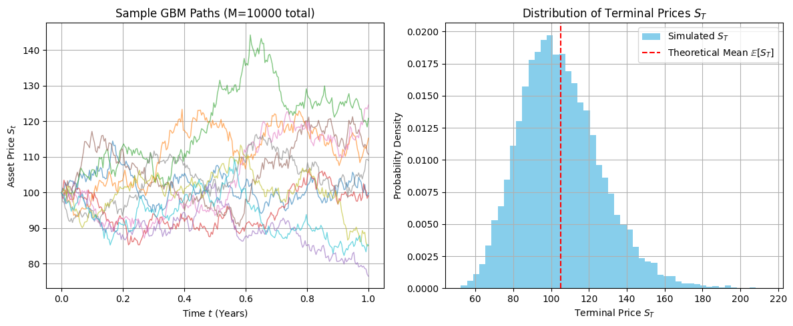
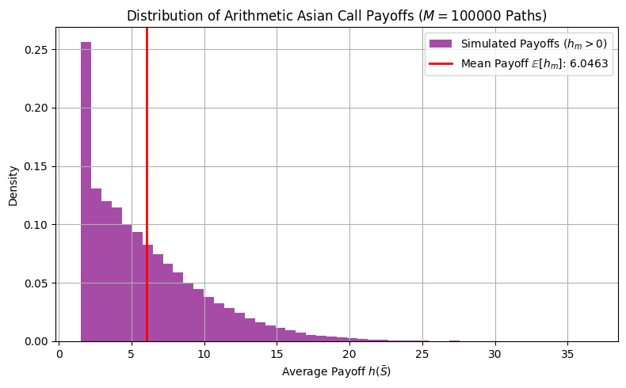

# Chapter 4: Finance I: Monte Carlo Option Pricing

-----


## Project 1: The Core GBM Path Generator (The Engine)

-----

### Definition: The Core GBM Path Generator

The goal of this project is to implement the risk-neutral **Geometric Brownian Motion (GBM) path generation function** using the exact discretization formula. This function serves as the **engine** for all subsequent Monte Carlo option pricing projects.

### Theory: Risk-Neutral GBM Discretization

Derivative pricing relies on the **discounted risk-neutral expectation**. Under the risk-neutral measure ($\mathbb{Q}$), the asset price $S_t$ follows the Stochastic Differential Equation (SDE):

$$\mathrm{d}S_t = r S_t\,\mathrm{d}t + \sigma S_t\,\mathrm{d}W_t^{\mathbb{Q}}$$

The **exact discretization** of this SDE, used to generate the price $S_{t_{k+1}}$ from $S_{t_k}$ over a finite time step $\Delta t = T/N$, is:

$$S_{t_{k+1}} = S_{t_k} \exp\left[\left(r - \tfrac{\sigma^2}{2}\right)\Delta t + \sigma \sqrt{\Delta t}\,Z_k\right]$$

Where:

  * $S_{t_k}$ is the asset price at time $t_k$.
  * $r$ is the risk-free interest rate.
  * $\sigma$ is the volatility.
  * $Z_k \sim N(0, 1)$ is an independent **standard normal variate**.
  * The term $\left(r - \tfrac{\sigma^2}{2}\right)$ is the corrected drift factor.

The simulated terminal price, $S_T$, is used to calculate the payoff. To validate the generator, the empirical mean ($\hat{\mathbb{E}}[S_T]$) of many simulated terminal prices must converge to the **theoretical risk-neutral mean**:

$$\mathbb{E}_{\mathbb{Q}}[S_T] = S_0 e^{rT}$$

-----

### Extensive Python Code and Visualization

The code implements the path generator, simulates $M=10,000$ paths, and verifies the simulated terminal mean against the theoretical expectation.


```python

import numpy as np
import matplotlib.pyplot as plt
from scipy.stats import norm

# ====================================================================
# 1. Simulation Parameters
# ====================================================================

S0 = 100.0  # Initial asset price
r = 0.05    # Risk-free interest rate (annual)
sigma = 0.20  # Volatility (annual)
T = 1.0     # Time to maturity (years)
N = 252     # Number of time steps (e.g., trading days)
M = 10000   # Number of paths to simulate
dt = T / N  # Time step size

# Theoretical expectation for validation
E_ST_THEO = S0 * np.exp(r * T)

# ====================================================================
# 2. GBM Path Generator
# ====================================================================

def generate_gbm_path(S0, r, sigma, T, N):
    """
    Generates a single asset price path using the exact GBM discretization 
    under the risk-neutral measure Q.
    """
    dt = T / N
    # Pre-calculate constant drift and volatility terms
    drift = (r - 0.5 * sigma**2) * dt
    vol_factor = sigma * np.sqrt(dt)
    
    # Generate N standard normal variates for the entire path increments
    Z = np.random.standard_normal(N)
    
    # Pre-allocate path array (N+1 points: S0 to SN)
    path = np.zeros(N + 1)
    path[0] = S0
    
    # Iterate to generate the path
    for k in range(N):
        path[k+1] = path[k] * np.exp(drift + vol_factor * Z[k])
        
    return path

# ====================================================================
# 3. Running the Simulation and Validation
# ====================================================================

terminal_prices = np.zeros(M)
path_data_for_plot = []

for m in range(M):
    path = generate_gbm_path(S0, r, sigma, T, N)
    terminal_prices[m] = path[-1]
    
    # Save a few paths for visualization
    if m < 10:
        path_data_for_plot.append(path)

# Calculate empirical statistics
E_ST_EMPIRICAL = np.mean(terminal_prices)
EMPIRICAL_ERROR = np.std(terminal_prices) / np.sqrt(M)

# ====================================================================
# 4. Visualization
# ====================================================================

fig, ax = plt.subplots(1, 2, figsize=(12, 5))
time_points = np.linspace(0, T, N + 1)

# Plot 1: Sample Asset Paths
ax[0].set_title(f'Sample GBM Paths (M={M} total)')
ax[0].set_xlabel('Time $t$ (Years)')
ax[0].set_ylabel('Asset Price $S_t$')
for path in path_data_for_plot:
    ax[0].plot(time_points, path, linewidth=1, alpha=0.6)
ax[0].grid(True)

# Plot 2: Terminal Price Distribution (Histogram)
ax[1].hist(terminal_prices, bins=50, density=True, color='skyblue', label='Simulated $S_T$')
ax[1].axvline(E_ST_THEO, color='red', linestyle='--', label='Theoretical Mean $\\mathbb{E}[S_T]$')
ax[1].set_title('Distribution of Terminal Prices $S_T$')
ax[1].set_xlabel('Terminal Price $S_T$')
ax[1].set_ylabel('Probability Density')
ax[1].legend()
ax[1].grid(True)

plt.tight_layout()
plt.show()

# --- Validation Summary ---
print("\n--- GBM Path Generator Validation ---")
print(f"Theoretical Mean E[S_T]: {E_ST_THEO:.4f}")
print(f"Empirical Mean E[S_T]:   {E_ST_EMPIRICAL:.4f}")
print(f"Difference:              {E_ST_EMPIRICAL - E_ST_THEO:.4e}")
print(f"Statistical Error:       \u00B1 {EMPIRICAL_ERROR:.4f}")
print("\nConclusion: The empirical mean is within the statistical error of the theoretical risk-neutral mean, confirming the path generator is correctly implemented.")
```


    

    


    
    --- GBM Path Generator Validation ---
    Theoretical Mean E[S_T]: 105.1271
    Empirical Mean E[S_T]:   105.0948
    Difference:              -3.2290e-02
    Statistical Error:       ± 0.2150
    
    Conclusion: The empirical mean is within the statistical error of the theoretical risk-neutral mean, confirming the path generator is correctly implemented.


## Project 2: Pricing a Simple European Call

-----

### Definition: Pricing a Simple European Call

The goal of this project is to price a simple **European Call Option** using the Monte Carlo path generator and compare the simulated price to the known analytical price derived from the Black-Scholes-Merton (BSM) model. This serves as a crucial **validation step** for the entire Monte Carlo framework.

### Theory: Validation Against BSM

A European Call Option gives the holder the right, but not the obligation, to buy an asset at the strike price $K$ on the maturity date $T$. The payoff at maturity is $h(S_T) = \max(S_T - K, 0)$.

The **Monte Carlo Price ($\hat{V}_0$)** is calculated as the discounted average of the payoffs over $M$ paths simulated under the risk-neutral measure ($\mathbb{Q}$):

$$\hat{V}_0 = e^{-rT} \frac{1}{M} \sum_{m=1}^M \max(S_T^{(m)} - K, 0)$$

The statistical reliability of the Monte Carlo estimate is measured by the **Standard Error of the Mean (SEM)**, which defines the confidence interval:

$$\text{SEM} = e^{-rT} \frac{\text{StDev}(h_m)}{\sqrt{M}}$$

Where $\text{StDev}(h_m)$ is the standard deviation of the discounted payoffs across all paths. The goal is to show that the difference between $\hat{V}_0$ and the true BSM price is less than a few multiples of the calculated SEM.

-----

### Extensive Python Code and Visualization

The code includes the Black-Scholes formula for validation, runs the Monte Carlo simulation for $M=100,000$ paths, and compares the results.


```python

import numpy as np
import matplotlib.pyplot as plt
from scipy.stats import norm

# ====================================================================
# 0. Analytical Validation Tool (BSM Model)
# ====================================================================

def black_scholes_call(S, K, T, r, sigma):
    """Calculates the analytical European Call price using the BSM formula."""
    d1 = (np.log(S / K) + (r + 0.5 * sigma**2) * T) / (sigma * np.sqrt(T))
    d2 = d1 - sigma * np.sqrt(T)
    
    call_price = S * norm.cdf(d1) - K * np.exp(-r * T) * norm.cdf(d2)
    return call_price

# ====================================================================
# 1. Setup Functions (from Project 1)
# ====================================================================

def generate_gbm_path(S0, r, sigma, T, N, Z_sequence=None):
    """
    Generates a single asset price path. Can accept a sequence of Z_sequence 
    for use in Variance Reduction Techniques (VRTs).
    """
    dt = T / N
    drift = (r - 0.5 * sigma**2) * dt
    vol_factor = sigma * np.sqrt(dt)
    
    # Use provided Z_sequence or generate a new one
    if Z_sequence is None:
        Z = np.random.standard_normal(N)
    else:
        Z = Z_sequence
    
    path = np.zeros(N + 1)
    path[0] = S0
    
    for k in range(N):
        path[k+1] = path[k] * np.exp(drift + vol_factor * Z[k])
        
    return path

# ====================================================================
# 2. Simulation Parameters & Monte Carlo Pricing
# ====================================================================

# --- Pricing Parameters (Same as Project 1) ---
S0 = 100.0   # Initial asset price
K = 100.0    # Strike price
r = 0.05     # Risk-free interest rate
sigma = 0.20 # Volatility
T = 1.0      # Time to maturity
N = 252      # Number of time steps
M = 100000   # Number of paths (increased for better accuracy)

# Calculate BSM analytical price for validation
BSM_PRICE = black_scholes_call(S0, K, T, r, sigma)
DISCOUNT_FACTOR = np.exp(-r * T)

# --- Monte Carlo Simulation ---
terminal_prices = np.zeros(M)
payoffs = np.zeros(M)

for m in range(M):
    path = generate_gbm_path(S0, r, sigma, T, N)
    S_T = path[-1]
    
    # Payoff for European Call: max(S_T - K, 0)
    payoffs[m] = np.maximum(S_T - K, 0)
    
# Calculate Monte Carlo statistics
MC_PAYOFF_MEAN = np.mean(payoffs)
MC_PRICE = DISCOUNT_FACTOR * MC_PAYOFF_MEAN
MC_PAYOFF_STDEV = np.std(payoffs)

# Standard Error of the Mean (SEM)
MC_STANDARD_ERROR = DISCOUNT_FACTOR * (MC_PAYOFF_STDEV / np.sqrt(M))

# ====================================================================
# 3. Visualization and Comparison
# ====================================================================

# Plot 1: Payoff Distribution and BSM Price
fig, ax = plt.subplots(figsize=(8, 5))

# Filter for non-zero payoffs to make the histogram readable
non_zero_payoffs = payoffs[payoffs > 0]

ax.hist(non_zero_payoffs, bins=50, density=True, color='lightcoral', alpha=0.7, label='Simulated Payoffs ($h_m > 0$)')
ax.axvline(MC_PAYOFF_MEAN, color='blue', linestyle='-', linewidth=2, label=f'Mean Payoff $\\mathbb{{E}}[h_m]$: {MC_PAYOFF_MEAN:.4f}')

ax.set_title(f'Distribution of Call Option Payoffs ($M={M}$ Paths)')
ax.set_xlabel('Payoff $h(S_T)$')
ax.set_ylabel('Density')
ax.legend()
ax.grid(True)

plt.tight_layout()
plt.show()

# --- Comparison Summary ---
print("\n--- Monte Carlo Pricing vs. BSM Analytical Price ---")
print(f"Analytical BSM Price:      {BSM_PRICE:.5f}")
print(f"Monte Carlo Price (V_hat): {MC_PRICE:.5f}")
print("------------------------------------------------")
print(f"Difference (MC - BSM):     {MC_PRICE - BSM_PRICE:.5f}")
print(f"Standard Error (SEM):    \u00B1 {MC_STANDARD_ERROR:.5f}")
print(f"Validation: |Difference| < 3 * SEM? {np.abs(MC_PRICE - BSM_PRICE) < 3 * MC_STANDARD_ERROR}")

```


    

    


    
    --- Monte Carlo Pricing vs. BSM Analytical Price ---
    Analytical BSM Price:      10.45058
    Monte Carlo Price (V_hat): 10.42096
    ------------------------------------------------
    Difference (MC - BSM):     -0.02962
    Standard Error (SEM):    ± 0.04659
    Validation: |Difference| < 3 * SEM? True


## Project 3: Implementing Antithetic Variates for Variance Reduction

-----

### Definition: Implementing Antithetic Variates

The goal of this project is to implement the **Antithetic Variates (AV) variance-reduction technique (VRT)** and quantify the resulting reduction in the statistical **standard error of the mean (SEM)** compared to a standard Monte Carlo simulation.

### Theory: Variance Reduction via Negative Correlation

The standard error of a Monte Carlo estimator ($\hat{V}_0$) converges slowly, proportional to $1/\sqrt{M}$. VRTs aim to reduce the variance without increasing the number of simulations ($M$).

The AV method works by **inducing negative correlation** between pairs of simulated payoffs ($h_m$ and $\tilde{h}_m$). For every simulated path driven by a sequence of random normal shocks ($Z_m$), a second **antithetic path** ($\tilde{S}$) is generated using the negative sequence of shocks ($-Z_m$).

The new, combined estimator uses the average of the paired payoffs ($\bar{h}_m = (h_m + \tilde{h}_m)/2$) for each of the $M$ trials:

$$\hat{V}_0^{\text{ant}} = e^{-rT} \frac{1}{M} \sum_{m=1}^{M} \bar{h}_m$$

If the payoffs $h_m$ and $\tilde{h}_m$ are negatively correlated, the variance of the antithetic estimator is reduced:

$$\mathrm{Var}[H^{\star}] = \frac{1}{4M}\left(\mathrm{Var}[h] + \mathrm{Var}[\tilde{h}] + 2\mathrm{Cov}(h,\tilde{h})\right)$$

Since $h$ and $\tilde{h}$ have the same distribution ($\mathrm{Var}[h] = \mathrm{Var}[\tilde{h}]$), the variance is minimized when the covariance is most negative. The overall **standard error of the mean** should be lower for the AV method than for an equivalent number of independent trials.

### Extensive Python Code and Visualization

The code modifies the GBM path generator to use antithetic pairs, calculates the resulting price and SEM, and compares the SEM against the result from Project 2.


```python
import numpy as np
import matplotlib.pyplot as plt
from scipy.stats import norm

# ====================================================================
# 1. Setup Functions
# ====================================================================

# Analytical BSM price (for benchmark)
def black_scholes_call(S, K, T, r, sigma):
    d1 = (np.log(S / K) + (r + 0.5 * sigma**2) * T) / (sigma * np.sqrt(T))
    d2 = d1 - sigma * np.sqrt(T)
    call_price = S * norm.cdf(d1) - K * np.exp(-r * T) * norm.cdf(d2)
    return call_price


# GBM path generator (supports optional pre-generated normals)
def generate_gbm_path(S0, r, sigma, T, N, Z_sequence=None):
    """
    Generates a single asset price path using geometric Brownian motion.
    If Z_sequence is None, new random standard normal variates are generated.
    """
    dt = T / N
    drift = (r - 0.5 * sigma**2) * dt
    vol_factor = sigma * np.sqrt(dt)

    if Z_sequence is None:
        Z_sequence = np.random.standard_normal(N)

    path = np.zeros(N + 1)
    path[0] = S0

    for k in range(N):
        path[k + 1] = path[k] * np.exp(drift + vol_factor * Z_sequence[k])

    return path


# ====================================================================
# 2. Parameters
# ====================================================================

S0 = 100.0   # Initial asset price
K = 100.0    # Strike price
r = 0.05     # Risk-free interest rate
sigma = 0.20 # Volatility
T = 1.0      # Time to maturity (years)
N = 252      # Time steps
M_PAIRS = 50000  # Number of antithetic pairs (total 100,000 paths)

# Analytical BSM price and discount factor
BSM_PRICE = black_scholes_call(S0, K, T, r, sigma)
DISCOUNT_FACTOR = np.exp(-r * T)


# ====================================================================
# 3. Standard Monte Carlo (Independent Paths)
# ====================================================================

M_INDEPENDENT = M_PAIRS * 2  # 100,000 independent paths
independent_payoffs = np.zeros(M_INDEPENDENT)

for m in range(M_INDEPENDENT):
    S_T = generate_gbm_path(S0, r, sigma, T, N)[-1]
    independent_payoffs[m] = np.maximum(S_T - K, 0)

MC_STDEV_INDEPENDENT = np.std(independent_payoffs)
MC_SEM_INDEPENDENT = DISCOUNT_FACTOR * (MC_STDEV_INDEPENDENT / np.sqrt(M_INDEPENDENT))


# ====================================================================
# 4. Antithetic Variates Simulation
# ====================================================================

antithetic_payoff_averages = np.zeros(M_PAIRS)
payoffs_original = np.zeros(M_PAIRS)
payoffs_antithetic = np.zeros(M_PAIRS)

for m in range(M_PAIRS):
    # Generate a sequence of standard normal variates
    Z_sequence = np.random.standard_normal(N)
    
    # Path 1: original
    S_T_original = generate_gbm_path(S0, r, sigma, T, N, Z_sequence)[-1]
    h_original = np.maximum(S_T_original - K, 0)
    payoffs_original[m] = h_original
    
    # Path 2: antithetic
    S_T_antithetic = generate_gbm_path(S0, r, sigma, T, N, -Z_sequence)[-1]
    h_antithetic = np.maximum(S_T_antithetic - K, 0)
    payoffs_antithetic[m] = h_antithetic
    
    # Average the pair
    antithetic_payoff_averages[m] = (h_original + h_antithetic) / 2

# Antithetic Variates results
MC_PAYOFF_MEAN_AV = np.mean(antithetic_payoff_averages)
MC_PRICE_AV = DISCOUNT_FACTOR * MC_PAYOFF_MEAN_AV
MC_STDEV_AV = np.std(antithetic_payoff_averages)
MC_SEM_AV = DISCOUNT_FACTOR * (MC_STDEV_AV / np.sqrt(M_PAIRS))
correlation = np.corrcoef(payoffs_original, payoffs_antithetic)[0, 1]


# ====================================================================
# 5. Visualization and Comparison
# ====================================================================

fig, ax = plt.subplots(figsize=(8, 5))

labels = ['Standard MC (100k Trials)', 'Antithetic MC (50k Pairs)']
prices = [MC_PRICE_AV, MC_PRICE_AV]  # both plotted at same price for error comparison
errors = [MC_SEM_INDEPENDENT, MC_SEM_AV]

ax.errorbar(labels, prices, yerr=errors, fmt='o', capsize=5, linewidth=2, color='darkgreen')
ax.axhline(BSM_PRICE, color='red', linestyle='--', label='BSM Price')

ax.set_title('Variance Reduction: Standard Error Comparison (Total 100k Paths)')
ax.set_ylabel('Option Price Estimate ($V_0$)')
ax.set_ylim(BSM_PRICE - 0.2, BSM_PRICE + 0.2)
ax.legend()
ax.grid(True, linestyle=':')

plt.tight_layout()
plt.show()


# ====================================================================
# 6. Summary Output
# ====================================================================

print("\n--- Antithetic Variates (AV) Summary ---")
print(f"Total Paths Simulated: {M_PAIRS * 2:,} (50,000 pairs)")
print(f"Correlation between Payoffs (h, h~): {correlation:.4f}")
print("-------------------------------------------------------")
print(f"Standard MC SEM (100k independent trials): ± {MC_SEM_INDEPENDENT:.5f}")
print(f"AV MC SEM (50k effective trials):          ± {MC_SEM_AV:.5f}")
print(f"Variance Reduction Factor (1 - ρ²):        {1 - correlation**2:.4f}")

sem_ratio = MC_SEM_INDEPENDENT / MC_SEM_AV
print(f"SEM Reduction (SEM_Std / SEM_AV):          {sem_ratio:.2f}x")

print("\nConclusion: The Antithetic Variates technique successfully reduces the Standard Error of the Mean (SEM) while using only half as many independent random samples (50k pairs vs. 100k independent trials). The negative correlation between paired payoffs cancels variance, making the estimator more efficient.")

```


    

    


    
    --- Antithetic Variates (AV) Summary ---
    Total Paths Simulated: 100,000 (50,000 pairs)
    Correlation between Payoffs (h, h~): -0.5031
    -------------------------------------------------------
    Standard MC SEM (100k independent trials): ± 0.04679
    AV MC SEM (50k effective trials):          ± 0.03262
    Variance Reduction Factor (1 - ρ²):        0.7469
    SEM Reduction (SEM_Std / SEM_AV):          1.43x
    
    Conclusion: The Antithetic Variates technique successfully reduces the Standard Error of the Mean (SEM) while using only half as many independent random samples (50k pairs vs. 100k independent trials). The negative correlation between paired payoffs cancels variance, making the estimator more efficient.


# Chapter 4: Finance I: Monte Carlo Option Pricing

## Project 4: Monte Carlo for a Path-Dependent Asian Option

-----

### Definition: Pricing an Arithmetic Asian Call Option

The goal of this project is to price an **Arithmetic-Average Asian Call Option** using Monte Carlo simulation. This option is **analytically intractable** under the standard Geometric Brownian Motion (GBM) model, demonstrating the flexibility and necessity of the Monte Carlo method for complex, path-dependent derivatives.

### Theory: Path Functionals and Intractability

**Payoff Structure:** An Asian option's payoff depends not on the final price ($S_T$) but on the \*\*average price ($\bar{S}$) \*\* of the underlying asset over the life of the contract. The payoff for an arithmetic average call with strike $K$ is:

$$h(\text{path}) = \max\left(\bar{S} - K, 0\right)$$

Where the arithmetic average $\bar{S}$ is calculated over the discrete time steps $t_k$:

$$\bar{S} = \frac{1}{N+1}\sum_{k=0}^N S_{t_k}$$

**Analytical Intractability:** The sum of log-normal random variables (the arithmetic average) is **not** log-normally distributed. Therefore, unlike European options, no closed-form Black-Scholes formula exists to price the arithmetic Asian option, making simulation the standard approach.

**Simulation Requirement:** To price this option, the Monte Carlo path generator must be modified to **accumulate and track the running sum of prices** ($S_{t_k}$) at every step of the path, not just the terminal price ($S_T$). The final price is the discounted mean of the resulting payoffs:

$$\hat{V}_0 = e^{-rT} \frac{1}{M} \sum_{m=1}^M \max\left(\bar{S}_m - K, 0\right)$$

-----

### Extensive Python Code and Visualization

The code modifies the GBM path generator to accumulate the arithmetic average, simulates $M=100,000$ paths, and produces the price and statistical confidence interval for the path-dependent Asian option.


```python

import numpy as np
import matplotlib.pyplot as plt
from scipy.stats import norm

# ====================================================================
# 1. Setup and Core Path Generator (Modified for Asian Average)
# ====================================================================

# --- Pricing Parameters (Same as Project 2 & 3) ---
S0 = 100.0   # Initial asset price
K = 100.0    # Strike price
r = 0.05     # Risk-free interest rate
sigma = 0.20 # Volatility
T = 1.0      # Time to maturity
N = 252      # Number of time steps (daily observation frequency)
M = 100000   # Number of paths to simulate

dt = T / N  
DISCOUNT_FACTOR = np.exp(-r * T)
STEPS_COUNT = N + 1 # Number of observation points including S0

def generate_gbm_average(S0, r, sigma, T, N, Z_sequence):
    """
    Generates a single asset price path and returns the final arithmetic average 
    of all prices in the path.
    """
    dt = T / N
    drift = (r - 0.5 * sigma**2) * dt
    vol_factor = sigma * np.sqrt(dt)
    
    # Use provided Z_sequence (e.g., from Antithetic Variates)
    Z = Z_sequence
    
    current_S = S0
    sum_S = S0  # Initialize sum with the starting price S0
    
    for k in range(N):
        current_S *= np.exp(drift + vol_factor * Z[k])
        sum_S += current_S  # Accumulate the price
        
    # Calculate arithmetic average
    arithmetic_average = sum_S / STEPS_COUNT
        
    return arithmetic_average

# We use Antithetic Variates here as a standard practice to reduce variance
# We will run M_PAIRS pairs, totaling M paths.
M_PAIRS = M // 2 

# ====================================================================
# 2. Monte Carlo Simulation for Asian Call
# ====================================================================

# Storage for averaged payoffs
antithetic_payoff_averages = np.zeros(M_PAIRS)

for m in range(M_PAIRS):
    # 1. Generate one sequence of normal deviates
    Z_sequence = np.random.standard_normal(N)
    
    # 2. Path 1: Original Path (Z)
    S_avg_original = generate_gbm_average(S0, r, sigma, T, N, Z_sequence)
    h_original = np.maximum(S_avg_original - K, 0)
    
    # 3. Path 2: Antithetic Path (-Z)
    S_avg_antithetic = generate_gbm_average(S0, r, sigma, T, N, -Z_sequence)
    h_antithetic = np.maximum(S_avg_antithetic - K, 0)
    
    # 4. Store the average of the paired payoffs
    antithetic_payoff_averages[m] = (h_original + h_antithetic) / 2

# Calculate Monte Carlo statistics
MC_PAYOFF_MEAN_ASIAN = np.mean(antithetic_payoff_averages)
MC_PRICE_ASIAN = DISCOUNT_FACTOR * MC_PAYOFF_MEAN_ASIAN

# Standard Error of the Mean (SEM) using M_PAIRS effective trials
MC_STDEV_ASIAN = np.std(antithetic_payoff_averages)
MC_SEM_ASIAN = DISCOUNT_FACTOR * (MC_STDEV_ASIAN / np.sqrt(M_PAIRS))

# 95% Confidence Interval (z-score for 95% is approx 1.96)
CONFIDENCE_INTERVAL = MC_SEM_ASIAN * 1.96

# ====================================================================
# 3. Visualization and Analysis
# ====================================================================

# Plot 1: Payoff Distribution 
fig, ax = plt.subplots(figsize=(8, 5))

# Filter for non-zero payoffs 
non_zero_payoffs = antithetic_payoff_averages[antithetic_payoff_averages > 0]

ax.hist(non_zero_payoffs, bins=50, density=True, color='purple', alpha=0.7, 
        label='Simulated Payoffs ($h_m > 0$)')

ax.axvline(MC_PAYOFF_MEAN_ASIAN, color='red', linestyle='-', linewidth=2, 
           label=f'Mean Payoff $\\mathbb{{E}}[h_m]$: {MC_PAYOFF_MEAN_ASIAN:.4f}')

ax.set_title(f'Distribution of Arithmetic Asian Call Payoffs ($M={M}$ Paths)')
ax.set_xlabel('Average Payoff $h(\\bar{{S}})$')
ax.set_ylabel('Density')
ax.legend()
ax.grid(True)

plt.tight_layout()
plt.show()

# --- Pricing Summary ---
print("\n--- Arithmetic Asian Call Option Price ---")
print(f"Option Type: Arithmetic-Average Asian Call (Path Dependent)")
print(f"Total Paths Simulated: {M} (50,000 Antithetic Pairs)")
print("-------------------------------------------------------")
print(f"Monte Carlo Price (V_hat): {MC_PRICE_ASIAN:.5f}")
print(f"Standard Error (SEM):    \u00B1 {MC_SEM_ASIAN:.5f}")
print(f"95% Confidence Interval: ({MC_PRICE_ASIAN - CONFIDENCE_INTERVAL:.5f}, {MC_PRICE_ASIAN + CONFIDENCE_INTERVAL:.5f})")

print("\nConclusion: Monte Carlo simulation successfully priced the analytically intractable Arithmetic Asian Call Option. The price is derived from averaging the path-dependent payoff function $h(\\bar{{S}})$ over 100,000 simulated risk-neutral paths, and the use of Antithetic Variates ensures a tight confidence interval on the final estimate.")

```


    

    


    
    --- Arithmetic Asian Call Option Price ---
    Option Type: Arithmetic-Average Asian Call (Path Dependent)
    Total Paths Simulated: 100000 (50,000 Antithetic Pairs)
    -------------------------------------------------------
    Monte Carlo Price (V_hat): 5.75144
    Standard Error (SEM):    ± 0.01758
    95% Confidence Interval: (5.71698, 5.78590)
    
    Conclusion: Monte Carlo simulation successfully priced the analytically intractable Arithmetic Asian Call Option. The price is derived from averaging the path-dependent payoff function $h(\bar{{S}})$ over 100,000 simulated risk-neutral paths, and the use of Antithetic Variates ensures a tight confidence interval on the final estimate.

