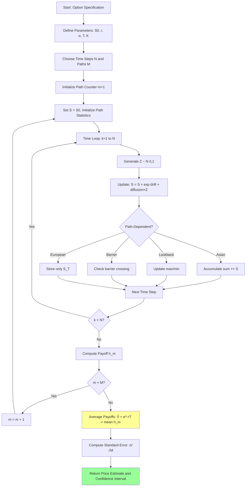

# **Chapter 4: Financial Derivatives and Monte Carlo Simulation**

---


## **Introduction**

Financial derivatives—instruments whose value depends on the evolution of underlying assets—present a computational challenge remarkably similar to the problems we've encountered in statistical physics. While simple European options admit elegant closed-form solutions like the Black–Scholes–Merton formula, **exotic derivatives** with path-dependent payoffs, multiple correlated assets, or complex barrier conditions defy analytical treatment. An Asian option whose payoff depends on the average price over time, a barrier option that activates only if a threshold is crossed, or a basket option tied to multiple stocks—each requires computing expected values over an exponentially large space of possible price trajectories.

This chapter demonstrates how **Monte Carlo simulation** provides a universal framework for derivative pricing under the risk-neutral measure. The fundamental insight of arbitrage-free valuation is that any derivative's fair price equals the **discounted expected payoff under a risk-neutral probability measure** $\mathbb{Q}$, where asset prices grow on average at the risk-free rate. By simulating thousands of independent price paths according to **geometric Brownian motion (GBM)** under $\mathbb{Q}$, evaluating the payoff along each path, and averaging the results, we obtain an unbiased estimate of the option's value—regardless of how complex the payoff structure.

The methods we develop here directly parallel those from statistical mechanics: just as we sampled spin configurations to estimate magnetization, we now sample price trajectories to estimate option values. By the end of this chapter, you will understand how to discretize stochastic differential equations to generate GBM paths, how to implement path-dependent payoff calculations for Asian, lookback, and barrier options, and how to apply **variance-reduction techniques** like antithetic variates and control variates to dramatically improve computational efficiency. These foundations extend beyond finance to any domain requiring Monte Carlo integration of stochastic processes.

---

## **Chapter Outline**

| **Sec.** | **Title**                                                      | **Core Ideas & Examples**                                                                                                                                                                                                              |
| -------- | -------------------------------------------------------------- | -------------------------------------------------------------------------------------------------------------------------------------------------------------------------------------------------------------------------------------- |
| **4.1**  | **Chapter Opener: Probability, Options and Risk-Neutral Pricing** | From discrete spins to financial derivatives; geometric Brownian motion $\mathrm{d}S_t = rS_t\mathrm{d}t + \sigma S_t\mathrm{d}W_t^{\mathbb{Q}}$; risk-neutral measure $\mathbb{Q}$; option price $V_0 = e^{-rT}\mathbb{E}_{\mathbb{Q}}[h(S_T)]$; advantages and limitations of Monte Carlo. |
| **4.2**  | **Simulating Asset Paths Under Geometric Brownian Motion**    | Exact discretization $S_{t+\Delta t} = S_t \exp[(r - \frac{\sigma^2}{2})\Delta t + \sigma\sqrt{\Delta t} Z]$; generating standard normal variates; time-stepping algorithms; multi-asset correlations via Cholesky decomposition.       |
| **4.3**  | **Path-Dependent Options: Asian, Lookback and Barrier**       | Asian options: arithmetic vs. geometric averaging; lookback options: $\max(S_{\max} - K, 0)$; barrier options: knock-in/knock-out monitoring; discretization bias and continuous barrier approximations.                                |
| **4.4**  | **Variance-Reduction Techniques: Antithetic Variates and Control Variates** | Antithetic paths: use $-Z$ to reduce variance via negative correlation; control variates: use Black-Scholes European price as control; variance reduction factors of 2-10×; stratified sampling and importance sampling.                |
| **4.5**  | **Chapter Summary & Bridge to Chapter 5**                     | Recap of Monte Carlo option pricing; statistical error $\propto 1/\sqrt{M}$; variance reduction as efficiency multiplier; preview of molecular dynamics for continuous systems; from financial trajectories to phase space evolution. |

---

## **4.1 Chapter Opener: Probability, Options and Risk‑Neutral Pricing**

-----

### **From discrete spins to financial derivatives**

The previous chapters focused on statistical mechanics and quantum field theory, where the goal was to sample a probability distribution over a huge state space and compute expectations of observables. In finance we face a similar challenge: valuing a derivative requires computing the expected payoff of a contingent claim under a suitable probability measure. For simple derivatives like European calls and puts with a single underlying asset, the Black–Scholes–Merton (BSM) formula provides a closed‑form price. But **exotic options**—whose payoffs depend on the entire path of the asset price or on multiple correlated assets—rarely admit analytic solutions. Examples include:

- **Asian options**, whose payoff depends on the average price over the contract’s life (arithmetic or geometric).
- **Barrier options**, which knock in or knock out if the asset price crosses a barrier.
- **Lookback options**, whose payoff depends on the maximum or minimum asset price achieved.
- **Basket options**, which depend on a weighted sum of several underlying assets.

For these instruments, numerical methods are essential. Among them, **Monte‑Carlo simulation** is the most flexible: by simulating many possible price trajectories, we can directly compute the discounted expected payoff even when the payoff function is complicated or path‑dependent. This parallels the use of MCMC in physics, where sampling enables us to estimate observables without summing over an exponential number of microstates.

-----

### **Modeling the underlying asset: geometric Brownian motion**

To simulate price trajectories we need a model for the stochastic dynamics of the underlying asset. The canonical choice in quantitative finance is **geometric Brownian motion (GBM)**, which assumes that price changes are proportional to the current price and include a deterministic drift and a stochastic component. Under a general probability measure $\mathbb{P}$ the dynamics are given by the stochastic differential equation (SDE):

$$
\mathrm{d}S_t = \mu S_t\,\mathrm{d}t + \sigma S_t\,\mathrm{d}W_t,
$$

where $S_t$ is the asset price at time $t$, $\mu$ is its drift (the expected return), $\sigma$ is its volatility and $W_t$ is a standard Brownian motion. This SDE has the closed‑form solution

$$
S_t = S_0 \exp\left[\left(\mu - \tfrac{\sigma^2}{2}\right)t + \sigma W_t\right],
$$

so that $\log S_t$ is normally distributed and $S_t$ is log‑normal. GBM is mathematically convenient: it guarantees positive prices and leads to tractable pricing formulas in the BSM framework. More sophisticated models incorporate stochastic volatility, jumps or mean reversion, but GBM remains the workhorse for illustrating Monte‑Carlo pricing.

-----

### **From the physical measure to the risk‑neutral measure**

In the physical (real‑world) measure $\mathbb{P}$, the drift $\mu$ equals the asset’s expected return, which includes a risk premium. However, derivative pricing is governed by **arbitrage‑free valuation**: in a frictionless market with no arbitrage opportunities, any derivative can be replicated (at least approximately) by dynamic trading in the underlying asset and a riskless bond. This implies that there exists an equivalent probability measure $\mathbb{Q}$ such that **discounted asset prices are martingales**. Under this **risk‑neutral measure**, the drift of the asset equals the risk‑free interest rate $r$. The GBM SDE becomes

$$
\mathrm{d}S_t = r S_t\,\mathrm{d}t + \sigma S_t\,\mathrm{d}W_t^{\mathbb{Q}},
$$

where $W_t^{\mathbb{Q}}$ is a Brownian motion under $\mathbb{Q}$. The risk‑neutral drift $r$ ensures that the expected growth of the asset is exactly the risk‑free return, reflecting the fact that any excess return above $r$ would be offset by a hedging strategy.

The **fundamental theorem of asset pricing** then states that the fair price $V_0$ of a derivative with payoff $h(S_T)$ at maturity $T$ is given by the **discounted risk‑neutral expectation**:

$$
V_0 = e^{-rT} \mathbb{E}_{\mathbb{Q}} \left[h(S_T)\right].
$$

More generally, if the payoff depends on the entire path $\{S_t\}_{0\le t\le T}$, we compute the expected value of $h(\{S_t\})$ under $\mathbb{Q}$ and discount it by $e^{-rT}$.

!!! tip "Why the Risk-Free Rate as Drift?"
    Under the risk-neutral measure, the expected return of any tradable asset must equal the risk-free rate $r$ to prevent arbitrage. If $S_t$ had expected return $\mu > r$, one could borrow at rate $r$, invest in $S_t$, and lock in riskless profit. The change from physical measure $\mathbb{P}$ (drift $\mu$) to risk-neutral measure $\mathbb{Q}$ (drift $r$) is achieved via Girsanov's theorem, which adjusts the Brownian motion by the market price of risk.

-----

### **Monte‑Carlo pricing under the risk‑neutral measure**

Monte‑Carlo simulation estimates the risk‑neutral expectation by generating many independent realizations of the underlying asset path and averaging their payoffs. The basic steps are:

1. **Discretize time:** Partition the interval $[0,T]$ into $N$ steps of length $\Delta t$.
2. **Generate random paths:** Starting from $S_0$, use the exact GBM discretization

   $$
   S_{t_{k+1}} = S_{t_k} \exp\left[\left(r - \tfrac{\sigma^2}{2}\right)\Delta t + \sigma \sqrt{\Delta t}\,Z_k\right],
   $$

   where $Z_k$ are independent standard normal variates. Repeat this to obtain $M$ independent paths $\{S_{t_0}^{(m)}, S_{t_1}^{(m)}, \dots, S_{t_N}^{(m)}\}$.
3. **Compute payoffs:** For each path $m$, evaluate the payoff $h_m$ of the derivative. For a European call, $h_m = \max(S_{t_N}^{(m)} - K, 0)$; for a path‑dependent option, $h_m$ might involve an average, a maximum/minimum or barrier monitoring.
4. **Average and discount:** Estimate the option price by

   $$
   \hat{V}_0 = e^{-rT} \frac{1}{M} \sum_{m=1}^M h_m.
   $$

As in physical Monte‑Carlo simulations, the estimator's standard error decreases as $1/\sqrt{M}$. Doubling precision requires quadrupling the number of paths. The flexibility of this method is immense: you can incorporate multiple assets, correlated Brownian motions, stochastic volatilities or jumps. The only requirement is that you can simulate the underlying process under the risk‑neutral measure.

!!! example "Pricing a European Call with Monte Carlo"
    Consider $S_0 = 100$, $K = 105$, $r = 0.05$, $\sigma = 0.20$, $T = 1$ year. With $M = 10{,}000$ paths:
    
    1. For each path $m$: generate $Z \sim N(0,1)$, compute $S_T^{(m)} = 100 \exp[(0.05 - 0.5 \times 0.2^2) + 0.2 Z]$
    2. Payoff: $h_m = \max(S_T^{(m)} - 105, 0)$
    3. Estimate: $\hat{V}_0 = e^{-0.05} \times \frac{1}{10000}\sum h_m \approx 8.02$
    
    The Black-Scholes formula gives $V_0 = 8.02$. Standard error $\approx 0.15$, so the estimate is accurate within $\pm 0.30$ at 95% confidence.

-----

### **Why Monte‑Carlo? Advantages and limitations**

**Advantages:**

- **Generality:** Monte‑Carlo can price almost any derivative, including highly path‑dependent and multi‑asset options. It is particularly valuable when no analytic or lattice‑based method exists.
- **Easy to implement:** The basic algorithm—simulate paths, compute payoffs, average—is conceptually straightforward and highly parallelizable.
- **Extensible:** By changing the SDE or adding dimensions, one can model stochastic volatility, interest rates, or jump processes without significant structural changes.

**Limitations:**

- **Slow convergence:** The $1/\sqrt{M}$ convergence rate implies that Monte‑Carlo is computationally intensive. For precise pricing of options with small Vega or deep out‑of‑the‑money barrier options, millions of paths may be required.
- **Variance:** Estimators can exhibit high variance, particularly for options where the payoff is sensitive to rare events (e.g., digital options, deep barriers). Variance‑reduction techniques like antithetic variates and control variates (discussed in §4.4) are essential to improve efficiency.
- **Model risk:** The accuracy of the price depends on the correctness of the assumed stochastic model (GBM). Real markets exhibit jumps, volatility clustering and fat tails; such effects can significantly alter option prices if ignored. More advanced models (Heston, Merton jump–diffusion, variance gamma) address these issues at additional computational cost.

??? question "When Should You Use Monte Carlo Instead of Black-Scholes?"
    Use Monte Carlo when:
    - The option is path-dependent (Asian, barrier, lookback) with no closed-form solution
    - Multiple correlated assets are involved (basket options)
    - Complex early exercise features exist (American with path dependence)
    - You need to model stochastic volatility or jumps
    
    Stick with analytical formulas when they exist (European vanilla) for speed and precision. For American options on single assets, binomial trees or finite difference methods are often more efficient than Monte Carlo.

-----

### **Connecting back to physics and beyond**

There is a deep conceptual link between the Monte‑Carlo methods used to sample the Boltzmann distribution in statistical mechanics and those used to compute risk‑neutral expectations in finance:

- In physics, the **state space** is the set of microstates of a system (e.g., spin configurations, gauge fields); in finance it is the set of possible price paths.
- The **probability measure** is given by the Boltzmann factor $\exp(-\beta E)$ in physics and by the risk‑neutral measure $\exp(-rT)$ weighted over stochastic paths in finance.
- The **observable** is a physical quantity like magnetization or energy in physics, and a payoff function like $\max(S_T - K, 0)$ in finance.
- The **estimator** is the sample mean of the observable over simulated states or paths; its variance determines the required number of samples.

In both domains, Monte‑Carlo is a universal tool for high‑dimensional integration. The subsequent sections of Chapter 4 (and later chapters in other domains) will build on this foundation: simulating GBM paths (§4.2), implementing path‑dependent payoffs (§4.3), reducing variance (§4.4) and drawing broader lessons (§4.5).

---

## **4.2 Simulating Asset Paths Under Geometric Brownian Motion**

-----

### **Recap: the risk‑neutral GBM model**

Under the risk‑neutral measure $\mathbb{Q}$, a single asset price $S_t$ evolves according to the stochastic differential equation (SDE)

$$
\mathrm{d}S_t = r S_t\,\mathrm{d}t + \sigma S_t\,\mathrm{d}W_t^{\mathbb{Q}},
$$

where $r$ is the risk‑free rate, $\sigma$ the volatility and $W_t^{\mathbb{Q}}$ a standard Brownian motion. The exact solution is

$$
S_t = S_0 \exp\left[\left(r - \tfrac{\sigma^2}{2}\right)t + \sigma W_t^{\mathbb{Q}}\right],
$$

so that $\log S_t$ is normally distributed with mean $\log S_0 + \left(r - \tfrac{\sigma^2}{2}\right)t$ and variance $\sigma^2 t$. Simulating GBM paths requires discretizing this continuous‑time process into finite time steps.

-----

### **Exact discretization versus Euler–Maruyama**

Because the GBM SDE is linear in $S_t$, we can discretize it exactly. Partition the interval $[0,T]$ into $N$ equally spaced times $t_k = k\Delta t$ with $\Delta t = T/N$. Then

$$
S_{t_{k+1}} = S_{t_k} \exp\left[\left(r - \tfrac{\sigma^2}{2}\right)\Delta t + \sigma \sqrt{\Delta t} Z_k\right],
$$

where $Z_k$ are independent standard normal random variables. This update formula is sometimes called the **exact discretization** because it samples the exact distribution of GBM at discrete times.

For more general SDEs (e.g., with state‑dependent volatility), one often uses the **Euler–Maruyama method**:

$$
S_{t_{k+1}}^{\text{Euler}} = S_{t_k} + r S_{t_k} \Delta t + \sigma S_{t_k} \sqrt{\Delta t} Z_k.
$$

This is a first‑order numerical scheme whose error in the expected value is $O(\Delta t)$. For GBM the exact exponential update is preferred because it avoids discretization bias and preserves the log‑normal distribution; nonetheless, it is instructive to understand Euler–Maruyama as it generalizes to SDEs without closed‑form solutions (e.g., stochastic volatility models).

-----

### **Choice of time step and convergence**

The **time step $\Delta t$** determines the resolution of the simulated path. Key considerations:

- **Path‑dependent options:** If the payoff depends on the maximum, minimum or average price along the path (e.g., barrier or Asian options), $\Delta t$ must be small enough to capture price fluctuations that could trigger barrier crossings or affect the average. A coarse grid may underestimate the probability of hitting a barrier or miscompute the average price. There is a trade‑off: halving $\Delta t$ roughly doubles the number of computations. In practice one performs a convergence test by halving $\Delta t$ until the estimated price stabilizes within a desired tolerance.

- **Quadratic variation:** For SDEs like GBM, the quadratic variation of the process is $\langle (S_{t+\Delta t}-S_t)^2\rangle \approx \sigma^2 S_t^2 \Delta t$. If $\Delta t$ is too large, one may not resolve the volatility dynamics; if it is too small, computational cost increases without significant gain in accuracy.

- **Brownian bridge adjustments:** For barrier options, one can use Brownian bridge techniques to refine the probability of barrier crossing between time steps, reducing the need for extremely small $\Delta t$.

-----

### **Random number generation and quasi‑random sequences**

The quality of Monte‑Carlo simulation hinges on the quality of the random numbers used to generate $Z_k$. Key points:

- Use a robust pseudorandom number generator (PRNG) with a long period and good statistical properties to produce independent $U(0,1)$ variates, then transform them to standard normals via the Box–Muller or Ziggurat method.

- **Antithetic variates:** To reduce variance, one can generate $Z_k$ in pairs $(Z_k, -Z_k)$, ensuring that the antithetic path uses the negative of the random shocks. This technique is discussed further in §4.4 and improves estimator precision without additional random variates.

- **Quasi‑Monte‑Carlo:** Instead of pseudorandom numbers, low‑discrepancy sequences (Sobol’, Halton) can be employed. These sequences cover the unit hypercube more uniformly than pseudorandom numbers, potentially reducing integration error faster than $1/\sqrt{M}$. However, their effectiveness diminishes in very high dimensions (large $N$).

-----

### **Multi‑asset and correlated paths**

Many derivatives involve multiple underlying assets (e.g., basket options, spread options). If we model each asset $S_t^{(i)}$ as a GBM with its own volatility $\sigma_i$ and Brownian motion $W_t^{(i)}$, we must account for correlations $\rho_{ij}$ between the Brownian motions. The correlated SDEs are

$$
\mathrm{d}S_t^{(i)} = r S_t^{(i)}\,\mathrm{d}t + \sigma_i S_t^{(i)}\,\mathrm{d}W_t^{(i)},\quad
\mathrm{d}W_t^{(i)}\,\mathrm{d}W_t^{(j)} = \rho_{ij}\,\mathrm{d}t.
$$

To simulate correlated increments, one can:

1. Compute a **Cholesky decomposition** $C$ of the correlation matrix $\rho$ such that $\rho = C C^\top$.
2. Draw independent standard normals $Z_k^{(1)}, \dots, Z_k^{(d)}$.
3. Set correlated normals as $Y_k = C Z_k$; then $Y_k^{(i)}$ has the desired covariances.

Update each asset using the exact discretization:

$$
S_{t_{k+1}}^{(i)} = S_{t_k}^{(i)} \exp\left[\left(r - \tfrac{\sigma_i^2}{2}\right)\Delta t + \sigma_i \sqrt{\Delta t} Y_k^{(i)}\right].
$$

This procedure allows pricing of multi‑asset exotics and baskets with proper correlation structure.

-----

### **Parameter estimation and calibration**

Before simulating GBM paths, the parameters $r$, $\sigma$ and $S_0$ must be specified:

- **Risk‑free rate ($r$):** Use the continuously compounded yield of a zero‑coupon government bond or the relevant discount curve.

- **Initial price ($S_0$):** The current market price of the underlying asset.

- **Volatility ($\sigma$):** This can be estimated in various ways. **Historical volatility** uses time series of past returns; **implied volatility** solves for $\sigma$ in the BSM formula to match observed option prices. For Monte‑Carlo pricing of exotics, implied volatility from at‑the‑money vanilla options at similar maturities is typically used. Some models assume constant $\sigma$, while more sophisticated ones treat volatility as stochastic; for the latter, one must simulate an additional SDE (e.g., Heston model) alongside the asset price.

Calibration ensures that the simulation reflects current market expectations. Mis‑calibrated parameters lead to biased prices and mis‑estimated risk.

-----

### **Algorithmic pseudocode**

Putting it all together, a typical Monte‑Carlo routine for a single‑asset exotic might look like:

**Pseudo-code for Monte Carlo Option Pricing:**

```python
# Monte Carlo pricing for path-dependent options
def monte_carlo_option_price(S0, r, sigma, T, N, M, payoff_func):
    """
    S0: initial asset price
    r: risk-free rate
    sigma: volatility
    T: time to maturity
    N: number of time steps
    M: number of simulation paths
    payoff_func: function computing payoff from path
    """
    dt = T / N
    drift = (r - 0.5 * sigma**2) * dt
    diffusion = sigma * sqrt(dt)
    
    payoffs = []
    for m in range(M):
        # Simulate one path
        S = S0
        path = [S]
        for k in range(N):
            Z = random_normal(0, 1)
            S = S * exp(drift + diffusion * Z)
            path.append(S)
        
        # Compute payoff for this path
        h_m = payoff_func(path)
        payoffs.append(h_m)
    
    # Estimate option price
    V_hat = exp(-r * T) * mean(payoffs)
    std_error = exp(-r * T) * std(payoffs) / sqrt(M)
    
    return V_hat, std_error
```

For multi‑asset options, the inner loop generates correlated $Y_k$ and updates each asset price accordingly.

-----

### **Verification and diagnostics**

To ensure the simulation is correctly implemented:

- **Distribution check:** For a given $\Delta t$ simulate many one‑step updates and verify that $\log(S_{t+\Delta t}/S_t)$ has mean $(r - \tfrac{\sigma^2}{2})\Delta t$ and variance $\sigma^2 \Delta t$.

- **Moment matching:** Compare sample moments (mean, variance) of $S_T$ across all paths with theoretical values. For GBM, $\mathbb{E}[S_T] = S_0 e^{rT}$ and $\mathrm{Var}(S_T) = S_0^2 e^{2rT}(e^{\sigma^2 T} - 1)$.

- **Convergence testing:** Doubling $M$ and halving $\Delta t$ should not produce significant changes in the estimated price. Plotting price estimates versus $\Delta t$ can reveal discretization bias.

- **Correlation tests:** For multi‑asset simulations, compute empirical correlations of simulated returns and compare them with the target correlation matrix.

By following these steps, one builds confidence that the simulated paths accurately reflect the risk‑neutral dynamics assumed in the pricing model. These simulations form the basis for evaluating complex derivatives in the subsequent sections of this chapter.

**Flowchart: Monte Carlo Option Pricing Workflow**



---

## **4.3 Path‑Dependent Options: Asian, Lookback and Barrier**

-----

In contrast to plain vanilla options whose payoff depends solely on the terminal asset price, **path‑dependent options** derive their value from the entire trajectory of the underlying asset over the option’s life. Such instruments are ubiquitous in commodity markets, foreign exchange, energy contracts and structured products because they allow tailored risk management. However, they are analytically intractable, making simulation techniques indispensable.

### **Classification of path‑dependent options**

1. **Asian options (average price or average strike).**

   - **Arithmetic‑average Asian call**: payoff $h = \max(\bar{S} - K, 0)$, where $\bar{S} = \frac{1}{N+1}\sum_{k=0}^N S_{t_k}$ is the arithmetic average. Because the arithmetic average of a log‑normal process is not log‑normal, there is no closed‑form solution; hence Monte‑Carlo is the standard pricing approach.
   - **Geometric‑average Asian call**: payoff $h = \max(G - K, 0)$, where $G = \left(\prod_{k=0}^N S_{t_k}\right)^{1/(N+1)}$. The geometric mean of log‑normal variables is log‑normal, permitting a closed‑form price. This closed form can serve as a control variate when pricing arithmetic Asians (§4.4).
   - **Average strike options**: the strike is the average price; the payoff is $\max(S_T - \bar{S}, 0)$.

2. **Lookback options.**

   - **Fixed strike lookback call**: payoff $h = \max(M_{\max} - K, 0)$, where $M_{\max} = \max_{0\le k\le N} S_{t_k}$. The holder can “look back” at the maximum price attained and exercise accordingly. There are also lookback puts based on the minimum price.
   - **Floating strike lookback call/put**: strike equals $M_{\min}$ or $M_{\max}$. For example, a floating strike lookback call has payoff $S_T - M_{\min}$; a lookback put has $M_{\max} - S_T$.

3. **Barrier options.**

   - **Up‑and‑out / down‑and‑out options**: become worthless if the asset price ever crosses an upper or lower barrier. For an up‑and‑out call with barrier $B$, the payoff is $\max(S_T - K,0)$ if $S_t < B$ for all $t \le T$; otherwise zero.
   - **Up‑and‑in / down‑and‑in options**: activate only if the price crosses a barrier.
   - **Double barrier options**: extinguish or activate upon crossing either of two barriers (e.g., double knock‑out). Energy and FX markets use such structures to cap exposures.

4. **Cliquet and ratchet options.** These are series of forward‑starting options where the payoff depends on periodic resets of the strike and running sums of returns. Pricing often requires Monte‑Carlo or lattice methods due to their path dependence.

5. **Asian barriers and lookback barriers.** More exotic features can be combined: an option may pay based on the average but knock out if a barrier is breached.

The common thread is that one must track some functional of the path—an average, a maximum, minimum or barrier hit indicator—when simulating.

-----

### **Monte‑Carlo algorithm in detail**

While the high‑level algorithm outlined in §4.1 suffices, path‑dependent options require careful book‑keeping of path statistics:

1. **Initialization.** Set parameters $S_0$, $r$, $\sigma$, maturity $T$, number of time steps $N$ and number of paths $M$. Determine the payoff function $h(\text{path})$ according to the option type.

2. **Simulate paths.** For each simulation $m=1,\dots,M$:

   - Initialize variables: set $S=S_0$; set running sums or extrema (e.g., $\text{sum}=S_0$ for an Asian option; $\text{max}=S_0$, $\text{min}=S_0$ for lookbacks; set a barrier flag).

   - For each time step $k=1,\dots,N$:

     - Generate a standard normal random number $Z_k$ (or a vector for multiple assets).

     - Update $S$ via the exact GBM discretization:

       $$
       S \leftarrow S \times \exp\left[(r - \tfrac{\sigma^2}{2})\Delta t + \sigma \sqrt{\Delta t} Z_k\right].
       $$

     - Update path statistics:
       - **Asian**: accumulate the sum, $\text{sum} \leftarrow \text{sum} + S$.
       - **Lookback**: update maximum and minimum, $\text{max} \leftarrow \max(\text{max}, S)$, $\text{min} \leftarrow \min(\text{min}, S)$.
       - **Barrier**: if the barrier is breached, set a flag and break out of the loop (for knock‑out options) or record the crossing (for knock‑in options).

   - After the final step, compute the payoff:
     - Arithmetic Asian call: $h_m = \max\left(\tfrac{\text{sum}}{N+1} - K, 0\right)$.
     - Lookback call: $h_m = \max(\text{max} - K, 0)$.
     - Up‑and‑out call: $h_m = \max(S - K, 0)$ if no barrier breach; else $0$.

   - Discount the payoff by $e^{-rT}$ and store it.

3. **Average payoffs.** After simulating all paths, compute the estimator $\hat{V}_0 = \frac{1}{M} \sum_{m=1}^M e^{-rT} h_m$ and estimate the standard error.

Monte‑Carlo’s power lies in this modularity: to price a new path‑dependent option, one changes only the path statistic and payoff computation.

-----

### **Implementation nuances**

- **Memory management:** For path‑dependent options one might need to store entire paths, but most statistics (sum, max, min, barrier flag) can be updated incrementally, avoiding storage of all intermediate prices.

- **Barrier monitoring:** Because the asset price is only observed at discrete times, it might “jump” over a barrier between steps. To reduce discretization error, one can use **Brownian bridge interpolation**: given $S_{t_k}$ and $S_{t_{k+1}}$, the conditional distribution of $\log S_t$ for $t \in [t_k, t_{k+1}]$ is Gaussian with mean linear in time. One can compute the probability of crossing the barrier during $[t_k,t_{k+1}]$ and adjust the payoff accordingly.

- **Variance and rare events:** For knock‑in options or out‑of‑the‑money lookbacks, the payoff distribution is skewed with fat tails because the option pays only if a rare event occurs. **Importance sampling** can bias the simulation toward barrier crossings or extreme maxima, with weights adjusted to correct for the change of measure. This reduces variance but requires careful design.

- **Multi‑asset path dependence:** For basket options or spread options, one must track combinations of asset prices. For example, a basket call with weights $w_i$ has payoff $\max\left(\sum_i w_i S_T^{(i)} - K, 0\right)$. In this case, correlation among assets plays a crucial role (§4.2.5).

-----

### **Illustrative examples**

1. **Arithmetic Asian call:**

   Let $S_0=100$, $K=100$, $r=0.05$, $\sigma=0.2$, $T=1$ year. Suppose we simulate with $\Delta t = 1/252$ (daily steps) and $M=50{,}000$. The arithmetic mean is computed over 253 prices. The Monte‑Carlo price may converge to around \$5.60 (this depends on the parameters and can be compared with analytic approximations or control variate estimates). Reducing $\Delta t$ to $1/365$ (daily steps) might alter the price slightly; a convergence test ensures stability.

2. **Up‑and‑out barrier option:**

   Consider an up‑and‑out call with strike $K=100$, barrier $B=130$, same parameters as above. If the price ever exceeds 130 before maturity, the payoff is zero. The barrier significantly reduces the option’s value compared to a plain call; Monte‑Carlo simulation must carefully check barrier crossings at each step or use Brownian bridge adjustment.

3. **Lookback put:**

   A fixed strike lookback put with strike $K=100$ pays $\max(K - M_{\min}, 0)$, where $M_{\min}$ is the minimum asset price. It is valuable if the asset can dip far below the strike. Monte‑Carlo simulation captures the distribution of minima; pricing depends on the volatility and the likelihood of large downward excursions.

These examples illustrate the variety of path‑dependent payoffs and how the Monte‑Carlo framework can handle them by augmenting the simulation with appropriate path functionals.

-----

### **Why path dependence matters**

Path‑dependent options allow fine‑grained hedging and payoff structuring. For instance:

- Commodity producers use Asian options to hedge average prices rather than spot prices, matching their revenue streams.
- Barrier options enable cheaper premiums by knocking out the option if an adverse price move occurs, making them attractive to traders seeking conditional protection.
- Lookback options give the holder the right to “look back” at the best (or worst) price during the contract, providing built‑in optimisation.

However, the complexity of these payoffs means that intuitive reasoning or simple formulas are inadequate; rigorous simulation or advanced numerical methods (PDEs, transform techniques) are required. Monte‑Carlo shines in this domain because it can incorporate arbitrary payoff structures without intricate derivations. As we move to more intricate products in modern finance, the ability to simulate complex stochastic processes and compute expectations of non‑linear, path‑dependent functionals becomes ever more valuable.

---

## **4.4 Variance‑Reduction Techniques: Antithetic Variates and Control Variates**

-----

Monte‑Carlo estimators converge slowly: the standard error decreases at a rate proportional to $1/\sqrt{M}$, where $M$ is the number of simulations. Achieving an extra digit of accuracy often requires an order‑of‑magnitude increase in runtime. **Variance‑reduction techniques** aim to lower the estimator’s variance without increasing bias, thereby obtaining the same accuracy with fewer simulations. Two of the simplest yet most powerful methods are **antithetic variates** and **control variates**. We also briefly discuss other techniques.

### **Antithetic variates: negative correlation to the rescue**

**Basic idea.** If two random variables $X$ and $Y$ are negatively correlated, their average $\tfrac{1}{2}(X+Y)$ has a variance smaller than that of $X$ alone. The antithetic variates technique exploits this by pairing each Monte‑Carlo sample with an “opposite” sample, thereby inducing negative correlation between paired payoffs.

**Application to GBM.** In GBM simulation, each price path is driven by a sequence of standard normal variates $(Z_0,Z_1,\dots,Z_{N-1})$. To generate an antithetic path, we use $(-Z_0,-Z_1,\dots,-Z_{N-1})$. Because the GBM update is monotonic in $Z_k$, the resulting asset path $\tilde{S}_t$ tends to move in the opposite direction relative to the original path, especially for short time horizons. For many payoff functions $h(S)$, the payoffs of the original and antithetic paths are negatively correlated.

**Estimator.** Suppose $h_m$ is the payoff computed from the $m$‑th original path and $\tilde{h}_m$ from its antithetic counterpart. The antithetic estimator is

$$
\hat{V}_0^{\mathrm{ant}} = e^{-rT} \frac{1}{2M} \sum_{m=1}^{M} \left(h_m + \tilde{h}_m\right).
$$

If $\mathrm{Cov}(h_m,\tilde{h}_m)<0$, the variance of $\hat{V}_0^{\mathrm{ant}}$ is

$$
\mathrm{Var}[\hat{V}_0^{\mathrm{ant}}] = \frac{1}{4M}\left(\mathrm{Var}[h] + \mathrm{Var}[\tilde{h}] + 2\mathrm{Cov}(h,\tilde{h})\right),
$$

which is smaller than $\mathrm{Var}[h]/M$. In practice, this technique often yields 10–50% variance reduction for vanilla options and moderate improvements for path‑dependent options.

**Example.** Consider pricing a European call. For a given $Z$, the payoff is $h(S_T(Z)) = \max\left(S_0 e^{(r-\tfrac{\sigma^2}{2})T + \sigma \sqrt{T}Z}-K,0\right)$. Because the function $h(S_T(Z))$ is convex in $Z$, $h(Z)$ and $h(-Z)$ are positively correlated, so antithetic variates may not offer dramatic variance reduction. For monotonic but nearly linear payoffs (e.g., deep in‑the‑money or deep out‑of‑the‑money options), the effect is small. However, for payoffs with significant curvature around the money (gamma), the negative correlation between $S_T(Z)$ and $S_T(-Z)$ leads to variance reduction.

**Extensions.** Antithetic sampling can be combined with stratified sampling: partition the unit interval into pairs $(u,1-u)$, map them to normals via the inverse CDF, and ensure that each pair sums to one. For multi‑dimensional Brownian motions, one can create antithetic vectors by reflecting the entire vector or subsets of components.

-----

### **Control variates: leveraging known expectations**

**Concept.** If we want to estimate $\mu = \mathbb{E}[H]$ but can find a random variable $C$ with known expectation $\mathbb{E}[C]$ that is correlated with $H$, we can reduce variance by considering

$$
H^\star = H + \beta \left(C_{\text{known}} - C\right),
$$

where $C_{\text{known}} = \mathbb{E}[C]$. The new estimator is $\mathbb{E}[H^\star] = \mu$ for any choice of $\beta$. The variance is

$$
\mathrm{Var}[H^\star] = \mathrm{Var}[H] + \beta^2 \mathrm{Var}[C] - 2\beta \mathrm{Cov}(H,C),
$$

which is minimized when

$$
\beta^\ast = \frac{\mathrm{Cov}(H,C)}{\mathrm{Var}(C)}.
$$

With this choice, the variance of $H^\star$ is $(1-\rho_{HC}^2)\mathrm{Var}[H]$, where $\rho_{HC}$ is the correlation coefficient between $H$ and $C$. A correlation of 0.9 reduces variance by 81%.

**Procedure.** In practice:

1. Identify a control variate $C$ with known expected value $C_{\text{known}}$. Ideally $C$ should be highly correlated with the target payoff $H$.
2. Run the Monte‑Carlo simulation, recording both $H_m$ and $C_m$ for each path.
3. Estimate the sample covariance and variance:

   $$
   \hat{\mathrm{Cov}}(H,C) = \frac{1}{M-1}\sum_{m=1}^{M} (H_m - \bar{H})(C_m - \bar{C}),\quad
   \hat{\mathrm{Var}}(C) = \frac{1}{M-1}\sum_{m=1}^{M} (C_m - \bar{C})^2.
   $$

4. Compute $\beta^\ast = \hat{\mathrm{Cov}}(H,C) / \hat{\mathrm{Var}}(C)$.
5. Form the control‑variate estimator:

   $$
   \hat{V}_0^{\mathrm{cv}} = e^{-rT} \left(\bar{H} + \beta^\ast [C_{\text{known}} - \bar{C}]\right),
   $$

   where $\bar{H}$ and $\bar{C}$ are sample means of $H_m$ and $C_m$.

**Example: arithmetic vs geometric Asian options.** Suppose we want to price an arithmetic‑average Asian call but only the geometric‑average Asian call has a closed‑form price. Let $H$ be the arithmetic payoff and $C$ be the geometric payoff. Since both are functions of the same price path and the averages are strongly correlated, $C$ is an excellent control variate. One computes $C_{\text{known}}$ analytically, simulates $H_m$ and $C_m$ for each path, estimates $\beta^\ast$, and forms $\hat{V}_0^{\mathrm{cv}}$. Empirically this can reduce variance by an order of magnitude.

**Other control variates:**

- **Discounted asset price:** For certain derivatives one may use $C = S_T$ or $C = \exp(-rT) S_T$, whose expectation is $S_0$. If the payoff is positively correlated with the terminal asset price, this can reduce variance.
- **Term‑structure models:** In interest rate models, the short rate integrated over time has known expectation; it can be a control variate for discount factors.

-----

### **Stratified sampling**

**Idea.** Divide the domain of the random input into mutually exclusive strata and sample from each. For example, if $U \sim U(0,1)$, partition $[0,1]$ into $M$ intervals $I_m = [(m-1)/M, m/M)$ and pick one uniformly random point $u_m$ from each interval. Map $u_m$ to a normal $Z_m$ via the inverse cumulative distribution function. By ensuring each stratum is sampled exactly once, stratified sampling reduces sampling error due to randomness in the distribution of $U$.

**Application to Monte‑Carlo:** When simulating $M$ paths, rather than drawing $M$ independent sequences of normals, one can assign each path a quasi‑random sequence using stratification. For multi‑dimensional problems, one can stratify along low‑dimensional projections (Latin hypercube sampling). This method often improves convergence for pricing European options and can be combined with antithetic variates.

-----

### **Importance sampling**

**Problem:** Some payoffs depend on rare events (e.g., deep out‑of‑the‑money options, barrier hits) that occur with low probability under the nominal measure, leading to high variance. **Importance sampling** changes the sampling distribution to overweight these rare events and adjusts the estimator by likelihood ratios to maintain unbiasedness.

**Implementation:**

1. **Choose a new measure** with density $f^\ast$ such that important regions (where the payoff is large) are sampled more frequently. For GBM, one might tilt the drift of the Brownian motion to push paths towards the barrier.
2. **Generate paths** under $f^\ast$ and compute the likelihood ratio $L = \frac{f}{f^\ast}$ (Radon–Nikodym derivative). For Brownian motion with drift shift, the likelihood ratio is an exponential martingale.
3. **Compute the weighted payoff**: $H_m L_m$ for each path. The estimator is $\hat{V}_0 = e^{-rT}\frac{1}{M}\sum H_m L_m$.

Choosing the optimal change of measure is problem‑specific and requires some analysis. For barrier options, Brownian bridge methods combined with importance sampling can drastically reduce variance.

-----

### **Quasi‑Monte‑Carlo (QMC)**

**Concept.** Instead of pseudorandom numbers, QMC uses deterministic low‑discrepancy sequences (Sobol’, Halton, Faure) that fill the unit hypercube more uniformly. The integration error of QMC can be $O(M^{-1}(\log M)^d)$ rather than $O(M^{-1/2})$, where $d$ is the dimensionality (e.g., number of time steps). This improvement is significant for low or moderate dimensions.

**Caveats:**

- QMC sequences lose their low‑discrepancy properties in very high dimensions (e.g., thousands of time steps).
- Randomized QMC (scrambled sequences) can provide unbiased estimators and error estimates.
- Combining QMC with Brownian bridge construction (to reduce effective dimensionality) improves performance when simulating GBM.

-----

### **Other methods**

- **Moment matching:** Adjust the generated random numbers so that sample moments (e.g., mean, variance) match theoretical moments. For example, ensure that the average of all $Z_k$ across paths is zero and their variance is one. This can reduce variance slightly but can be combined with antithetic sampling.

- **Control variates with martingale representation:** For certain options one can derive a representation of the payoff as an Itō integral plus a predictable process. This leads to control variates derived from the hedging portfolio. The Longstaff–Schwartz least‑squares approach for American options can be viewed in this light.

- **Multilevel Monte‑Carlo:** Instead of simulating all paths with a fine time discretization, simulate many coarse paths and a few fine paths. Combine their results to achieve a given error at lower cost. This method is powerful for SDEs where discretization error dominates.

-----

### **Choosing the right technique**

No single variance‑reduction method is universally superior. The choice depends on the payoff’s structure, the underlying dynamics and the desired accuracy:

- **Antithetic variates** are easy to implement and beneficial for payoffs that are monotonic and symmetric in the driving noise. They incur zero additional computational cost beyond generating antithetic normals.
- **Control variates** offer dramatic improvements when a strongly correlated payoff with known expectation is available (e.g., geometric Asian vs arithmetic Asian). They require computing the control payoff in addition to the target payoff.
- **Stratification and QMC** help when the integrand is smooth and low‑dimensional, and are often used in conjunction with Brownian bridge constructions for path simulation.
- **Importance sampling** is essential for rare‑event problems such as deep out‑of‑the‑money barrier options or insurance losses but requires problem‑specific design.
- **Multilevel Monte‑Carlo** is attractive when discretization error is non‑negligible and can reduce the computational complexity from $O(\epsilon^{-3})$ to $O(\epsilon^{-2})$ for a desired root‑mean‑squared error $\epsilon$.

By applying these techniques thoughtfully, practitioners can reduce simulation time, improve precision and obtain reliable prices for even the most exotic derivatives. In the next and final section of this chapter, we will summarise how Monte‑Carlo option pricing connects to other stochastic simulations and set the stage for the stochastic modeling of biological systems in Chapter 5.

---

## **4.5 Chapter Summary & Bridge to Chapter 5**

-----

### **Review of key concepts**

**A unified perspective on simulation.** In previous chapters we learned how stochastic sampling can solve intractable integrals in physics (Ising models) and gauge theory (Wilson loops). In Chapter 4 we transported this philosophy to **financial mathematics**, showing that seemingly disparate domains share a common computational backbone: Monte‑Carlo methods. Let’s recap the core ideas:

1. **Risk‑neutral valuation.** By invoking the absence of arbitrage, we replaced the real‑world drift of an asset with the risk‑free rate $r$, allowing derivative prices to be expressed as discounted expectations under a **risk‑neutral measure**. This parallels how partition functions weight states by $e^{-\beta E}$ in statistical mechanics. The risk‑neutral measure is to finance what the Boltzmann distribution is to physics: a probability measure that encodes equilibrium pricing.

2. **Modelling asset paths via SDEs.** We modelled the underlying asset as a geometric Brownian motion (GBM), capturing the log‑normal distribution of stock prices. We discussed exact and Euler–Maruyama discretizations and highlighted the importance of choosing appropriate time steps and calibrating parameters $(r,\sigma,S_0)$ to market data.

3. **Simulation of path‑dependent payoffs.** Exotic options like Asian, lookback and barrier options depend on the whole price path. Monte‑Carlo simulation shines here because it naturally tracks path functionals (averages, maxima, minima and barrier crossings). We demonstrated algorithms that accumulate these statistics on the fly and compute discounted payoffs.

4. **Variance‑reduction techniques.** Naïve Monte‑Carlo estimators converge slowly ($O(M^{-1/2})$). We introduced **antithetic variates** and **control variates**, showing how negative correlation and known expectations can dramatically reduce variance. We briefly discussed stratified sampling, importance sampling, quasi‑Monte‑Carlo, and multilevel Monte‑Carlo, emphasising that these tools are crucial for efficient pricing of rare or complex events.

5. **Comparison with other numerical methods.** While Monte‑Carlo is flexible, other techniques—tree methods, finite difference schemes and transform methods—may be preferable for certain options. Monte‑Carlo is particularly advantageous when the payoff depends on multiple risk factors or path features and when other methods become unwieldy.

6. **Error analysis and diagnostics.** Throughout, we stressed the importance of checking convergence with respect to both the number of paths and the time discretization, verifying that simulated distributions match theoretical moments, and computing confidence intervals using binning or bootstrap methods.

-----

### **Broader implications and interdisciplinary insights**

This chapter illustrates how **probability theory and stochastic processes** underpin modern finance just as they underpin statistical mechanics. Concepts like Brownian motion, martingales, path integrals and measure changes are shared across disciplines. There are also instructive contrasts:

- In physics, we sample from a **Boltzmann distribution** to compute macroscopic observables; in finance, we sample from a risk‑neutral distribution to compute fair prices.
- The **energy** in physics becomes the **log‑likelihood ratio** in finance when performing importance sampling; both modulate the probability weight of states or paths.
- **Correlation** plays a dual role: coupling in spin systems corresponds to asset correlation in baskets. Generating correlated normal variates via Cholesky decomposition in finance mirrors generating correlated fields in multi‑component physical systems.

Recognizing these parallels fosters conceptual transfer: techniques like antithetic sampling and control variates are directly inspired by variance‑reduction methods in MCMC for physical systems.

-----

### **Limitations and outlook**

While our focus was on GBM and log‑normal dynamics, real markets exhibit features like jumps, stochastic volatility, mean reversion and fat tails. Extending Monte‑Carlo methods to these models requires simulating additional stochastic factors (e.g., volatility processes in Heston models) or jump processes, and often demands more sophisticated variance‑reduction. Moreover, market frictions, liquidity constraints and behavioural factors may violate risk‑neutral assumptions. Hence, Monte‑Carlo simulation is not a cure‑all; it is a powerful tool when used judiciously.

On the computational side, Monte‑Carlo remains resource intensive. However, advances in parallel processing, GPU computing and quasi‑Monte‑Carlo techniques continue to push the boundaries of real‑time pricing and risk management.

-----

### **Bridge to Chapter 5: from financial noise to biological noise**

In closing this chapter, we have mastered the art of simulating continuous‑time stochastic processes and pricing path‑dependent financial derivatives. The next chapter transports us to a very different realm: **stochastic systems biology**, where the randomness arises from **discrete molecular events** inside cells.

In biological systems:

- The state space consists of molecule counts (integers), not continuous asset prices.
- Reactions occur randomly according to **propensities** rather than Brownian motion.
- The fundamental algorithm is the **Gillespie Stochastic Simulation Algorithm (SSA)**, which samples reaction times and updates molecule counts one jump at a time. It is the discrete analogue of simulating GBM paths.

Yet the overarching themes persist:

- We need to simulate many possible trajectories to understand the distribution of outcomes (gene expression levels, protein counts).
- We must compute expectations of path‑dependent quantities (time to reach a threshold, total number of proteins produced).
- Variance‑reduction and efficiency considerations remain crucial, especially when modelling rare events like transcriptional bursts or signalling cascades.

Chapter 5 will introduce the Gillespie algorithm and show how intrinsic molecular noise gives rise to striking biological phenomena. Just as we used Monte‑Carlo to price exotic options by sampling price paths, we will use Monte‑Carlo to simulate biochemical reaction paths and illuminate the stochastic nature of life at the molecular scale.

---

## **References**

[1] F. Black and M. Scholes, "The Pricing of Options and Corporate Liabilities," *Journal of Political Economy* **81**, 637–654 (1973).  
The foundational paper deriving the Black-Scholes formula for European options under geometric Brownian motion.

[2] P. Glasserman, *Monte Carlo Methods in Financial Engineering*, Springer (2004).  
Comprehensive textbook covering Monte Carlo simulation for derivative pricing, variance reduction, and quasi-Monte Carlo methods.

[3] J. C. Hull, *Options, Futures, and Other Derivatives*, 11th edition, Pearson (2021).  
Standard reference for financial derivatives, including numerical methods and practical implementation.

[4] M. Broadie and P. Glasserman, "Pricing American-style securities using simulation," *Journal of Economic Dynamics and Control* **21**, 1323–1352 (1997).  
Early work on Monte Carlo methods for American options with path dependence.

[5] M. Giles, "Multilevel Monte Carlo path simulation," *Operations Research* **56**, 607–617 (2008).  
Introduction of multilevel Monte Carlo for variance reduction in SDE simulation with applications to finance.

[6] B. Lapeyre and E. Temam, "Competitive Monte Carlo methods for the pricing of Asian options," *Journal of Computational Finance* **5**, 39–57 (2001).  
Detailed study of control variates and variance reduction for Asian option pricing.

[7] P. Boyle, M. Broadie, and P. Glasserman, "Monte Carlo methods for security pricing," *Journal of Economic Dynamics and Control* **21**, 1267–1321 (1997).  
Comprehensive survey of Monte Carlo techniques in finance, including antithetic variates and quasi-random sequences.

[8] S. Heston, "A Closed-Form Solution for Options with Stochastic Volatility," *Review of Financial Studies* **6**, 327–343 (1993).  
Introduces the Heston model for stochastic volatility, widely used in Monte Carlo simulations for exotic options.

[9] L. Andersen and R. Brotherton-Ratcliffe, "The equity option volatility smile: an implicit finite-difference approach," *Journal of Computational Finance* **1**, 5–38 (1998).  
Discussion of discretization methods and Brownian bridge techniques for barrier options.

[10] I. Karatzas and S. Shreve, *Brownian Motion and Stochastic Calculus*, 2nd edition, Springer (1998).  
Rigorous mathematical foundation for stochastic differential equations and martingale theory underlying derivative pricing.

