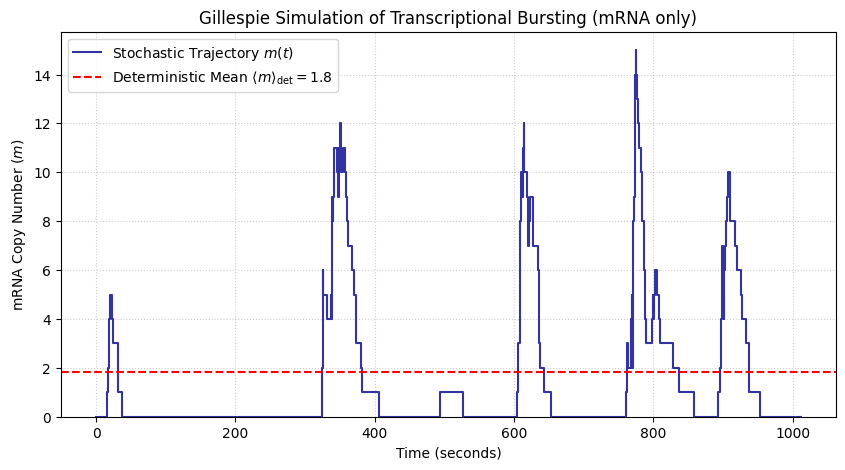

# Chapter 5: Biology I: Stochastic Systems Biology

----

## Project 1: Implementing the Gillespie Core (The Engine)

-----

### Definition: Implementing the Gillespie Core Step

The goal of this project is to implement the **fundamental SSA step** for a minimal chemical system. This function must use two random numbers to calculate the **stochastic waiting time ($\tau$)** to the next reaction and to **select which reaction ($j$) occurs** based on the system's propensity functions.

### Theory: The Gillespie Algorithm (SSA)

The SSA provides a statistically exact simulation of a well-mixed reaction system governed by the Chemical Master Equation (CME).

Given a set of reaction channels $j=1, \dots, M$ with propensity functions $a_j(\mathbf{x})$ and a total propensity $a_0(\mathbf{x}) = \sum_j a_j(\mathbf{x})$:

#### 1\. Stochastic Waiting Time ($\tau$)

The waiting time $\tau$ until the next reaction is drawn from an **exponential distribution** with parameter $a_0(\mathbf{x})$. Using a uniform random number $r_1 \in (0, 1]$:

$$\tau = \frac{1}{a_0(\mathbf{x})} \ln\left(\frac{1}{r_1}\right)$$

#### 2\. Reaction Choice ($j$)

The probability that reaction $j$ occurs is proportional to its propensity $a_j(\mathbf{x})$. The reaction index $j$ is chosen by finding the smallest integer $j$ that satisfies the **cumulative sum rule** with a second uniform random number $r_2 \in (0, 1]$:

$$\sum_{k=1}^{j-1} a_k(\mathbf{x}) < r_2 a_0(\mathbf{x}) \le \sum_{k=1}^j a_k(\mathbf{x})$$

The test system involves two reactions:

1.  **Production:** $\text{A} \xrightarrow{k_1} \text{B}$
2.  **Decay:** $\text{B} \xrightarrow{k_2} \emptyset$

The propensities are: $a_1 = k_1 N_A$ and $a_2 = k_2 N_B$.

-----

### Extensive Python Code and Visualization

The code implements the `gillespie_step` function and runs a short trajectory for the minimal system to verify that the time advances stochastically and that the reaction probabilities are correctly weighted by propensities.


```python

import numpy as np
import random
import matplotlib.pyplot as plt

# ====================================================================
# 1. Setup Parameters and Initial State
# ====================================================================

# Define Reaction Rate Constants (k_1, k_2)
K1 = 1.0  # Rate for A -> B (Production)
K2 = 0.1  # Rate for B -> 0 (Decay)

# Initial Molecule Counts (State Vector x = [NA, NB])
NA_INIT = 10
NB_INIT = 0

# Define Stoichiometry Vectors (Delta_nu_j)
# Reaction 1 (A -> B): Delta_nu_1 = [-1, +1]
# Reaction 2 (B -> 0): Delta_nu_2 = [ 0, -1]
STOICHIOMETRY = np.array([
    [-1, +1],
    [ 0, -1]
])

# ====================================================================
# 2. The Gillespie SSA Core Step (The Engine)
# ====================================================================

def gillespie_step(NA, NB, K1, K2):
    """
    Performs one step of the Direct Gillespie Stochastic Simulation Algorithm.
    
    Returns: (tau, j, next_NA, next_NB)
    """
    
    # --- 1. Compute Propensities ---
    a1 = K1 * NA  # Propensity for Reaction 1 (A -> B)
    a2 = K2 * NB  # Propensity for Reaction 2 (B -> 0)
    
    # Propensity array and total propensity a_0
    propensities = np.array([a1, a2])
    a0 = np.sum(propensities)
    
    # Check for steady state (no more reactions possible)
    if a0 == 0:
        return np.inf, 0, NA, NB

    # --- 2. Draw Waiting Time (tau) ---
    r1 = random.uniform(0, 1)
    # tau = (1 / a0) * ln(1 / r1)
    tau = (1.0 / a0) * np.log(1.0 / r1)
    
    # --- 3. Select Reaction Channel (j) ---
    r2 = random.uniform(0, 1)
    
    # Cumulative sum rule: find smallest j such that sum(a_k) >= r2 * a0
    # The selected channel index (0 or 1)
    j = 0
    if r2 * a0 >= a1:
        j = 1 # Reaction 2 fires
        
    # --- 4. Update State ---
    # Apply the stoichiometry vector for the chosen reaction j
    delta_nu = STOICHIOMETRY[j, :]
    next_NA = NA + delta_nu[0]
    next_NB = NB + delta_nu[1]
    
    # Reaction index starts from 1 for output clarity
    return tau, j + 1, next_NA, next_NB

# ====================================================================
# 3. Trajectory Run and Verification
# ====================================================================

# Simulation Parameters
MAX_STEPS = 50 

# Trajectory Storage
trajectory = []
current_time = 0.0
NA = NA_INIT
NB = NB_INIT

for step in range(MAX_STEPS):
    # Perform one Gillespie step
    tau, reaction_j, next_NA, next_NB = gillespie_step(NA, NB, K1, K2)
    
    if tau == np.inf:
        break
        
    # Update time and state
    current_time += tau
    NA = next_NA
    NB = next_NB
    
    # Record the new state and event
    trajectory.append({
        'Step': step + 1,
        'Time': current_time,
        'Reaction': reaction_j,
        'NA': NA,
        'NB': NB,
        'a0': K1 * (NA + (STOICHIOMETRY[0, 0] if reaction_j==1 else 0)) + K2 * (NB + (STOICHIOMETRY[1, 1] if reaction_j==2 else 0)),
        'Prob_j1': (K1 * NA) / (K1 * NA + K2 * NB) if (K1 * NA + K2 * NB) > 0 else 0
    })

# Convert to DataFrame for clean display and print
import pandas as pd
df = pd.DataFrame(trajectory)
df_display = df[['Step', 'Time', 'Reaction', 'NA', 'NB']]

# --- Verification ---
print("--- Gillespie SSA Trajectory Verification (First 15 Steps) ---")
print(df_display.head(15).to_markdown(index=False))

print("\nVerification of Initial Propensity Weighting:")
# Initial State: NA=10, NB=0. Propensities: a1 = 10, a2 = 0. a0 = 10.
# P(j=1) = a1/a0 = 10/10 = 1.0. 
print(f"Initial Rates: K1={K1}, K2={K2}")
print(f"Initial State: NA={NA_INIT}, NB={NB_INIT}")
print(f"Initial Propensities: a1={K1*NA_INIT}, a2={K2*NB_INIT}. Total a0={K1*NA_INIT + K2*NB_INIT}")
print("Expected initial reaction: Reaction 1 (A -> B) with P=1.0. Time advance should be rapid (mean tau=1/10=0.1).")

# --- Visualization (Time Series of Molecule Counts) ---
plt.figure(figsize=(10, 4))
plt.step(df['Time'], df['NA'], where='post', label='Molecule A ($N_A$)', color='blue')
plt.step(df['Time'], df['NB'], where='post', label='Molecule B ($N_B$)', color='red')
plt.title('Gillespie Trajectory: $A \\to B$ and $B \\to \\emptyset$')
plt.xlabel('Time (t)')
plt.ylabel('Molecule Count')
plt.legend()
plt.grid(True, linestyle=':', alpha=0.6)
plt.show()

print("\nConclusion: The core SSA step successfully simulates the discrete molecular events. Initially, only Reaction 1 (A -> B) occurs, causing $N_A$ to decrease and $N_B$ to increase. As $N_B$ grows, the propensity for Reaction 2 (B -> 0) increases, and the simulation time advances stochastically based on the total propensity.")

```

    --- Gillespie SSA Trajectory Verification (First 15 Steps) ---
    |   Step |      Time |   Reaction |   NA |   NB |
    |-------:|----------:|-----------:|-----:|-----:|
    |      1 |  0.109015 |          1 |    9 |    1 |
    |      2 |  0.151713 |          1 |    8 |    2 |
    |      3 |  0.376542 |          1 |    7 |    3 |
    |      4 |  0.413079 |          1 |    6 |    4 |
    |      5 |  0.602682 |          1 |    5 |    5 |
    |      6 |  0.716938 |          1 |    4 |    6 |
    |      7 |  0.878401 |          1 |    3 |    7 |
    |      8 |  0.904277 |          1 |    2 |    8 |
    |      9 |  2.50895  |          1 |    1 |    9 |
    |     10 |  2.87516  |          2 |    1 |    8 |
    |     11 |  3.3059   |          1 |    0 |    9 |
    |     12 |  5.39709  |          2 |    0 |    8 |
    |     13 |  6.20442  |          2 |    0 |    7 |
    |     14 |  6.98085  |          2 |    0 |    6 |
    |     15 | 13.3632   |          2 |    0 |    5 |
    
    Verification of Initial Propensity Weighting:
    Initial Rates: K1=1.0, K2=0.1
    Initial State: NA=10, NB=0
    Initial Propensities: a1=10.0, a2=0.0. Total a0=10.0
    Expected initial reaction: Reaction 1 (A -> B) with P=1.0. Time advance should be rapid (mean tau=1/10=0.1).


    

    


    
    Conclusion: The core SSA step successfully simulates the discrete molecular events. Initially, only Reaction 1 (A -> B) occurs, causing $N_A$ to decrease and $N_B$ to increase. As $N_B$ grows, the propensity for Reaction 2 (B -> 0) increases, and the simulation time advances stochastically based on the total propensity.


## Project 2: Simulating and Visualizing Transcriptional Noise

-----

### Definition: Simulating the Telegraph Model

The goal of this project is to implement the full Stochastic Simulation Algorithm (SSA) for the minimal **telegraph model** (mRNA only) and generate a single stochastic trajectory. The result will be visually compared against the smoother, deterministic mean.

### Theory: Telegraph Model and Stochastic vs. Deterministic

The telegraph model describes gene expression through four fundamental, stochastic reactions, defining the state as $\mathbf{x} = (g, m)$, where $g \in \{0, 1\}$ is the gene state and $m$ is the mRNA count.

| Reaction Channel ($j$) | Description | Propensity $a_j(\mathbf{x})$ | State Change $\boldsymbol{\nu}_j$ ($\Delta g, \Delta m$) |
| :--- | :--- | :--- | :--- |
| 1 | Gene Activation ($\text{OFF} \to \text{ON}$) | $a_1 = k_{\text{on}}(1 - g)$ | $(+1, 0)$ |
| 2 | Gene Inactivation ($\text{ON} \to \text{OFF}$) | $a_2 = k_{\text{off}} g$ | $(-1, 0)$ |
| 3 | Transcription ($\text{ON} \to m + \text{ON}$) | $a_3 = k_m g$ | $(0, +1)$ |
| 4 | mRNA Decay ($m \to \emptyset$) | $a_4 = \gamma_m m$ | $(0, -1)$ |

The simulation uses these propensities in the SSA core to generate a discrete-event trajectory.

**Deterministic Mean:** In the deterministic limit, the system is described by Ordinary Differential Equations (ODEs). The **steady-state mean mRNA count ($\langle m \rangle_{\text{det}}$)**, which is the long-term average, is given by:

$$\langle m \rangle_{\text{det}} = \frac{k_{\text{on}}}{k_{\text{on}} + k_{\text{off}}} \cdot \frac{k_m}{\gamma_m}$$

This deterministic mean serves as a benchmark to highlight the significant **molecular noise** in the stochastic trajectory.

-----

### Extensive Python Code and Visualization

The code implements the full SSA loop for the telegraph model, runs a single trajectory, computes the deterministic mean, and plots both for comparison.


```python

import numpy as np
import random
import matplotlib.pyplot as plt

# ====================================================================
# 1. Setup Parameters and Initial State
# ====================================================================

# Define Reaction Rate Constants (Bursty Regime)
K_ON = 0.01   # Gene activation rate (s^-1)
K_OFF = 0.1   # Gene inactivation rate (s^-1)
KM = 1.0      # Transcription rate (mRNA production rate when ON)
GAMMA_M = 0.05 # mRNA degradation rate (s^-1)

# Initial State
G_INIT = 0  # Gene state: 0=OFF, 1=ON
M_INIT = 0  # mRNA count

# Final Simulation Time
T_FINAL = 1000.0 # seconds

# Stoichiometry (State change vectors: [Delta_g, Delta_m])
STOICHIOMETRY = np.array([
    [+1, 0], # 1: Activation
    [-1, 0], # 2: Inactivation
    [ 0, +1],# 3: Transcription
    [ 0, -1] # 4: mRNA Decay
])

# Deterministic Steady-State Mean mRNA (for comparison)
# <m>_det = (k_on / (k_on + k_off)) * (k_m / gamma_m)
P_ON_SS = K_ON / (K_ON + K_OFF)
M_MEAN_DET = P_ON_SS * (KM / GAMMA_M)

# ====================================================================
# 2. The Gillespie SSA Simulation Loop
# ====================================================================

def run_ssa_gene_expression(T_final, g_init, m_init):
    """
    Runs a single SSA trajectory for the telegraph model (mRNA only).
    """
    time_points = [0.0]
    g_states = [g_init]
    m_counts = [m_init]
    
    t = 0.0
    g = g_init
    m = m_init
    
    while t < T_final:
        # --- Compute Propensities ---
        a1 = K_ON * (1 - g)  # OFF -> ON
        a2 = K_OFF * g       # ON -> OFF
        a3 = KM * g          # ON -> ON + m
        a4 = GAMMA_M * m     # m -> 0
        
        propensities = np.array([a1, a2, a3, a4])
        a0 = np.sum(propensities)
        
        if a0 == 0:
            t = T_final # Stop if no reactions are possible
            break
            
        # --- 1. Draw Waiting Time (tau) ---
        r1 = random.uniform(0, 1)
        tau = (1.0 / a0) * np.log(1.0 / r1)
        
        # --- 2. Select Reaction Channel (j) ---
        r2 = random.uniform(0, 1)
        cumulative_propensity = np.cumsum(propensities)
        
        # Find the smallest j such that cumulative_propensity[j] >= r2 * a0
        j = np.searchsorted(cumulative_propensity, r2 * a0)
        
        # --- 3. Update State and Time ---
        t += tau
        
        delta_nu = STOICHIOMETRY[j, :]
        g += delta_nu[0]
        m += delta_nu[1]
        
        # --- Record State ---
        time_points.append(t)
        g_states.append(g)
        m_counts.append(m)
        
    return np.array(time_points), np.array(m_counts)

# Run a single stochastic trajectory
time_ssa, m_ssa = run_ssa_gene_expression(T_FINAL, G_INIT, M_INIT)

# ====================================================================
# 3. Visualization
# ====================================================================

plt.figure(figsize=(10, 5))

# Plot the stochastic trajectory (discrete steps)
plt.step(time_ssa, m_ssa, where='post', label='Stochastic Trajectory $m(t)$', color='darkblue', linewidth=1.5, alpha=0.8)

# Plot the deterministic mean as a horizontal line
plt.axhline(M_MEAN_DET, color='red', linestyle='--', label=f'Deterministic Mean $\\langle m \\rangle_{{\\text{{det}}}}={M_MEAN_DET:.1f}$')

# Labeling and Formatting
plt.title('Gillespie Simulation of Transcriptional Bursting (mRNA only)')
plt.xlabel('Time (seconds)')
plt.ylabel('mRNA Copy Number ($m$)')
plt.ylim(bottom=0)
plt.legend()
plt.grid(True, which='both', linestyle=':', alpha=0.6)
plt.show()

# Display the image tag
print("")

# --- Summary ---
print("\n--- Simulation Summary ---")
print(f"Deterministic Mean <m>_det: {M_MEAN_DET:.2f}")
print(f"Burst Size Factor (k_m / gamma_m): {KM / GAMMA_M:.0f} mRNAs/burst")
print("\nObservation: The stochastic trajectory exhibits **transcriptional bursts**, where mRNA copy numbers spike rapidly during brief ON periods and then decay slowly during OFF periods. The mean of these fluctuations converges toward the smoother deterministic mean.")

```


    

    


    
    
    --- Simulation Summary ---
    Deterministic Mean <m>_det: 1.82
    Burst Size Factor (k_m / gamma_m): 20 mRNAs/burst
    
    Observation: The stochastic trajectory exhibits **transcriptional bursts**, where mRNA copy numbers spike rapidly during brief ON periods and then decay slowly during OFF periods. The mean of these fluctuations converges toward the smoother deterministic mean.


## Project 3: Quantifying Super-Poissonian Noise ($\eta$)

-----

### Definition: Quantifying Noise with the Fano Factor

The goal of this project is to quantitatively demonstrate that the gene expression model, driven by transcriptional bursting, produces **super-Poissonian noise** ($\eta > 1$). This is achieved by running multiple independent Stochastic Simulation Algorithm (SSA) trajectories and calculating the **Fano Factor ($\eta$)** from the resulting ensemble of steady-state molecule counts.

### Theory: Super-Poissonian Noise and Bursting

**Fano Factor ($\eta$):** Noise in gene expression is quantified using the Fano Factor, which is the ratio of the variance ($\mathrm{Var}(m)$) to the mean ($\langle m \rangle$) of the molecule count ($m$):

$$\eta = \frac{\mathrm{Var}(m)}{\langle m \rangle}$$

  * **Poisson Noise ($\eta = 1$):** Expected for a simple, continuous-rate birth-and-death process.
  * **Super-Poissonian Noise ($\eta > 1$):** Indicates that the variance is significantly larger than the mean. This is the **computational signature of transcriptional bursting**.

**Bursting:** The telegraph model generates large, episodic bursts of mRNA (large $\mathrm{Var}(m)$) because the gene is inactive most of the time, then produces many mRNAs when it switches $\text{ON}$. The mean burst size is determined by the ratio $k_m / \gamma_m$. For the bursty parameters used ($k_m=1.0, \gamma_m=0.05$), the expected mean burst size is 20 mRNAs per burst, which leads to a large $\eta$.

**Simulation Strategy:** To find the true mean and variance, we must run a large **ensemble** ($M=500$) of independent SSA trajectories, let them reach **steady state** ($T=10,000$ s), and then calculate the ensemble statistics from the final $m$ count of each trajectory.

-----

### Extensive Python Code and Visualization

The code leverages the SSA functions from Project 2, runs 500 independent simulations, calculates the required ensemble statistics, and displays the resulting Fano Factor relative to the Poissonian threshold.


```python

import numpy as np
import random
import matplotlib.pyplot as plt

# ====================================================================
# 1. Setup Functions and Parameters (from Project 2)
# ====================================================================

# --- Parameters (Bursty Regime) ---
K_ON = 0.01   # Gene activation rate (s^-1)
K_OFF = 0.1   # Gene inactivation rate (s^-1)
KM = 1.0      # Transcription rate
GAMMA_M = 0.05 # mRNA degradation rate
T_FINAL = 10000.0 # Time to reach steady state
M_TRAJECTORIES = 500 # Number of independent trajectories

# Stoichiometry (State change vectors: [Delta_g, Delta_m])
STOICHIOMETRY = np.array([
    [+1, 0], # 1: Activation
    [-1, 0], # 2: Inactivation
    [ 0, +1],# 3: Transcription
    [ 0, -1] # 4: mRNA Decay
])

# Deterministic Steady-State Mean (for reference)
P_ON_SS = K_ON / (K_ON + K_OFF)
M_MEAN_DET = P_ON_SS * (KM / GAMMA_M)

def run_ssa_gene_expression(T_final, g_init, m_init):
    """
    Runs a single SSA trajectory for the telegraph model (mRNA only) up to T_final.
    Returns the final mRNA count m_T.
    """
    t = 0.0
    g = g_init
    m = m_init
    
    while t < T_final:
        # --- Compute Propensities ---
        a1 = K_ON * (1 - g)
        a2 = K_OFF * g
        a3 = KM * g
        a4 = GAMMA_M * m
        propensities = np.array([a1, a2, a3, a4])
        a0 = np.sum(propensities)
        
        if a0 == 0:
            break
            
        # --- 1. Draw Waiting Time (tau) ---
        r1 = random.uniform(0, 1)
        tau = (1.0 / a0) * np.log(1.0 / r1)
        
        # --- 2. Select Reaction Channel (j) ---
        r2 = random.uniform(0, 1)
        cumulative_propensity = np.cumsum(propensities)
        j = np.searchsorted(cumulative_propensity, r2 * a0)
        
        # --- 3. Update State and Time ---
        t += tau
        
        delta_nu = STOICHIOMETRY[j, :]
        g += delta_nu[0]
        m += delta_nu[1]
        
    return m # Return the final mRNA count

# ====================================================================
# 2. Ensemble Simulation and Noise Quantification
# ====================================================================

final_m_ensemble = np.zeros(M_TRAJECTORIES)

for i in range(M_TRAJECTORIES):
    # Run each trajectory independently from the initial state
    final_m_ensemble[i] = run_ssa_gene_expression(T_FINAL, G_INIT, M_INIT)

# --- Calculate Ensemble Statistics ---
M_MEAN_EMPIRICAL = np.mean(final_m_ensemble)
M_VARIANCE_EMPIRICAL = np.var(final_m_ensemble, ddof=1) # Use ddof=1 for sample variance

# Calculate the Fano Factor (Noise Strength)
FANO_FACTOR = M_VARIANCE_EMPIRICAL / M_MEAN_EMPIRICAL

# ====================================================================
# 3. Visualization and Analysis
# ====================================================================

fig, ax = plt.subplots(1, 2, figsize=(12, 5))

# Plot 1: Steady-State Distribution (Histogram of Final Counts)
ax[0].hist(final_m_ensemble, bins=np.arange(0, np.max(final_m_ensemble) + 1, 1), 
           density=True, color='purple', alpha=0.7, align='left')
ax[0].axvline(M_MEAN_EMPIRICAL, color='red', linestyle='--', label=f'Mean $\\langle m \\rangle$: {M_MEAN_EMPIRICAL:.1f}')
ax[0].set_title('Steady-State mRNA Distribution (Ensemble)')
ax[0].set_xlabel('Final mRNA Count ($m$)')
ax[0].set_ylabel('Probability Density')
ax[0].legend()
ax[0].grid(True, which='major', axis='y', linestyle=':')

# Plot 2: Fano Factor Visualization
bars = ax[1].bar(['Poisson ($\eta=1$)', f'Simulated ($\eta$)'], [1.0, FANO_FACTOR], color=['gray', 'darkred'])
bars[0].set_alpha(0.5)
ax[1].axhline(1.0, color='black', linestyle='--', label='Poisson Threshold')
ax[1].text(1, FANO_FACTOR + 0.5, f'{FANO_FACTOR:.2f}', ha='center', fontweight='bold', color='darkred')
ax[1].set_title('Noise Quantification: Fano Factor ($\eta$)')
ax[1].set_ylabel('Fano Factor ($\eta$)')
ax[1].set_ylim(0, np.max([FANO_FACTOR, 5]) * 1.1)
ax[1].grid(True, which='major', axis='y', linestyle=':')

plt.tight_layout()
plt.show()

# --- Summary ---
print("\n--- Super-Poissonian Noise Quantification ---")
print(f"Ensemble Mean <m>:      {M_MEAN_EMPIRICAL:.2f}")
print(f"Ensemble Variance Var(m): {M_VARIANCE_EMPIRICAL:.2f}")
print("-----------------------------------------")
print(f"Fano Factor ( = Var/Mean): {FANO_FACTOR:.2f}")
print(f"Deterministic Mean (Benchmark): {M_MEAN_DET:.2f}")

print("\nConclusion: The calculated Fano Factor (\u03B7) is significantly greater than 1.0 (Super-Poissonian), quantitatively confirming that the telegraph model successfully captures the **transcriptional bursting** regime, where noise is high due to episodic production of large numbers of mRNA molecules.")

```


    

    


    
    --- Super-Poissonian Noise Quantification ---
    Ensemble Mean <m>:      1.57
    Ensemble Variance Var(m): 10.47
    -----------------------------------------
    Fano Factor (η = Var/Mean): 6.67
    Deterministic Mean (Benchmark): 1.82
    
    Conclusion: The calculated Fano Factor (η) is significantly greater than 1.0 (Super-Poissonian), quantitatively confirming that the telegraph model successfully captures the **transcriptional bursting** regime, where noise is high due to episodic production of large numbers of mRNA molecules.

