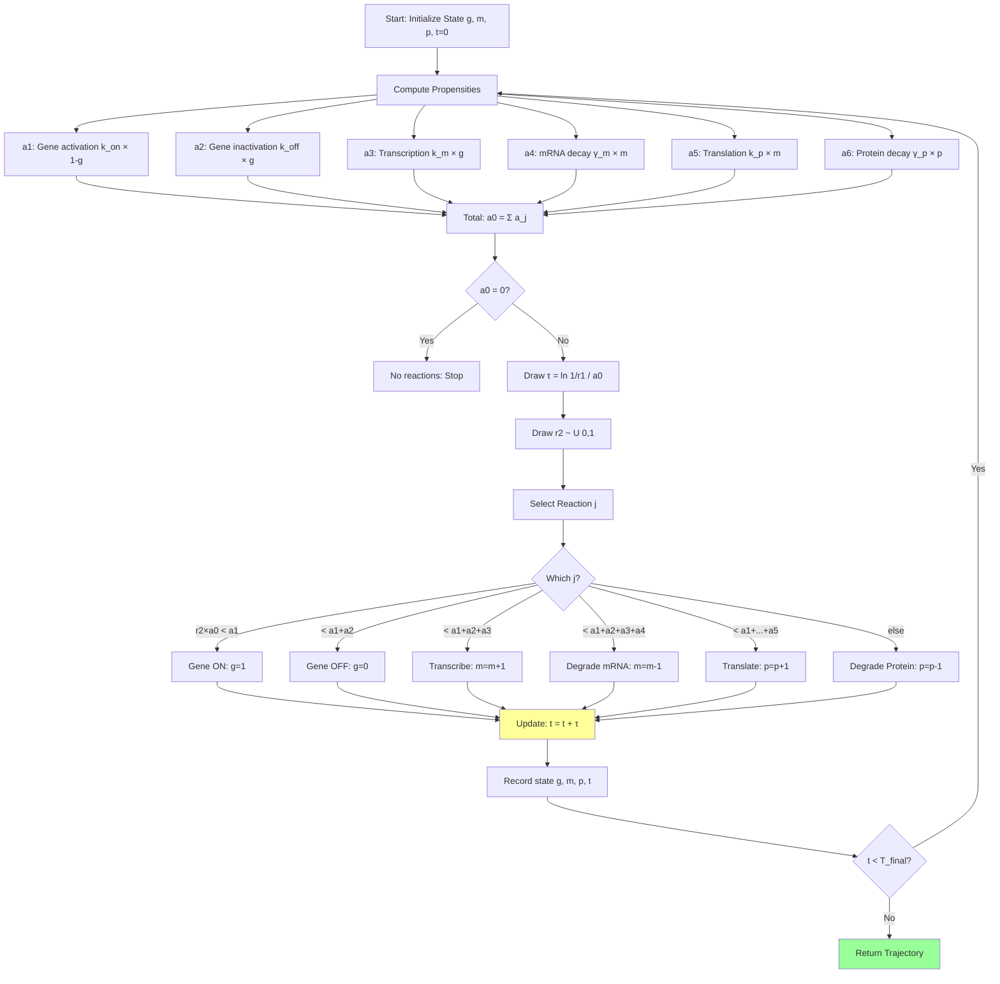

# **Chapter 5: Stochastic Systems Biology**

---

## **Introduction**

Biological systems operate in a regime where the previous chapters' continuous approximations break down. Inside a living cell, gene expression is not a smooth, deterministic process but a fundamentally **stochastic phenomenon**. A bacterial gene might produce only tens of mRNA molecules; a mammalian transcription factor could exist in single-digit copy numbers. At these molecular scales, **noise is not a nuisance to be averaged away—it is the whole story**. Random fluctuations in biochemical reactions drive cell-to-cell variability, influence cellular decision-making, enable bet-hedging strategies, and underlie phenomena from antibiotic resistance to stem cell differentiation.

This chapter introduces **stochastic systems biology**, where we abandon deterministic differential equations in favor of exact Monte Carlo simulation of discrete molecular events. The governing framework is the **Chemical Master Equation (CME)**, which describes the time evolution of probability distributions over molecule counts. While the CME is rarely solvable analytically, the **Gillespie Stochastic Simulation Algorithm (SSA)** provides a mathematically exact method for generating sample trajectories consistent with the CME. This algorithm tracks individual reaction events—mRNA synthesis, protein translation, molecular degradation—by sampling waiting times from exponential distributions and selecting reactions proportional to their propensity functions.

We apply the Gillespie algorithm to model **gene expression in the low-copy-number regime**, revealing how transcriptional bursting generates super-Poissonian noise and heavy-tailed protein distributions. By the end of this chapter, you will understand how to implement the SSA for biochemical reaction networks, how to extract noise statistics like the Fano factor from simulated trajectories, and how stochastic fluctuations produce measurable phenotypic heterogeneity. These techniques bridge computational physics and quantitative biology, demonstrating how Monte Carlo methods illuminate the molecular origins of cellular behavior.

---

## **Chapter Outline**

| **Sec.** | **Title**                                               | **Core Ideas & Examples**                                                                                                                                                                                                                     |
| -------- | ------------------------------------------------------- | --------------------------------------------------------------------------------------------------------------------------------------------------------------------------------------------------------------------------------------------- |
| **5.1**  | **Chapter Opener: Noise is the Whole Story**           | Gene expression as stochastic process; intrinsic vs. extrinsic noise; Fano factor $\eta = \mathrm{Var}(X)/\langle X \rangle$; transcriptional bursting; telegraph model (ON/OFF states); limitations of deterministic ODEs.                   |
| **5.2**  | **The Gillespie Algorithm**                             | Chemical Master Equation; propensity functions $a_j(\mathbf{x})$; joint distribution $p(\tau,j) = a_j(\mathbf{x})e^{-\tau a_0(\mathbf{x})}$; SSA algorithm: draw $\tau = \ln(1/r_1)/a_0$, select reaction $j$ by weighted sampling.          |
| **5.3**  | **Simulation: Modeling Simple Gene Expression**        | Two-state gene model: transcription $\emptyset \to M$ at rate $k_m$, translation $M \to M+P$ at rate $k_p$, degradation; implementing SSA with propensity vector updates; generating single-cell trajectories; ensemble statistics.          |
| **5.4**  | **Application: Observing Transcriptional Bursting**    | Telegraph model with gene switching (ON/OFF); burst frequency vs. burst size; super-Poissonian protein distributions ($\eta > 1$); comparing simulations to experimental histograms; cell-to-cell variability as phenotypic heterogeneity.     |
| **5.5**  | **Chapter Summary & Bridge to Chapter 6**              | Recap of Gillespie SSA; stochastic vs. deterministic regimes; noise as biological function; preview of synthetic gene circuits (toggle switch, oscillators); from single genes to regulatory networks; feedback and bistability.               |

---

## **5.1 Chapter Opener: Noise is the Whole Story**

-----

### **Gene expression as a stochastic process**

At the molecular scale, cells are noisy. The transcription of DNA into mRNA and the translation of mRNA into protein involve discrete, random events: RNA polymerase and ribosomes bind and unbind, molecules diffuse and collide, and reactions occur sporadically. Each cell in a genetically identical population experiences a unique sequence of such events, leading to cell‑to‑cell variability in the copy numbers of mRNAs and proteins. This variability persists even in homogeneous environments and is fundamental to processes like cell fate decisions, bet‑hedging, and antibiotic tolerance.

In deterministic models, one writes differential equations for the concentrations of mRNAs and proteins, implicitly assuming that these species exist in large numbers and that fluctuations average out. But many genes are expressed at low copy numbers: a mammalian gene might produce only a few mRNA molecules per cell, and a bacterial transcription factor could exist in tens of copies. In such regimes, random fluctuations (noise) cannot be neglected; they dominate the dynamics and often drive phenotypic outcomes.

-----

### **Intrinsic versus extrinsic noise**

It is useful to classify sources of noise into two categories:

- **Intrinsic noise** arises from the random nature of biochemical reactions within a single cell. Even if two identical genes are present in the same cell and are subject to the same environment, the timing of transcription and translation events for each gene will differ. This leads to uncorrelated fluctuations in their expression levels. Intrinsic noise originates from low copy numbers of reactants, stochastic binding/unbinding of regulators, and finite reaction rates. Dual‑reporter experiments (expressing two identical fluorescent proteins in one cell) reveal intrinsic noise by measuring the difference between the reporters.

- **Extrinsic noise** reflects cell‑to‑cell variability in global factors such as the abundance of transcription machinery, ribosomes, metabolites, and signaling molecules. These factors affect all genes in a cell similarly, inducing correlated fluctuations across different genes. Examples include differences in cell size, cell cycle stage, metabolic state, and microenvironment. Extrinsic noise can be probed by comparing identical reporter genes across different cells; correlated fluctuations indicate extrinsic contributions.

In practice, both types of noise coexist and contribute to the total variance of gene expression. Quantitative analyses often decompose the variance into intrinsic and extrinsic components by measuring the covariance between dual reporters.

-----

### **Quantifying noise: mean, variance and Fano factor**

Given a random variable $X$ representing the copy number of mRNA or protein, the **mean** $\langle X\rangle$ measures the average expression level, while the **variance** $\mathrm{Var}(X) = \langle (X - \langle X\rangle)^2\rangle$ quantifies the spread. A useful dimensionless measure of noise is the **Fano factor** or **noise strength**:

$$
\eta = \frac{\mathrm{Var}(X)}{\langle X\rangle},
$$

which compares the variance to the mean. For a Poisson process (e.g., constant‑rate birth and death), $\eta = 1$; super‑Poissonian noise ($\eta > 1$) indicates bursty production or long‑tailed distributions, while sub‑Poissonian noise ($\eta < 1$) suggests feedback or cooperativity that suppresses fluctuations.

!!! tip "Interpreting the Fano Factor"
    The Fano factor $\eta = \mathrm{Var}(X)/\langle X \rangle$ provides a quick diagnostic for noise:
    
    - $\eta = 1$: Poisson-like noise (constitutive expression at constant rate)
    - $\eta > 1$: Super-Poissonian (bursting, heavy tails, cell-to-cell variability)
    - $\eta < 1$: Sub-Poissonian (feedback regulation, noise suppression)
    
    For example, if mRNA has $\langle m \rangle = 20$ and $\mathrm{Var}(m) = 60$, then $\eta = 3$, indicating strong bursting. The Fano factor is dimensionless and robust to measurement units, making it ideal for comparing experiments across systems.

In gene expression, bursting often leads to Fano factors greater than one, reflecting large excursions in mRNA or protein numbers.

-----

### **Transcriptional bursting and phenotypic heterogeneity**

Experiments reveal that transcription does not occur at a steady rate but in **bursts**: periods of intense activity interspersed with inactivity. Studies have shown that transcriptional bursting is ubiquitous across bacteria, yeast, and mammals. During a burst, multiple mRNA molecules are produced in rapid succession; between bursts, the gene is silent. This bursty dynamics creates a heavy‑tailed distribution of mRNA copy numbers and propagates to protein levels, contributing to cell‑to‑cell heterogeneity.

Transcriptional bursting is typically modeled by a **telegraph process**: the gene toggles between an “ON” state (transcription at rate $k_{\text{on}}$) and an “OFF” state (no transcription), with switching rates $k_{\text{activate}}$ and $k_{\text{inactivate}}$. The burst frequency is determined by the switching rates, and the burst size by the transcription and degradation rates. The heterogeneity generated by bursting drives phenotypic diversity and can influence processes such as differentiation, stress responses, and pathogenicity.

-----

### **Limitations of deterministic models and the need for stochastic simulations**

Traditional deterministic models, based on ordinary differential equations (ODEs), describe the time evolution of concentrations averaged over a large population. They predict smooth trajectories and fixed‑point equilibria. However, these models cannot capture:

- **Random timing of events.** When a gene switches ON or OFF or when the first mRNA is produced matters for cellular decisions (e.g., timing of a developmental switch).
- **Probability distributions.** ODEs yield only mean trajectories; they do not provide information about the distribution of expression levels across cells.
- **Large fluctuations at low copy numbers.** When molecule numbers are small, the discrete nature of reactions leads to variance comparable to or larger than the mean, invalidating continuous approximations.

??? question "Why Can't We Just Add Noise to Deterministic ODEs?"
    One might try to model noise by adding Gaussian white noise to deterministic ODEs (Langevin equations). However, this approach has limitations:
    
    1. **Continuous vs. discrete**: ODEs treat molecule counts as continuous, but mRNA/protein counts are integers. Gaussian noise can produce negative counts.
    2. **Incorrect noise structure**: The Chemical Master Equation dictates that noise should be Poisson-like (variance proportional to mean), not Gaussian with constant variance.
    3. **Missing correlations**: Discrete reaction events create specific correlations between species that Langevin approximations may not capture correctly.
    
    The Gillespie SSA respects the discrete, stochastic nature of reactions and is mathematically exact. Langevin approximations are useful for large copy numbers but break down in the low-copy regime where bursting matters most.

To accurately model gene expression in regimes where noise is consequential, we need **stochastic simulation algorithms**. These algorithms track individual reaction events and generate trajectories consistent with the underlying probability distribution. The **Gillespie Stochastic Simulation Algorithm (SSA)**, introduced in the next section, is a mathematically exact method for simulating coupled chemical reactions in well‑mixed systems with low copy numbers. It samples the waiting time to the next reaction and the reaction identity according to the system’s propensity functions. By generating many such trajectories, we can compute distributions, autocorrelation functions, and noise statistics that match experimental observations.

-----

### **Outline of the chapter**

This chapter will show how to apply the Gillespie algorithm to a minimal gene expression model.

- **Section 5.2** derives the SSA and explains how to draw reaction times and select reactions based on propensities.
- **Section 5.3** implements the algorithm for a two‑state gene with mRNA and protein synthesis and degradation.
- **Section 5.4** examines transcriptional bursting, showing how the telegraph model generates bursty transcription and how simulation results compare with experiments.
- **Section 5.5** summarises the insights gained and connects to the next chapter on synthetic gene circuits.

---

## **5.2 The Gillespie Algorithm**

-----

### **Why a stochastic simulation algorithm?**

Chemical reactions inside a cell occur randomly when reactant molecules collide and react. For systems with large numbers of molecules, the law of mass action and differential equations provide accurate mean-field descriptions. But when copy numbers are small—as for low-abundance mRNAs, transcription factors or signaling molecules—discrete fluctuations dominate. The **Chemical Master Equation (CME)** governs the time evolution of the probability distribution over the vector of molecule counts. For a system with states $\mathbf{X}(t)$, the CME reads

$$
\frac{\mathrm{d}P(\mathbf{x},t)}{\mathrm{d}t} = \sum_{j=1}^{M} \left[ a_j(\mathbf{x}-\boldsymbol{\nu}_j) P(\mathbf{x}-\boldsymbol{\nu}_j,t) - a_j(\mathbf{x}) P(\mathbf{x},t) \right],
$$

where $M$ is the number of reaction channels, $a_j(\mathbf{x})$ is the **propensity function** of reaction $j$ in state $\mathbf{x}$, and $\boldsymbol{\nu}_j$ is the state-change vector indicating how molecule counts change when reaction $j$ occurs. Solving the CME analytically is rarely possible for non-trivial systems. Instead, we simulate trajectories consistent with the CME. The **Gillespie Stochastic Simulation Algorithm (SSA)** provides an exact procedure for doing so.

-----

### **Propensity functions and reaction hazards**

Consider a reaction network with $M$ reaction channels. In state $\mathbf{x}$ (a vector of molecule counts), the **propensity function** $a_j(\mathbf{x})$ is defined such that:

- $a_j(\mathbf{x})\,\mathrm{d}t$ is the probability that reaction $j$ will occur in the infinitesimal interval $[t,t+\mathrm{d}t)$, given that the system is in state $\mathbf{x}$ at time $t$.
- $a_j(\mathbf{x})$ has dimensions of inverse time; it depends on the number of available reactants and the rate constant $c_j$.

For example, for a unimolecular decay $S \to \emptyset$ with rate constant $k$, $a(\mathbf{x}) = k x_S$. For a bimolecular reaction $S_1 + S_2 \to P$ with rate constant $k$, $a(\mathbf{x}) = k x_{S_1} x_{S_2}$, assuming well-mixed conditions.

Let $a_0(\mathbf{x}) = \sum_{j=1}^M a_j(\mathbf{x})$ denote the **total propensity**—the overall rate at which any reaction fires.

-----

### **Derivation of the joint distribution of time and reaction**

Suppose the system is in state $\mathbf{x}$ at time $t$. We wish to derive the joint probability density $p(\tau,j|\mathbf{x},t)$ that the next reaction will occur after a waiting time $\tau$ and that it will be reaction $j$. Gillespie showed that this distribution factorizes into an exponential distribution over $\tau$ and a discrete distribution over $j$:

$$
p(\tau, j \mid \mathbf{x}, t)
= a_j(\mathbf{x}) \exp\left(-\tau a_0(\mathbf{x})\right)
\quad\text{for } \tau\ge 0,\ j=1,\dots,M.
$$

This result follows because (i) reaction events form a **Poisson process** with rate $a_0(\mathbf{x})$, so the waiting time $\tau$ to the next event is exponentially distributed with mean $1/a_0(\mathbf{x})$, and (ii) conditional on an event occurring, the probability it is reaction $j$ is proportional to its propensity: $\mathbb{P}(j|\mathbf{x}) = a_j(\mathbf{x}) / a_0(\mathbf{x})$. Therefore:

1. Draw $\tau$ from an exponential distribution with parameter $a_0(\mathbf{x})$. Equivalently, if $r_1$ is a uniform random number in $(0,1]$, set $\tau = \frac{1}{a_0(\mathbf{x})} \ln\left(\frac{1}{r_1}\right)$.
2. Select reaction $j$ by drawing a second uniform random number $r_2 \in (0,1]$ and choosing the smallest $j$ satisfying $\sum_{k=1}^j a_k(\mathbf{x}) \ge r_2 a_0(\mathbf{x})$.

This factorization is central: it implies that the time to the next reaction is memoryless and that choosing which reaction occurs is a simple weighted sampling problem.

-----

### **The Gillespie algorithm (SSA) step-by-step**

Given the initial state $\mathbf{x}$ at time $t$, the SSA proceeds as follows:

1. **Compute propensities.** For each reaction channel $j=1,\dots,M$, compute $a_j(\mathbf{x})$ and the total $a_0(\mathbf{x})$.
2. **Draw waiting time.** Generate a uniform random number $r_1 \in (0,1)$. Set
   $$
   \tau = \frac{1}{a_0(\mathbf{x})} \ln\left(\frac{1}{r_1}\right).
   $$
   This is the time until the next reaction.
3. **Select reaction channel.** Generate another uniform random number $r_2 \in (0,1)$. Identify the reaction index $j$ satisfying
   $$
   \sum_{k=1}^{j-1} a_k(\mathbf{x}) < r_2 a_0(\mathbf{x}) \le \sum_{k=1}^j a_k(\mathbf{x}).
   $$
   This ensures that $\mathbb{P}(j) = a_j(\mathbf{x})/a_0(\mathbf{x})$.
4. **Update state and time.** Advance time: $t \leftarrow t + \tau$. Update the state: $\mathbf{x} \leftarrow \mathbf{x} + \boldsymbol{\nu}_j$, where $\boldsymbol{\nu}_j$ is the stoichiometry vector for reaction $j$.
5. **Iterate.** Return to step 1 unless the desired final time has been reached or another stopping criterion (e.g., fixed number of reactions) is met.

Because the SSA exactly samples from the CME, multiple runs yield statistically correct trajectories. Averaging over many runs provides estimates of moments, distributions and autocorrelation functions.

-----

### **Illustrative example: reversible dimerization**

Consider a simple reaction system: dimerization of two species $A$ and $B$ to form a complex $C$, with forward rate $k_f$ and backward rate $k_b$:

$$
A + B \xrightleftharpoons[k_b]{k_f} C.
$$

The state is $\mathbf{x} = (x_A, x_B, x_C)$. There are two reaction channels: forward reaction (binding) and backward reaction (dissociation). The propensity functions are:

- $a_1(\mathbf{x}) = k_f x_A x_B$ for $A + B \to C$.
- $a_2(\mathbf{x}) = k_b x_C$ for $C \to A + B$.

The total propensity is $a_0 = k_f x_A x_B + k_b x_C$. According to the SSA, the time $\tau$ to the next reaction is exponential with mean $1/a_0$, and the probability that the next reaction is the forward reaction is $a_1/a_0$ (binding) while the probability of the backward reaction is $a_2/a_0$ (dissociation). For example, if $x_A = x_B = 10$, $x_C = 0$, and $k_f = k_b = 1$, $a_0 = 100$, so the expected waiting time is $0.01$ time units. Simulations will show fluctuations in $C$ as complexes form and dissociate.

This example illustrates how propensities depend on reactant counts and how the SSA naturally captures reaction stochasticity. It also resembles gene expression reactions (e.g., binding/unbinding of transcription factors), which we will model in the next section.

!!! example "Gillespie SSA for Simple Dimerization"
    Consider $A + B \rightleftharpoons C$ with $k_f = k_b = 1$, starting with $x_A = x_B = 10$, $x_C = 0$.
    
    **Step 1**: Propensities $a_1 = 1 \times 10 \times 10 = 100$, $a_2 = 1 \times 0 = 0$, $a_0 = 100$.
    
    **Step 2**: Draw $r_1 = 0.5$, compute $\tau = \ln(1/0.5)/100 = 0.00693$ time units.
    
    **Step 3**: Draw $r_2 = 0.3$; since $r_2 a_0 = 30 < a_1 = 100$, reaction 1 fires (binding).
    
    **Step 4**: Update state to $x_A = 9$, $x_B = 9$, $x_C = 1$; advance $t \leftarrow t + 0.00693$.
    
    Repeat until desired time. After many steps, the system reaches equilibrium with fluctuating $C$ levels.

-----

### **Algorithmic efficiency and variants**

While the direct SSA described above is exact, its cost scales with the number of reaction channels $M$ because at each step one must compute the cumulative sum of propensities and perform a linear search to select $j$. For large networks or when some reactions fire orders of magnitude faster than others, more efficient variants exist:

- **Next Reaction Method (NRM)** and **Gibson–Bruck algorithm**: maintain a priority queue of tentative reaction times and update propensities locally after each event, reducing computational complexity from $\mathcal{O}(M)$ to $\mathcal{O}(\log M)$.
- **$\tau$-leaping**: approximate the exact SSA by allowing multiple reactions to occur in a leap of fixed time $\tau$, updating species counts by drawing Poisson variates. This sacrifices exactness for speed when propensities are large.
- **Hybrid methods**: treat some species deterministically (ODE) and others stochastically, suitable for systems with both high- and low-copy-number species.

However, for the relatively small gene-expression models discussed in this chapter, the standard SSA suffices and retains conceptual clarity.

-----

### **Connection to the CME and well-mixed assumption**

The Gillespie algorithm assumes:

- **Well-mixedness:** Molecules are homogeneously distributed in a reaction volume; spatial heterogeneity and diffusion limitations are neglected. This is a reasonable approximation for reactions in small volumes like bacterial cells or eukaryotic nuclei when diffusion is fast compared to reaction times.
- **Markovian reactions:** Reaction propensities depend only on the current state, not on the history.
- **Elementary reactions:** Each reaction occurs with a propensity proportional to the number of reactant molecules (for unimolecular or bimolecular reactions) and the rate constant.

Given these assumptions, the SSA generates trajectories consistent with the CME. If spatial effects or delayed reactions are important (e.g., gene regulation with transcriptional delays), extensions such as spatial SSA or delay stochastic simulation algorithms can be used.

With this rigorous foundation, we are ready to model the stochastic dynamics of gene expression. In the next section we will apply the Gillespie algorithm to a simple gene expression model.

---

## **5.3 Simulation: Modeling Simple Gene Expression**

-----

### **A minimal gene-expression model**

To illustrate stochastic gene expression, we consider a simplified **telegraph model** comprising four reaction channels:

1. **Gene activation and inactivation.** The gene toggles between an inactive “OFF” state and an active “ON” state:
   $$
   \text{OFF} \xrightarrow{k_\text{on}} \text{ON},\qquad
   \text{ON} \xrightarrow{k_\text{off}} \text{OFF}.
   $$
   When the gene is ON, transcription occurs; when OFF, no mRNA is produced. Switching rates $k_\text{on}$ and $k_\text{off}$ control burst frequency and duration.

2. **Transcription.** While the gene is in the ON state, it synthesizes mRNA at rate $k_m$:
   $$
   \text{ON} \xrightarrow{k_m} \text{ON} + m.
   $$
   Each reaction creates one mRNA molecule.

3. **mRNA degradation.** mRNA molecules degrade at rate $\gamma_m$:
   $$
   m \xrightarrow{\gamma_m} \emptyset.
   $$

4. **Translation and protein degradation.** For completeness, we can include translation and protein decay:
   $$
   m \xrightarrow{k_p} m + p,\qquad p \xrightarrow{\gamma_p} \emptyset,
   $$
   where $p$ denotes protein. Translation and protein dynamics amplify mRNA noise but follow the same SSA principles.

We represent the state as $\mathbf{x} = (g, m, p)$, where $g \in \{0,1\}$ indicates the gene’s ON (1) or OFF (0) state, $m$ the number of mRNA molecules and $p$ the number of protein molecules. The stoichiometry vectors for the reactions are:

- Gene activation: $\boldsymbol{\nu}_1 = (+1, 0, 0)$.
- Gene inactivation: $\boldsymbol{\nu}_2 = (-1, 0, 0)$.
- Transcription: $\boldsymbol{\nu}_3 = (0, +1, 0)$.
- mRNA decay: $\boldsymbol{\nu}_4 = (0, -1, 0)$.
- Translation: $\boldsymbol{\nu}_5 = (0, 0, +1)$.
- Protein decay: $\boldsymbol{\nu}_6 = (0, 0, -1)$.

Depending on the level of detail desired, one may omit translation (focusing on mRNA) or include it to study protein noise.

-----

### **Propensity functions**

The propensity functions $a_j(\mathbf{x})$ reflect the stochastic rate of each reaction given the current state:

1. **Gene activation:** $a_1(\mathbf{x}) = k_\text{on}(1 - g)$. Activation can occur only when the gene is OFF ($g=0$), so the propensity is zero if the gene is already ON.

2. **Gene inactivation:** $a_2(\mathbf{x}) = k_\text{off}g$. Inactivation occurs only when the gene is ON ($g=1$).

3. **Transcription:** $a_3(\mathbf{x}) = k_m g$. mRNA synthesis happens only in the ON state.

4. **mRNA decay:** $a_4(\mathbf{x}) = \gamma_m m$. Each existing mRNA degrades independently.

5. **Translation:** $a_5(\mathbf{x}) = k_p m$. Each mRNA produces proteins at rate $k_p$.

6. **Protein decay:** $a_6(\mathbf{x}) = \gamma_p p$. Each protein decays independently.

The total propensity is $a_0(\mathbf{x}) = \sum_{j=1}^6 a_j(\mathbf{x})$. At each step of the SSA we compute $a_j$ and use them to draw a waiting time and choose which reaction occurs.

-----

### **Implementing the SSA for gene expression**

The simulation algorithm follows the general SSA described in §5.2:

1. **Initialization.** Set time $t = 0$. Choose initial state: the gene may start OFF or ON; mRNA and protein counts may start at zero. Specify parameter values $(k_\text{on}, k_\text{off}, k_m, \gamma_m, k_p, \gamma_p)$.

2. **Compute propensities.** At time $t$, with state $\mathbf{x} = (g, m, p)$, compute $a_j(\mathbf{x})$ for each reaction and the total $a_0$.

3. **Draw waiting time and select reaction.** Generate two uniform random numbers $(r_1, r_2)$. Set $\tau = \frac{1}{a_0} \ln(1/r_1)$. Determine the reaction index $j$ such that $\sum_{k=1}^{j-1} a_k < r_2 a_0 \le \sum_{k=1}^j a_k$ (see §5.2).

4. **Update state and record.** Advance time: $t \leftarrow t + \tau$. Update $\mathbf{x} \leftarrow \mathbf{x} + \boldsymbol{\nu}_j$. Record the state at time $t$ if needed for output.

5. **Repeat.** Loop until $t$ exceeds a final time $T$ or until a desired number of reaction events has occurred. To generate a statistically meaningful distribution, run many independent realizations.

-----

### **Interpreting simulation results**

By running the SSA many times, we can compute the time-dependent mean $\langle m(t) \rangle$ and variance $\mathrm{Var}(m(t))$ of mRNA and similarly for proteins. We can also estimate:

- **Steady-state distributions.** After a sufficiently long transient, the system approaches a stationary distribution $P_\text{ss}(m)$ for mRNA copy numbers and $P_\text{ss}(p)$ for proteins. Plotting histograms reveals whether the distribution is Poisson-like, geometric or bimodal, depending on bursting parameters.

- **Autocorrelation function.** The autocorrelation $C(\Delta t) = \langle X(t) X(t+\Delta t) \rangle - \langle X \rangle^2$ measures memory in the fluctuations; its decay time relates to mRNA lifetime and gene switching dynamics.

- **Burst statistics.** From trajectories one can identify bursts (consecutive transcription events during ON periods) and compute their size (number of mRNAs per burst) and frequency (number of bursts per unit time). In the telegraph model, burst size has mean $k_m / \gamma_m$ (average number of mRNAs produced before the gene turns OFF) and burst frequency is $k_\text{on} k_\text{off} / (k_\text{on} + k_\text{off})$. The overall mean mRNA number is $\langle m \rangle = \frac{k_\text{on}}{k_\text{off} + k_\text{on}} \cdot \frac{k_m}{\gamma_m}$, while the Fano factor exceeds one due to bursts.

- **Extrinsic modulations.** If parameters like $k_m$ or $\gamma_m$ vary between cells (extrinsic noise), we can model this by drawing parameters from distributions and running simulations for each cell. The resulting mixture distribution exhibits broader variability.

-----

### **Example parameter choices**

To illustrate the algorithm, consider typical values:

- Gene activation rate $k_\text{on} = 0.01\ \text{s}^{-1}$
- Gene inactivation rate $k_\text{off} = 0.1\ \text{s}^{-1}$
- Transcription rate $k_m = 1\ \text{s}^{-1}$
- mRNA degradation rate $\gamma_m = 0.05\ \text{s}^{-1}$
- Translation rate $k_p = 0.5\ \text{s}^{-1}$
- Protein degradation rate $\gamma_p = 0.005\ \text{s}^{-1}$

These rates correspond to a gene that is OFF most of the time (90%), bursts ON occasionally (average ON duration of 10 s), produces roughly $k_m / \gamma_m = 20$ mRNAs per burst and each mRNA translates ~100 proteins on average ($k_p / \gamma_p$). Running the SSA with these parameters yields bursty trajectories of mRNA and protein copy numbers. Histograms of $m$ and $p$ show broad distributions with tails extending to high copy numbers. Adjusting $k_\text{on}$ and $k_\text{off}$ changes the burst frequency; adjusting $k_m$ and $\gamma_m$ scales the burst size.

-----

### **Code outline**

Below is a pseudocode illustrating the SSA for the telegraph model (mRNA only). A full implementation in Python or C would follow this structure:

```pseudo
Input: T_final, parameters k_on, k_off, k_m, gamma_m
Initialize: t = 0; g = 0; m = 0
Initialize arrays to record time and mRNA counts

while t < T_final:
    # compute propensities
    a1 = k_on * (1 - g)       # activation
    a2 = k_off * g            # inactivation
    a3 = k_m * g              # transcription
    a4 = gamma_m * m          # mRNA decay
    a0 = a1 + a2 + a3 + a4
    if a0 == 0:
        break  # no reactions possible

    # draw waiting time and reaction
    r1, r2 = random_uniform(), random_uniform()
    tau = (1 / a0) * log(1 / r1)
    # determine which reaction fires
    if r2 * a0 < a1:
        g = 1  # gene turns ON
    elif r2 * a0 < a1 + a2:
        g = 0  # gene turns OFF
    elif r2 * a0 < a1 + a2 + a3:
        m = m + 1  # transcribe mRNA
    else:
        m = m - 1  # degrade mRNA
    t = t + tau
    record (t, m)

Return time series of m
````

For translation and protein degradation, additional propensities and updates would be included. After running many trajectories, one can compute sample means, variances and histograms.

-----

### **Beyond the basic model**

While the telegraph model captures key features of bursting, real gene networks exhibit additional complexity:

* **Regulation:** Transcription factor binding/unbinding adds more states and reactions; propensities become functions of transcription-factor concentrations.
* **Feedback:** Proteins may regulate their own gene’s transcription (negative or positive feedback), altering burst statistics and stabilizing or amplifying noise.
* **Multiple promoter states:** Genes can have multiple active states corresponding to different chromatin configurations; this leads to multi-modal distributions.
* **Transcriptional delays:** RNA polymerase initiation and elongation times introduce delays between promoter activation and mRNA production; delay SSA methods can incorporate these.

Nonetheless, the core principles remain: define reaction channels, compute propensities, sample reaction times and identities, update the state and iterate. In the next section we will use this framework to study **transcriptional bursting**, analyze burst size and frequency, and compare simulation results with experimental observations.

**Flowchart: Gillespie SSA for Gene Expression**



---

## **5.4 Application: Observing Transcriptional Bursting**

-----

### **What is transcriptional bursting?**

Single‑cell studies using techniques such as single‑molecule RNA fluorescence in situ hybridization (smFISH), live‑cell RNA imaging and MS2/PP7 tagging have revealed that transcription does not proceed at a constant rate. Instead, many genes exhibit **bursting**: periods of rapid RNA production interspersed with long silent intervals. During a burst the gene’s promoter is in an active state, and multiple RNA molecules are synthesized in quick succession; between bursts the promoter is inactive and no transcription occurs. This phenomenon has been observed across bacteria, yeast, plants and mammals. Bursting creates wide, heavy‑tailed distributions of mRNA and protein copy numbers, leading to cell‑to‑cell heterogeneity and enabling phenotypic diversity within genetically identical populations.

In the telegraph model of gene expression (see §5.3), bursting arises naturally because the gene stochastically switches between an ON state and an OFF state. The **burst frequency** is determined by the activation and inactivation rates ($k_{\text{on}}$ and $k_{\text{off}}$), and the **burst size** is set by the transcription and mRNA degradation rates ($k_m$ and $\gamma_m$). Specifically, in the ON state mRNAs are produced at rate $k_m$ and degrade at rate $\gamma_m$; thus, the expected number of mRNAs produced in one burst is $k_m / \gamma_m$. The average time between bursts is $1 / k_\text{on}$ when OFF durations dominate.

-----

### **Simulating bursting with the Gillespie algorithm**

Using the Gillespie SSA, we simulate the telegraph model for many independent cells (see §5.3). Each simulation yields a trajectory of mRNA copy number over time. An example output resembles a “spike train”: long stretches where $m = 0$ punctuated by sudden increases as bursts occur, followed by exponential decay as mRNAs degrade. By analysing these trajectories we can extract burst statistics:

- **Burst frequency:** Count the number of times the gene turns ON per unit time. The estimated burst frequency converges to $k_\text{on} k_\text{off} / (k_\text{on} + k_\text{off})$ for the telegraph model.
- **Burst size:** For each ON period, count the number of mRNA molecules produced (or the total area under the mRNA curve). The mean burst size matches $k_m / \gamma_m$.
- **Burst duration:** Measure the length of each ON period; its mean is $1 / k_\text{off}$.

Histograms of burst sizes and waiting times between bursts often follow geometric and exponential distributions, respectively. The Fano factor (variance/mean) of mRNA copy number exceeds one, confirming super‑Poissonian noise due to bursting.

-----

### **Comparison with experimental data**

Experiments show that burst sizes and frequencies vary widely across genes and organisms. Some genes burst rarely but produce many transcripts per burst (large size, low frequency), while others burst frequently but produce few transcripts per burst (small size, high frequency). The telegraph model reproduces both regimes by adjusting $k_\text{on}$, $k_\text{off}$ and $k_m$. For example, increasing $k_\text{on}$ while keeping $k_\text{off}$ fixed increases burst frequency but not burst size; increasing $k_m$ increases burst size.

Transcriptional bursting can create phenotypic heterogeneity even when genes are subject to the same environment. Intrinsic noise generated by random transcription and translation events leads to uncorrelated fluctuations between identical genes within the same cell. Extrinsic factors—such as variability in polymerase concentration or chromatin state—can modulate bursting parameters across cells, inducing correlated noise between genes. Including extrinsic variability in simulations (e.g., by sampling $k_\text{on}$ or $k_m$ from a distribution across cells) widens the distribution of burst statistics and more closely matches experimental observations.

Live‑cell imaging experiments often report the mean and variance of mRNA and protein copy numbers. When fitted to the telegraph model, these moments yield estimates of burst frequency and size. For instance, in mammalian fibroblasts the β‑globin gene exhibits bursts with size ≈ 20 transcripts and frequency ≈ once per hour. The SSA model reproduces such data when $k_m / \gamma_m \approx 20$ and $k_\text{on} \approx 0.02\ \text{min}^{-1}$.

-----

### **Bursting and gene regulatory networks**

Bursting influences how information is transmitted through gene regulatory networks. In feed‑forward loops or negative feedback loops, bursty input signals (e.g., transcription factor levels) produce bursty outputs. Feedback can modulate burst frequency and size: negative feedback (protein represses its own promoter) reduces burst size and suppresses noise, while positive feedback can stabilize the ON state and produce bimodal distributions. In networks with multiple genes, extrinsic factors (e.g., cell cycle stage) can align bursts across genes, resulting in correlated expression.

Simulation studies show that:

- Increasing burst size (via higher $k_m / \gamma_m$) elevates noise but may accelerate responses by producing many proteins quickly.
- Increasing burst frequency (via higher $k_\text{on} / k_\text{off}$) smooths out fluctuations and reduces noise, approaching deterministic behaviour.

Thus, cells can tune burst parameters to balance noise, speed and energy cost. Evolution may exploit such tuning to optimize gene function in fluctuating environments.

-----

### **Extensions and experimental considerations**

While the simple telegraph model captures the essence of bursting, real promoters can have multiple intermediate states (e.g., nucleosome‑bound, polymerase‑bound, paused). Multi‑state models produce more complex burst statistics and multimodal expression distributions. Transcriptional bursting can also be modulated by chromatin modifications, enhancer–promoter interactions and external signals.

Experimentally, measuring bursting requires single‑molecule sensitivity; bulk measurements average out bursts. smFISH can count transcripts in fixed cells; MS2/PP7 systems allow real‑time observation of nascent RNA. These methods reveal burst kinetics and validate models. However, detection efficiency, photobleaching and probe accessibility must be considered. Data analysis techniques such as hidden Markov models are used to infer burst parameters from noisy traces.

-----

### **Summary**

Transcriptional bursting is a universal feature of gene expression across life. It arises from stochastic promoter switching and manifests as episodic production of mRNAs. Using the Gillespie SSA to simulate the telegraph model, we can quantitatively reproduce burst statistics and noise levels. Simulations highlight how intrinsic and extrinsic noise, burst frequency and size, and feedback control shape gene‑expression variability. These insights lay the groundwork for understanding how cells exploit noise for phenotypic diversity, robustness and decision‑making.

In the final section, we will synthesize the lessons from this chapter and connect them to the next topic—perhaps synthetic gene circuits or stochastic resonance—where noise becomes not merely a nuisance but a functional component of biological computation.

---

## **5.5 Chapter Summary & Bridge to Chapter 6**

-----

### **What we learned about stochastic gene expression**

In Chapter 5 we moved from the deterministic world of financial markets to the probabilistic world of **intracellular biochemistry**, where randomness at the molecular scale profoundly influences cellular behaviour. Our journey revealed several core principles:

1. **Noise is intrinsic to life.** Gene expression is inherently stochastic because transcription and translation occur through discrete, random events. Even genetically identical cells in identical environments exhibit variability in mRNA and protein levels. We distinguished **intrinsic noise**—variability arising within a single cell due to the random timing of reactions—from **extrinsic noise**—variability between cells due to fluctuating global factors. Understanding these noise sources is essential for interpreting single‑cell data.

2. **Deterministic models can mislead when copy numbers are low.** Ordinary differential equations predict smooth trajectories and average concentrations. But at low molecule counts, fluctuations are large relative to the mean. The **Gillespie Stochastic Simulation Algorithm** provided an exact method to simulate discrete reaction events and generate trajectories consistent with the chemical master equation. By sampling reaction times and types based on propensity functions, we captured the full distribution of outcomes, not just the mean.

3. **Transcriptional bursting is ubiquitous.** Experiments across bacteria, yeast, plants and mammals show that genes often transcribe in bursts: periods of rapid mRNA production punctuated by inactivity. We modelled bursting using a telegraph process in which the gene toggles between ON and OFF states. Burst size (mRNAs per burst) and burst frequency (bursts per unit time) are controlled by transcription and promoter switching rates. Burst statistics explain why noise in gene expression can be super‑Poissonian (Fano factor > 1) and why phenotypic diversity arises even in uniform environments.

4. **Simulation reveals distributions and correlations.** Using the SSA to simulate many trajectories of the telegraph model, we computed steady‑state distributions, Fano factors and autocorrelation functions for mRNA and proteins. We showed how tuning burst frequency and size influences noise levels, and how negative or positive feedback could dampen or amplify fluctuations. These simulations bridge theoretical models with single‑cell experiments and provide quantitative predictions.

5. **Stochasticity is functional, not just noise.** Far from being a nuisance, stochasticity can confer advantages: bet‑hedging strategies, phenotypic differentiation, and oscillations or bistability in gene regulatory networks. Cells can modulate noise through feedback, chromatin state and network architecture, suggesting that evolution harnesses randomness for adaptive purposes.

-----

### **Methodological connections and broader context**

The techniques developed in this chapter echo those used in earlier chapters and in other fields:

- **Monte‑Carlo sampling** was the unifying computational tool. In Chapter 3 we sampled gauge field configurations to measure confinement; in Chapter 4 we sampled asset price paths to price options; here we sampled reaction events to model gene expression. In each case, complex distributions were tackled by generating representative realizations rather than summing over all possibilities.

- **Importance of variance reduction and statistics.** As in financial Monte‑Carlo, we emphasized the need for many simulations to estimate means and variances and to use statistical measures like the Fano factor to quantify noise. The interplay between burst parameters and noise mirrors the relationship between drift/volatility and option pricing uncertainty.

- **Cross‑disciplinary resonance.** The Gillespie SSA is conceptually akin to discrete event simulations in queueing theory, network packet modelling, and epidemic spread. The notion of bursty activity appears in fields as diverse as telecommunications (bursty traffic), neuroscience (burst firing) and astrophysics (pulsar emissions). Recognizing these parallels fosters a deeper appreciation of stochastic processes across science and engineering.

-----

### **Looking ahead: controlling noise and building circuits**

While Chapter 5 focused on understanding how noise arises in simple gene circuits, the next logical step is to **manipulate and exploit noise**. Chapter 6 will likely delve into **synthetic biology and systems design**, exploring how cells use regulatory architectures—feedback loops, feedforward motifs and multi‑state promoters—to control the magnitude and temporal structure of fluctuations. We will learn how synthetic gene circuits can be engineered to perform computations, act as biological memory, or generate oscillations, and how stochasticity influences their performance.

Possible topics include:

- **Noise suppression and amplification:** How negative feedback can reduce noise and positive feedback can create bistability or toggle switches.
- **Stochastic resonance and information transmission:** How noise can enhance signal detection in gene networks.
- **Genetic oscillators:** How delayed feedback can produce rhythmic behaviour, and how noise affects the precision of biological clocks.
- **Noise in development:** How stochastic gene expression contributes to pattern formation and differentiation.

By integrating the stochastic simulation techniques of this chapter with the design principles of regulatory networks, we will develop a deeper understanding of how living systems process information, make decisions and adapt to changing environments.

---

## **References**

[1] D. T. Gillespie, "Exact stochastic simulation of coupled chemical reactions," *Journal of Physical Chemistry* **81**, 2340–2361 (1977).  
The foundational paper introducing the Stochastic Simulation Algorithm (SSA) for exact simulation of chemical reaction systems.

[2] M. B. Elowitz, A. J. Levine, E. D. Siggia, and P. S. Swain, "Stochastic gene expression in a single cell," *Science* **297**, 1183–1186 (2002).  
Experimental demonstration of intrinsic and extrinsic noise in gene expression using dual-reporter systems.

[3] J. Paulsson, "Summing up the noise in gene networks," *Nature* **427**, 415–418 (2004).  
Theoretical framework for decomposing noise into intrinsic and extrinsic components and their propagation through networks.

[4] A. Raj and A. van Oudenaarden, "Nature, nurture, or chance: stochastic gene expression and its consequences," *Cell* **135**, 216–226 (2008).  
Comprehensive review of stochastic gene expression, bursting, and phenotypic consequences.

[5] N. Friedman, L. Cai, and X. S. Xie, "Linking stochastic dynamics to population distribution: an analytical framework of gene expression," *Physical Review Letters* **97**, 168302 (2006).  
Analytical solutions for the telegraph model and comparison with experimental mRNA distributions.

[6] D. R. Larson, "What do expression dynamics tell us about the mechanism of transcription?" *Current Opinion in Genetics & Development* **21**, 591–599 (2011).  
Review of live-cell imaging of transcriptional bursting and its implications for gene regulation.

[7] I. Golding, J. Paulsson, S. M. Zawilski, and E. C. Cox, "Real-time kinetics of gene activity in individual bacteria," *Cell* **123**, 1025–1036 (2005).  
Single-molecule fluorescence measurements of transcriptional bursting in E. coli.

[8] T. B. Kepler and T. C. Elston, "Stochasticity in transcriptional regulation: origins, consequences, and mathematical representations," *Biophysical Journal* **81**, 3116–3136 (2001).  
Mathematical analysis of noise sources in transcription and the Chemical Master Equation.

[9] J. M. Raser and E. K. O'Shea, "Noise in gene expression: origins, consequences, and control," *Science* **309**, 2010–2013 (2005).  
Overview of how cells generate, propagate, and control noise in gene expression.

[10] V. Shahrezaei and P. S. Swain, "Analytical distributions for stochastic gene expression," *Proceedings of the National Academy of Sciences* **105**, 17256–17261 (2008).  
Exact analytical distributions for protein copy numbers in the telegraph model with translation and degradation.

