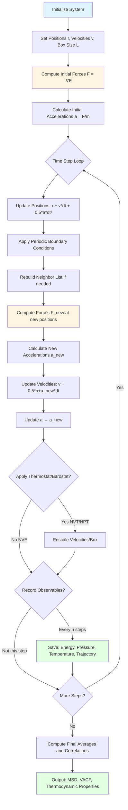

# **Chapter 7: Molecular Dynamics**

---


## **Introduction**

Monte Carlo methods, while powerful for sampling equilibrium configurations, are fundamentally **stochastic** and provide no information about how systems evolve in real time. In nature, atoms and molecules do not hop randomly between configurations weighted by Boltzmann factors—they move **continuously** under the influence of deterministic forces, governed by Newton's equations of motion $m \ddot{\mathbf{r}} = \mathbf{F}(\mathbf{r})$. To capture dynamic phenomena such as molecular diffusion, protein folding trajectories, vibrational spectra, and transport coefficients, we require a computational framework that integrates the classical equations of motion step-by-step in time. This fundamental limitation of MCMC motivates the transition from **probability-driven sampling** to **force-driven dynamics**.

This chapter introduces **Molecular Dynamics (MD)**, a simulation technique that generates deterministic trajectories by numerically integrating Newton's laws. At the heart of MD lies the **Velocity–Verlet algorithm**, a symplectic integrator that preserves phase space volume and ensures excellent long-term energy conservation—critical for stable, multi-nanosecond simulations. To bridge finite simulation boxes to the thermodynamic limit, we employ **periodic boundary conditions** and the minimum image convention, eliminating artificial surface effects. Computational efficiency demands reducing the $\mathcal{O}(N^2)$ pairwise force calculation to $\mathcal{O}(N)$ scaling via **neighbor lists**. While isolated MD naturally samples the microcanonical (NVE) ensemble, we introduce **thermostats** (Nosé–Hoover) and **barostats** (Parrinello–Rahman) to control temperature and pressure, enabling simulations in the canonical (NVT) and isothermal–isobaric (NPT) ensembles that match experimental conditions.

By the end of this chapter, you will master the complete MD workflow: implementing symplectic integrators, designing efficient force evaluation schemes, controlling thermodynamic ensembles, and extracting both equilibrium and dynamic observables. You will compute pressure via the virial theorem, diffusion coefficients from mean-squared displacement, and velocity autocorrelation functions that reveal molecular caging effects. These techniques form the computational foundation for studying liquids, proteins, polymers, and materials—systems where real-time dynamics are as important as equilibrium thermodynamics. This chapter bridges the gap between stochastic sampling (Chapters 1–6) and the data-driven inference methods of Part III, where MD trajectories become the training data for machine-learned force fields.

---

## **Chapter Outline**

| **Sec.** | **Title** | **Core Ideas & Examples** |
|:---------|:----------|:--------------------------|
| **7.1** | From Sampling to Dynamics | **Conceptual shift**: MC random walks vs. MD deterministic trajectories $m \ddot{\mathbf{r}} = \mathbf{F}$. **Force replaces probability**: $\mathbf{F} = -\nabla E$ drives motion, not Boltzmann weights $e^{-\beta E}$. Velocity–Verlet algorithm with symplectic properties and $\mathcal{O}(\Delta t^2)$ accuracy. |
| **7.2** | The Velocity–Verlet Algorithm | **Three-step integrator**: Position update $\mathbf{r}(t+\Delta t) = \mathbf{r}(t) + \mathbf{v}(t)\Delta t + \frac{1}{2}\mathbf{a}(t)\Delta t^2$, force evaluation, velocity update. **Time-reversibility and symplectic structure**: Phase space volume conservation, long-term energy stability. Harmonic oscillator test case with exact solutions. |
| **7.3** | Periodic Boundary Conditions and Neighbor Lists | **PBC and minimum image convention**: $\mathbf{\Delta r} = \mathbf{r}_i - \mathbf{r}_j - L \cdot \text{round}((\mathbf{r}_i - \mathbf{r}_j)/L)$, eliminating surface effects. **Computational efficiency**: Neighbor lists with skin $\delta$, reducing $\mathcal{O}(N^2) \to \mathcal{O}(N)$ scaling. Cell lists for large-scale systems. |
| **7.4** | Thermostats and Ensembles | **NVE vs. NVT vs. NPT**: Microcanonical (energy-conserving), canonical (temperature control), isothermal–isobaric (pressure control). **Berendsen thermostat**: Velocity rescaling with $\lambda = \sqrt{1 + \frac{\Delta t}{\tau_T}(T_0/T_{\text{inst}} - 1)}$. **Nosé–Hoover**: Canonical ensemble via friction $\xi \mathbf{v}$. Parrinello–Rahman barostat for NPT. |
| **7.5** | Computing Observables | **Thermodynamic properties**: Pressure via virial $P = \frac{Nk_BT}{V} + \frac{1}{3V}\sum \mathbf{r}_{ij} \cdot \mathbf{F}_{ij}$. **Transport coefficients**: Mean-squared displacement $\text{MSD}(\tau) = \langle \|\mathbf{r}(t+\tau) - \mathbf{r}(t)\|^2 \rangle$, diffusion $D = \lim_{\tau \to \infty} \frac{1}{6\tau}\text{MSD}(\tau)$. Velocity autocorrelation function (VACF) and Green–Kubo relations. |
| **7.6** | Chapter Summary & Bridge | **MC vs. MD complementarity**: Stochastic sampling vs. deterministic dynamics, equilibrium vs. time-dependent properties. Connection to Part III: MD trajectories as training data for machine-learned force fields, statistical inference for parameter fitting, bridge from simulation to data-driven modeling. |

---

## **7.1 From Sampling to Dynamics**

-----

### **Motivation: From Random Walks to Real Motions**

In previous chapters, Monte Carlo (MC) methods provided a robust framework for **sampling** equilibrium configurations based on statistical physics, allowing us to measure macroscopic observables. These methods explore the configurational space through random, accepted jumps, without providing any insight into the system's actual time evolution.

In contrast, systems in nature evolve **continuously in time**, driven by deterministic forces governed by Newton’s laws of motion. Atoms move, collide, and exchange energy through mechanisms fundamentally different from the probabilistic acceptance rules of MCMC.

This chapter introduces **Molecular Dynamics (MD)**, a simulation technique that integrates the classical equations of motion to model the continuous, real-time dynamics of a system, showing **how it gets there** rather than just **where it can go**.

-----

### **Conceptual Bridge: Forces Replace Probabilities**

In Monte Carlo simulations, the central quantity is the **probability** of a configuration $X$, which is proportional to the Boltzmann weight:

$$P(X) \propto \mathrm{e}^{-\beta E(X)}.$$

Molecular Dynamics shifts the focus entirely to the **force** $\mathbf{F}_i$ acting on each particle $i$, which is derived from the negative gradient of the potential energy $E$:

$$\mathbf{F}_i = -\nabla_i E(\mathbf{r}_1, \mathbf{r}_2, \dots, \mathbf{r}_N).$$

The system's trajectory is then determined by **integrating** Newton's second law:

$$m_i \frac{d^2 \mathbf{r}_i}{dt^2} = \mathbf{F}_i.$$

The key difference is conceptual: MC performs **ensemble sampling** via a random walk in configuration space, while MD performs **time evolution** via a deterministic trajectory in phase space. Both approaches yield the same equilibrium statistical physics, but MD additionally provides access to time-dependent properties.

| Monte Carlo | Molecular Dynamics |
| :--- | :--- |
| Random jumps between states | **Continuous, deterministic trajectories** |
| Weighted by $e^{-\beta E}$ | Driven by $\mathbf{F} = -\nabla E$ |
| No concept of time or dynamics | **Real time evolution** and dynamics |
| Statistical equilibrium only | Dynamics and equilibrium properties |

-----

### **The Velocity–Verlet Algorithm**

To numerically integrate Newton's equations, a stable and accurate time-stepping scheme is essential. The standard method in MD is the **Velocity–Verlet algorithm**: a second-order, time-reversible, and **symplectic** integrator. The symplectic nature ensures excellent long-term conservation of energy and phase space volume, which is critical for long MD runs.

The Velocity-Verlet update advances positions $\mathbf{r}$ and velocities $\mathbf{v}$ for a time step $\Delta t$ using the current force $\mathbf{F}(t)$ and the new force $\mathbf{F}(t+\Delta t)$:

1.  **Update positions:**
    $$\mathbf{r}_i(t+\Delta t) = \mathbf{r}_i(t) + \mathbf{v}_i(t)\Delta t + \frac{1}{2}\frac{\mathbf{F}_i(t)}{m_i}\Delta t^2$$
2.  **Compute new forces** $\mathbf{F}_i(t+\Delta t)$
3.  **Update velocities:**
    $$\mathbf{v}_i(t+\Delta t) = \mathbf{v}_i(t) + \frac{1}{2m_i}\left[\mathbf{F}_i(t) + \mathbf{F}_i(t+\Delta t)\right]\Delta t$$

The stability of this integrator is a hallmark of well-integrated molecular dynamics, keeping the total energy nearly constant in an isolated system.

-----

### **Key Takeaways**

* **Molecular Dynamics (MD)** simulates real-time motion by integrating **Newton's equations**.
* The **Velocity–Verlet algorithm** is the core integrator, chosen for its stability and energy conservation.
* MD provides access to **dynamic observables** (trajectories, time correlations, diffusion) that are inaccessible to equilibrium-focused Monte Carlo methods.
* The potential energy landscape defines the **forces** that drive this deterministic motion, replacing the probability weights that drive stochastic sampling.

The transition from random exploration to deterministic motion marks the beginning of our exploration of time-dependent phenomena in complex systems.

**Flowchart: Molecular Dynamics Simulation Workflow**



---

## **7.2 The Velocity–Verlet Algorithm**

-----

### **Motivation: Why We Need Better Integrators**

When numerically simulating a physical system governed by Newton's equations, the choice of the time-stepping algorithm is critical for maintaining **accuracy** and **energy conservation** over long trajectories. A simple integration scheme, such as Euler’s method, introduces systematic errors that can cause the total energy of the system to drift, ultimately leading to unphysical results and destroying equilibrium properties over time.

The **Velocity–Verlet algorithm** is the preferred integrator in Molecular Dynamics (MD) because it is a **symplectic** scheme, meaning it conserves the geometric structure of phase space. This characteristic prevents artificial energy drift and ensures long-term stability and time-reversibility, making it the workhorse for nearly all MD simulations.

-----

### **Recalling Newton's Equations and Taylor Expansion**

Molecular Dynamics is based on integrating Newton's second law for a system of $N$ particles:

$$m_i \frac{d^2 \mathbf{r}_i}{dt^2} = \mathbf{F}_i(\mathbf{r}_1, \ldots, \mathbf{r}_N)$$

where $\mathbf{F}_i$ is the force acting on particle $i$, derived from the potential energy $E(\mathbf{r})$ as $\mathbf{F}_i = -\nabla_i E(\mathbf{r})$.

The Velocity–Verlet algorithm is derived from truncated Taylor expansions of the position $\mathbf{r}(t+\Delta t)$ and velocity $\mathbf{v}(t+\Delta t)$ around time $t$:

$$\mathbf{r}(t+\Delta t) = \mathbf{r}(t) + \mathbf{v}(t)\Delta t + \frac{1}{2}\mathbf{a}(t)\Delta t^2 + \mathcal{O}(\Delta t^3),$$

where $\mathbf{a}(t) = \mathbf{F}(t)/m$ is the acceleration. The velocity update is constructed using the average acceleration over the interval $[t, t+\Delta t]$:

$$\mathbf{v}(t+\Delta t) = \mathbf{v}(t) + \frac{1}{2}\left[\mathbf{a}(t) + \mathbf{a}(t+\Delta t)\right]\Delta t + \mathcal{O}(\Delta t^3).$$

This pairing yields a **second-order accurate** scheme, meaning errors scale as $\mathcal{O}(\Delta t^2)$.

-----

### **The Velocity–Verlet Algorithm in Three Steps**

The integration is split into three sequential steps, often conceptualized as a "Kick-Drift-Kick" sequence:

1.  **Drift/First Kick (Position Update):** Compute the new position $\mathbf{r}(t+\Delta t)$ using the current velocity $\mathbf{v}(t)$ and the current acceleration $\mathbf{a}(t)$:
    $$\mathbf{r}_i(t+\Delta t) = \mathbf{r}_i(t) + \mathbf{v}_i(t)\Delta t + \frac{1}{2}\mathbf{a}_i(t)\Delta t^2$$
2.  **New Force Evaluation:** Use the new position $\mathbf{r}(t+\Delta t)$ to compute the force $\mathbf{F}(t+\Delta t)$ and the new acceleration $\mathbf{a}(t+\Delta t)$:
    $$\mathbf{F}_i(t+\Delta t) = -\nabla_i E(\mathbf{r}_1(t+\Delta t), \ldots, \mathbf{r}_N(t+\Delta t))$$
3.  **Final Kick (Velocity Update):** Compute the final velocity $\mathbf{v}(t+\Delta t)$ using the average of the initial and final accelerations:
    $$\mathbf{v}_i(t+\Delta t) = \mathbf{v}_i(t) + \frac{1}{2}\left[\mathbf{a}_i(t) + \mathbf{a}_i(t+\Delta t)\right]\Delta t$$

This structure ensures that the position update uses information available at time $t$, and the final velocity update benefits from the acceleration calculated at the new position $t+\Delta t$.

**Pseudo-code: Velocity-Verlet MD Integration**

```
Algorithm: Velocity_Verlet_MD(positions, velocities, forces, dt, n_steps)
  Input: initial positions r, velocities v, forces F, timestep dt, number of steps
  Output: trajectory of positions and velocities

  1. for i = 1 to N particles:
       a[i] ← F[i] / m[i]  // initial accelerations
  
  2. for step = 1 to n_steps:
       // Step 1: Update positions (drift + half kick)
       for i = 1 to N:
         r[i] ← r[i] + v[i]*dt + 0.5*a[i]*dt²
       
       // Apply periodic boundary conditions
       for i = 1 to N:
         r[i] ← r[i] - L * round(r[i]/L)
       
       // Step 2: Compute new forces at updated positions
       F_new ← compute_forces(r)  // F_new[i] = -∇E(r)
       for i = 1 to N:
         a_new[i] ← F_new[i] / m[i]
       
       // Step 3: Update velocities (second half kick)
       for i = 1 to N:
         v[i] ← v[i] + 0.5*(a[i] + a_new[i])*dt
       
       // Update accelerations for next iteration
       a ← a_new
       
       // Record observables (energy, pressure, etc.)
       if step mod output_frequency == 0:
         save_snapshot(r, v, step*dt)
  
  3. return trajectory
```

-----

### **The Harmonic Oscillator Example**

To demonstrate energy conservation, the Velocity–Verlet algorithm is often applied to a simple system, such as the 1D harmonic oscillator, where the potential energy is $E = \frac{1}{2} k r^2$ and the force is $F = -k r$.

```python
# Code snippet to illustrate the core Velocity-Verlet loop (1D)
# Based on the implementation in the provided files.

# F = force(r)
# a = F / m
    
# # Step 1: update position
# r_new = r + v*dt + 0.5*a*dt**2
    
# # Step 2: compute new force
# F_new = force(r_new)
# a_new = F_new / m
    
# # Step 3: update velocity
# v_new = v + 0.5*(a + a_new)*dt

# # Bookkeeping
# r, v = r_new, v_new
```

When run over many steps, the total energy $E_{\text{tot}} = \frac{1}{2}m v^2 + \frac{1}{2} k r^2$ remains nearly constant, confirming the numerical stability of the Velocity–Verlet integrator.

-----

### **Choosing the Time Step**

The choice of the time step $\Delta t$ is a practical consideration balancing speed and accuracy. A time step that is too large will lead to **numerical instability and energy drift** because it fails to resolve the fastest oscillations in the system, such as high-frequency bond stretching vibrations. A common rule of thumb suggests that $\Delta t$ should be at least 50 times smaller than the period of the fastest oscillation.

!!! tip "Choosing the Right Time Step"
    The time step $\Delta t$ must resolve the fastest motion in your system. Practical guidelines:
    
    - **Bonded systems** (e.g., water molecules): $\Delta t \approx 1$ fs (femtosecond) to capture O-H bond vibrations (~10 fs period)
    - **Constraint algorithms** (e.g., SHAKE/RATTLE): Allow $\Delta t \approx 2$ fs by freezing fastest bonds
    - **Soft potentials** (e.g., coarse-grained models): Can use $\Delta t \approx 10-50$ fs
    
    **Test**: Run short NVE simulation and monitor total energy drift. Acceptable drift: $\Delta E/E < 10^{-4}$ over 1 ns. If energy drifts significantly, halve $\Delta t$ and retest.

-----

### **Summary**

The Velocity–Verlet algorithm is the fundamental engine of Molecular Dynamics, providing accurate, stable, and time-reversible integration of the equations of motion. It is the correct starting point for building sophisticated simulations of liquids, proteins, and materials.

---

## **7.3 Periodic Boundary Conditions and Neighbor Lists**

-----

### **Simulating Infinite Matter in a Finite Box**

A fundamental challenge in molecular simulation is bridging the gap between a computationally tractable finite system (typically a few hundred to a few thousand particles) and the **thermodynamic limit** of an infinite, bulk system. Real-world materials, such as gases, liquids, and crystals, exist in environments where internal particles are surrounded by neighbors in all directions. If a simulation were run in a vacuum (with open boundaries), particles near the edges would experience fewer interactions than those in the interior. This introduces unphysical surface effects, causes a systematic bias in properties like pressure and energy, and can lead to the evaporation of the simulated material.

The standard solution in Molecular Dynamics (MD) to mitigate these **finite-size effects** is the use of **Periodic Boundary Conditions (PBCs)**.

-----

### **Periodic Boundary Conditions**

Under PBCs, the finite simulation box (e.g., a cube of side length $L$) is conceptually treated as one cell in an infinite, three-dimensional lattice of identical, infinitely repeating images. The finite box effectively becomes topologically equivalent to a torus.

* **Particle Trajectories:** When a particle moves out of the primary simulation box across one boundary (e.g., $x > L$), it simultaneously re-enters the box from the opposite boundary (e.g., $x = 0$). This mechanism maintains a constant number of particles ($N$) and constant density within the defined volume ($V$), preserving translational invariance and eliminating surface artifacts.
* **Minimum Image Convention (MIC):** When calculating the interaction force or potential energy between two particles, $\mathbf{r}_i$ and $\mathbf{r}_j$, the MIC dictates that particle $i$ interacts not with the particle $j$ itself, but with the **nearest periodic image** of particle $j$.

Mathematically, the vector distance $\mathbf{\Delta r} = \mathbf{r}_i - \mathbf{r}_j$ between two particles is calculated to find the shortest distance across the periodic boundaries:

$$\mathbf{\Delta r} = \mathbf{r}_i - \mathbf{r}_j - L \cdot \text{round}\left(\frac{\mathbf{r}_i - \mathbf{r}_j}{L}\right)$$

where $L$ is the box length and the $\text{round}$ operation rounds to the nearest integer. This ensures that the distance components in all directions are contained within the interval $[-L/2, L/2]$.

The MIC imposes a necessary constraint: to correctly capture all nearest-neighbor interactions, the interaction cutoff radius $r_c$ (discussed below) must be no greater than half the box length, $r_c \le L/2$. If this condition is violated, a particle could interact simultaneously with the same image particle through two different boundaries, leading to non-physical, double interactions.

!!! example "Minimum Image Convention in Practice"
    Consider a cubic box with $L = 10$ Å and two particles at positions:
    - Particle A: $\mathbf{r}_A = (1.0, 5.0, 5.0)$ Å
    - Particle B: $\mathbf{r}_B = (9.5, 5.0, 5.0)$ Å
    
    **Naive distance**: $|\mathbf{r}_A - \mathbf{r}_B| = 8.5$ Å (along x-axis)
    
    **MIC distance**: The nearest image of B is actually at $(-0.5, 5.0, 5.0)$ through periodic wrapping, giving true distance $|1.0 - (-0.5)| = 1.5$ Å.
    
    This 6× reduction dramatically affects force calculations! Always apply MIC before computing $r_{ij}$ for forces.

-----

### **Computational Efficiency: The $\mathcal{O}(N^2)$ Problem**

For a system with $N$ particles, the direct calculation of all pairwise forces requires iterating through $N(N-1)/2$ unique pairs. This process scales as $\mathcal{O}(N^2)$ with respect to the number of particles. While feasible for small systems ($N < 10^3$), this computational cost quickly becomes **prohibitive** for large-scale MD simulations ($N \ge 10^5$).

However, most common interatomic potentials, such as the **Lennard-Jones potential**, exhibit a rapid decay with distance. Beyond a specific **cutoff radius** $r_c$, the interaction energy becomes negligible, and the force approaches zero. This observation allows for significant computational optimization by restricting force calculations only to nearby pairs of particles.

-----

### **Neighbor Lists: The $\mathcal{O}(N)$ Solution**

To overcome the $\mathcal{O}(N^2)$ bottleneck, the concept of **Neighbor Lists** is employed. A neighbor list is a data structure that stores the indices of all particles $j$ that are within an interaction range of particle $i$, thus dramatically reducing the number of force calculations required per time step.

* **The Cutoff Radius ($r_c$) and Skin ($\delta$):** Instead of using only the interaction cutoff radius $r_c$, the neighbor list is built using a slightly larger radius, $r_L = r_c + \delta$, where $\delta$ is the **skin distance** (or buffer). This safety margin ensures that as particles move over several time steps, they do not leave the neighborhood defined by $r_c$ without the list being updated, thus avoiding missed interactions.
* **Update Frequency:** Since the list includes the skin $\delta$, it only needs to be rebuilt periodically (e.g., every 10 to 50 time steps), rather than every single integration step. The list is rebuilt when any particle has moved more than $\delta/2$ since the last update. This intermittent rebuilding is the source of the high efficiency.

By calculating forces only for particles found in the neighbor list, the computational complexity for short-range force evaluations is reduced from $\mathcal{O}(N^2)$ to approximately **$\mathcal{O}(N)$**. This is because the number of neighbors for any given particle is roughly constant, independent of the total system size $N$, and the total calculation cost is proportional only to the total number of particles.

-----

### **Extensions for Large-Scale Systems**

For very large systems, the process of searching through all pairs to build the neighbor list itself can become a performance bottleneck. To address this, the neighbor list method is often combined with **Cell Lists**.

The **Cell List** method divides the simulation box into a grid of smaller, equal-sized cells, with the cell size slightly larger than the neighbor list cutoff $r_L$. To find the neighbors of a particle, one only needs to search the cell the particle is in, plus the 26 surrounding cells (in 3D). This localized search further speeds up the neighbor-finding process, maintaining the overall $\mathcal{O}(N)$ scaling for the entire force-loop and making simulations of millions of particles feasible.

---

## **7.4 Thermostats and Ensembles**

-----

### **Motivation: From Mechanics to Thermodynamics**

The Molecular Dynamics (MD) simulations discussed so far operate in the **Microcanonical Ensemble (NVE)**, where the number of particles ($N$), the volume ($V$), and the total energy ($E$) are conserved quantities. This is the natural outcome of integrating Newton's equations of motion in isolation using an energy-conserving scheme like Velocity-Verlet.

However, many real-world experiments and simulations require controlling **temperature ($T$)** or **pressure ($P$)**. For example, chemical reactions often occur at constant temperature and pressure, corresponding to the **Canonical (NVT)** or **Isothermal–Isobaric (NPT)** ensembles, respectively. To model these systems, MD requires coupling the simulation to auxiliary mechanisms: **thermostats** for temperature control and **barostats** for pressure control.

-----

### **The Classical Thermodynamic Ensembles in MD**

The choice of ensemble dictates which physical variables are held constant and therefore which equations of motion or auxiliary constraints must be used:

| Ensemble | Conserved Quantities | Controlled Variables | Use Case |
| :--- | :--- | :--- | :--- |
| **NVE** (Microcanonical) | $N, V, E$ | None (isolated system) | Verifying energy conservation and integrator stability |
| **NVT** (Canonical) | $N, V, T$ | Temperature (via Thermostat) | Equilibrating the system, simulating phase behavior at fixed temperature |
| **NPT** (Isothermal–Isobaric) | $N, P, T$ | Temperature & Pressure (via Thermostat/Barostat) | Simulating liquid densities, phase transitions, and real experimental conditions |

-----

### **Thermostats for the NVT Ensemble**

A **thermostat** is an algorithm that maintains the system's kinetic energy, and thus its temperature, near a target value $T_0$. The instantaneous temperature is related to the kinetic energy ($K$) by the equipartition theorem (for a 3D system): $T_{\text{inst}} = \frac{2K}{(3N - N_c)k_B}$, where $N_c$ is the number of constraints.

#### The Berendsen Thermostat
The **Berendsen thermostat** is a simple method that weakly couples the system to an external heat bath. It operates by continually rescaling particle velocities by a factor $\lambda$ at each time step $\Delta t$:

$$\lambda = \sqrt{1 + \frac{\Delta t}{\tau_T}\left(\frac{T_0}{T_{\text{inst}}} - 1\right)}$$

where $\tau_T$ is a characteristic relaxation time. If the system is too hot ($T_{\text{inst}} > T_0$), $\lambda < 1$, and velocities are scaled down; if it is too cold, $\lambda > 1$, and velocities are scaled up.

While effective for **equilibration**—quickly achieving the target temperature $T_0$—the Berendsen thermostat does **not** generate the correct canonical ensemble. It artificially suppresses large fluctuations in kinetic energy, leading to incorrect calculations of fluctuation-dependent observables (e.g., specific heat).

??? question "When Should You Use Berendsen vs. Nosé–Hoover Thermostats?"
    The choice depends on your simulation phase and what you're measuring:
    
    **Use Berendsen for**:
    - Initial equilibration (first 10-100 ps)
    - Quickly bringing system to target temperature
    - When you only care about structural properties (not fluctuations)
    
    **Use Nosé–Hoover for**:
    - Production runs where you extract thermodynamic data
    - Computing heat capacity, energy fluctuations, or free energies
    - Any ensemble-sensitive observable
    
    **Best practice**: Equilibrate with Berendsen ($\tau_T \approx 0.1$ ps), then switch to Nosé–Hoover ($Q \approx Nk_BT\tau^2$ with $\tau \approx 1$ ps) for production. Monitor temperature distribution—should match canonical $P(T) \propto \sqrt{T} e^{-\beta(E-\langle E \rangle)^2/2k_B T^2}$.

#### The Nosé–Hoover Thermostat
The **Nosé–Hoover thermostat** is a deterministic method that explicitly generates the statistically correct **canonical ensemble**. It achieves this by modifying the equations of motion to include a dynamic friction term $\xi \mathbf{v}_i$, effectively introducing an auxiliary thermostat variable ($\xi$) and an associated thermal inertia ($Q$):

$$\dot{\mathbf{v}}_i = \frac{\mathbf{F}_i}{m_i} - \xi \mathbf{v}_i, \quad \dot{\xi} = \frac{1}{Q}\left(\frac{K}{k_B T_0} - N\right).$$

This method acts as a feedback loop: if the system's instantaneous kinetic energy $K$ is too high, the friction $\xi$ becomes positive and damps the velocities; if $K$ is too low, $\xi$ becomes negative and boosts the velocities. The Nosé–Hoover method is widely used for **production runs** because it rigorously samples the canonical distribution.

-----

### **Barostats for the NPT Ensemble**

The **Isothermal–Isobaric (NPT)** ensemble requires controlling both temperature and pressure. This necessitates coupling the system to a **barostat**, which allows the simulation box volume ($V$) to fluctuate dynamically to maintain a target external pressure $P_0$.

The theoretical framework for the NPT ensemble is based on sampling from a distribution proportional to $P(X, V) \propto \mathrm{e}^{-\beta (E(X) + P_0 V)}$.

* **Pressure Calculation:** The instantaneous pressure $P_{\text{inst}}$ is calculated using the **Virial Theorem**, which relates pressure to both kinetic energy and the contribution of interparticle forces.
* **Barostat Action:** The barostat uses the difference between the instantaneous pressure $P_{\text{inst}}$ and the target pressure $P_0$ to scale the coordinates and the box volume.

The **Parrinello–Rahman barostat** is a common, advanced method that allows the simulation box shape to fluctuate (not just its volume), enabling the study of phase transitions and crystalline structure changes. The simpler **Berendsen barostat** achieves pressure relaxation through analogous scaling factors applied to the box dimensions.

---

## **7.5 Computing Observables**

-----

The primary purpose of running a Molecular Dynamics (MD) simulation is to generate trajectories of particle positions and velocities, $\mathbf{r}(t)$ and $\mathbf{v}(t)$, from which **macroscopic observables** can be calculated. These observables bridge the gap between microscopic atomic motion and measurable bulk properties of the system.

***

### 7.5.1 Thermodynamic Observables (Energy and Pressure)

These observables are typically computed as time averages over the production phase of the simulation, after the system has reached equilibrium in the chosen ensemble ($NVE$, $NVT$, or $NPT$).

#### Energy

The **total energy** ($E_{\text{tot}}$) is the sum of the system's instantaneous **Kinetic Energy** ($K$) and **Potential Energy** ($U$):

$$E_{\text{tot}} = K + U = \frac{1}{2}\sum_{i=1}^{N} m_i |\mathbf{v}_i|^2 + E(\mathbf{r}_1, \dots, \mathbf{r}_N)$$

* **Kinetic Energy ($K$)** is directly related to the instantaneous temperature of the system.
* **Potential Energy ($U$)** is defined by the interparticle force field (e.g., Lennard-Jones).

In the $NVE$ ensemble, monitoring $E_{\text{tot}}$ over time is the most crucial diagnostic test for the numerical accuracy and stability of the integrator (e.g., Velocity–Verlet).

#### Pressure

The **pressure** ($P$) in the system is calculated using the **Virial Theorem**, which provides a link between macroscopic pressure and the microscopic forces and kinetic energy. The pressure equation consists of two main parts:

$$P = \frac{N k_B T}{V} + \frac{1}{3V} \sum_{i<j} \mathbf{r}_{ij} \cdot \mathbf{F}_{ij}$$

* The first term, $Nk_BT/V$, is the **kinetic (ideal gas) contribution**.
* The second term, $\frac{1}{3V} \sum_{i<j} \mathbf{r}_{ij} \cdot \mathbf{F}_{ij}$, is the **virial contribution**, which accounts for the influence of interparticle forces $\mathbf{F}_{ij}$ at separation $\mathbf{r}_{ij}$. This calculation is integrated directly into the force computation loop.

-----

### **Transport Observables**

MD's ability to track motion over time makes it uniquely suited for computing **transport properties**, which are inaccessible to standard Monte Carlo methods.

#### Mean-Squared Displacement (MSD)

The **Diffusion Coefficient** ($D$), a measure of a particle's mobility or transport, is calculated from the time evolution of the **Mean-Squared Displacement ($\text{MSD}$)**. The MSD quantifies the average squared distance a particle moves from its initial position over time $\tau$:

$$\text{MSD}(\tau) = \left\langle |\mathbf{r}(t+\tau) - \mathbf{r}(t)|^2 \right\rangle$$

The average ($\langle \dots \rangle$) is performed over all particles in the system and over multiple time origins $t$ to ensure good statistics.

For a system exhibiting normal diffusion (e.g., a liquid or gas), the MSD grows linearly with time $\tau$ at long times, a relationship known as the Einstein relation:

$$D = \lim_{\tau \to \infty} \frac{1}{6\tau} \text{MSD}(\tau)$$

The diffusion coefficient $D$ is thus extracted from the slope of the $\text{MSD}(\tau)$ curve in the linear regime.

-----

### **Time Correlation Functions**

**Correlation functions** are general tools in MD that reveal the "memory" and dynamic relaxation processes of the system. They quantify how a physical quantity at time zero relates to the same quantity at a later time $t$. For an arbitrary observable $A(t)$, the correlation function $C_A(t)$ is:

$$C_A(t) = \frac{\langle A(0)A(t)\rangle}{\langle A(0)^2\rangle}$$

#### Velocity Autocorrelation Function (VACF)

The **Velocity Autocorrelation Function ($C_v(t)$)** measures the correlation between a particle's velocity at time zero and its velocity at time $t$:

$$C_v(t) = \frac{\langle \mathbf{v}(0) \cdot \mathbf{v}(t) \rangle}{\langle \mathbf{v}(0)^2 \rangle}$$

* $C_v(t)$ starts at 1 and decays to 0 as the particle's velocity direction is randomized by collisions.
* In dense fluids, $C_v(t)$ often becomes slightly negative at short times, which physically indicates **caging effects** where a particle is momentarily pushed back by its nearest neighbors.
* The VACF is related to the diffusion coefficient $D$ via the **Green–Kubo relation**:

$$D = \frac{1}{3} \int_0^\infty C_v(\tau) \cdot \langle |\mathbf{v}(0)|^2 \rangle \cdot d\tau$$

Both MSD and VACF provide two independent but physically consistent ways to calculate the same diffusion coefficient, serving as a powerful consistency check for MD simulations.

---

## **7.6 Chapter Summary & Bridge to Part III**

-----

### **Synthesis of Molecular Dynamics Methodology**

Chapter 7 marked a significant transition from the stochastic exploration methods of Monte Carlo (MC) to the **deterministic time evolution** characteristic of Molecular Dynamics (MD). We established the MD pipeline for simulating the classical movement of atoms and molecules:

* **The Integration Engine:** The **Velocity–Verlet algorithm** was introduced as the foundation for MD, ensuring excellent long-term **energy conservation** and stability due to its **symplectic** and time-reversible nature.
* **Boundary Control:** **Periodic Boundary Conditions (PBCs)** and the **Minimum Image Convention** provided the framework to emulate infinite bulk matter using a finite simulation box, eliminating surface artifacts. Efficiency was achieved by reducing the $\mathcal{O}(N^2)$ force calculation cost to $\mathcal{O}(N)$ using **Neighbor Lists**.
* **Thermodynamic Ensembles:** Auxiliary mechanisms—**thermostats** (like Nosé–Hoover) and **barostats** (like Parrinello–Rahman)—were introduced to control temperature ($T$) and pressure ($P$), enabling simulations in the **Canonical (NVT)** and **Isothermal–Isobaric (NPT)** ensembles, respectively.
* **Dynamic Measurement:** We learned to extract both equilibrium and dynamic properties from the time trajectories, including **pressure** (via the Virial Theorem), and **transport properties** like the **Diffusion Coefficient** ($D$), calculated from the **Mean-Squared Displacement (MSD)** and the **Velocity Autocorrelation Function (VACF)**.

-----

### **The Complementarity of MC and MD**

Molecular Dynamics and Monte Carlo are complementary approaches to statistical mechanics. While both aim to generate samples representative of the equilibrium ensemble, their outputs serve different purposes:

| Aspect | Monte Carlo (MC) | Molecular Dynamics (MD) |
| :--- | :--- | :--- |
| Nature of Movement | **Random Jumps** (stochastic) | **Deterministic Trajectories** (time-evolving) |
| Driving Force | Boltzmann **Probability** $e^{-\beta E}$ | Newtonian **Force** $\mathbf{F} = -\nabla E$ |
| Primary Output | **Equilibrium averages** (thermodynamics) | **Time-dependent properties** (transport and dynamics) |

MD acts as a powerful **computational microscope**, allowing us to witness processes like diffusion, relaxation, and collision dynamics that are invisible to the time-averaged view of Monte Carlo.

-----

### **Bridge to Part III: From Simulation to Inference**

Part II of this volume focused on simulating physical systems using known laws and models—whether the local interaction rules of the Ising model, the gauge symmetry of the Wilson action, or the classical dynamics of molecular force fields.

In **Part III**, the central question shifts from *simulating known laws* to **learning unknown ones**. We move from the direct application of computational physics to the domain of **statistical inference** and **data-driven modeling**:

* **Parameterization Challenge:** The accuracy of MD relies entirely on the quality of the force field (the potential function $E(\mathbf{r})$). Often, these potentials contain parameters (e.g., bond strengths, atomic charges) that must be fit to experimental or *ab initio* data.
* **Model Fitting and Learning:** The next chapters will introduce methods for **statistical inference**, including Bayesian reasoning, to systematically fit these parameters and quantify the uncertainty in our models. We will explore how modern **machine learning** techniques can be integrated into the simulation pipeline to accelerate or even replace traditional, manually derived force fields.

The robust computational framework developed here—the ability to generate statistically sound ensembles and time trajectories—becomes the indispensable **data source** for these advanced inference and learning techniques. Part III thus represents the final stage of unification: connecting computation, statistics, and learning to understand the fundamental rules governing complex systems.

---

## **References**

1. **Frenkel, D., & Smit, B.** (2001). *Understanding Molecular Simulation: From Algorithms to Applications* (2nd ed.). Academic Press. [Authoritative textbook covering MD fundamentals, integrators, and ensemble methods]

2. **Allen, M. P., & Tildesley, D. J.** (2017). *Computer Simulation of Liquids* (2nd ed.). Oxford University Press. [Classic reference for MD algorithms, neighbor lists, and liquid-phase simulations]

3. **Tuckerman, M. E.** (2010). *Statistical Mechanics: Theory and Molecular Simulation*. Oxford University Press. [Rigorous treatment of MD theory, symplectic integrators, and extended ensemble methods]

4. **Leach, A. R.** (2001). *Molecular Modelling: Principles and Applications* (2nd ed.). Pearson. [Practical guide to MD implementation, force fields, and biomolecular applications]

5. **Verlet, L.** (1967). *Computer "experiments" on classical fluids. I. Thermodynamical properties of Lennard-Jones molecules*. Physical Review, 159(1), 98-103. [Original paper introducing the Verlet algorithm for MD]

6. **Swope, W. C., Andersen, H. C., Berens, P. H., & Wilson, K. R.** (1982). *A computer simulation method for the calculation of equilibrium constants for the formation of physical clusters of molecules*. The Journal of Chemical Physics, 76(1), 637-649. [Introduces the Velocity-Verlet formulation]

7. **Nosé, S.** (1984). *A unified formulation of the constant temperature molecular dynamics methods*. The Journal of Chemical Physics, 81(1), 511-519. [Foundational paper on the Nosé thermostat for canonical ensemble sampling]

8. **Hoover, W. G.** (1985). *Canonical dynamics: Equilibrium phase-space distributions*. Physical Review A, 31(3), 1695-1697. [Simplified Nosé–Hoover thermostat formulation]

9. **Parrinello, M., & Rahman, A.** (1981). *Polymorphic transitions in single crystals: A new molecular dynamics method*. Journal of Applied Physics, 52(12), 7182-7190. [Introduces flexible cell MD for NPT ensemble and crystal simulations]

10. **Rapaport, D. C.** (2004). *The Art of Molecular Dynamics Simulation* (2nd ed.). Cambridge University Press. [Comprehensive practical guide with detailed algorithms, neighbor lists, and optimization techniques]

---


