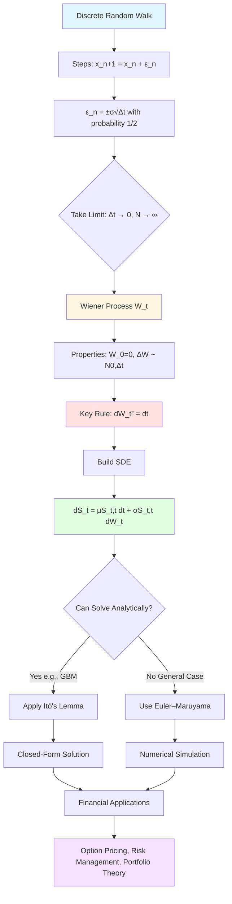

# **Chapter 8: Stochastic Calculus and SDEs**

---


## **Introduction**

Classical calculus, the mathematical foundation of physics and engineering, rests on a fundamental assumption: that functions are smooth and possess well-defined derivatives $\frac{df}{dt} = \lim_{\Delta t \to 0} \frac{f(t+\Delta t) - f(t)}{\Delta t}$. This assumption fails catastrophically when confronted with financial asset prices, which exhibit continuous yet **nowhere differentiable** trajectories driven by the relentless accumulation of random, high-frequency market shocks. Stock prices do not evolve along smooth curves—they jitter violently at all timescales, rendering the instantaneous velocity $\frac{dS}{dt}$ undefined in the classical sense. The mathematical framework required to model such continuous randomness is **stochastic calculus**, where the limiting behavior of discrete random walks converges to the **Wiener process** $W_t$ (Brownian motion), characterized by the revolutionary property $(dW_t)^2 = dt$—forcing retention of second-order terms that classical Taylor expansions discard.

This chapter develops the rigorous mathematical machinery needed to describe and simulate financial dynamics governed by **Stochastic Differential Equations (SDEs)**. We begin by explaining why classical chain rules fail when applied to functions of stochastic processes, then introduce the **Wiener process** and its defining properties: independent Gaussian increments with variance $\text{Var}(dW_t) = dt$, continuous paths, and nowhere differentiability. The centerpiece is **Itō's Lemma**, the stochastic generalization of the chain rule that introduces the **Itō correction term** $\frac{1}{2}\sigma^2 \frac{\partial^2 f}{\partial S^2} dt$—a purely deterministic drift adjustment arising from the accumulated effects of volatility. This correction ensures that expectations are computed correctly and reveals the profound principle that randomness itself creates deterministic structure. For numerical simulation, we present the **Euler–Maruyama method**, the workhorse integrator for SDEs that achieves weak convergence of order $\mathcal{O}(\Delta t)$, sufficient for Monte Carlo option pricing.

By the end of this chapter, you will understand the foundational mathematics underlying quantitative finance: how to derive and apply Itō's Lemma to solve SDEs analytically (as with geometric Brownian motion $S_t = S_0 \exp[(\mu - \frac{1}{2}\sigma^2)t + \sigma W_t]$), how to implement Euler–Maruyama simulations with $\Delta W_n = \sqrt{\Delta t} Z_n$ for general drift-diffusion processes, and why the Itō correction term is essential for correctly pricing derivatives. These tools form the computational and theoretical bridge to Chapter 9, where the Black–Scholes PDE emerges from the cancellation of randomness through dynamic hedging—transforming stochastic asset dynamics into deterministic valuation equations. Mastering stochastic calculus is essential for anyone working at the intersection of computation, probability, and financial modeling.

---

## **Chapter Outline**

| **Sec.** | **Title** | **Core Ideas & Examples** |
|:---------|:----------|:--------------------------|
| **8.1** | Why Classical Calculus Fails | **Smoothness assumption breakdown**: Classical derivative $\frac{dS}{dt}$ undefined for noisy price paths. **Nowhere differentiable trajectories**: Financial time series continuous but irregular. **Wiener process scaling**: $(dW_t)^2 = dt$ violates classical $(dt)^2 \approx 0$ assumption. Introduction of SDE $dS_t = \mu dt + \sigma dW_t$ separating drift and diffusion. |
| **8.2** | The Wiener Process and SDEs | **Brownian motion properties**: $W_0 = 0$, independent increments, $\Delta W \sim \mathcal{N}(0, \Delta t)$, continuous but nondifferentiable paths. **SDE structure**: $dS_t = \mu(S_t,t)dt + \sigma(S_t,t)dW_t$ with drift term (predictable trend) and diffusion term (volatility). Variance growth $\text{Var}(W_t) = t$ and quadratic variation. |
| **8.3** | Itō's Lemma | **Stochastic chain rule**: $df = \left(\frac{\partial f}{\partial t} + \mu \frac{\partial f}{\partial S} + \frac{1}{2}\sigma^2 \frac{\partial^2 f}{\partial S^2}\right) dt + \sigma \frac{\partial f}{\partial S} dW_t$. **Itō correction term**: $\frac{1}{2}\sigma^2 f_{SS} dt$ from $(dW_t)^2 = dt$ rule. **GBM analytical solution**: $S_t = S_0 \exp[(\mu - \frac{1}{2}\sigma^2)t + \sigma W_t]$ via $d(\ln S_t)$. Jensen's inequality and convexity effects. |
| **8.4** | The Euler–Maruyama Method | **Discretization scheme**: $S_{n+1} = S_n + \mu(S_n,t_n)\Delta t + \sigma(S_n,t_n)\sqrt{\Delta t} Z_n$ with $Z_n \sim \mathcal{N}(0,1)$. **Convergence orders**: Strong $\mathcal{O}(\sqrt{\Delta t})$ for pathwise accuracy, weak $\mathcal{O}(\Delta t)$ for expectation accuracy. GBM simulation for Monte Carlo option pricing. Higher-order methods: Milstein scheme. |
| **8.5** | Chapter Summary & Bridge | **Framework synthesis**: Wiener process $\to$ SDEs $\to$ Itō's Lemma $\to$ numerical integration. **Randomness creates deterministic structure**: Itō correction $\frac{1}{2}\sigma^2 f_{SS}$ as predictable drift from volatility. Bridge to Chapter 9: Black–Scholes PDE via hedging argument, cancellation of $dW_t$ terms, risk-neutral valuation, transition from stochastic dynamics to deterministic pricing equation. |

---

## **8.1 Why Classical Calculus Fails**

-----

### **The Hidden Assumption of Smoothness**

Classical analysis, which forms the basis for Ordinary Differential Equations (ODEs) and traditional physics, relies fundamentally on the existence of a well-defined derivative. The definition of the instantaneous rate of change is given by:

$$\frac{df}{dt} = \lim_{\Delta t\to 0}\frac{f(t+\Delta t)-f(t)}{\Delta t}.$$

The existence of this limit necessitates that the function $f(t)$ is **smooth** and changes gradually over time. This assumption of differentiability and continuous first-order dynamics is sufficient for modeling deterministic physical systems, such as orbital mechanics or damped oscillation, which are governed by equations like:

$$\frac{dS}{dt} = \mu(S,t)$$

where $\mu$ represents a deterministic rate of change. This framework, however, collapses when applied to financial time series.

-----

### **The Jagged Reality of Price Motion**

Financial asset prices, particularly stock prices, are characterized by continuous and rapid fluctuations driven by a multitude of unpredictable, high-frequency events, including market noise, trades, and news sentiment. When one examines a price path $S(t)$ over time, it appears highly irregular and noisy.

Mathematically, this irregularity means that the price path is **continuous but nowhere differentiable**. If one attempts to compute the derivative $\frac{dS}{dt}$ in the classical sense, the limit does not converge; the instantaneous "velocity" of the price is undefined or diverges. This necessitates a new mathematical framework capable of handling processes that are continuous in time but driven by continuous randomness.

| Classical Physics | Financial Markets |
| :--- | :--- |
| Smooth, differentiable trajectory | Irregular, noisy, nowhere differentiable trajectory |
| Deterministic rate $\frac{dS}{dt}$ exists | $\frac{dS}{dt}$ is undefined in the classical sense |
| Governing Equation: ODE | Governing Equation: SDE |

-----

### **The Birth of the Wiener Process**

The core building block for modeling continuous randomness is the limit of the discrete random walk, which converges to the **Wiener Process ($W_t$)**, also known as **Brownian Motion**. The Wiener Process models the cumulative effect of countless, independent, random infinitesimal steps.

The critical feature of the Wiener Process is how its increment, $dW_t = W_{t+dt} - W_t$, scales: it has zero mean ($\mathbb{E}[dW_t]=0$), but its variance is non-negligible:

$$\text{Var}(dW_t) = \mathbb{E}[(dW_t)^2] = dt.$$

-----

### **Where Classical Calculus Breaks Down**

In standard calculus, any infinitesimal term of order $(dt)^2$ is discarded in Taylor expansions because it is assumed to be negligible compared to the first-order term $dt$. For example, the product of two deterministic differentials is negligible: $dt \cdot dt = (dt)^2 \approx 0$.

The Wiener Process violates this fundamental assumption. Because the variance of the random increment is of order $dt$, the term $(dW_t)^2$ is also of order $dt$:

$$\text{If } (dt)^2 \approx 0, \quad \text{then } (dW_t)^2 \approx dt.$$

This observation means that in any Taylor expansion of a function of a stochastic process, the second-order terms involving $(dW_t)^2$ **must be retained**, fundamentally invalidating the classical chain rule.

!!! tip "The $(dW_t)^2 = dt$ Rule: Why Itō Calculus is Different"
    The fundamental difference between classical and stochastic calculus comes down to one equation:
    
    $$\mathbb{E}[(dW_t)^2] = dt$$
    
    **Classical calculus**: $(dt)^2 \approx 0$ → discard all second-order terms in Taylor expansion
    
    **Stochastic calculus**: $(dW_t)^2 = dt$ → **must keep** second-order terms involving $dW_t$
    
    **Practical implication**: When computing $df(S_t)$ where $dS_t = \mu dt + \sigma dW_t$, the term $(dS_t)^2 = \sigma^2 dt$ survives and creates the Itō correction $\frac{1}{2}\sigma^2 f_{SS} dt$. This is not a small perturbation—it fundamentally changes the expected drift of any nonlinear function of $S_t$.

-----

### **The Introduction of Stochastic Differential Equations**

To address this failure, a new mathematical framework called **Stochastic Calculus (or Itō Calculus)** is adopted. This calculus acknowledges the quadratic variation of the random term and redefines the rules for differential products:

$$ (dW_t)^2 = dt, \quad dW_t \cdot dt = 0, \quad (dt)^2 = 0.$$

This leads to the **Stochastic Differential Equation (SDE)**, the governing equation for continuous random motion:

$$dS_t = \mu(S_t,t)dt + \sigma(S_t,t)dW_t.$$

The SDE separates the evolution into two components:
* **Drift Term ($\mu dt$):** The predictable, deterministic trend (expected change).
* **Diffusion Term ($\sigma dW_t$):** The unpredictable, random shock (volatility).

This SDE structure is the natural language for describing financial markets, where asset price dynamics are understood as a combination of an expected return and continuous, volatile uncertainty.

**Flowchart: From Discrete Random Walk to Continuous SDE**



---

## **8.2 The Wiener Process and SDEs**

-----

### **From Random Walks to Continuous Random Motion**

The mathematical foundation for modeling continuous market uncertainty begins with the simplest form of random movement: the **discrete random walk**. In this model, the position $x$ changes at each small time step $\Delta t$ by a random increment $\epsilon_n$:

$$x_{n+1} = x_n + \epsilon_n, \qquad \epsilon_n = \begin{cases} +\sigma\sqrt{\Delta t}, & p=\tfrac{1}{2},\\ -\sigma\sqrt{\Delta t}, & p=\tfrac{1}{2}.\end{cases}$$

For this discrete process, the **expected position** after $N$ steps is $\mathbb{E}[x_N] = 0$, and the **variance** grows linearly with time $T=N\Delta t$: $\text{Var}(x_N) = \sigma^2 T$.

As the time step $\Delta t$ shrinks to zero and the number of steps $N$ approaches infinity while keeping the total time $T$ finite, the discrete random walk converges to a continuous-time process known as **Brownian Motion**, or the **Wiener Process ($W_t$)**.

-----

### **Defining the Wiener Process**

The Wiener process, a cornerstone of stochastic calculus, is defined by four fundamental properties:

1.  **Starting Point:** $W_0 = 0$.
2.  **Independent Increments:** The change in $W_t$ over any time interval is statistically independent of the change over any non-overlapping interval.
3.  **Gaussian Increments:** The increment $\Delta W = W_{t+\Delta t} - W_t$ is a normally distributed random variable with zero mean and a variance equal to the time step:
    $$\Delta W \sim \mathcal{N}(0, \Delta t).$$
4.  **Continuous but Nondifferentiable Paths:** The sample paths of $W_t$ are continuous everywhere in time but are nowhere differentiable.

Due to the Gaussian increments, the Wiener process is characterized by simple first and second moments:
$$\mathbb{E}[W_t] = 0, \quad \text{Var}(W_t) = t.$$

This linear growth in variance is a core feature that distinguishes it from deterministic processes and is central to the Itō correction.

-----

### **Stochastic Differential Equations**

The SDE is the mathematical framework for describing dynamical systems that include a random component driven by the Wiener Process. It is a modification of the ordinary differential equation (ODE) to incorporate continuous noise.

The general form of an SDE is written as:
$$dS_t = \mu(S_t,t)dt + \sigma(S_t,t)dW_t.$$

The equation decomposes the change in the variable $S_t$ over an infinitesimal time period $dt$ into two parts:

| Term | Function | Interpretation |
| :--- | :--- | :--- |
| $\mu(S_t,t)dt$ | **Drift Term** | The deterministic component, controlling the *average trend* or expected growth. |
| $\sigma(S_t,t)dW_t$ | **Diffusion Term** | The stochastic component, controlling the *volatility* or random shock. |

The diffusion term adds uncertainty to the evolution, such that $\text{Var}(S_{t+\Delta t} - S_t) = \sigma^2(S_t,t)\Delta t$.

-----

### **Geometric Brownian Motion**

The most commonly used SDE in mathematical finance is the **Geometric Brownian Motion (GBM)**, which models asset prices ($S_t$) under the assumption that returns are normally distributed.

The GBM SDE is defined as:
$$dS_t = \mu S_t dt + \sigma S_t dW_t.$$

In this model:
* $\mu$ is the constant expected rate of return (or drift).
* $\sigma$ is the constant volatility.

The presence of the $S_t$ factor in the diffusion term makes the SDE multiplicative. This ensures that the price $S_t$ remains positive (prices cannot fall below zero) and, importantly, that the magnitude of the random fluctuations scales with the price level. The GBM provides the dynamic model for the underlying asset that is the foundation of the influential Black–Scholes option pricing theory.

-----

### **Increment Rules and Itō Calculus**

The unique properties of the Wiener Process impose a unique "multiplication table" for infinitesimal differentials, necessary for Itō Calculus:

* $(dt)^2 = 0$
* $dt \cdot dW_t = 0$
* $(dW_t)^2 = dt$

The rule $\mathbf{(dW_t)^2 = dt}$ is the key concept that drives all deviations from classical calculus. It confirms that the non-negligible second-order randomness must be accounted for, a realization that is formalized in the **Itō Lemma**.

---

## **8.3 Itō's Lemma**

-----

### **The Problem: When the Classical Chain Rule Breaks**

In standard (classical) calculus, the evolution of a function $f(S,t)$ that depends on a time-varying variable $S(t)$ is given by the ordinary **chain rule**:

$$df = \frac{\partial f}{\partial t}dt + \frac{\partial f}{\partial S}dS.$$

This rule is based on the assumption that the variable $S(t)$ is differentiable, allowing second-order terms in the Taylor expansion—specifically $O((dt)^2)$ and higher—to be neglected.

However, when the variable $S_t$ follows a Stochastic Differential Equation (SDE) driven by the Wiener Process ($W_t$), as in $dS_t = \mu dt + \sigma dW_t$, this assumption fails because the square of the random increment, $(dW_t)^2$, is of the same order of magnitude as $dt$.

-----

### **The Itō Differential Rules**

To derive a consistent chain rule for stochastic processes, the differential products must conform to the rules of Itō calculus, which stem from the property $\mathbb{E}[(dW_t)^2] = dt$:

| Product | Value | Interpretation |
| :--- | :--- | :--- |
| $(dt)^2$ | $0$ | Deterministic second-order term is negligible. |
| $dt \cdot dW_t$ | $0$ | Mixed term vanishes. |
| $(dW_t)^2$ | $dt$ | **The key non-classical rule:** Stochastic second-order term is non-negligible and equals $dt$. |

-----

### **Derivation and Statement of Itō's Lemma**

Itō’s Lemma is derived by expanding the function $f(S_t, t)$ in a Taylor series up to the second order, retaining all terms, and then applying the Itō differential rules.

Consider a function $f = f(S_t, t)$, where $S_t$ is an **Itō process** defined by $dS_t = \mu(S_t, t)dt + \sigma(S_t, t)dW_t$.

The second-order Taylor expansion contains the term $\frac{1}{2}\frac{\partial^2 f}{\partial S^2}(dS_t)^2$. Substituting $dS_t$ and applying the rules for the squared term yields:

$$(dS_t)^2 = (\mu dt + \sigma dW_t)^2 = \mu^2 (dt)^2 + 2\mu\sigma dt dW_t + \sigma^2 (dW_t)^2$$

Since $(dt)^2 \approx 0$ and $dt dW_t \approx 0$, only the last term survives and is simplified using the non-classical rule: $(dS_t)^2 = \sigma^2 dt$.

Substituting this back into the Taylor expansion leads to **Itō’s Lemma**, the stochastic chain rule:

$$\boxed{df = \left(\frac{\partial f}{\partial t} + \mu \frac{\partial f}{\partial S} + \frac{1}{2}\sigma^2 \frac{\partial^2 f}{\partial S^2}\right) dt + \sigma \frac{\partial f}{\partial S} dW_t.}$$

-----

### **The Itō Correction Term**

The central difference from the classical chain rule is the addition of the term $\frac{1}{2}\sigma^2 \frac{\partial^2 f}{\partial S^2} dt$, known as the **Itō correction**:

$$\text{Itō Correction} = \frac{1}{2}\sigma^2 \frac{\partial^2 f}{\partial S^2} dt.$$

This term is **deterministic** (it contains no $dW_t$) and represents an adjustment to the expected drift of the function $f$ that arises purely from the accumulated effects of volatility ($\sigma^2$).

For a convex function ($f_{SS} > 0$), the correction term adds positive drift. This means that the expected value of a function of a random variable is always greater than the function of the expected value, a consequence of Jensen's inequality. The Itō correction ensures that the deterministic growth of a function is correctly adjusted to account for the continuous "jiggling" of the underlying stochastic variable.

-----

### **Application: Solving Geometric Brownian Motion**

Itō’s Lemma provides the analytical solution for the GBM SDE:

$$dS_t = \mu S_t dt + \sigma S_t dW_t.$$

To find the solution, we apply Itō's Lemma to the logarithmic function $f(S_t) = \ln S_t$. The necessary derivatives are:
$$\frac{\partial f}{\partial S} = \frac{1}{S_t}, \quad \frac{\partial^2 f}{\partial S^2} = -\frac{1}{S_t^2}, \quad \frac{\partial f}{\partial t} = 0.$$

Substituting these into Itō’s Lemma:
$$d(\ln S_t) = \left(0 + \mu S_t \left(\frac{1}{S_t}\right) + \frac{1}{2}\sigma^2 S_t^2 \left(-\frac{1}{S_t^2}\right)\right) dt + \sigma S_t \left(\frac{1}{S_t}\right) dW_t$$

Simplifying, we get the SDE for the log-price:
$$d(\ln S_t) = \left(\mu - \frac{1}{2}\sigma^2\right)dt + \sigma dW_t.$$

Integrating both sides from $0$ to $t$ and exponentiating yields the exact solution for GBM:

$$S_t = S_0 \exp\left[\left(\mu - \frac{1}{2}\sigma^2\right)t + \sigma W_t\right].$$

This expression shows that the expected logarithmic return is adjusted by the term $-\frac{1}{2}\sigma^2$, confirming that volatility subtracts deterministic growth from the average log-price path. This exact analytical solution is fundamental to the **Black–Scholes–Merton model**.

!!! example "The $-\\frac{1}{2}\\sigma^2$ Correction in GBM: Why Volatility Reduces Average Growth"
    Consider GBM with $\mu = 0.10$ (10% drift) and $\sigma = 0.20$ (20% volatility):
    
    **SDE form**: $dS_t = 0.10 S_t dt + 0.20 S_t dW_t$
    
    **Analytical solution**: $S_t = S_0 \exp[(0.10 - \frac{1}{2}(0.20)^2)t + 0.20 W_t] = S_0 \exp[0.08t + 0.20 W_t]$
    
    **Expected value**: $\mathbb{E}[S_t] = S_0 e^{0.10t}$ (drift term alone)
    
    **Median value**: $S_0 e^{0.08t}$ (reduced by $\frac{1}{2}\sigma^2 = 0.02$)
    
    **Interpretation**: Due to Jensen's inequality and the convexity of $\exp$, the median growth rate (0.08) is less than the mean growth rate (0.10). The Itō correction $-\frac{1}{2}\sigma^2$ accounts for this difference. Higher volatility → larger gap between mean and median → more "drag" on typical paths.

---

## **8.4 The Euler–Maruyama Method**

-----

### **From Differential Form to Numerical Simulation**

Most Stochastic Differential Equations (SDEs), unlike the Geometric Brownian Motion (GBM), do not possess an exact analytical solution derived from Itō's Lemma. To study the behavior of these general SDEs or to calculate the expected values of complex financial derivatives, **numerical integration** is essential.

The **Euler–Maruyama (EM) method** is the simplest and most widely used numerical scheme for approximating solutions to SDEs. It is the stochastic analogue of the classic deterministic Euler method for Ordinary Differential Equations (ODEs).

-----

### **Deriving the Euler–Maruyama Scheme**

The EM scheme starts from the general SDE:

$$dS_t = \mu(S_t,t)dt + \sigma(S_t,t)dW_t$$

Integrating this SDE over a small, finite time step $\Delta t = t_{n+1} - t_n$, the change in the variable $S$ is given by:

$$S_{t_{n+1}} - S_{t_n} = \int_{t_n}^{t_{n+1}} \mu(S_s,s)ds + \int_{t_n}^{t_{n+1}} \sigma(S_s,s)dW_s$$

The EM method makes the simplest possible approximation for both the deterministic (drift) and stochastic (diffusion) integrals: it assumes the functions $\mu(S_s,s)$ and $\sigma(S_s,s)$ are constant over the interval and equal to their values at the beginning of the step, $t_n$.

This yields the **Euler–Maruyama update rule**:

$$\boxed{S_{t_{n+1}} \approx S_{t_n} + \mu(S_{t_n},t_n)\Delta t + \sigma(S_{t_n},t_n)\Delta W_n}$$

where the increment $\Delta W_n = W_{t_{n+1}} - W_{t_n}$ is a Gaussian random variable:

$$\Delta W_n \sim \mathcal{N}(0, \Delta t)$$

To implement this numerically, the random increment is generated as $\Delta W_n = \sqrt{\Delta t} \cdot Z_n$, where $Z_n \sim \mathcal{N}(0,1)$ is a standard normal random variable.

-----

### **Error Behavior and Convergence Orders**

The accuracy of numerical SDE solvers is quantified by two distinct types of convergence:

| Type | Definition | Order of Convergence | Interpretation |
| :--- | :--- | :--- | :--- |
| **Strong Convergence** | Pathwise accuracy: $\mathbb{E}[|S_t - S_t^{(\text{num})}|]$ | $\mathcal{O}(\sqrt{\Delta t})$ | Measures how closely a single simulated path tracks the corresponding true path (requires specific tracking of noise). |
| **Weak Convergence** | Expected value accuracy: $|\mathbb{E}[g(S_t)] - \mathbb{E}[g(S_t^{(\text{num})}]|$ | $\mathcal{O}(\Delta t)$ | Measures how closely the average of many simulated paths tracks the true expected value of a function $g(S_t)$. |

The EM method is a **first-order weak** ($\mathcal{O}(\Delta t)$) and **half-order strong** ($\mathcal{O}(\sqrt{\Delta t})$) solver.

In quantitative finance, the primary goal is often to find the **expected payoff** of a derivative, $\mathbb{E}[\text{Payoff}(S_T)]$. Since this task relies solely on **weak convergence**, the $\mathcal{O}(\Delta t)$ accuracy of the EM method is typically sufficient and widely favored due to its simplicity and robust stability.

??? question "Strong vs. Weak Convergence: Which Matters for Option Pricing?"
    **Question**: If Euler–Maruyama only has strong convergence of $\mathcal{O}(\sqrt{\Delta t})$, why is it acceptable for pricing derivatives?
    
    **Answer**: Because derivative pricing requires **expectation accuracy**, not **path accuracy**:
    
    - **Strong convergence** measures: $\mathbb{E}[|S_T^{\text{true}} - S_T^{\text{sim}}|]$ (average path error)
      - Needed for: Hedge ratios, path-dependent Greeks, control variates
      - EM achieves: $\mathcal{O}(\sqrt{\Delta t})$ → slow convergence
    
    - **Weak convergence** measures: $|\mathbb{E}[g(S_T^{\text{true}})] - \mathbb{E}[g(S_T^{\text{sim}})]|$ (expectation error)
      - Needed for: Option prices, expected payoffs, risk-neutral valuation
      - EM achieves: $\mathcal{O}(\Delta t)$ → good convergence
    
    **Practical guideline**: For vanilla option pricing via Monte Carlo, use EM with $\Delta t = T/100$ (100 steps to maturity). For path-dependent derivatives (Asian options, barriers), consider Milstein or reduce $\Delta t$ to $T/1000$ if strong convergence matters.

-----

### **Application: Simulating GBM with Euler–Maruyama**

The discretized GBM using the EM scheme is given by:

$$S_{n+1} = S_n + \mu S_n \Delta t + \sigma S_n \sqrt{\Delta t} Z_n$$

This formula clearly shows the two-part nature of the discrete step:

* **Drift step:** $S_n + \mu S_n \Delta t$ — The price grows by the expected return $\mu$ multiplied by $\Delta t$.
* **Diffusion step:** $\sigma S_n \sqrt{\Delta t} Z_n$ — A random deviation scaled by volatility $\sigma$, the price $S_n$, and the square root of the time step $\sqrt{\Delta t}$.

By iteratively applying this rule over many small time steps, a stochastic trajectory is generated. Running this simulation many times allows the computation of the expected terminal price $\mathbb{E}[S_T]$, which forms the basis of **Monte Carlo option pricing**.

**Pseudo-code: Euler–Maruyama for GBM Simulation**

```
Algorithm: Euler_Maruyama_GBM(S0, mu, sigma, T, dt, n_paths)
  Input: initial price S0, drift mu, volatility sigma, maturity T, timestep dt, number of paths
  Output: simulated price paths and terminal values

  1. n_steps ← T / dt
  2. Initialize price_paths[n_paths, n_steps+1]
  
  3. for path = 1 to n_paths:
       S ← S0
       price_paths[path, 0] ← S0
       
       for step = 1 to n_steps:
         Z ← random_normal(0, 1)  // Standard normal random variable
         dW ← sqrt(dt) * Z
         
         // Euler-Maruyama update
         S ← S + mu*S*dt + sigma*S*dW
         
         price_paths[path, step] ← S
  
  4. terminal_prices ← price_paths[:, n_steps]
  5. return price_paths, terminal_prices

// For Monte Carlo option pricing:
Function: Monte_Carlo_Call_Price(S0, K, r, sigma, T, dt, n_paths)
  1. price_paths, S_T ← Euler_Maruyama_GBM(S0, r, sigma, T, dt, n_paths)
  2. payoffs ← max(S_T - K, 0)  // Call option payoff
  3. option_price ← exp(-r*T) * mean(payoffs)  // Discounted expectation
  4. return option_price
```

-----

### **Beyond Euler–Maruyama**

While EM is dominant due to its simplicity and adequate weak convergence, higher-order methods exist to improve strong convergence, such as the **Milstein method**. The Milstein method achieves $\mathcal{O}(1)$ strong convergence by including a term derived from the quadratic variation, $((\Delta W)^2 - \Delta t)$, but is more complex to implement. However, for most financial applications, the added complexity of Milstein (or even higher-order Runge–Kutta schemes for SDEs) is usually not justified, reinforcing the status of EM as the preferred production solver.

---

## **8.5 Chapter Summary & Bridge to Chapter 9**

-----

### **Synthesis of Stochastic Calculus**

Chapter 8 provided the essential mathematical framework for modeling continuous random processes, shifting the paradigm from the **smooth, deterministic functions** of classical calculus to the **continuous but nowhere differentiable** paths characteristic of financial assets. The core concepts established were:

* **The Wiener Process ($W_t$):** The foundation of continuous randomness, defined by independent, Gaussian increments with variance $\text{Var}(dW_t) = dt$.
* **Stochastic Differential Equations (SDEs):** The governing equation, $dS_t = \mu dt + \sigma dW_t$, separating dynamics into deterministic **drift ($\mu dt$)** and stochastic **diffusion ($\sigma dW_t$)**.
* **Itō’s Lemma:** The stochastic chain rule, which includes the necessary **Itō correction term** $\frac{1}{2}\sigma^2 \frac{\partial^2 f}{\partial S^2} dt$. This term accounts for the accumulated, predictable drift imparted by the underlying volatility ($\sigma$).
* **The Euler–Maruyama (EM) Method:** The principal numerical technique for integrating SDEs, providing stability and **weak convergence** of order $\mathcal{O}(\Delta t)$, which is sufficient for calculating expected payoffs in finance.

This toolkit allows for the precise description and simulation of market dynamics, with the Itō correction revealing that **randomness itself creates a measurable deterministic structure**.

-----

### **The Conceptual Map: From Randomness to Determinism**

The most significant insight of stochastic calculus in the financial context is that by correctly modeling volatility, we enable a profound transition from random dynamics to deterministic valuation:

| Level | Equation Type | Governing Math | Key Role of Randomness |
| :--- | :--- | :--- | :--- |
| **Asset Price ($S_t$)** | SDE: $dS_t = \mu S_t dt + \sigma S_t dW_t$ | Itō Calculus | **Drives motion** via $dW_t$ |
| **Derivative Value ($f$)** | Itō’s Lemma: $df = (\dots)dt + (\sigma S f_S)dW_t$ | Itō Correction | **Shifts average drift** via $\sigma^2$ |
| **Hedged Portfolio ($\Pi$)** | Deterministic ODE: $d\Pi = r\Pi dt$ | Cancellation | **Vanishes entirely** when hedged |

The derivative's SDE, as derived by Itō's Lemma, contains a random component ($\propto dW_t$) that is directly proportional to the random component of the underlying asset's SDE. This symmetry is the key that unlocks the **Black–Scholes–Merton framework**.

-----

### **Bridge to Chapter 9: The Black–Scholes Equation**

Chapter 9 will demonstrate the conceptual leap of **risk-neutral valuation** and **dynamic hedging**, which leverages the symmetry exposed by Itō's Lemma.

#### The Hedging Argument

If we construct a portfolio $\Pi$ that is long the derivative $f$ and short a specific amount of the underlying asset $S$ (specifically, $-\frac{\partial f}{\partial S}$ units of $S$), the portfolio value is:
$$\Pi = f - \frac{\partial f}{\partial S} S_t$$

By applying Itō's Lemma to the portfolio, the random terms ($dW_t$) from the derivative and the underlying asset precisely **cancel each other out**. This results in a purely deterministic portfolio whose instantaneous return must, in a no-arbitrage market, equal the risk-free rate $r$:

$$d\Pi = r\Pi dt$$

This forced cancellation removes all references to the investor's expected return $\mu$ and the randomness $dW_t$, leading directly to the final **Black–Scholes Partial Differential Equation (PDE)** for the option price $f(S,t)$:

$$\frac{\partial f}{\partial t} + \frac{1}{2}\sigma^2 S^2 \frac{\partial^2 f}{\partial S^2} + r S \frac{\partial f}{\partial S} - r f = 0.$$

This is a deterministic equation that governs the price of an option, demonstrating how the specialized stochastic rules of Itō calculus are used to arrive at a powerful **deterministic solution** for valuation. The term $\frac{1}{2}\sigma^2 S^2 \frac{\partial^2 f}{\partial S^2}$ in the PDE is directly descended from the fundamental **Itō correction**.

Chapter 9 will explore the full derivation, solution, and implications of this seminal PDE, completing the transition from modeling random walks to determining financial value.

---

## **References**

1. **Øksendal, B.** (2003). *Stochastic Differential Equations: An Introduction with Applications* (6th ed.). Springer. [Rigorous mathematical treatment of SDEs, Wiener processes, and Itō calculus with proofs]

2. **Shreve, S. E.** (2004). *Stochastic Calculus for Finance II: Continuous-Time Models*. Springer. [Comprehensive graduate-level text connecting stochastic calculus to derivative pricing and martingale theory]

3. **Glasserman, P.** (2003). *Monte Carlo Methods in Financial Engineering*. Springer. [Detailed coverage of numerical SDE integration, variance reduction, and computational finance applications]

4. **Kloeden, P. E., & Platen, E.** (1992). *Numerical Solution of Stochastic Differential Equations*. Springer. [Authoritative reference on SDE numerical methods including Euler–Maruyama, Milstein, and higher-order schemes]

5. **Itō, K.** (1951). *On stochastic differential equations*. Memoirs of the American Mathematical Society, 4, 1-51. [Original paper introducing Itō calculus and the stochastic chain rule]

6. **Karatzas, I., & Shreve, S. E.** (1998). *Brownian Motion and Stochastic Calculus* (2nd ed.). Springer. [Advanced mathematical foundations of Brownian motion, martingales, and stochastic integration]

7. **Hull, J. C.** (2018). *Options, Futures, and Other Derivatives* (10th ed.). Pearson. [Practitioner-oriented introduction to GBM, Itō's Lemma, and the Black–Scholes framework]

8. **Wilmott, P.** (2006). *Paul Wilmott on Quantitative Finance* (2nd ed.). Wiley. [Intuitive explanations of stochastic calculus concepts with financial market applications]

9. **Higham, D. J.** (2001). *An algorithmic introduction to numerical simulation of stochastic differential equations*. SIAM Review, 43(3), 525-546. [Tutorial paper with MATLAB code for implementing Euler–Maruyama and understanding convergence]

10. **Rogers, L. C. G., & Williams, D.** (2000). *Diffusions, Markov Processes and Martingales: Volume 2, Itō Calculus*. Cambridge University Press. [Rigorous measure-theoretic approach to stochastic processes and Itō integration]

---